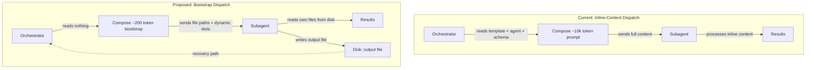
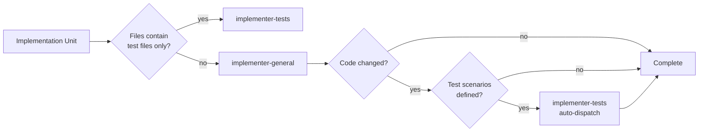
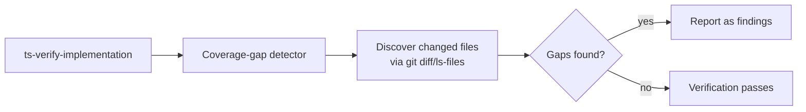

# Test Coverage for New Scripts + Token Efficiency

## Summary

Close the test-coverage blind spot where changed scripts ship without automated tests (Issue 102), reduce token consumption in ts-plan and ts-doc-review by standardizing subagent dispatch and restructuring skill files (Issue 103), remove legacy HTML rendering support and Phase 0.0 output-format resolution, and add notification recovery via Monitor-based file watching (Issue 98). All changes produce standards documentation for Issue #94 (Wave 2) as a downstream consumer.

## Problem Frame

Three independent design gaps combine to create friction in the skill workflow:

**Test coverage gap (Issue 102).** When `ts-do-work-loop` implements a plan that changes scripts (e.g., `validate-index-standards.py` — 384 lines), no tests are created or updated. The `implementer-general` agent explicitly refuses to touch tests. The `implementer-tests` agent only writes tests for scenarios already documented in the plan's `Files:` list. There is no mechanism to detect that a changed script should have tests when the plan didn't list them. PR #99's Finding #2 ("Zero test coverage for a 384-line validator") required creating 17 pytest tests as a post-hoc fix.

**Token inefficiency (Issue 103).** `ts-plan/SKILL.md` is 12,592 words loaded every invocation. `ts-doc-review` re-emits the full subagent template (~25KB) per dispatched reviewer. Confidence rubric is restated in two places (subagent template and synthesis doc). Deterministic parsing logic lives as prose instead of scripts.

**Notification fragility (Issue 98).** Background agent completions are lost ~40-50% of the time when the orchestrator is mid-generation. The current inline-content dispatch pattern makes recovery expensive — the orchestrator must re-emit all content to retry.

## Requirements

**Test coverage (Issue 102)**

- R1. When an implementation unit changes application code (not test files), `ts-work` dispatches `implementer-tests` after `implementer-general` to create or update corresponding test files using the unit's test scenarios as the test plan. This applies to any code change — new files, modifications, or refactors.
- R2. A coverage-gap detector script flags any changed script that has no corresponding test file in `tests/`. The detector discovers changed files autonomously via git. If a script was changed, it needs a test — no line threshold.
- R3. `ts-verify-implementation` runs the coverage-gap detector as an additional verification dimension.
- R4. Test files created by the automatic dispatch follow the established conventions: `ok()`/`die()` helpers, `tmpdir` with cleanup trap, exit-code assertions (per test suite hardening plan).

**Token efficiency (Issue 103)**

- R5. Subagent dispatch uses a read-it-yourself bootstrap pattern: the orchestrator passes only file paths and dynamic slots inline (~150-300 tokens per dispatch), not template/agent/schema content.
- R6. `ts-plan/SKILL.md` word count is reduced to ≤9,000 words by deduplicating against references that phases already mandate reading.
- R7. Deterministic output-format resolution logic is extracted from Phase 0.0 prose to `scripts/resolve-output-format.sh`.
- R8. The confidence rubric (behavioral anchors 0/25/50/75/100) exists in exactly one authoritative location (`findings-schema.json` confidence property description), referenced by the subagent template and synthesis docs instead of restated inline.

**Notification resilience (Issue 98)**

- R9. When an agent writes output to disk, the orchestrator can detect completion by checking file existence via Monitor-based file watching, regardless of notification state. This is a recovery mechanism — the harness-level notification reliability problem remains unsolved.
- R10. The orchestrator can detect and recover all completions between turns by watching the output directory for new files, without sequential polling.

**Standards documentation**

- R11. All changes are documented in standards/solution docs following the existing conventions (frontmatter + standard sections), structured for consumption by Issue #94 (Wave 2).

## Key Technical Decisions

KTD-1. **Bootstrap dispatch over inline-content dispatch.** The orchestrator passes a minimal bootstrap prompt (~150-300 tokens) listing file paths the subagent must read in full before starting: operating contract, role prompt, schema, and target document. Dynamic slots (`document_type`, `origin_path`, decision primer) stay inline. The inline-content pattern remains documented as a fallback for harnesses without subagent file-read tools. The bootstrap prompt includes two additional instructions: (1) a bootstrap-ack requirement — the agent must emit a brief list of files read (paths + line counts) before starting analysis, so the orchestrator can verify all expected files were read; (2) a schema-as-guidance instruction — "Schema `description` fields contain behavioral guidance — read them as instructions, not metadata." *Rationale:* Orchestrator dispatch output drops from ~10k tokens per reviewer to ~150-300. The bootstrap-ack catches lazy partial reads (the known failure mode). The schema-as-guidance instruction ensures agents process rubric descriptions as behavioral rules.

KTD-2. **Coverage-gap detection as post-implementation verification, not plan-time mandate.** The detector runs in `ts-verify-implementation` after implementation completes, checking whether any changed script has a corresponding test file. No line threshold — if a script was changed, it needs a test. The detector does not require plans to pre-list test files. *Rationale:* Plans already define test scenarios; the gap is that `implementer-general` doesn't create the files. A post-implementation check catches the gap regardless of plan quality, and doesn't require every plan to be perfect. Test planning is an important step of an implementation plan — the detector is the backstop, not the primary mechanism.

KTD-3. **Confidence rubric anchored in schema descriptions.** The behavioral anchor definitions (0/25/50/75/100) already exist in the `confidence` property's `description` field in `references/findings-schema.json`. The subagent template references the schema's description rather than restating the anchors inline. The P0-P3 severity translation, evidence-must-be-array, and anchors-0/25-suppress-silently rules stay inline in the template (cheap and load-bearing). The synthesis-and-presentation doc's third restatement is replaced with a pointer to the schema. *Rationale:* ~800 words of redundancy removed per dispatch. Single source of truth prevents the two-way drift risk between template and synthesis doc.

KTD-4. **ts-plan restructure: inline routing + deferred procedures.** What stays in SKILL.md: routing/classification logic, phase guards, firing conditions, never/always constraints. What moves to references: procedure elaboration, worked examples, rationale prose. Target: ≤9k words (dedup pass). *Rationale:* The file already uses `@./references/` for 8 files; this extends the same pattern to the remaining inline prose.

KTD-5. **Notification recovery via disk-first state and Monitor-based file watching.** Agents write structured output to files on disk as their primary state mechanism. The orchestrator uses Monitor with `inotifywait` to watch the output directory for new files, detecting completion without relying on notifications. When the bootstrap pattern is used, agents are self-contained — they read their own instructions from disk, so a missed notification doesn't lose the agent's operating context. *Rationale:* Issue #98 shows notifications are unreliable 40-50% of the time. Disk-first design with Monitor-based detection means the orchestrator can recover by watching for output files, even when notifications are lost. This is a recovery mechanism — the harness-level notification reliability problem remains unsolved and needs a separate fix.

## High-Level Technical Design

### Dispatch flow: before vs. after



### Test dispatch flow: automatic test-coder



### Verification flow: coverage-gap detection



### Token savings estimate

| Component | Before (tokens/dispatch) | After (tokens/dispatch) | Savings |
|---|---|---|---|
| ts-doc-review per reviewer | ~10,000 | ~200-300 | ~97% |
| ts-plan Phase 1/1.3 dispatch | ~3,000-5,000 | ~200-300 | ~90-95% |
| ts-plan SKILL.md load | ~17,000 (full) | ~12,000 (dedup) | ~30% |
| Confidence rubric (per dispatch) | ~800 (inline) | 0 (in schema) | 100% |

## Scope Boundaries

### Out of Scope (upstream)

- **Harness-level notification fix (Issue #98 root cause)** — requires an upstream fix in Claude Code's harness. The Monitor-based recovery in U4b is a mitigation, not a solution. A GitHub issue should be created to track this upstream dependency.

### Deferred to Follow-Up Work

- Further ts-plan SKILL.md compression to ≤6k words (router pass) — the ≤9k dedup pass is the primary target; the deeper pass moves per-phase procedure detail into phase-scoped references and is a separate effort.
- Conditional-agent gating logic, model tiering assignments, and anchor-based confidence gate changes — these already do the right economic work.
- Compressing defensive rule-restatement within references (`synthesis-and-presentation.md` R-rules, `walkthrough.md`) — that density is load-bearing for adherence.
- Cross-session primer persistence and reviewer selection criteria changes.
- Changes to what findings surface or how they route.
- Issue #94 (Wave 2) implementation — this plan only produces the standards documents Wave 2 needs.

## Implementation Units

### U1. Create `scripts/resolve-output-format.sh`

**Goal:** Extract the deterministic Phase 0.0 output-format resolution logic from `ts-plan/SKILL.md` prose into a reusable script.

**Requirements:** R7

**Dependencies:** None

**Files:**
- `scripts/resolve-output-format.sh` (create)
- `tests/scripts/test-resolve-output-format.sh` (create)
- `skills/ts-plan/SKILL.md` (modify — replace Phase 0.0 prose with script invocation)

**Approach:** Implement the full precedence chain: CLI `output:` token scan and strip, config read with YAML-comment awareness (`# plan_output: html` must not match as active), default (`md`), pipeline override. Script emits `OUTPUT_FORMAT=<md|html>` and `ARGS_REMAINDER=<...>` to stdout. Use `set -euo pipefail`. Follow the existing script patterns (`scripts/classify-document.sh`, `scripts/locate-plan.py`).

**Patterns to follow:**
- `scripts/classify-document.sh` — shell script structure, JSON output via `to-json.sh`
- `scripts/locate-plan.py` — deterministic parsing with clear precedence chain
- `tests/skills/ts-work/test-detect-missing-artifacts.sh` — test structure with `ok()`/`die()` helpers

**Test scenarios:**
- Happy path: bare `output:md` token → `OUTPUT_FORMAT=md`, token stripped from remainder
- Happy path: `output:html` token → `OUTPUT_FORMAT=html`
- Edge case: `output:` alone (no value) → falls through to config/default, token stripped
- Edge case: `output:pdf` (unknown value) → falls through with note, token stripped
- Config precedence: active `plan_output: html` in config → `OUTPUT_FORMAT=html`
- Config precedence: commented `# plan_output: html` in config → ignored, falls through to default
- Default: no CLI arg, no config → `OUTPUT_FORMAT=md`
- Pipeline override: when `DISABLE_MODEL_INVOCATION` is set → force `OUTPUT_FORMAT=md`
- Passthrough: conventional commit prefix `feat:` not consumed as output token
- Integration: non-output `<word>:<word>` tokens preserved in remainder

**Verification:** Script passes all test scenarios. `ts-plan` SKILL.md Phase 0.0 prose is replaced with script invocation reference. Diff outputs from baseline invocations before/after — flag deviations beyond minor.

---

### U2. Deduplicate confidence rubric to single location

**Goal:** Reference the existing behavioral anchor definitions in `findings-schema.json`'s confidence property description instead of restating them in the subagent template, eliminating ~800 words of redundancy per dispatch.

**Requirements:** R8

**Dependencies:** None

**Files:**
- `skills/ts-doc-review/references/findings-schema.json` (no change — behavioral anchors already exist in the `confidence` property's `description` field)
- `skills/ts-doc-review/references/subagent-template.md` (modify — replace inline rubric with reference to schema's confidence description)
- `skills/ts-doc-review/references/synthesis-and-presentation.md` (modify — remove third rubric restatement, add pointer to schema)

**Approach:** The behavioral anchor definitions (0/25/50/75/100) already exist in the `confidence` property's `description` field in `findings-schema.json` (JSON Schema draft-07 does not support per-value enum descriptions, so anchors must remain at the property level). Update the subagent template to reference the schema's property-level description as the authoritative rubric instead of restating the anchors inline. Keep inline in the template: P0-P3 severity translation rule, evidence-must-be-array rule, and anchors-0/25-suppress-silently rule (these are cheap and load-bearing from real validation failures). Remove the third restatement from `synthesis-and-presentation.md`, replacing with a pointer to the schema's confidence description.

**Patterns to follow:**
- The existing `findings-schema.json` structure for JSON Schema conventions
- The subagent template's current rubric section for behavioral anchor wording

**Test scenarios:**
- Happy path: a dispatched reviewer returns findings JSON that validates against `findings-schema.json` with correct confidence values
- Happy path: the subagent template correctly references schema descriptions for the rubric
- Edge case: findings with confidence 0 and 25 are suppressed per the inline rule (not in schema descriptions)
- Integration: full ts-doc-review run produces equivalent findings pre- and post-change
- Regression: P0-P3 severity translation still works correctly with the schema-referenced rubric

**Verification:** Confidence rubric exists in exactly one authoritative location (`findings-schema.json`). Template and synthesis doc reference it. Diff ts-doc-review outputs before/after — flag deviations beyond minor. Same deviations occurring across multiple tests increase the signal. ~800 words of redundancy removed per dispatch.

---

### U3. Restructure `ts-plan/SKILL.md` toward router + references

**Goal:** Reduce `ts-plan/SKILL.md` from ~12,592 words to ≤9,000 words by deduplicating against references that phases already mandate reading.

**Requirements:** R6

**Dependencies:** U1, U2

**Files:**
- `skills/ts-plan/SKILL.md` (modify — deduplicate inline prose)
- `skills/ts-plan/references/synthesis-summary.md` (verify — confirm overlap before cutting)
- `skills/ts-plan/references/deepening-workflow.md` (verify — confirm Phase 5.3 overlap)
- `skills/ts-plan/references/approach-altitude.md` (verify — confirm Phase 0.1a overlap)

**Approach:** Deduplicate specific sections against their authoritative references:

- Phase 0.7 and 5.1.5: keep only firing guards and hard never-constraints inline ("required gate output — silent proceeding not allowed", "no touch-surface enumeration", pre-Phase-1 timing rule); point everything else at `references/synthesis-summary.md`.
- Phase 5.3: same treatment against `references/deepening-workflow.md` after verifying overlap.
- Phase 0.1a: compress to the explicit trigger plus the two-signal proactive gate (~6 lines); defer elaboration to `references/approach-altitude.md`.

Every removed rule has a verified home in a reference that the corresponding phase mandates reading. Do not cut rules that have no reference home.

**Patterns to follow:**
- The existing `@./references/` syntax used throughout SKILL.md for the 8 reference files already loaded

**Test scenarios:**
- Happy path: a full ts-plan invocation produces an equivalent plan before and after restructure
- Edge case: deepening fast path (Phase 0.1 resume) still fires correctly with compressed Phase 5.3
- Edge case: approach-altitude request (Phase 0.1a) still routes correctly with compressed trigger
- Edge case: solo-mode scoping synthesis (Phase 0.7) still produces correct output with reference-based guidance
- Regression: brainstorm-sourced invocation (Phase 5.1.5) still works correctly
- Regression: all existing plan files in `docs/plans/` remain valid (no format changes)

**Verification:** Word count ≤9,000. Every removed rule has a verified home in a reference the phase mandates reading. Before U3 execution, capture baseline plan outputs from 3-5 representative invocations (different document types, different phases). After restructure, re-run the same invocations and diff the outputs — compare plan structure (requirements traceability, unit counts, file paths, test scenarios). Automate this as a test script. Flag deviations beyond minor; same deviations across multiple tests increase the signal.

---

### U4a. Standardize subagent dispatch on read-it-yourself bootstrap

**Goal:** Replace inline-content dispatch with a minimal bootstrap prompt across all skills that dispatch subagents.

**Requirements:** R5

**Dependencies:** U3

**Files:**
- `skills/ts-doc-review/SKILL.md` (modify — replace inline dispatch with bootstrap)
- `skills/ts-doc-review/references/subagent-template.md` (modify — add bootstrap instructions)
- `skills/ts-plan/SKILL.md` (modify — Phase 1/1.3 dispatch uses path references)
- `skills/ts-work/SKILL.md` (modify — dispatch uses bootstrap pattern)
- `docs/solutions/conventions/subagent-bootstrap-dispatch.md` (create — documents the pattern)
- `docs/standards/agent-standards.md` (modify — Bootstrap pattern replaces Template-Wrapped; Direct-Seed removal is a separate PR)

**Approach:** Implement the bootstrap dispatch pattern:

Target shape (~150-300 tokens per dispatch):

```text
Read these files IN FULL before starting. Do not begin analysis until all four are read:
1. references/subagent-template.md (your operating contract)
2. references/agents/<reviewer-name>.md (your role)
3. references/findings-schema.json
4. <document_path> (document under review)
document_type: <requirements|plan>
origin_path: <path or none>
<prior-decisions>
...decision primer content...
</prior-decisions>
```

Bootstrap-ack requirement: after reading all files, the agent must emit a brief acknowledgment listing the files read (paths + line counts) before starting analysis. The orchestrator verifies all expected files are present in the ack before accepting findings.

Schema-as-guidance instruction: the bootstrap prompt includes "Schema `description` fields contain behavioral guidance — read them as instructions, not metadata."

Rules:
- Dynamic slots stay inline: `document_type`, `origin_path`, `{decision_primer}` (session state, cannot be read from disk).
- The "IN FULL before starting" instruction is a hard constraint, enforced by the bootstrap-ack.
- Keep inline-content dispatch documented as the fallback for harnesses without subagent file-read tools.
- Round-2+ re-reads of the document from disk pick up applied `safe_auto` fixes.
- Apply the same pattern to `ts-plan` Phase 1/1.3 dispatch.
- Audit all other skills that dispatch subagents and converge on this pattern.

**Patterns to follow:**
- The existing `@./references/` syntax for file loading
- `docs/solutions/conventions/agent-definition-convention.md` for solution doc format
- `docs/standards/agent-standards.md` for standards doc structure

**Test scenarios:**
- Happy path: a dispatched reviewer in ts-doc-review returns findings JSON that validates against `findings-schema.json` via the bootstrap path
- Happy path: ts-plan Phase 1 dispatch uses path references to `references/agents/*.md`
- Happy path: agent emits bootstrap-ack listing all files read before starting analysis
- Edge case: bootstrap-ack missing an expected file → orchestrator rejects and re-dispatches with inline-content fallback
- Edge case: fallback to inline-content dispatch when subagent lacks file-read tools
- Edge case: round-2 re-read picks up applied `safe_auto` fixes from disk
- Edge case: agent reads schema descriptions as behavioral guidance (confidence anchors applied correctly)
- Integration: full ts-doc-review headless run produces equivalent findings pre- and post-change
- Integration: full ts-plan interactive run produces equivalent plans pre- and post-change
- Regression: P0-P3 severity translation still works correctly with schema-referenced rubric

**Verification:** Dispatch prompts contain no inlined template, agent-file, or schema content — only bootstrap file list plus dynamic slots. Bootstrap-ack is emitted and verified. Behavioral eval: dispatched reviewer returns valid findings JSON with correct confidence anchors. All existing skill invocations produce equivalent output (diff outputs before/after, flag deviations beyond minor).

---

### U4b. Add notification recovery via Monitor-based file watching

**Goal:** Enable the orchestrator to detect and recover from missed subagent completion notifications using Monitor with `inotifywait`.

**Requirements:** R9, R10

**Dependencies:** U4a

**Files:**
- `skills/ts-doc-review/SKILL.md` (modify — add Monitor-based recovery after dispatch)
- `skills/ts-work/SKILL.md` (modify — add Monitor-based recovery after dispatch)
- `skills/ts-plan/SKILL.md` (modify — add Monitor-based recovery after dispatch)
- `docs/solutions/workflow-issues/notification-resilience-via-disk-state.md` (create — documents the recovery pattern)

**Approach:** Implement Monitor-based notification recovery with disk-first state:

Set up the Monitor **before** dispatching subagents, then reconcile any files already present immediately after dispatch before trusting the watch. Each subagent must write a structured output file upon completion — this is the primary completion signal, not the notification. When a file appears, the orchestrator reads it and processes the results. This works regardless of whether the `<task-notification>` arrives.

Recovery flow:
1. Orchestrator arms Monitor with `inotifywait -m <dir> -e close_write` watching expected output directory
2. Orchestrator dispatches agents and records expected output file paths
3. Orchestrator reconciles any files already present (fast agents may complete before dispatch returns)
4. When a new file appears, Monitor emits a notification to the orchestrator
5. Orchestrator reads the output file and processes results
6. If a `<task-notification>` also arrives, it's redundant — the file-based detection already fired

Each subagent **must** write its output to a file upon completion — the file is the authoritative completion signal. This requirement is enforced by the bootstrap dispatch pattern (U4a): the operating contract instructs agents to write output files.

This is a recovery mechanism, not a fix for notification reliability. The harness-level notification problem (Issue #98) is out of scope for this repo and requires an upstream fix in Claude Code.

**Patterns to follow:**
- Monitor tool's `command` mode with `inotifywait` for file watching
- Existing output file conventions in each skill
- `docs/solutions/workflow-issues/composition-over-generalization-for-verification.md` for solution doc format

**Test scenarios:**
- Happy path: orchestrator detects agent completion via Monitor when file appears in output directory
- Happy path: multiple agents complete between turns — all outputs detected by Monitor
- Edge case: `<task-notification>` arrives before Monitor fires — orchestrator deduplicates (no double-processing)
- Edge case: Monitor fires before `<task-notification>` — orchestrator processes from file, ignores late notification
- Edge case: agent writes partial output then crashes — Monitor detects file but orchestrator validates completeness
- Integration: full ts-doc-review headless run with simulated notification delay produces correct results
- Integration: full ts-plan interactive run with Monitor recovery produces correct plans

**Verification:** Orchestrator detects agent completions via Monitor regardless of notification state. Output files are read and processed correctly. No double-processing when both Monitor and notification fire. Recovery methods tested (Monitor triggers, file-based output reads), even though forcing notification failure cannot be tested directly.

---

### U5. Implement automatic test-coder dispatch

**Goal:** Close the test-coverage blind spot by automatically dispatching `implementer-tests` whenever code changes occur, not just for new code.

**Requirements:** R1, R4

**Dependencies:** U4a

**Files:**
- `skills/ts-work/SKILL.md` (modify — dispatch logic at lines 163-167)
- `skills/ts-work/references/agents/implementer-tests.md` (modify — add bootstrap dispatch instructions for auto-dispatch)

**Approach:** Modify `ts-work` dispatch logic to evaluate two separate gates after `implementer-general` completes:

1. **Code changed?** — Did `implementer-general` create or modify any application code files (not test files)? If no, done.
2. **Test scenarios defined?** — Does the unit have a `Test Scenarios:` section with non-manual-only tests? If no, done. If yes, dispatch `implementer-tests`.

The existing trigger (unit's `Files:` list contains test files → `implementer-tests` dispatched) is preserved as-is. The new gates are evaluated only for units that went through `implementer-general`.

The `implementer-tests` agent uses the bootstrap pattern (from U4a) to read its own operating contract.

**Test conventions (R4).** New test files created by auto-dispatch follow established patterns: `ok()`/`die()` helpers, `tmpdir` with `trap 'rm -rf "$tmpdir"' EXIT`, exit-code assertions, negative verification technique.

**Patterns to follow:**
- `skills/ts-work/SKILL.md` lines 163-167 for existing dispatch routing
- `tests/skills/ts-work/test-detect-missing-artifacts.sh` for test patterns (ok/die, tmpdir, cleanup trap)

**Test scenarios:**
- Happy path: unit with new `.py` file + test scenarios → `implementer-general` then `implementer-tests` dispatched
- Happy path: unit with modified `.py` file + test scenarios → `implementer-general` then `implementer-tests` dispatched
- Happy path: unit with only test files → `implementer-tests` dispatched (existing behavior preserved)
- Happy path: unit with code files but only manual test scenarios → `implementer-general` only, no auto-dispatch
- Error path: `implementer-tests` auto-dispatch fails → orchestrator logs failure, continues (non-blocking)
- Integration: full ts-do-work-loop run creates tests alongside implementation
- Regression: existing dispatch for test-only units unchanged
- Regression: existing implementer-general behavior unchanged for units without test scenarios

**Verification:** Modified scripts have updated test files. New scripts have corresponding test files. Test files follow established conventions. Dispatch behavior unchanged for existing unit types.

---

### U7. Create coverage-gap detector script

**Goal:** Create a script that flags any changed script without a corresponding test file, and integrate it as a verification dimension.

**Requirements:** R2, R3

**Dependencies:** U5

**Files:**
- `scripts/detect-coverage-gaps.sh` (create)
- `tests/scripts/test-detect-coverage-gaps.sh` (create)
- `skills/ts-verify-implementation/SKILL.md` (modify — add coverage-gap dimension)

**Approach:** Create `scripts/detect-coverage-gaps.sh` that:
1. Locates changed files itself using `git diff --name-only HEAD` + `git ls-files --others --exclude-standard` (no external file list required)
2. For **any** changed script file (new or modified), checks whether a corresponding test file exists in `tests/`
3. No line threshold — if a script exists and was changed, it needs a test
4. Outputs a JSON report of gaps found
5. Integrate as an additional verification dimension in `ts-verify-implementation`

The detector discovers files autonomously — it runs `git diff` and `git ls-files` internally. No stdin pipe, no `--source` flag, no file list from the caller. This reduces token usage (no file list to pass) and improves reliability (no risk of incomplete lists). Triggers on any code change, not just new files.

**Patterns to follow:**
- `scripts/classify-document.sh` for script structure
- `tests/skills/ts-work/test-detect-missing-artifacts.sh` for test patterns

**Test scenarios:**
- Happy path: new `.py` script with no corresponding test file → gap flagged
- Happy path: new `.sh` script with no corresponding test file → gap flagged
- Happy path: script with corresponding test file → no gap flagged
- Happy path: modified `.py` script with no corresponding test file → gap flagged
- Happy path: modified script with existing test → no gap flagged
- Edge case: test file exists but is in wrong directory → gap flagged
- Edge case: script is a test file itself → no gap flagged (test files don't need tests for themselves)
- Edge case: only non-script files changed (`.md`, `.yaml`) → no gaps flagged
- Integration: ts-verify-implementation runs detector and reports gaps as findings
- Integration: detector autonomously discovers changed files via git (no external file list)

**Verification:** Detector correctly identifies scripts without tests. ts-verify-implementation reports gaps as findings. No false positives for scripts that have tests. Test file follows established conventions.

---

### U8. Create and update standards documentation

**Goal:** Document all changes from U1-U7 in standards and solution docs, structured for consumption by Issue #94 (Wave 2).

**Requirements:** R11

**Dependencies:** U1, U2, U3, U4a, U4b, U5, U7

**Files:**
- `docs/standards/agent-standards.md` (modify — Bootstrap pattern replaces Template-Wrapped in Dispatch Patterns section)
- `docs/standards/testing-standards.md` (create — test coverage expectations, auto-dispatch trigger rules, coverage-gap detection)
- `docs/standards/INDEX.md` (modify — add new standards entries)
- `docs/solutions/conventions/subagent-bootstrap-dispatch.md` (create — documents the read-it-yourself bootstrap pattern)
- `docs/solutions/conventions/automatic-test-dispatch.md` (create — documents the test-coder auto-dispatch pattern)
- `docs/solutions/workflow-issues/notification-resilience-via-disk-state.md` (create — documents the Issue 98 recovery pattern)

**Approach:** Update/create three categories of documentation:

**Standards updates.** In `agent-standards.md`, the Bootstrap pattern replaces Template-Wrapped as the primary dispatch pattern. The bootstrap-ack requirement and schema-as-guidance instruction are documented. Direct-Seed removal is a separate PR. Test coverage expectations are documented in the new `testing-standards.md`: if a script exists and was changed, it needs a corresponding test; auto-dispatch mechanism handles this for any code change; coverage-gap detection is a post-implementation backstop.

**Convention docs.** Create `subagent-bootstrap-dispatch.md` following the existing solution doc format (frontmatter + Context/Guidance/Why This Matters/When to Apply/Examples/Related). Create `automatic-test-dispatch.md` documenting the dispatch logic and coverage-gap detection.

**Workflow issue doc.** Create `notification-resilience-via-disk-state.md` documenting the Issue 98 recovery pattern: Monitor-based file watching, disk-first state, file-based recovery.

**Patterns to follow:**
- `docs/solutions/conventions/agent-definition-convention.md` — convention doc format
- `docs/solutions/workflow-issues/composition-over-generalization-for-verification.md` — workflow issue doc format
- `docs/standards/agent-standards.md` — standards doc structure with conformance checklists

**Test scenarios:**
- Happy path: each new/updated doc follows the established frontmatter and section conventions
- Happy path: `docs/standards/INDEX.md` lists all new/updated standards
- Edge case: solution docs reference the correct skill files and script paths
- Integration: a reader can follow the standards docs to understand the bootstrap dispatch pattern without reading SKILL.md files
- Integration: Issue #94 (Wave 2) can reference these docs as prerequisites

**Verification:** All docs follow established conventions. INDEX.md is current. Solution docs are self-contained enough for Wave 2 consumption. No orphaned references.

---

### U9. Remove HTML rendering and Phase 0.0 output-format resolution

**Goal:** Eliminate legacy HTML rendering support and the Phase 0.0 output-format resolution logic. This repo always uses markdown — the HTML path is dead code borrowed from the upstream plugin.

**Requirements:** R6 (contributes to SKILL.md word count reduction)

**Dependencies:** U1 (resolve-output-format.sh becomes unnecessary once Phase 0.0 is removed)

**Files:**
- `skills/ts-plan/references/html-rendering.md` (delete)
- `skills/ts-plan/SKILL.md` (modify — remove Phase 0.0 entirely, remove all HTML output references, remove `output:html` CLI token handling)
- `skills/ts-plan/references/plan-handoff.md` (modify — remove HTML format gate, remove "Open in browser" option for HTML)
- Any other references to `html-rendering.md` or `OUTPUT_FORMAT=html` (search and remove)

**Approach:** Remove all HTML rendering support since this repo exclusively uses markdown:

1. Delete `skills/ts-plan/references/html-rendering.md` — legacy from upstream plugin, never used
2. Remove Phase 0.0 from SKILL.md entirely — the output-format resolution logic (CLI arg scan, config read, default, pipeline override) exists only to choose between markdown and HTML. With HTML removed, the answer is always markdown. Any remaining prose about format selection becomes dead weight
3. Remove `output:html` CLI token handling and `plan_output: html` config option references
4. Update `plan-handoff.md` to remove the HTML format gate (5.3.8) and the "Open in browser" option
5. Search all references for `html-rendering`, `OUTPUT_FORMAT=html`, and `output:html` — remove or update

**Patterns to follow:**
- The existing reference cleanup in U3 for deduplication against SKILL.md

**Test scenarios:**
- Happy path: ts-plan invocation with no `output:` arg → defaults to markdown, no format resolution prose emitted
- Happy path: ts-plan invocation with `output:md` → accepted (no-op), no format resolution prose emitted
- Edge case: ts-plan invocation with `output:html` → ignored with note (HTML support removed)
- Edge case: ts-plan invocation with `output:` alone → no-op, falls through to default
- Regression: all existing plan files in `docs/plans/` remain valid (no format changes)
- Regression: ts-plan produces equivalent plans before and after removal
- Regression: plan-handoff menu renders correctly with 4 options (no HTML option)

**Verification:** `html-rendering.md` deleted. No references to it remain. Phase 0.0 removed from SKILL.md. Word count further reduced. ts-plan produces equivalent plans. Plan-handoff menu works without HTML option.

---

## Risks & Dependencies

- **U3 depends on U1 and U2** — the restructure benefits from the script extraction and rubric dedup landing first, reducing what SKILL.md needs to carry inline.
- **U4a depends on U3** — ts-plan's dispatch changes should align with its restructured form.
- **U4b depends on U4a** — Monitor-based recovery builds on the bootstrap dispatch pattern.
- **U5 depends on U4a** — automatic test-coder dispatch uses the bootstrap pattern.
- **U7 depends on U5** — the detector runs after auto-dispatch completes.
- **U8 depends on U1-U7, U9** — standards document what was built, including the HTML/Phase 0.0 removal.
- **U9 depends on U1** — resolve-output-format.sh extraction should land before Phase 0.0 removal, to preserve the logic if ever needed for reference.
- **Harness limitation (Issue 98)** — the notification-failure problem is out of scope for this repo and requires an upstream fix in Claude Code. The Monitor-based recovery and disk-first state in U4b are recovery mechanisms, not fixes. A GitHub issue should be created to track the upstream dependency.
- **Behavioral equivalence verification** — restructured SKILL.md files and deduplicated rubrics must produce equivalent outputs. Diff outputs before/after baseline invocations; flag deviations beyond minor. Same deviations occurring across multiple tests increase the signal.

## Sources & Research

- Issue #102 — PR #99 Finding #2, `scripts/validate-index-standards.py` (384 lines, 0 tests)
- Issue #103 — baseline measurements: ts-plan/SKILL.md 12,592 words, ts-doc-review per-dispatch ~10k tokens
- Issue #98 — 7-agent session with 40-50% notification loss rate
- `docs/plans/2026-07-02-002-fix-test-suite-hardening-plan.md` — canonical test patterns
- `docs/plans/2026-06-25-001-feat-script-extraction-pass-plan.md` — token efficiency philosophy ("extract to scripts, not optimize prompts")
- `docs/solutions/workflow-issues/composition-over-generalization-for-verification.md` — composition over generalization
- `docs/plans/2026-07-04-001-feat-agent-profiles-standardization-plan.md` — implementer agent sub-templates
- `docs/standards/agent-standards.md` — agent definition format
