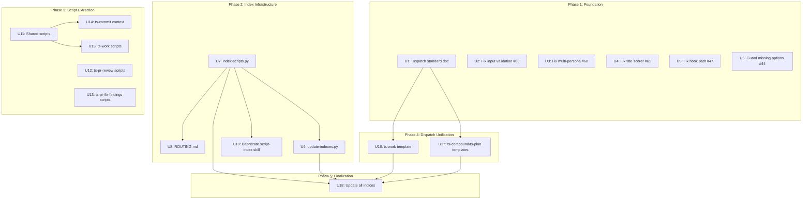

# feat: Wave 2 — Script Extraction + Index Infrastructure + Dispatch Unification

## Summary

Extract inline scripts from six skills into reusable script files, build automated index infrastructure (index-scripts.py, update-indexes.py, ROUTING.md), unify the dispatch pattern to template-wrapped across all skills, and harden five scripts with specific bug fixes. Builds on Wave 1's R3 frontmatter, R7 link conventions, and R8 index standards.

## Problem Frame

Skills contain inline shell commands and mechanical steps that the LLM executes token-by-token. These steps are duplicated across skills (default branch resolution appears in three skills, context gathering in two), error-prone when executed inline (complex awk scripts, GraphQL mutations), and expensive in tokens. Wave 1 established the frontmatter and standards foundation; Wave 2 extracts, indexes, and hardens.

Two dispatch patterns coexist: template-wrapped (ts-code-review, ts-doc-review, ts-verify-implementation) and direct-seed (ts-work, ts-compound, ts-plan). Unifying to template-wrapped centralizes output contracts and confidence rubrics, reducing drift when standards evolve.

## Requirements

**Index Infrastructure (from #81)**

- R1. `scripts/index-scripts.py` indexes all repo-level scripts using R3 frontmatter, producing `docs/script-index.md`
- R2. `docs/ROUTING.md` is a Map of Content pointing to other indices and important information
- R3. `scripts/update-indexes.py` recursively creates/updates INDEX.md files in `docs/`, calls index-scripts.py, and ensures ROUTING.md has entries for all sub-indices
- R4. Update skills that reference inline script locations to reference the new script-index

**Script Extraction (from #82)**

- R5. Extract inline scripts from ts-commit, ts-commit-push-pr, ts-pr-review, ts-verify-implementation, ts-pr-fix-findings, and ts-work into reusable script files under `scripts/` or `skills/<name>/scripts/`
- R6. Each extracted script follows existing conventions: R3 frontmatter, `--help` flag, JSON output, exit codes (0/1/2), input validation, `set -euo pipefail`

**Script Fixes (from #63, #60, #61, #47, #44)**

- R7. `check-thread-resolution.sh` and `fetch-issue-comments.sh` validate input formats (owner/repo shape, digits-only PR number), not just shell metacharacters (#63)
- R8. `select-reviewers.sh` uses independent predicate checks instead of case-block-first-match, so a single file can activate multiple reviewer personas (#60)
- R9. `detect-overlap.py` title scorer uses only substring/word-overlap logic, removing SequenceMatcher contribution (#61)
- R10. `find-precommit-hook.sh` outputs the full resolved hook path in scripts[0], not just the basename (#47)
- R11. `detect-missing-artifacts.sh` guards against missing option values before reading `$2`, failing gracefully with JSON error (#44)

**Dispatch Unification**

- R12. All skills use the template-wrapped dispatch pattern with a `references/subagent-template.md` file
- R13. `docs/standards/agent-standards.md` documents template-wrapped as the canonical dispatch pattern; direct-seed is deprecated

## Key Technical Decisions

**KTD-1. Agent consolidation (#83) is out of scope.** The nine cross-skill agent duplicates require their own dedicated plan due to the cross-cutting nature of the changes. Wave 2 focuses on script work and dispatch unification only.

**KTD-2. Template-wrapped is the canonical dispatch pattern.** ts-work, ts-compound, and ts-plan adopt `references/subagent-template.md` files with `{agent_file}` variable substitution. The template provides shared structure (output contract, context slots, rules) and the agent file provides domain-specific identity. This matches the existing pattern in ts-code-review and ts-doc-review.

**KTD-3. Script extraction scope — high-value candidates only.** Not every inline code block is worth extracting. Prioritize: (a) steps duplicated across skills, (b) complex mechanical steps (awk scripts, GraphQL mutations), (c) steps with known bugs. Trivial one-liners (`git push`, `git add`) stay inline.

**KTD-4. New shared scripts go in `scripts/`; skill-specific scripts stay in `skills/<name>/scripts/`.** Shared utilities (default-branch.sh, git-context.sh) serve multiple skills from `scripts/`. Skill-specific scripts (resolve-thread.sh, map-diff-lines.sh) live under the skill's own `scripts/` directory. This matches the existing two-tier structure.

**KTD-5. Python scripts for indexer infrastructure.** `index-scripts.py` and `update-indexes.py` are Python (matching `extract-ktds.py` and `verify-ktd-literal.py` patterns): `#!/usr/bin/env python3`, `pathlib.Path`, `json.dumps()` output, `main()` with `if __name__ == '__main__'` guard, stdlib only.

**KTD-6. Script extraction preserves existing behavior.** Extracted scripts produce the same output format and exit codes as the inline logic they replace. Skills are updated to call the extracted scripts, but their orchestration logic (what to do with the output) stays in the SKILL.md.

**KTD-7. Dispatch template varies by skill type.** ts-work gets an implementer-focused template (scope boundary, fidelity, done criteria). ts-compound and ts-plan get research-focused templates (research context, output contract). The template shape matches the skill's agent type, not a one-size-fits-all approach.

## High-Level Technical Design

The plan has five phases with three parallel work streams. Phase 1 (Foundation) and Phase 2 (Index Infrastructure) have no inter-track dependencies and can proceed in parallel. Phase 3 (Script Extraction) benefits from Phase 2 landing first (so the script index can be updated), but individual extraction units are independent of each other. Phase 4 (Dispatch Unification) depends only on U1 (standards update).

## Implementation Units

### Phase 1: Foundation (independent, can start immediately)

### U1. Document template-wrapped dispatch as the canonical pattern

**Goal:** Update `docs/standards/agent-standards.md` to deprecate direct-seed and document template-wrapped as the only supported dispatch pattern.

**Requirements:** R13

**Dependencies:** None

**Files:**
- `docs/standards/agent-standards.md` (update Dispatch Patterns section)

**Approach:**
- Replace the current "Two dispatch patterns coexist" section with a single canonical pattern: template-wrapped
- Document the template structure: `<agent>{agent_file}</agent>` block, `<output-contract>` block, `<context>` block with per-skill variable slots
- Add a deprecation note: direct-seed is no longer accepted for new or modified skills
- Document the template creation guidance: how to create a `references/subagent-template.md` for a skill, what variable slots to define, how the output contract works

**Patterns to follow:** The existing template structure in `skills/ts-code-review/references/subagent-template.md` and `skills/ts-doc-review/references/subagent-template.md`.

**Test scenarios:**
- Happy path: The dispatch patterns section documents only template-wrapped as canonical
- Happy path: The deprecation note for direct-seed is clear and unambiguous
- Edge case: The template creation guidance is specific enough for an implementer to create a new template

**Verification:** `docs/standards/agent-standards.md` documents template-wrapped as the sole canonical pattern with creation guidance.

---

### U2. Fix pr-fix-findings input validation (#63)

**Goal:** `check-thread-resolution.sh` and `fetch-issue-comments.sh` validate input formats (owner/repo shape, digits-only PR number), not just shell metacharacters.

**Requirements:** R7

**Dependencies:** None

**Files:**
- `skills/ts-pr-fix-findings/scripts/check-thread-resolution.sh` (update validation)
- `skills/ts-pr-fix-findings/scripts/fetch-issue-comments.sh` (update validation)
- `tests/skills/ts-pr-fix-findings/test-check-thread-resolution.sh` (add test cases)
- `tests/skills/ts-pr-fix-findings/test-fetch-issue-comments.sh` (add test cases)

**Approach:**
- The format validation is already applied: both scripts have `^[a-zA-Z0-9._-]+/[a-zA-Z0-9._-]+$` for repo and `^[0-9]+$` for PR number checks after the metacharacter gate
- Verify the current implementation is correct and add test cases for edge cases (path traversal, extra slashes, non-numeric PR)

**Patterns to follow:** The existing error handling pattern in both scripts (JSON error on stderr, exit 1).

**Test scenarios:**
- Happy path: Valid `owner/repo` and numeric PR pass validation
- Edge case: `1/../../orgs/other/...` is rejected by the format validator
- Edge case: `owner/repo/extra/slashes` is rejected
- Edge case: PR number with letters is rejected
- Error path: Validation failure produces JSON error on stderr with exit 1

**Verification:** Both scripts reject non-conforming inputs with structured JSON errors. Test cases pass.

---

### U3. Fix select-reviewers.sh multi-persona matching (#60)

**Goal:** Replace case-block-first-match with independent predicate checks so a single file can activate multiple reviewer personas.

**Requirements:** R8

**Dependencies:** None

**Files:**
- `skills/ts-code-review/scripts/select-reviewers.sh` (rewrite matching logic)
- `tests/skills/ts-code-review/test-select-reviewers.sh` (update/add test cases)

**Approach:**
- Replace the `case` block (around line 50) with independent `if` predicates for each conditional persona
- Each predicate is evaluated independently — no early exit after first match
- Suppress predicates already covered by `always_on` (e.g., if `testing` is always_on, skip the conditional `testing` predicate)
- Build the conditional array by appending matches, then deduplicate before JSON output
- Preserve the existing JSON output structure: `{always_on: [], conditional: [], rationale: {}}`

**Patterns to follow:** The existing output format in the same script. The `always_on` array is populated first, then conditional predicates run independently.

**Test scenarios:**
- Happy path: `api/auth/login_controller_test.rb` activates security, api-contract, and testing (not just security)
- Happy path: A pure backend file activates only backend-related personas
- Edge case: A file matching no conditional predicates produces empty conditional array
- Edge case: A persona already in `always_on` does not appear in `conditional`

**Verification:** A mixed-surface path like `api/auth/login_controller_test.rb` activates all applicable reviewer personas, not just the first match.

---

### U4. Fix detect-overlap.py title scorer (#61)

**Goal:** Remove SequenceMatcher contribution from `title_similarity()`, using only substring/word-overlap logic.

**Requirements:** R9

**Dependencies:** None

**Files:**
- `skills/ts-compound/scripts/detect-overlap.py` (update `title_similarity` function)
- `tests/skills/ts-compound/test-detect-overlap.py` (update test cases)

**Approach:**
- In `title_similarity()` (around line 87), remove the `SequenceMatcher` ratio contribution
- Keep only the substring/word-overlap based scoring that matches the documented contract
- Verify the composite scoring formula (0.6 * title_sim + 0.4 * tag_overlap) still produces expected results with the simplified scorer
- Update any test cases that relied on SequenceMatcher-specific scores

**Patterns to follow:** The documented scoring algorithm in the existing script's docstring and the script extraction plan (U14).

**Test scenarios:**
- Happy path: Identical titles produce score 1.0
- Happy path: Completely different titles produce score near 0
- Edge case: Substring matches (e.g., "Deployment" in "Deployment Patterns") are detected
- Edge case: Word-overlap catches reordered titles ("Fix Bug A" vs "A Bug Fix")

**Verification:** `title_similarity()` uses only overlap-based logic. Composite scores match documented formula.

---

### U5. Fix find-precommit-hook.sh scripts[0] path (#47)

**Goal:** Output the full resolved hook path in scripts[0], not just the basename.

**Requirements:** R10

**Dependencies:** None

**Files:**
- `skills/ts-work/scripts/find-precommit-hook.sh` (fix line ~58)
- `tests/skills/ts-work/test-find-precommit-hook.sh` (add assertion)

**Approach:**
- The fix is already applied: line 58 reads `scripts=("$hook_path")` (full path, not basename)
- Verify the current implementation is correct and add a test assertion confirming scripts[0] is a valid/resolvable path

**Patterns to follow:** The existing JSON output construction in the same script.

**Test scenarios:**
- Happy path: scripts[0] in JSON output is a resolvable file path
- Edge case: When hook is found via `.githooks/`, the full path is returned
- Error path: When no hook is found, scripts array is empty (existing behavior preserved)

**Verification:** scripts[0] in the JSON output is a resolvable file path to the pre-commit hook.

---

### U6. Guard detect-missing-artifacts.sh missing options (#44)

**Goal:** Guard against missing option values before reading `$2`, failing gracefully with JSON error.

**Requirements:** R11

**Dependencies:** None

**Files:**
- `skills/ts-work/scripts/detect-missing-artifacts.sh` (update option parsing)
- `tests/skills/ts-work/test-detect-missing-artifacts.sh` (add regression test)

**Approach:**
- The fix is already applied: lines 37 and 42 have `[[ $# -ge 2 ]]` guards with JSON error output
- Verify the current implementation is correct and add a regression test case for `--plan-files` / `--reference-dir` with no value

**Patterns to follow:** The existing JSON error pattern in the same script and other scripts in the repo.

**Test scenarios:**
- Happy path: `--plan-files <file>` works correctly when value is present
- Edge case: `--plan-files` (no value) exits 1 with JSON error, not bash unbound variable error
- Edge case: `--reference-dir` (no value) exits 1 with JSON error
- Error path: Missing value error is structured JSON, not raw bash output

**Verification:** Running `detect-missing-artifacts.sh --plan-files` (no value) exits 1 and prints a JSON error message.

---

### Phase 2: Index Infrastructure (depends on Wave 1 R3/R7/R8 landing on main)

### U7. Create index-scripts.py

**Goal:** Automate script indexing using R3 frontmatter, replacing the manual `script-index` skill.

**Requirements:** R1

**Dependencies:** Wave 1 R3 (script frontmatter standardized), Wave 1 R7/R8 (link/index conventions)

**Files:**
- `scripts/index-scripts.py` (new)
- `tests/scripts/test-index-scripts.py` (new)
- `docs/script-index.md` (generated output)

**Approach:**
- Python script following existing patterns: `#!/usr/bin/env python3`, `pathlib.Path`, `json.dumps()` output, `main()` guard
- Scans `scripts/` and `skills/*/scripts/` for `.sh` and `.py` files
- Reads R3 frontmatter from each script (lines 2-3: `# <name> -- <description>`)
- Generates `docs/script-index.md` with R8-compliant structure: YAML frontmatter with `tags: [index, scripts]`, description, table with Link and Description columns
- Ensures `docs/ROUTING.md` has an entry pointing to `docs/script-index.md` with the prescribed description
- `--help` flag with usage documentation
- Exit codes: 0 success, 1 error

**Patterns to follow:** `scripts/extract-ktds.py` and `scripts/verify-ktd-literal.py` for Python script structure. `docs/standards/index-convention.md` for R8 format.

**Test scenarios:**
- Happy path: Scans all `.sh` files in `scripts/` and `skills/*/scripts/`, extracts frontmatter, generates valid index
- Happy path: Generated `docs/script-index.md` passes R8 validation
- Edge case: Scripts without R3 frontmatter are listed with empty description and a warning is emitted
- Edge case: ROUTING.md entry is created if missing, updated if stale

**Verification:** `scripts/index-scripts.py` generates `docs/script-index.md` that passes `scripts/validate-index-standards.py`. ROUTING.md has the correct entry.

---

### U8. Create ROUTING.md

**Goal:** Create the Map of Content pointing to other indices and important information.

**Requirements:** R2

**Dependencies:** U7 (script-index.md must exist to be referenced)

**Files:**
- `docs/ROUTING.md` (new)

**Approach:**
- R8-compliant structure: YAML frontmatter with `tags: [index, routing]`, brief description, table
- Entries point to: `docs/script-index.md` (from U7), `docs/standards/INDEX.md`, `docs/solutions/INDEX.md` (from U9)
- Each entry has Link and Description columns per R8
- Only ROUTING.md may reference files outside its parent folder per R8 convention
- The script-index entry uses the prescribed description: "Index of all repo-level scripts. Read this any time you need to perform a repeatable task, such as git operations, JSON output, etc. Also consult this before running any ad-hoc scripts to see if one doesn't already exist"

**Patterns to follow:** `docs/standards/INDEX.md` for R8 structure. The R8 convention in `docs/standards/index-convention.md`.

**Test scenarios:**
- Happy path: ROUTING.md lists all major indices with accurate descriptions
- Happy path: ROUTING.md passes R8 validation
- Edge case: Only ROUTING.md references files outside its parent folder

**Verification:** `scripts/validate-index-standards.py` reports zero errors for ROUTING.md.

---

### U9. Create update-indexes.py

**Goal:** Automate recursive INDEX.md creation/updates across `docs/`.

**Requirements:** R3

**Dependencies:** U7 (index-scripts.py exists), U8 (ROUTING.md exists)

**Files:**
- `scripts/update-indexes.py` (new)
- `tests/scripts/test-update-indexes.py` (new)

**Approach:**
- Recursively searches through `docs/` subdirectories
- In each folder, creates or updates an INDEX.md conforming to R8
- For `docs/solutions/` subdirectories: adds a "Tags" column pulled from solution file frontmatter
- Descriptions pulled from the paragraph between first and second headings in each file
- Ensures ROUTING.md has a table entry pointing to `docs/solutions/INDEX.md`
- Calls `index-scripts.py` to ensure script indexes are up-to-date
- `--help` flag, `--dry-run` flag for preview
- Exit codes: 0 success, 1 error

**Patterns to follow:** `scripts/index-scripts.py` (U7) for Python structure. `docs/standards/index-convention.md` for R8 format.

**Test scenarios:**
- Happy path: Creates INDEX.md in each `docs/` subfolder that doesn't have one
- Happy path: Updates existing INDEX.md files to match current directory contents
- Happy path: `docs/solutions/INDEX.md` includes Tags column from frontmatter
- Edge case: `--dry-run` shows what would change without writing
- Edge case: Calls index-scripts.py as part of the run

**Verification:** `scripts/update-indexes.py` produces R8-compliant INDEX.md files. `docs/solutions/INDEX.md` includes Tags column.

---

### U10. Deprecate script-index skill

**Goal:** Remove the manual `script-index` skill, replaced by `index-scripts.py`.

**Requirements:** R4

**Dependencies:** U7 (index-scripts.py exists and works)

**Files:**
- `skills/script-index/SKILL.md` (update or remove)

**Approach:**
- Remove `skills/script-index/SKILL.md` entirely — `index-scripts.py` (U7) generates `docs/script-index.md` which replaces the manual routing table
- Update any skills that referenced `script-index` to reference `docs/script-index.md` instead

**Patterns to follow:** None — this is a removal/replacement.

**Test scenarios:**
- Happy path: No skill references the old `script-index` skill
- Happy path: `docs/script-index.md` is the authoritative script index

**Verification:** `skills/script-index/` is removed or reduced to a redirect. All script references point to `docs/script-index.md`.

---

### Phase 3: Script Extraction (depends on Phase 2 for index updates)

### U11. Create shared scripts: default-branch.sh and context-gather.sh

**Goal:** Extract duplicated default-branch resolution and git-context-gathering into shared scripts.

**Requirements:** R5, R6

**Dependencies:** None (these are new scripts, no existing file conflicts)

**Files:**
- `scripts/default-branch.sh` (existing — verify Wave 1 implementation matches spec)
- `scripts/context-gather.sh` (new)
- `tests/scripts/test-default-branch.sh` (new)
- `tests/scripts/test-context-gather.sh` (new)

**Approach:**
- `default-branch.sh`: Already exists at `scripts/default-branch.sh` with the exact cascading fallback chain described. Verify the existing implementation matches spec; add R3 frontmatter or tests if missing. Do not create a new script.
- `context-gather.sh`: Gather git context used by ts-commit and ts-commit-push-pr: current branch, default branch, recent commits, dirty/untracked/staged files, unpushed status. Output: JSON on stdout. Combines the inline context-gathering blocks from both skills.
- Both follow R3 frontmatter, `--help`, exit codes, input validation conventions

**Patterns to follow:** `scripts/git-context.sh` for git state JSON output patterns. `scripts/default-branch.sh` if it already exists.

**Test scenarios:**
- Happy path: `default-branch.sh` returns `main` when origin/HEAD points to main
- Happy path: `context-gather.sh` returns valid JSON with all expected fields
- Edge case: Fallback chain works when origin/HEAD is not set
- Edge case: Dirty files list is accurate

**Verification:** Both scripts produce correct output in the taegosts-skills repo. Tests pass.

---

### U12. Extract ts-pr-review inline scripts

**Goal:** Extract the diff line mapping awk script and PR data fetch into reusable scripts.

**Requirements:** R5, R6

**Dependencies:** None

**Files:**
- `skills/ts-pr-review/scripts/map-diff-lines.sh` (new)
- `skills/ts-pr-review/scripts/fetch-pr-data.sh` (new)
- `skills/ts-pr-review/SKILL.md` (update to call extracted scripts)
- `tests/skills/ts-pr-review/test-map-diff-lines.sh` (new)
- `tests/skills/ts-pr-review/test-fetch-pr-data.sh` (new)

**Approach:**
- `map-diff-lines.sh`: Extract the complex awk script (lines 73-78 of SKILL.md) that parses diff output to build `file:line` mapping. Input: diff on stdin or as file argument. Output: JSON mapping of `file:line` to diff locations. The awk logic stays in the script; the skill just calls it and parses the JSON result.
- `fetch-pr-data.sh`: Extract the `gh pr view` call (line 39) into a script with `--repo` and `--pr` arguments. Output: JSON with PR metadata. Uses `gh` CLI (matching existing patterns).
- Update SKILL.md to call these scripts instead of inline commands

**Patterns to follow:** `scripts/pr-metadata.sh` for PR data fetching. `scripts/to-json.sh` for JSON output patterns.

**Test scenarios:**
- Happy path: `map-diff-lines.sh` correctly maps file:line pairs from a sample diff
- Happy path: `fetch-pr-data.sh` returns valid JSON PR metadata
- Edge case: Large diffs with many hunks are handled correctly
- Edge case: Binary files in diff are skipped

**Verification:** Both scripts produce correct output. SKILL.md calls them instead of inline commands.

---

### U13. Extract ts-pr-fix-findings inline scripts

**Goal:** Extract the thread resolution GraphQL mutation and re-review request into scripts.

**Requirements:** R5, R6

**Dependencies:** None

**Files:**
- `skills/ts-pr-fix-findings/scripts/resolve-thread.sh` (new)
- `skills/ts-pr-fix-findings/scripts/request-re-review.sh` (new)
- `skills/ts-pr-fix-findings/SKILL.md` (update to call extracted scripts)
- `tests/skills/ts-pr-fix-findings/test-resolve-thread.sh` (new)
- `tests/skills/ts-pr-fix-findings/test-request-re-review.sh` (new)

**Approach:**
- `resolve-thread.sh`: Extract the GraphQL mutation (line 198 of SKILL.md) into a script. Input: `--repo owner/repo --thread-id <id>`. Output: JSON with resolution status. Uses `gh api graphql`.
- `request-re-review.sh`: Extract the re-review request (lines 207-212) into a script. Input: `--repo owner/repo --pr number --reviewer name`. Output: JSON confirmation. Uses `gh api` or `gh pr edit`.
- Both include R3 frontmatter, `--help`, input validation (owner/repo format, numeric PR), exit codes
- Update SKILL.md Steps 3 and 5 to call these scripts

**Patterns to follow:** `skills/ts-pr-fix-findings/scripts/check-thread-resolution.sh` for GraphQL API patterns. `scripts/pr-metadata.sh` for `gh api` patterns.

**Test scenarios:**
- Happy path: `resolve-thread.sh` resolves a thread via GraphQL
- Happy path: `request-re-review.sh` requests a re-review
- Edge case: Invalid thread ID produces JSON error
- Edge case: API auth failure produces clear error message

**Verification:** Both scripts work against a real PR. SKILL.md calls them instead of inline commands.

---

### U14. Extract ts-commit and ts-commit-push-pr context gathering

**Goal:** Replace inline context-gathering blocks in ts-commit and ts-commit-push-pr with calls to `context-gather.sh`.

**Requirements:** R5

**Dependencies:** U11 (context-gather.sh exists)

**Files:**
- `skills/ts-commit/SKILL.md` (update to call context-gather.sh)
- `skills/ts-commit-push-pr/SKILL.md` (update to call context-gather.sh)

**Approach:**
- Replace the inline `printf` + git commands blocks (ts-commit line 37, ts-commit-push-pr line 40) with a call to `../../scripts/context-gather.sh`
- The skill parses the JSON output instead of executing individual git commands
- Preserve the skill's orchestration logic (what to do with the context data)

**Patterns to follow:** How other skills consume `scripts/git-context.sh` output.

**Test scenarios:**
- Happy path: ts-commit successfully gathers context via the script
- Happy path: ts-commit-push-pr successfully gathers context via the script
- Edge case: Script failure doesn't block the skill (graceful fallback)

**Verification:** Both skills invoke `context-gather.sh` instead of inline git commands.

---

### U15. Extract ts-work inline scripts

**Goal:** Extract high-value inline steps from ts-work into reusable scripts.

**Requirements:** R5, R6

**Dependencies:** U11 (default-branch.sh may be used)

**Files:**
- `skills/ts-work/SKILL.md` (update to call extracted scripts)
- New scripts as identified (e.g., `scripts/cross-check-conventions.sh` if the convention grep pattern is worth extracting)

**Approach:**
- Audit ts-work SKILL.md for extractable inline steps (context gathering, default branch resolution, convention cross-checking)
- Replace inline blocks with calls to shared or skill-specific scripts
- The incremental commit pattern (`git add && git commit`) is a template, not extractable — stays inline
- Focus on steps that are duplicated with other skills or have meaningful complexity

**Patterns to follow:** The existing script consumption pattern in ts-work (calling `scripts/extract-ktds.py`, `scripts/detect-missing-artifacts.sh`).

**Test scenarios:**
- Happy path: ts-work successfully calls extracted scripts
- Edge case: Script failures are handled gracefully

**Verification:** ts-work SKILL.md calls scripts for mechanical steps instead of inline commands.

---

### Phase 4: Dispatch Unification (depends on U1 for standards)

### U16. Create ts-work subagent template

**Goal:** Create `references/subagent-template.md` for ts-work, migrating from direct-seed to template-wrapped dispatch.

**Requirements:** R12

**Dependencies:** U1 (standards document updated)

**Files:**
- `skills/ts-work/references/subagent-template.md` (new)
- `skills/ts-work/SKILL.md` (update dispatch instructions)

**Approach:**
- Create a template with implementer-focused structure:
  - `<agent>{agent_file}</agent>` — agent identity and scope
  - `<plan-context>` — plan unit details (Goal, Files, Approach, Test scenarios)
  - `<output-contract>` — what the implementer returns (diff summary, test results, blockers)
  - `<rules>` — shared constraints (no staging, no committing, no running full test suite)
- Update SKILL.md Step 4 to inject agent file content into the template via `{agent_file}` substitution instead of seeding directly
- Preserve the existing serial/parallel dispatch logic and worktree isolation

**Patterns to follow:** `skills/ts-code-review/references/subagent-template.md` for template structure. `skills/ts-verify-implementation/references/subagent-template.md` for the simpler verification template.

**Test scenarios:**
- Happy path: Template has all required variable slots
- Happy path: SKILL.md dispatch instructions use `{agent_file}` substitution
- Edge case: Both implementer-general and implementer-tests work through the same template
- Edge case: Worktree isolation still works with template-wrapped dispatch

**Verification:** ts-work uses template-wrapped dispatch. Implementer agents are injected via `{agent_file}`.

---

### U17. Create ts-compound and ts-plan subagent templates

**Goal:** Create `references/subagent-template.md` for ts-compound and ts-plan, migrating from direct-seed to template-wrapped dispatch.

**Requirements:** R12

**Dependencies:** U1 (standards document updated)

**Files:**
- `skills/ts-compound/references/subagent-template.md` (new)
- `skills/ts-compound/SKILL.md` (update dispatch instructions)
- `skills/ts-plan/references/subagent-template.md` (new)
- `skills/ts-plan/SKILL.md` (update dispatch instructions)

**Approach:**
- Create research-focused templates with:
  - `<agent>{agent_file}</agent>` — agent identity and research scope
  - `<research-context>` — planning context summary, scope hints, feature description
  - `<output-contract>` — structured findings format (technology, architecture, patterns, recommendations)
  - `<rules>` — read-only analysis, repo-relative paths, no code changes
- ts-plan's template includes additional context slots for origin document content and planning phase
- ts-compound's template includes context slots for problem type, solution draft, and run ID
- Update both SKILL.md files to use `{agent_file}` substitution

**Patterns to follow:** `skills/ts-doc-review/references/subagent-template.md` for the research/reviewer template shape.

**Test scenarios:**
- Happy path: Both templates have `{agent_file}` and appropriate context slots
- Happy path: SKILL.md dispatch instructions use template-wrapped pattern
- Edge case: ts-plan's various agent types (repo-research-analyst, learnings-researcher, etc.) all work through the same template
- Edge case: ts-compound's Phase 1 research agents work through the template

**Verification:** Both skills use template-wrapped dispatch. Agent files are injected via `{agent_file}`.

---

### Phase 5: Finalization

### U18. Update docs/standards/INDEX.md and run update-indexes.py

**Goal:** Ensure all indices are up-to-date after Wave 2 changes.

**Requirements:** R3

**Dependencies:** U7, U8, U9 (index infrastructure complete), U1-U17 (all changes landed)

**Files:**
- `docs/standards/INDEX.md` (update to list new standards)
- All `INDEX.md` files across `docs/` (regenerated by update-indexes.py)
- `docs/ROUTING.md` (verified up-to-date)

**Approach:**
- Add dispatch-standard entry to `docs/standards/INDEX.md` if not already present
- Run `scripts/update-indexes.py` to regenerate all INDEX.md files
- Run `scripts/index-scripts.py` to regenerate `docs/script-index.md`
- Run `scripts/validate-index-standards.py --all` to confirm compliance
- Verify ROUTING.md has entries for all sub-indices

**Patterns to follow:** R8 convention in `docs/standards/index-convention.md`.

**Test scenarios:**
- Happy path: All INDEX.md files pass R8 validation
- Happy path: ROUTING.md references all sub-indices
- Happy path: `docs/script-index.md` lists all scripts with accurate descriptions

**Verification:** `scripts/validate-index-standards.py --all` reports zero errors. `scripts/update-indexes.py` produces no changes (idempotent).

## Scope Boundaries

**In scope:**
- All 6 skills for script extraction (ts-commit, ts-commit-push-pr, ts-pr-review, ts-verify-implementation, ts-pr-fix-findings, ts-work)
- Index infrastructure (index-scripts.py, update-indexes.py, ROUTING.md)
- 5 script hardening fixes (#63, #60, #61, #47, #44)
- Dispatch pattern unification to template-wrapped
- Standards documentation updates

**Deferred to Follow-Up Work:**
- **Agent consolidation (#83)** — requires its own dedicated plan. Tracked separately.
- **Test suites for extracted scripts** — script tests are created during extraction but full test coverage is a follow-up concern.
- **Script-index skill removal** — may be kept as a thin redirect if downstream tools depend on it.

**Out of scope:**
- Agent deduplication across skills (#83)
- Changes to skills' core orchestration logic (only dispatch pattern changes)
- New agent definitions beyond what's needed for template migration

## Risks & Dependencies

- **Wave 1 dependency:** Index infrastructure (U7-U9) requires Wave 1 R3/R7/R8 to be landed on main. Script fixes and extraction can start immediately.
- **Script extraction coordination:** Track 2 (extraction) and Track 3 (fixes) may touch the same scripts. Coordinate to avoid conflicts — fixes should land before extraction changes the target files.
- **Dispatch template migration:** Converting three skills from direct-seed to template-wrapped is a behavioral change. Each skill should be tested after migration to verify subagent dispatch still works correctly.
- **Inline script identification:** Some inline blocks in SKILL.md are templates (e.g., commit message patterns) that should stay inline, not be extracted. The implementer must use judgment on extraction candidates.

## System-Wide Impact

- All skills use a single dispatch pattern (template-wrapped), reducing maintenance surface
- Automated index infrastructure replaces manual script-index skill
- ROUTING.md provides a single entry point for navigating the repo's documentation
- Extracted scripts reduce token cost for skill invocations
- Hardened scripts prevent input validation bugs from PR review findings
