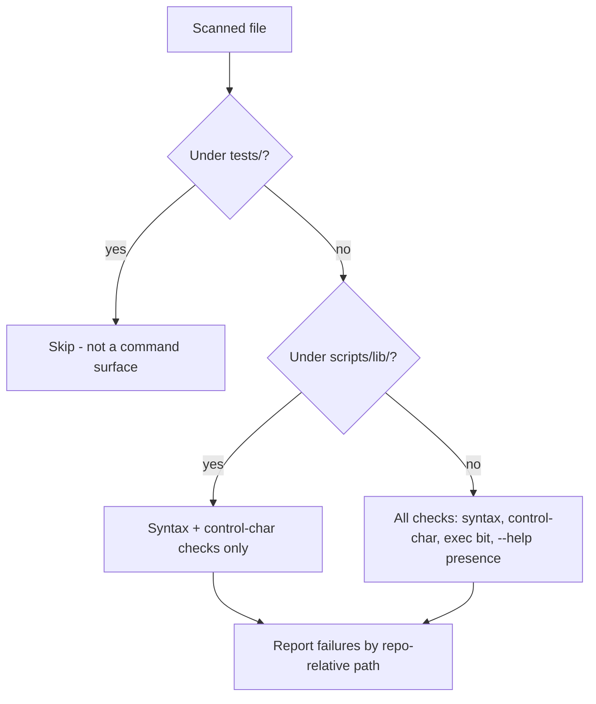
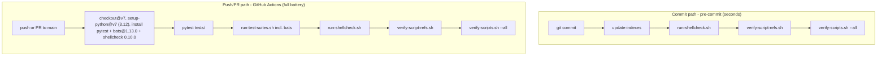

# fix: Repo hygiene — gate exemptions, test discovery, fleet compliance, and CI enforcement (Issue #118)

## Summary

Fix the `scripts/verify-scripts.sh` gate's two design gaps (tests/ scanning, missing library category), rename the four dash-named Python test suites — one also converted to pytest idiom — so bare `pytest tests/` collects all 101 tests, bring every genuine gate offender repo-wide into compliance, add an aggregate bash/bats test runner, and wire enforcement: the gate joins pre-commit as a fast check, and a first-ever GitHub Actions workflow runs the full test battery on push/PR to main.

---

## Problem Frame

Issue #118 tracks three residuals left deliberately out of PR #116's scope:

1. **The gate flags correct things.** `scripts/verify-scripts.sh .` reports 56 passed / 62 failures. Of the 62: 33 are genuine non-compliance (missing `--help`, missing exec bit) across 26 files in `scripts/` and `skills/*/scripts/`; 4 are false positives on `scripts/lib/` (sourced/imported libraries that are never commands); 25 are false positives on `tests/` (test scripts run via `bash`/pytest, not as commands). The gate has no exemption mechanism at all. Notably, its `--all` mode already skips `tests/` while dir mode does not — the two modes disagree.
2. **Python test discovery silently skips 73 of 97 tests.** No pytest config exists; the default `test_*.py` pattern matches only `tests/test_validate_index_standards.py`. The three dash-named suites in `tests/scripts/` (73 tests) are invisible to bare `pytest tests/` — a false green. A fourth dash-named suite, `tests/skills/ts-compound/test-detect-overlap.py`, is script-style — pytest never collects it under any name. `docs/standards/testing-standards.md` already mandates `test_<script_name>.py` (underscore); exactly one file follows it.
3. **Nothing enforces anything.** No CI exists (`.github/workflows/` absent), the gate is wired into no hook, and the 40 bash test suites (30 in `tests/scripts/`, 10 in `tests/skills/`) plus 4 bats files have no runner anywhere — no Makefile, no CI, no pre-commit entry. Every gate and suite runs only when a session remembers to.

The standards already encode the correct intent: `docs/standards/script-frontmatter-convention.md` has an explicit "Test Scripts (Excluded)" section, and `docs/standards/script-extraction-standards.md` defines `scripts/lib/` as first-party shared-library code "never invoked directly as commands." The gate never implemented either. Residuals 1 and 2 are both symptoms of residual 3.

Decisions were confirmed with the user during planning: underscore renames (not pytest config), repo-wide compliance batch (not `scripts/` only), bats included in CI, CI-full + fast-pre-commit enforcement split, and `scripts/lib/` exempt from command checks only (syntax checks retained — the files are first-party, per the standard's own text).

---

## Requirements

**Gate correctness**

- R1. `scripts/verify-scripts.sh` skips all checks for files under `tests/` in every mode (`--all`, dir, `--file`).
- R2. `scripts/verify-scripts.sh` skips `--help` and exec-bit checks for files under `scripts/lib/`, while retaining syntax checks (`bash -n` / `python3 -m py_compile`) and the control-character scan.
- R3. Gate failure output uses repo-relative paths, disambiguating duplicate basenames (two `validate-frontmatter.py` copies exist).
- R4. The gate's scope policy — which file classes receive which checks — is documented in `docs/standards/`, not only in gate code.

**Test discovery**

- R5. All Python test files follow `test_<name>.py` and are pytest-collectable; bare `pytest tests/` collects and passes all 101 Python tests with no pytest configuration file.
- R6. `scripts/detect-coverage-gaps.sh` reports no new coverage gaps from the renames. Its probe interpolates source basenames with dashes preserved (`tests/scripts/test_${basename_no_ext}.py`), so it recognized none of the three dash suites before and recognizes only `test_index_common.py` after — that script's pre-existing false gap clears; `index-scripts.py` and `update-indexes.py` keep pre-existing false gaps, out of scope per Scope Boundaries.

**Script compliance**

- R7. Every genuine offender across `scripts/` and `skills/*/scripts/` has a working `--help` (prints usage, exits 0, no side effects) and the executable bit; the gate exits green in both `--all` and dir mode.

**Enforcement**

- R8. An aggregate runner executes every bash suite under `tests/scripts/` and `tests/skills/` plus the 4 bats files, exiting non-zero if any suite fails.
- R9. A GitHub Actions workflow runs the full battery — pytest, the aggregate runner (which includes the bats files), `scripts/run-shellcheck.sh`, `scripts/verify-script-refs.sh`, `scripts/verify-scripts.sh --all` — on push and PR to `main`, and is green on `main` after merge.
- R10. Pre-commit adds `scripts/verify-scripts.sh --all` as a fast local gate; existing hooks are unchanged.
- R11. Documentation reflects the new reality: stale known-issue counters removed from `docs/solutions/tooling-decisions/claude-code-plugin-script-path-resolution.md`; README dev-setup covers pytest and bats install; `docs/standards/testing-standards.md` records the runner and bats conventions and codifies that every Python suite is pytest-collectable (`test_<name>.py`, no standalone runners); `docs/standards/script-security-standards.md` §10 scopes its header and `--help` rules to command scripts, exempting `scripts/lib/`; `docs/solutions/conventions/automatic-test-dispatch.md`'s worked example uses the underscore name; and `docs/standards/index-standards.md`'s orphaned "R3 frontmatter standard" reference names the actual convention.

---

## Key Technical Decisions

- **KTD1 [literal]: Exemptions are implemented as path-based classification at check time, applying identically in all three modes.** The classification keys on the file's repo-relative path (`tests/` prefix, `scripts/lib/` prefix), not on filtering the file list of one mode. Rationale: `--all` mode already skips `tests/` while dir mode does not — the modes disagree today; centralizing classification in `check_file()` (or an equivalent single choke point) fixes both plus `--file` consistency in one place.
- **KTD2 [literal]: `scripts/lib/` is exempt from command checks only.** `--help` and exec bit are dropped; syntax checks and control-char scan are retained. Rationale: `docs/standards/script-extraction-standards.md` defines `scripts/lib/` as first-party sourced/imported code never invoked as a command (so command checks are wrong by design), but a syntax-broken library still kills every importer — the cheap checks stay. User confirmed this split after a provenance check corrected an initial "3rd-party" framing.
- **KTD3 [behavioral]: Underscore renames over pytest configuration.** Rename the four dash-named Python suites — three pure renames in `tests/scripts/`, plus `tests/skills/ts-compound/test-detect-overlap.py` converted from standalone-runner idiom to pytest test functions — and add no `pytest.ini`. Rationale: `testing-standards.md` already mandates `test_<script_name>.py`; renames enforce the written standard instead of amending it, and pytest's default collection then works with zero configuration. Bash suites stay dash-named (`test-*.sh`) — the standard specifies dashes for shell, and pytest never collects them.
- **KTD4 [literal]: Compliance means functional `--help` blocks, not comment mentions.** Each offender gets the early-argument-check pattern from `scripts/to-json.sh`: `if [[ "${1:-}" == "--help" ]]; then` print usage, `exit 0`. Rationale: the gate only greps file contents, but sibling suites (`tests/scripts/test-to-json.sh`) functionally assert `--help` prints usage and exits 0 — a comment-only pass would satisfy the gate and fail the ecosystem's real convention.
- **KTD5 [literal]: CI runs GitHub Actions on `ubuntu-latest`, pinned: `actions/checkout@v7`, `actions/setup-python@v7` with `python-version: '3.12'`, `pip install pytest==9.1.0` (the version U2 validates against — 9.1.0 locally at planning time; capture the actual version during U2's run), `npm install -g bats@1.13.0`, shellcheck 0.10.0 via official release tarball; triggers `push`+`pull_request` on `main`; per-branch concurrency cancellation.** Rationale (externally verified 2026-09-08): v7 majors are current for both actions; the runner image's system Python is PEP 668 externally-managed so plain `pip install` fails — the setup-python tool-cache interpreter is not, making it the clean install path; bats 1.13.0 matches the local version exactly while 1.14.0 ships a breaking `run`/`set -e` change; the runner's preinstalled shellcheck is 0.9.0, which drifts lenient against the local 0.10.0 and the `.shellcheckrc` disables written against it — pinning the tarball keeps CI and local enforcement identical; pytest is pinned for the same reason — an unpinned install resolves to whatever pip serves that day, making green-on-main time-dependent. The workflow file becomes the canonical record of tool versions (none exists anywhere today); README mirrors it in dev-setup prose.
- **KTD6 [behavioral]: The aggregate runner covers `tests/scripts/test-*.sh`, `tests/skills/*/test-*.sh`, and `tests/scripts/*.bats`; it excludes `tests/baselines/`.** Rationale: baseline word-count artifacts describe the repo at 2026-07-05 and will have drifted — including `tests/baselines/test-word-counts.sh` would make CI red on arrival for a non-behavioral reason; baseline capture stays the manual tooling it was designed to be.
- **KTD7 [behavioral]: Pre-commit keeps fast gates only; the full battery lives in CI.** `verify-scripts.sh --all` (seconds) joins pre-commit once the fleet is green; pytest, bash suites, and bats run in CI only. Rationale: user decision — commits stay fast, CI blocks everything; matches the issue's proposed split.

---

## High-Level Technical Design

### Gate classification (KTD1/KTD2)

### Enforcement topology (KTD5/KTD7)

---

## Implementation Units

### U1. Gate redesign — classification, exemptions, rel-path output

- **Goal:** `verify-scripts.sh` flags only genuine command-surface non-compliance, identically in all modes.
- **Requirements:** R1, R2, R3, R4, plus R11 in part (the `script-security-standards.md` §10 scope carve-out and the `index-standards.md` line-190 convention-name fix; R11's remainder lands in U6)
- **Dependencies:** none
- **Files:** `scripts/verify-scripts.sh`, `tests/scripts/test-verify-scripts.sh`, `docs/standards/script-extraction-standards.md`, `docs/standards/script-security-standards.md`, `docs/standards/index-standards.md`
- **Approach:** Introduce path-based classification (tests/ → skip; `scripts/lib/` → syntax + control-char only; else full checks) at a single choke point so `--all`, dir, and `--file` modes share it. Change failure output from bare basenames to repo-relative paths. Document the scope policy as a "Gate scope" subsection in `script-extraction-standards.md` (which already owns the lib tier and extraction requirements); cross-check `docs/standards/script-frontmatter-convention.md`'s existing "Test Scripts (Excluded)" section needs no change. Two adjacent standards corrections land with the gate-scope policy: `script-security-standards.md` §10 ("Each script must have" header comment + `--help`) gets a scope carve-out matching R2 — command scripts only, `scripts/lib/` exempt — so the standard stops contradicting the gate; and `index-standards.md` line 190's checklist item "Follows R3 frontmatter standard" (no standards doc defines an R-numbered ruleset) is corrected to name `script-frontmatter-convention.md`.
- **Patterns to follow:** The denylist-classifier design vocabulary of `scripts/verify-script-refs.sh` (enumerated exemptions, deliberate scoping) per the #115/#116 remediation record; the KTD-normalization precedent of writing "meaningful difference vs acceptable variation" as policy rather than burying it in gate code.
- **Test scenarios:** Extend `tests/scripts/test-verify-scripts.sh` with tmpdir fixtures: (a) a `--help`-less non-executable file placed under a `tests/` path is not flagged in dir mode; (b) a `scripts/lib/` file missing both `--help` and exec bit passes when syntactically valid; (c) a `scripts/lib/` file with a syntax error fails; (d) a command script missing `--help` still fails; (e) output lines contain the repo-relative path, not the bare basename; (f) `--file` mode on a test file reports it as out of scope.
- **Verification:** `bash scripts/verify-scripts.sh .` reports zero tests/ and lib false positives (genuine offenders still fail); `--all` and dir mode agree on every file; gate self-test suite green.

### U2. Python test renames — underscore compliance

- **Goal:** Bare `pytest tests/` collects and passes all 101 Python tests.
- **Requirements:** R5, R6
- **Dependencies:** none (order-independent with U1; sequenced second because the issue orders it second)
- **Files:** rename `tests/scripts/test-index-scripts.py` → `tests/scripts/test_index_scripts.py`, `tests/scripts/test-update-indexes.py` → `tests/scripts/test_update_indexes.py`, `tests/scripts/test-index_common.py` → `tests/scripts/test_index_common.py`; convert `tests/skills/ts-compound/test-detect-overlap.py` → `tests/skills/ts-compound/test_detect_overlap.py`
- **Approach:** Pure renames — the files already use full pytest idioms and import scripts by path, not by their own names. No pytest configuration file is created (KTD3). No live references to the dash names exist outside historical plan/PR records and the solution doc updated in U6; historical records stay untouched. Also convert the fourth dash-named suite — `tests/skills/ts-compound/test-detect-overlap.py`, a standalone runner whose module-level code executes the whole suite — to pytest test functions under the underscore name; a bare rename would make pytest execute the suite during collection. Run the full suite now — these 73 tests were last exercised individually during #116, so this is their first full-battery run.
- **Execution note:** Run `pytest tests/` to completion before anything else in this unit; any failures in the newly-collected 77 (73 dash-suite + 4 converted detect-overlap) are fixed here, not deferred.
- **Test scenarios:** `pytest tests/ --collect-only` reports 101 tests (24 + 21 + 22 + 30 + 4); full `pytest tests/` run is green; `scripts/detect-coverage-gaps.sh` reports no new gaps — `index_common.py`'s pre-existing false gap clears, `index-scripts.py` and `update-indexes.py` keep pre-existing false gaps (out of scope per Scope Boundaries).
- **Verification:** All 101 collected and green locally; no new coverage gaps (the probe interpolates source basenames with dashes preserved, so it recognized none of the dash suites before and only `test_index_common.py` after).

### U3. Fleet compliance batch — `--help` blocks and exec bits

- **Goal:** Every genuine gate offender passes all command checks; gate goes fully green.
- **Requirements:** R7
- **Dependencies:** U1 (gate must classify correctly first, or false positives pollute the work list)
- **Files:** 26 scripts plus `tests/scripts/test-fleet-help.sh` (new). `scripts/` (12): missing `--help` only — `detect-changed-code-files.sh`, `detect-coverage-gaps.sh`, `extract-ktds.py`, `git-default-branch.sh`, `load-dispatch-standards.sh`, `locate-plan.py`, `sync-taegosts-skills.sh`, `verify-ktd-literal.py`, `wait-for-file.sh`; exec bit only — `request-reviews.sh`; both — `index-scripts.py`, `update-indexes.py`. `skills/*/scripts/` (14): missing `--help` only — `skills/ts-compound/scripts/detect-overlap.py`, `skills/ts-compound/scripts/session-history/discover-sessions.sh`, `skills/ts-compound/scripts/validate-frontmatter.py`; exec bit only — `skills/ts-code-review/scripts/select-reviewers.sh`, `skills/ts-pr-fix-findings/scripts/fetch-review-comments.sh`, `skills/ts-pr-fix-findings/scripts/post-pr-comment.sh`, `skills/ts-pr-fix-findings/scripts/resolve-thread.sh`, `skills/ts-pr-review/scripts/fetch-pr-data.sh`, `skills/ts-verify-implementation/scripts/verify-coverage-threshold.sh`; both — `skills/ts-compound-refresh/scripts/validate-doc-claims.py`, `skills/ts-compound-refresh/scripts/validate-frontmatter.py`, `skills/ts-compound/scripts/session-history/extract-errors.py`, `skills/ts-compound/scripts/session-history/extract-metadata.py`, `skills/ts-compound/scripts/session-history/extract-skeleton.py`.
- **Approach:** One mechanical pass following KTD4: early `--help` argument check before any argument validation or side effects, usage text describing actual flags, `exit 0`; `chmod +x` where flagged. Help text documents exit codes where the script has meaningful distinct ones, per `script-security-standards.md` §10. Verify each `.sh` file also carries the line-2 header required by `docs/standards/script-frontmatter-convention.md` (the convention excludes `.py` scripts, which keep their docstrings); no tool enforces it — verify by inspection while in the file. Inventory-first, one commit, then a verification pass — the #116 batch pattern (round-1 verification finds minors; budget a small remediation pass).
- **Patterns to follow:** `scripts/to-json.sh` (early `--help` check, Usage/Options/Exit-codes echo block); `scripts/run-shellcheck.sh` (heredoc help variant).
- **Test scenarios:** Fleet `--help` conformance suite (new `tests/scripts/test-fleet-help.sh`, the `test-to-json.sh` assertion pattern as a loop over the 26 fixed scripts): each script's `--help` prints usage containing "Usage", documents exit codes where the script has meaningful distinct ones, exits 0, produces no other output or side effects, and works before required-argument validation rejects the invocation; `scripts/verify-scripts.sh --all` and `.` both exit 0; `bash tests/scripts/test-verify-scripts.sh` still green.
- **Verification:** Gate fully green in both modes; every touched script's `--help` verified by the fleet conformance suite.

### U4. Aggregate test runner

- **Goal:** One command runs every bash suite and bats file with fail aggregation.
- **Requirements:** R8
- **Dependencies:** none (must land before U5's CI; the runner itself is rename-independent)
- **Files:** `scripts/run-test-suites.sh` (new), `tests/scripts/test-run-test-suites.sh` (new)
- **Approach:** Discover `tests/scripts/test-*.sh`, `tests/skills/*/test-*.sh`, and `tests/scripts/*.bats`; run each `.sh` via `bash` and each `.bats` via `bats`; aggregate pass/fail counts per suite, exit non-zero on any failure; exclude `tests/baselines/` (KTD6). The runner is itself a repo script — it gets the line-2 header required by `docs/standards/script-frontmatter-convention.md`, a functional `--help`, the exec bit, and its own test suite per repo convention.
- **Sequencing note:** Six bash suites are red today (`rc=126` Permission denied — missing exec bit, the same files U3's exec-bit-only list covers). The real-repo scenario (a) and the Verification line run against the current tree, so they can only pass after U3 lands; fixture-tree scenarios (b)–(e) are order-independent and validate the runner itself before then.
- **Execution note:** After U3 lands, run the full bash fleet (40 suites + 4 bats) to completion; any still-red suite is fixed here, not deferred — U5's CI wires this exact battery, so it must be proven green first.
- **Patterns to follow:** Suite self-shape (`set -euo pipefail`, `SCRIPT_DIR`/`REPO_ROOT` resolution, pass/fail counters, `Results:` summary line) from any `tests/scripts/test-*.sh`; `to-json.sh` for the `--help` block.
- **Test scenarios:** (a) Runner against the real repo tree runs every discovered suite and reports a per-suite summary; (b) a tmpdir fixture tree with one intentionally failing suite makes the runner exit non-zero while still running the remaining suites; (c) an all-green fixture tree exits zero; (d) `tests/baselines/` files are not discovered; (e) runner's own `--help` exits 0.
- **Verification:** `bash scripts/run-test-suites.sh` green against the current repo; self-test suite green.

### U5. CI workflow — first-ever GitHub Actions

- **Goal:** Full battery blocks every push and PR to `main`.
- **Requirements:** R9
- **Dependencies:** U1, U2, U3, U4 (CI must be able to pass on day one — wiring it before the fleet is green guarantees a red main)
- **Files:** `.github/workflows/ci.yml` (new)
- **Approach:** Single job per KTD5: `ubuntu-latest`; `actions/checkout@v7`; `actions/setup-python@v7` with `python-version: '3.12'`; `pip install pytest==9.1.0` — pinned to the version U2's full-battery run validates against, captured during U2 if it differs (setup-python's interpreter avoids the PEP 668 externally-managed failure of the image's system Python); `npm install -g bats@1.13.0`; shellcheck 0.10.0 from the official release tarball onto PATH ahead of the image's 0.9.0. Steps run pytest, `scripts/run-test-suites.sh` (which includes the bats files per KTD6 — no separate bats step), `scripts/run-shellcheck.sh`, `scripts/verify-script-refs.sh`, `scripts/verify-scripts.sh --all` — each a separate step so failure location is legible in the Actions log. Triggers `push`+`pull_request` on `main`; `concurrency` group per-ref with `cancel-in-progress: true`.
- **Patterns to follow:** KTD5's verified shape; `scripts/run-shellcheck.sh`'s exit-code contract (0 clean / 1 not installed / 2 findings).
- **Test scenarios:** Workflow YAML is valid and the step list matches KTD5 (no local Actions runner exists — validation is structural plus the first real run); Test expectation: none — CI config, correctness proven by the post-push run.
- **Verification:** After merge (or from the PR itself via the `pull_request` trigger), the Actions run on `main` completes green end-to-end.

### U6. Enforcement wiring and documentation closure

- **Goal:** Gate blocks local commits; docs state the new enforcement reality.
- **Requirements:** R10, R11
- **Dependencies:** U3 (pre-commit gate must be green or every commit blocks), U4 (testing-standards documents the runner that exists), U5 (README documents the CI that exists)
- **Files:** `.pre-commit-config.yaml`, `README.md`, `docs/standards/testing-standards.md`, `docs/solutions/conventions/automatic-test-dispatch.md`, `docs/solutions/tooling-decisions/claude-code-plugin-script-path-resolution.md`
- **Approach:** Add a fourth local hook — `verify-scripts`, entry `scripts/verify-scripts.sh --all`, `language: script`, `pass_filenames: false`, `always_run: true` — mirroring the `verify-script-refs` hook shape. README dev-setup section gains pytest and bats install lines with the pinned versions, plus the shellcheck 0.10.0 pin and an install path yielding it (the official release tarball — brew/apt/scoop serve 0.11.x or 0.9.0, the versions KTD5 pins against) (workflow stays the canonical source; README references it rather than duplicating rationale). `testing-standards.md` gains the runner and bats conventions (runner scope, baseline exclusion, bats inclusion) plus the pytest-collectable rule — every Python suite is named `test_<name>.py` and defines pytest-collectable tests; standalone `test-*.py` runners are prohibited (U2's `test-detect-overlap.py` conversion is the precedent); its naming rule otherwise needs no change. The existing `ok()`/`die()`/`tmpdir` helper conventions and the conformance checklist are scoped to bash suites (`.sh`) as part of the same edit — pytest test functions are the Python-suite convention — and `automatic-test-dispatch.md`'s ok()/die() instruction gets the same bash-suite qualifier so neither doc reads as cross-language guidance. `automatic-test-dispatch.md`'s worked example is corrected to the underscore name (`tests/test_validate.py`). Remove the stale "Known pre-existing issues" gate-failure and pytest-collection entries from the path-resolution solution doc; note the resolution inline. INDEX files regenerate automatically via the existing pre-commit hook (content-idempotent).
- **Patterns to follow:** Existing `.pre-commit-config.yaml` local-hook shapes; README's existing pre-commit/ShellCheck dev-setup block (`README.md` lines 131–153).
- **Test scenarios:** Test expectation: none — configuration and documentation; behavior proven by a real `git commit` triggering all four hooks (U3 makes the gate green first) and by U5's CI run.
- **Verification:** `pre-commit run --all-files` passes all four hooks; docs read correctly with no stale counters.

---

## Scope Boundaries

Out of scope for this plan:

- **Issue #117** (prose vs executable guard-mechanism decision) — separate follow-up issue by design.
- **Renaming bash test suites** — `test-*.sh` dashes are the written standard for shell; pytest never collects them.
- **Behavioral changes to the coverage-dispatch machinery** — `detect-coverage-gaps.sh` and `detect-changed-code-files.sh` receive compliance fixes only (`--help`, exec bit).
- **`tests/baselines/` in the runner or CI** — manual baseline tooling; baseline drift would make CI red on arrival (KTD6).

### Deferred to Follow-Up Work

- Wiring the coverage-dispatch gates (`detect-changed-code-files.sh`, `detect-coverage-gaps.sh`) into CI as a changed-code/changed-test check — natural next CI step once the basic battery is proven.
- Splitting CI into parallel jobs if the serial battery proves slow (~40 bash suites; measure first).
- Declaring Python dev dependencies (`requirements.txt` or equivalent) if the Python tool surface grows beyond pytest.

---

## Risks & Dependencies

- **Newly-collected tests may fail on first full run.** The 73 dash-suite tests and 4 detect-overlap assertions were last exercised individually during #116. Mitigation: U2 runs the full battery locally before CI exists and fixes failures in-unit; the plan orders CI (U5) after this is proven.
- **Tool version drift between local and CI.** bats@1.13.0 and shellcheck 0.10.0 are pinned exactly (KTD5); bats 1.14.0 ships a breaking `run`/`set -e` change and shellcheck 0.11.0 enables new SC checks — both would make CI diverge from local results. The workflow is the version record of record.
- **Red main on CI introduction.** Mitigated by unit ordering (U5 last among code units) and the `pull_request` trigger validating the workflow from the implementing PR before merge.
- **Actions majors churn.** `checkout@v7`/`setup-python@v7` are current majors (verified 2026-09-08); Node 20 action runtime removal on 2026-09-23 does not affect v7. Future major bumps are routine maintenance.
- **Git hygiene.** Branch from current `origin/main` head, not stale local main, before starting work.

---

## Documentation / Operational Notes

- `docs/standards/script-extraction-standards.md` gains the gate-scope policy (U1), alongside the §10 carve-out in `script-security-standards.md` and the `index-standards.md` line-190 convention-name fix; `docs/standards/testing-standards.md` gains runner/bats conventions and the pytest-collectable rule (U6); the frontmatter convention's test exclusion already stands.
- `docs/solutions/tooling-decisions/claude-code-plugin-script-path-resolution.md` "Known pre-existing issues" section is updated in U6 — it currently records the exact failures this plan fixes and goes stale the moment they land.
- Historical plan and PR records (`docs/plans/2026-09-07-001-...`, `docs/pull_requests/116_fix_*.md`) keep referencing dash names — they are immutable records of what was true then.
- INDEX.md files regenerate via the existing pre-commit hook; no manual index edits.
- After landing, this work is first-of-kind for the repo (first CI, first runner decision, first fleet compliance batch) — capture the decisions via `ts-compound` per repo convention.

---

## Sources & Research

- Failure inventory and gate anatomy: `scripts/verify-scripts.sh` (139 lines; unconditional `check_file()`, basename-only output, no exemption mechanism); live runs of `--all` (57 files, 29 pass / 37 fail) and dir mode (104 files, 56 pass / 62 fail) reproducing the issue's numbers.
- Standards grounding: `docs/standards/script-frontmatter-convention.md` ("Test Scripts (Excluded)" section predates this fix), `docs/standards/script-extraction-standards.md` (lib tier: first-party, never commands), `docs/standards/testing-standards.md` line 15 (underscore rule).
- Prior art in-repo: `docs/solutions/tooling-decisions/claude-code-plugin-script-path-resolution.md` (#115/#116 remediation record; pre-registers both residuals), `scripts/verify-script-refs.sh` (gate design vocabulary), `scripts/to-json.sh` (compliance exemplar), `scripts/detect-coverage-gaps.sh` lines 74–90 (dash-preserving basename interpolation into `test_${basename_no_ext}.py` — probes match neither old nor new names for dash-named sources; only underscore-basename scripts probe correctly).
- External (verified 2026-09-08): actions/checkout and actions/setup-python v7 releases; actions/runner-images ubuntu-24.04 manifest (system Python 3.12.3 PEP 668-managed, shellcheck 0.9.0 preinstalled, pytest absent) and issue #10781 (PEP 668 pip failures); bats-core npm registry (1.13.0 latest stable matching local; 1.14.0 breaking change) and releases; koalaman/shellcheck releases (0.11.0 current — intentionally not used); GitHub docs on event triggers and workflow concurrency.
