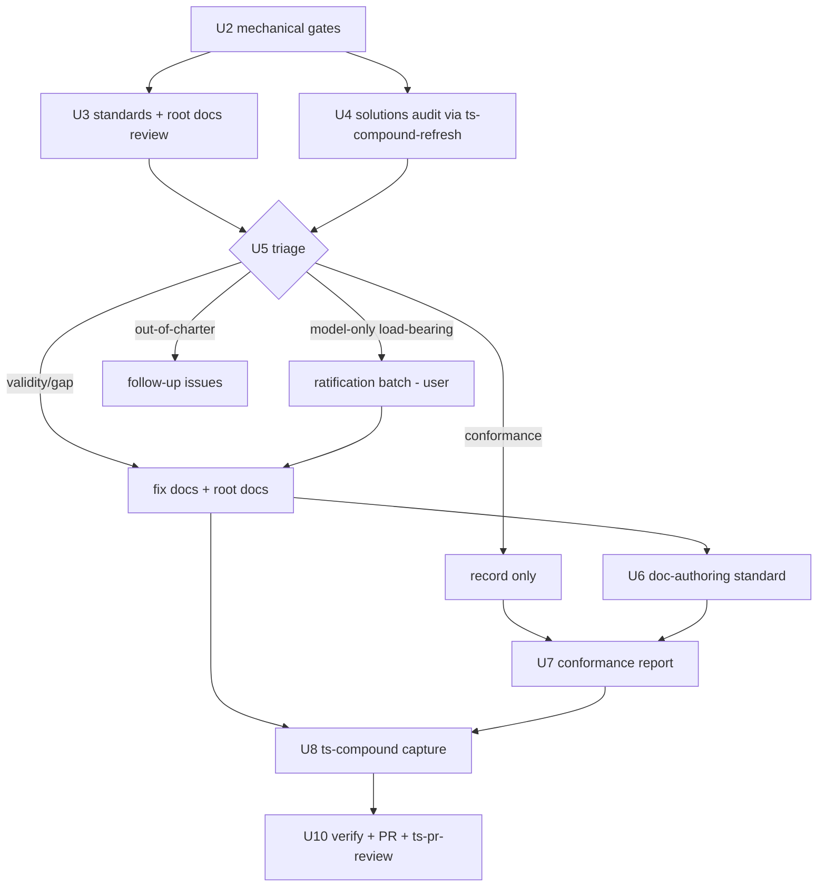

# fix: Repository documentation review (Issue #119)

## Summary

Run a repo-wide documentation review for Issue #119: validate every documented standard, concept, and best practice against current reality; trust-classify every directive (external best-practice verification is the primary signal, since most docs and code were model-authored); identify and remediate documentation gaps; audit repo conformance to the updated docs. Findings live in a Findings Ledger inside this plan. Conformance findings are recorded and reported, not fixed (user decision). The effort closes with knowledge capture via `ts-compound` and a PR reviewed through the newly rewritten `/ts-pr-review` pipeline.

---

## Problem Frame

The repo's documentation layer has accumulated without a full audit: 7 standards docs, 17 solutions docs, 5 root docs, `docs/ROUTING.md` plus INDEX files everywhere, 16 `SKILL.md` files with ~104 reference files, and ~32 scripts. Exploration already surfaces drift candidates — `README.md` lists 15 of 16 skills (`ts-compound-refresh` missing), `index-standards.md`'s own example table contradicts its link-format rule, `STRATEGY.md` carries `last_updated: 2026-06-22`, and no doc-authoring standard exists despite docs being this repo's primary product surface. Nothing verifies the documented claims match current code and skill behavior.

Audit volume is unknowable at plan time, so the plan defines an audit → ledger → triage → remediate workflow rather than pre-writing fixes.

---

## Requirements

From Issue #119 plus user decisions (2026-09-09):

**Validation and gap analysis**

- R1. Every standards doc, root doc, and solutions doc carries a recorded validity verdict (`valid` / `drifted` / `obsolete`) with `file:line` or command evidence — including docs verified as still correct (`kept-valid` rows).
- R2. Documentation gaps are identified and classified (missing standards, missing coverage, stale structure).

**Remediation**

- R3. Validity and gap findings in `docs/**` and root docs are remediated in this effort: docs updated to match reality, gaps closed with new docs where in-charter.
- R4. Conformance findings (repo content violating docs) are recorded and reported only — no `skills/**` or `scripts/**` content edits from conformance findings in this cycle.

**Reporting and capture**

- R5. The conformance report is posted as a comment on Issue #119; large clusters may become follow-up issues.
- R6. The review lifecycle itself is captured as a solutions doc via `ts-compound`.
- R7. INDEX files stay consistent with doc additions and deletions throughout (generated tables only, never hand-edited).

**Hygiene and verification**

- R8. All local `.claude/worktrees/*` copies are inspected and removed.
- R9. The PR is reviewed via `/ts-pr-review` and the pipeline's output is inspected against its post-7847ab7 behavior contract; misbehavior is reported as a finding.

**Trust and provenance**

- R10. Every directive-level claim in `docs/standards/` and root policy docs carries a trust classification — `verified-external` (with citation), `user-confirmed` (only via ratification), `potential-human` (account plus forensic markers), or `model-only` — because most existing documentation and the code it describes were model-authored, so behavior consistency and account attribution alone cannot establish legitimacy.
- R11. Model-authored claims that are neither externally verifiable nor user-confirmed, and which carry load-bearing weight, pass through explicit user ratification (keep / drop / rewrite) before the docs shipping in this PR retain them.

---

## Key Technical Decisions

1. **Mechanical-first ordering.** Deterministic validators run before semantic passes. They are cheap, they cover surfaces CI never checks (`README.md`, `skills/`), and they seed the ledger so semantic review only judges what machines can't.
2. **Findings Ledger as the single source of truth.** An append-only section of this plan (schema below) replaces scratch files. Every finding gets an ID, evidence, class, severity, and disposition; `ts-verify-implementation` reads it as the completion checklist.
3. **Composition over invention.** Reuse `scripts/validate-index-standards.py`, `scripts/update-indexes.py`, `scripts/verify-script-refs.sh`, `scripts/verify-scripts.sh`, `skills/ts-compound-refresh/scripts/validate-doc-claims.py`, `/ts-compound-refresh`, and `/ts-compound`. Zero new scripts (see `docs/solutions/workflow-issues/composition-over-generalization-for-verification.md`).
4. **Conformance is record-only** (user decision, 2026-09-09). The sweep produces a report and ledger rows, not edits to `skills/**` or `scripts/**`. Remediation becomes follow-up work.
5. **New doc-authoring standard goes to `docs/standards/`**, gated on the audit confirming the gap. It follows the standards-vs-conventions doctrine in `docs/standards/INDEX.md`: direct MUST rules plus a Conformance Checklist, cross-linking `index-standards.md` and `link-convention.md` without duplicating them.
6. **Escalation threshold: >40 S1/S2 findings at triage** splits remediation into per-area commits and offloads out-of-charter S3 gaps to new issues rather than widening the PR.
7. **Docs match reality, not the reverse** — except where the code looks wrong. In those cases stop and surface to the user instead of editing the doc to bless a possible regression.
8. **Trust model: external verification is the primary signal.** Roughly 90% of the validation corpus (docs and the code they describe) was written by the same models, so in-repo consistency proves nothing about authority. Trust ladder, heaviest first: (a) `verified-external` — the rule is a documented community/expert best practice, cited from authoritative sources outside the repo (the primary metric); (b) `user-confirmed` — exists only after the user ratifies it; no in-repo record earns this pre-ratification; (c) `potential-human` — Taegost-account content that passes forensic marker verification; (d) `model-only` — everything else, which must justify itself through the ratification gate. Attribution rules: `Cinandriel`-authored content is AI by definition (user's AI-helper persona). The user's own accounts carry no human guarantee — AI regularly works under the `Taegost` identity (PR reviews, quality passes), the user sometimes forgets to switch to Cinandriel, and git author `Mike Wheway` is shared with Claude sessions. PR-review comments under `Taegost` skew AI for this reason (`ts-pr-review` posts through the active token). `potential-human` therefore requires account attribution **plus** forensic markers: typos and grammar slips, casual register, short directive sentences, first-person decisions — versus the polished, heavily-structured, hedged shape of drafted output. Untagged Taegost commits are candidates, never confirmations (other models did not consistently tag). Marker verification is a heuristic, not proof — which is why every `potential-human` row still enters the ratification batch, carrying its source reference (commit SHA or issue/comment URL) so the user can confirm or deny authorship in one glance.
9. **Ratification, not silent resolution, for `model-only` claims.** A model-only claim that external research shows is sound best practice becomes `ratified-on-merits` with the citation recorded. A load-bearing model-only claim with no external backing gets disposition `needs-ratification` and lands in a batched user review list at U5 — the user keeps, drops, or rewrites each. No silent retention and no silent deletion (deleting an unrecorded real directive loses tribal knowledge).
10. **External verification scopes to rule-bearing surfaces.** `docs/standards/`, root policy docs, and load-bearing conventions get the external-research pass. `docs/solutions/` learnings are incident records, inherently local — they get trust classification via attribution only, not external verification.

---

## Findings Ledger Design

Append-only section at the end of this plan. Row schema:

```markdown
| ID | Surface | Location | Claim/Item | Evidence | Class | Severity | Trust | Disposition | Fixed-in |
```

- **Class:** `validity` (doc wrong vs reality) · `gap` (missing doc/coverage) · `conformance` (repo violates doc) · `hygiene`
- **Severity:** S1 contradicts reality · S2 stale facts · S3 gap · S4 cosmetic
- **Trust:** `verified-external <citation>` · `user-confirmed <source>` · `potential-human <sha-or-url>` · `model-only` — attribution per KTD 8; `user-confirmed` only ever set at ratification
- **Disposition:** `fixed-in-U<n>` · `deferred-issue-#<n>` · `recorded-only` (conformance, this cycle) · `wont-fix-churn` · `kept-valid` · `ratified-on-merits` · `needs-ratification`

`kept-valid` rows carry evidence too — task 1 of the issue demands proof of validation, not just a list of problems.

---

## High-Level Technical Design



The ledger is written by U2–U4 and U7, consumed by U5 (triage), and checked by `ts-verify-implementation` at U10. U9 (worktree cleanup) is local-only and runs outside the PR.

---

## Implementation Units

### U1. Branch and ledger scaffold

- **Goal:** Feature branch `docs/119-repo-documentation-review` with this plan committed and the empty Findings Ledger section in place.
- **Requirements:** R1, R2 (scaffold)
- **Dependencies:** none
- **Files:** `docs/plans/2026-09-09-001-fix-repo-documentation-review-plan.md`, `docs/plans/INDEX.md` (regenerated)
- **Approach:** Branch from current `main`. Ledger section carries the schema and severity definitions verbatim.
- **Verification:** `python3 scripts/validate-index-standards.py docs/` passes.
- **Test scenarios:** Test expectation: none — documentation scaffold; verification via the index validator.

### U2. Mechanical gate sweep, all surfaces

- **Goal:** Every deterministic validator run over every surface, including surfaces CI never covers; findings seeded into the ledger with command output as evidence.
- **Requirements:** R1, R2
- **Dependencies:** U1
- **Files:** ledger rows only
- **Approach:** Zero new scripts. Run `scripts/validate-index-standards.py` over `docs/ README.md CONCEPTS.md STRATEGY.md CLAUDE.md skills/`; `scripts/update-indexes.py` followed by an empty-`git diff` idempotency check; `scripts/verify-script-refs.sh`; `scripts/verify-scripts.sh --all`; `skills/ts-compound-refresh/scripts/validate-doc-claims.py` over every `docs/standards/*.md` and `docs/solutions/**/*.md`; grep sweeps for references to deleted or renamed artifacts.
- **Patterns to follow:** CI invocation shapes in `.github/workflows/ci.yml`.
- **Verification:** Every command's exit status recorded as ledger evidence; all mechanically-detectable S2 findings identified before U3 starts.
- **Test scenarios:** Test expectation: none — read-only audit; verification via recorded gate output.

### U3. Standards and root-docs semantic validity and trust review

- **Goal:** Task 1 for `docs/standards/` and root docs: every documented claim verified against current reality, and every directive-level claim trust-classified per KTD 8.
- **Requirements:** R1, R10
- **Dependencies:** U2
- **Files reviewed:** `docs/standards/agent-standards.md`, `docs/standards/index-standards.md`, `docs/standards/link-convention.md`, `docs/standards/script-extraction-standards.md`, `docs/standards/script-frontmatter-convention.md`, `docs/standards/script-security-standards.md`, `docs/standards/testing-standards.md`, `README.md`, `CLAUDE.md`, `CONCEPTS.md`, `STRATEGY.md`, `docs/ROUTING.md`
- **Approach:** Three passes per doc. First, claim extraction: list every testable claim (named scripts and their behavior, file paths, counts, "MUST be validated by X"), verify each against code or skill behavior, record a verdict row with evidence. Second, external verification: for each directive-level rule, research what authoritative external sources advise for the domain (shellcheck and shell scripting guidance for script-security-standards, GitHub Actions docs for CI conventions, CommonMark for link rules, pytest/bats community practice for testing-standards, prompt-engineering and agent-design practice for agent-standards) and record `verified-external` with citation, or note no external backing found. Third, attribution: gather Taegost-account candidates (GitHub issues, PR comments via `gh`; commits lacking an AI co-author trailer) and apply forensic marker verification per KTD 8 — account alone never yields human, because AI works under that identity regularly. Candidates passing marker checks rate `potential-human`; `Cinandriel`-authored content counts as model-written. Nothing rates above `potential-human` before ratification. No file edits in this unit. Known seeds: the `index-standards.md` example-vs-rule column inconsistency; `link-convention.md` claims vs actual `validate-index-standards.py` behavior; `testing-standards.md` vs `run-test-suites.sh` globs and `detect-coverage-gaps.sh`; `agent-standards.md` vs the `skills/*/references/agents/*.md` corpus; README skills tables; `STRATEGY.md` staleness; `CONCEPTS.md` glossary entries pointing at real machinery.
- **Verification:** Every listed doc has a completed verdict table in the ledger with reality evidence and trust classification, `kept-valid` rows included with evidence.
- **Test scenarios:** Test expectation: none — read-only audit; verification via ledger completeness.

### U4. Solutions docs audit via ts-compound-refresh

- **Goal:** Task 1 for `docs/solutions/`: freshness, overlap, and supersession verdicts for all 17 docs.
- **Requirements:** R1
- **Dependencies:** U2
- **Files:** `docs/solutions/**` including both root policy docs
- **Approach:** Run `/ts-compound-refresh docs/solutions` — 17 docs routes to its Broad scope triage path; honor that routing rather than forcing full depth. Merge its Keep/Update/Consolidate/Replace/Delete outcomes into the ledger as `validity` rows, with trust classification by attribution only (KTD 10 — incident learnings are local records, no external verification pass). Root policy docs (`docs/solutions/ktd-normalization-policy.md`, `docs/solutions/behavioral-ktd-verification.md`) get explicit verdicts — they are load-bearing for KTD verification, and as rule-bearing policy they additionally get the U3 external-verification treatment. Inbound-link check plus repo-wide filename grep before any delete.
- **Patterns to follow:** `skills/ts-compound-refresh/SKILL.md` scope routing and Phase 1.75 document-set analysis.
- **Verification:** Refresh report produced; `validate-frontmatter.py` and `validate-doc-claims.py` pass on every edited doc; INDEX regenerated.
- **Test scenarios:** Test expectation: none — skill-driven audit; verification via the skill's own report and validators.

### U5. Triage and documentation remediation

- **Goal:** Ledger-driven fixes for `validity` and `gap` classes, gated by the ratification batch; remediation volume discovered and executed here, not assumed.
- **Requirements:** R3, R11
- **Dependencies:** U2, U3, U4
- **Files:** whatever the ledger implicates — expected clusters: `docs/standards/*.md`, `README.md`, `CONCEPTS.md`, `STRATEGY.md`, `docs/solutions/*`
- **Approach:** Sort by severity. Fix S1/S2 in batches, one commit per doc area (standards batch, root-docs batch, solutions batch). S3 in-scope fixes flow to U6 or are fixed here; S3 out-of-charter becomes follow-up issues; S4 marked `wont-fix-churn`. Conformance rows stay `recorded-only`. Before fixing, run the ratification batch: collect every `needs-ratification` row (load-bearing `model-only` claims without external backing, per KTD 9, plus `potential-human` rows awaiting authorship confirmation) into one user review list — keep / drop / rewrite per item, with candidate commit SHAs shown for the `potential-human` entries — and only then remediate the affected docs. Where the code looks wrong rather than the doc, stop and surface to the user. Apply the U2 gate set after each batch to catch link breakage introduced by edits.
- **Verification:** Ledger rows flipped to `fixed-in-U5`; gates green after every batch.
- **Test scenarios:** Test expectation: none — documentation edits; verification via re-run gate set per batch.

### U6. Doc-authoring standard

- **Goal:** Close the confirmed gap: no standard governs prose, audience, or placement decisions.
- **Requirements:** R2, R3
- **Dependencies:** U3, U5 (gap confirmation)
- **Files:** `docs/standards/doc-authoring-standards.md` (new), `docs/standards/INDEX.md`, cross-reference in `docs/ROUTING.md` if warranted
- **Approach:** Conditional on U3/U5 evidence confirming the gap (strongly pre-seeded). Content: audience, tone, placement decision rule (standard vs solutions doc vs README entry vs `CONCEPTS.md` term), and a Conformance Checklist. Cross-link `index-standards.md` and `link-convention.md`; do not duplicate their rules.
- **Patterns to follow:** structure of `docs/standards/testing-standards.md` and the standards-vs-conventions doctrine in `docs/standards/INDEX.md`.
- **Verification:** One `/ts-doc-review` pass on the new standard; `validate-index-standards.py docs/` passes; the doc satisfies its own checklist.
- **Test scenarios:** Test expectation: none — new standard document; verification via doc-review pass and index validator.

### U7. Conformance audit — record only

- **Goal:** Task 4: repo content checked against the now-current docs; findings recorded, no fixes.
- **Requirements:** R4, R5
- **Dependencies:** U6 (sweep runs against updated docs)
- **Files:** report content only — no `skills/**` or `scripts/**` edits
- **Approach:** Mechanical layer first: `validate-index-standards.py skills/ scripts/`; grep sweeps per standard (bare-URL links, script `description:` frontmatter presence); `agent-standards.md` conformance across the agent corpus; README skills-listing check against actual `skills/` directories. Manual layer for judgment calls (agent definition structure, prose conventions). Findings land as `conformance` ledger rows and a structured report posted to Issue #119 at U10. Follow-up issues only for large clusters — decide at execution.
- **Verification:** Ledger carries the full conformance row set; report drafted.
- **Test scenarios:** Test expectation: none — read-only audit; verification via ledger completeness.

### U8. Knowledge capture via ts-compound

- **Goal:** Durable record of the doc-review lifecycle this effort establishes.
- **Requirements:** R6
- **Dependencies:** U5, U6, U7
- **Files:** new `docs/solutions/<category>/` doc (category per the skill's schema mapping), `CONCEPTS.md` only if ledger terms meet the vocabulary bar
- **Approach:** Run `/ts-compound` after the review completes. Capture: mechanical-first ordering, the ledger schema with severity classes and dispositions, and the reusable-machinery inventory (repo-wide `validate-doc-claims.py`, `validate-index-standards.py` over non-CI surfaces).
- **Patterns to follow:** `skills/ts-compound/assets/resolution-template.md`.
- **Verification:** `validate-frontmatter.py` and `validate-doc-claims.py` pass; INDEX regenerated.
- **Test scenarios:** Test expectation: none — skill-driven capture; verification via the skill's validators.

### U9. Worktree cleanup

- **Goal:** All local `.claude/worktrees/*` copies inspected and removed.
- **Requirements:** R8
- **Dependencies:** none (local-only; run any time before U10)
- **Files:** none in the PR — `.claude/worktrees/` is gitignored
- **Approach:** For each worktree directory: check for uncommitted changes and unmerged branches (`git worktree list`, `git -C <path> status`). If clean, `git worktree remove` then `git worktree prune`. Surface anything non-trivial to the user before removing. Record as a `hygiene` ledger row.
- **Verification:** `git worktree list` shows only the main checkout plus the active feature worktree.
- **Test scenarios:** Test expectation: none — local housekeeping; verification via `git worktree list`.

### U10. Verification, PR, and pipeline watch

- **Goal:** Ship with full gate coverage; exercise the newly rewritten review pipeline; deliver the conformance report.
- **Requirements:** R5, R9
- **Dependencies:** U1–U8
- **Files:** `docs/pull_requests/<PR#>_verification.md` (new), Issue #119 comment
- **Approach:** Full battery: pytest, `scripts/run-test-suites.sh`, shellcheck, `scripts/verify-script-refs.sh`, `scripts/verify-scripts.sh --all`, `validate-index-standards.py` over all surfaces, `update-indexes.py` idempotency. Then `/ts-verify-implementation` against this plan — ledger completeness is the satisfaction check. Open the PR, post the U7 conformance report as an Issue #119 comment, then run `/ts-pr-review` on the PR. Use `/ts-pr-fix-findings` for any review feedback.
- **Execution note:** `/ts-pr-review` was rewritten in 7847ab7 — scripted payload via `skills/ts-pr-review/scripts/build-review-payload.sh`, deterministic P0–P3 severity mapping, P2+ posts REQUEST_CHANGES, pre-existing findings land report-only in the fallback comment, zero-findings runs still execute the full pipeline. Watch for: payload construction succeeding from the run artifact, severity mapping stable across re-runs, P2+ actually blocking, pre-existing findings on untouched files staying report-only, clean runs completing end-to-end. **Pipeline misbehavior is itself a ledger finding — report it, do not work around it silently.**
- **Verification:** All gates green; verification doc written per the `docs/pull_requests/` naming convention; `/ts-pr-review` output inspected against the behavior contract above; PR merged with `Closes #119`.
- **Test scenarios:** Test expectation: none — verification and review orchestration; verification via the gate battery and the review run itself.

---

## Scope Boundaries

**In scope**

- Edits to `docs/**` and root docs (`README.md`, `CLAUDE.md`, `CONCEPTS.md`, `STRATEGY.md`) from validity and gap findings
- New `docs/standards/doc-authoring-standards.md`
- Conformance report (record-only) and its Issue #119 comment
- New solutions doc via `ts-compound`
- Local worktree cleanup

**Out of scope (this cycle)**

- Conformance *fixes* to `skills/**` or `scripts/**` — recorded, remediated in follow-up issues
- Code behavior changes anywhere
- New CI tooling (for example a markdown linter) — record as a gap finding, defer
- Hand-edits to generated INDEX tables

### Deferred to Follow-Up Work

- Conformance remediation issues spawned from the U7 report (created at U5/U10 depending on cluster size)
- Any S3 gaps judged out-of-charter at triage

---

## Risks & Dependencies

- **Audit scope ballooning** (17 solutions + 7 standards + 16 SKILL.md + ~104 reference files). Mitigation: ledger plus dedicated triage unit between discovery and fixes; conformance record-only bounds the PR; the >40 S1/S2 threshold splits remediation.
- **Solutions-doc deletion breaks citations.** Mitigation: `ts-compound-refresh` inbound-link check plus repo-wide filename grep before delete.
- **INDEX drift after doc additions and deletions.** Mitigation: rely on `update-indexes.py` regeneration (pre-commit runs it); empty-diff idempotency check.
- **Remediation blesses broken code.** Mitigation: doc-matches-reality rule with the explicit stop-and-surface exception.
- **Newly rewritten `/ts-pr-review` misbehaving mid-PR.** Mitigation: U10 execution note; misbehavior becomes a finding rather than a silent workaround.
- **Dependencies:** none external. All machinery already exists in-repo.

---

## Findings Ledger

Append audit rows below. Schema and severity definitions live in the Findings Ledger Design section.

| ID | Surface | Location | Claim/Item | Evidence | Class | Severity | Trust | Disposition | Fixed-in |
|---|---|---|---|---|---|---|---|---|---|
