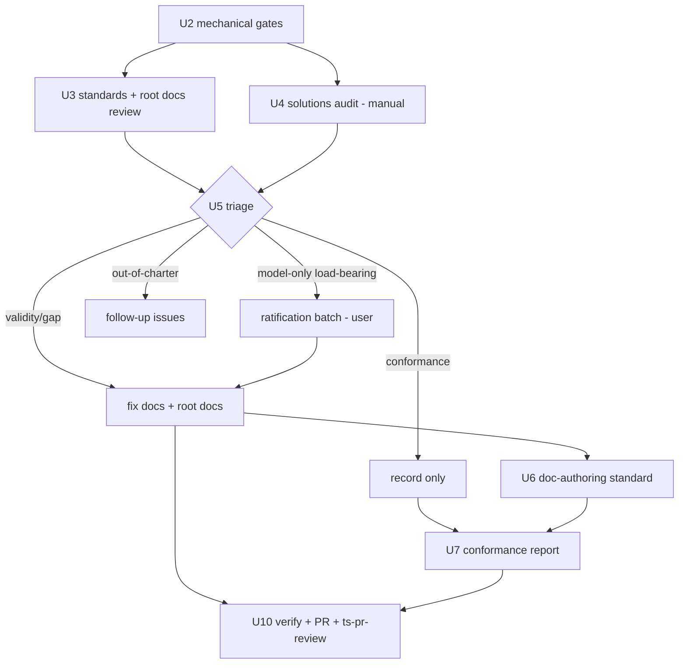

# fix: Repository documentation review (Issue #119)

## Summary

Run a repo-wide documentation review for Issue #119: validate every documented standard, concept, and best practice against current reality; trust-classify every directive (external best-practice verification is the primary signal, since most docs and code were model-authored); identify and remediate documentation gaps; audit repo conformance to the updated docs. Findings live in a Findings Ledger inside this plan. Conformance findings are recorded and reported, not fixed (user decision). Execution is ledger-first (user decision 2026-09-10): the first pass outputs the Findings Ledger only; every document fix waits for the user's explicit approval of that ledger (KTD 11). The effort closes with a PR reviewed through the newly rewritten `/ts-pr-review` pipeline; knowledge capture runs manually via `/ts-compound` afterwards, outside this plan (user decision 2026-09-10).

---

## Problem Frame

The repo's documentation layer has accumulated without a full audit: every doc under `docs/standards/`, every solutions doc under `docs/solutions/` (INDEX files excluded), the root docs (`README.md`, `CLAUDE.md`, `CONCEPTS.md`, `STRATEGY.md`), `docs/ROUTING.md` plus INDEX files everywhere, every `skills/*/SKILL.md` with its `references/` tree, and the `scripts/` corpus. Corpus sizes are deliberately unstated — counts drift during execution, so scope is defined by criteria, not numbers (user decision 2026-09-10). Exploration already surfaces drift candidates — `README.md`'s skills table lists fewer skills than `skills/` holds (`ts-compound-refresh` missing), `index-standards.md`'s own example table contradicts its link-format rule, `STRATEGY.md` carries `last_updated: 2026-06-22`, and no doc-authoring standard exists despite docs being this repo's primary product surface. Nothing verifies the documented claims match current code and skill behavior.

Audit volume is unknowable at plan time, so the plan defines an audit → ledger → triage → remediate workflow rather than pre-writing fixes.

---

## Requirements

From Issue #119 plus user decisions (2026-09-09):

**Validation and gap analysis**

- R1. Every standards doc, root doc, solutions doc, `docs/ROUTING.md`, and every `skills/*/SKILL.md` carries a recorded validity verdict (`valid` / `drifted` / `obsolete`) with `file:line` or command evidence — including docs verified as still correct (`kept-valid` rows). Verdict-to-ledger encoding: `valid` → `kept-valid` row; `drifted`/`obsolete` → `Verdict:` prefix in the Claim/Item field plus a terminal disposition (`fixed-in-U<n>` if a unit fixes it, else `deferred-issue-#<n>`). SKILL.md drifted claims dispose `deferred-issue-#<n>` (no `skills/**` remediation this cycle, per R4); their `references/` files stay U2-mechanical-only.
- R2. Documentation gaps are identified and classified (missing standards, missing coverage, stale structure).

**Remediation**

- R3. Validity and gap findings in `docs/**` and root docs are remediated in this effort: docs updated to match reality, gaps closed with new docs where in-charter.
- R4. Conformance findings (repo content violating docs) are recorded and reported only — no `skills/**` or `scripts/**` content edits from conformance findings in this cycle.

**Reporting and capture**

- R5. The conformance report is posted as a comment on Issue #119; large clusters may become follow-up issues.
- R6. The review lifecycle itself is captured as a solutions doc via `ts-compound` — descoped from plan execution (user decision 2026-09-10): the user runs `/ts-compound` manually after this effort; no unit executes it.
- R7. INDEX files stay consistent with doc additions and deletions throughout (generated tables only, never hand-edited).

**Hygiene and verification**

- R8. All local `.claude/worktrees/*` copies are inspected and removed.
- R9. The PR is reviewed via `/ts-pr-review` and the pipeline's output is inspected against its post-7847ab7 behavior contract; misbehavior is reported as a finding.

**Trust and provenance**

- R10. Every directive-level claim in `docs/standards/` and the two KTD policy docs (`docs/solutions/ktd-normalization-policy.md`, `docs/solutions/behavioral-ktd-verification.md`) carries a trust classification — `verified-external` (with citation), `user-confirmed` (only via ratification), `potential-human` (account plus forensic markers), or `model-only` — because most existing documentation and the code it describes were model-authored, so behavior consistency and account attribution alone cannot establish legitimacy.
- R11. Model-authored claims that carry load-bearing weight pass through explicit user ratification (keep / drop / rewrite) before the docs shipping in this PR retain them — including externally-backed claims, where the citation serves as review context but does not bypass the batch.

---

## Key Technical Decisions

1. **Mechanical-first ordering.** Deterministic validators run before semantic passes. They are cheap, they cover surfaces CI never checks (`README.md`, `skills/`), and they seed the ledger so semantic review only judges what machines can't.
2. **Findings Ledger as the single source of truth.** A ledger section of this plan (schema below; append-only for row creation — an existing row's Disposition and Fixed-in update in place) replaces scratch files. Every finding gets an ID, evidence, class, severity, and disposition; ledger verification is an explicit U10 step (every row terminal-dispositioned, every U3/U4-reviewed doc rowed), with `/ts-verify-implementation` running in parallel as standard diff review.
3. **Composition over invention.** Reuse `scripts/validate-index-standards.py`, `scripts/update-indexes.py`, `scripts/verify-script-refs.sh`, `scripts/verify-scripts.sh`, `skills/ts-compound-refresh/scripts/validate-doc-claims.py`, and `skills/ts-compound-refresh/scripts/validate-frontmatter.py` — direct script invocations only; no `/ts-compound` or `/ts-compound-refresh` skill runs in this plan (user decision 2026-09-10; capture runs manually post-plan). Zero new scripts (see `docs/solutions/workflow-issues/composition-over-generalization-for-verification.md`).
4. **Conformance is record-only** (user decision, 2026-09-09). The sweep produces a report and ledger rows, not edits to `skills/**` or `scripts/**`. Remediation becomes follow-up work: non-noise conformance rows carry `deferred-issue-#<n>` (issues filed at U10); `recorded-only` is reserved for S4 noise.
5. **New doc-authoring standard goes to `docs/standards/`**, gated on the audit confirming the gap. It follows the standards-vs-conventions doctrine in `docs/standards/INDEX.md`: direct MUST rules plus a Conformance Checklist, cross-linking `index-standards.md` and `link-convention.md` without duplicating them.
6. **Escalation threshold: >40 S1/S2 findings at triage (all classes — validity, gap, conformance, hygiene)** gates PR-widening escalation only: splitting remediation into per-area commits and offloading out-of-charter S3 gaps to new issues rather than widening the PR. Per-area commits are U5's default at any finding count.
7. **Docs match reality, not the reverse** — except where the code looks wrong. In those cases stop and surface to the user instead of editing the doc to bless a possible regression. The same exception covers prescribing-convention conflicts: when a doc's purpose is to mandate a convention and current repo shape contradicts it, surface the conflict — never rewrite the prescription to bless the status quo.
8. **Trust model: external verification is the primary signal.** Roughly 90% of the validation corpus (docs and the code they describe) was written by the same models, so in-repo consistency proves nothing about authority. Trust ladder, heaviest first: (a) `verified-external` — the rule is a documented community/expert best practice, cited from authoritative sources outside the repo (the primary metric); (b) `user-confirmed` — exists only after the user ratifies it; no in-repo record earns this pre-ratification; (c) `potential-human` — Taegost-account content that passes forensic marker verification; (d) `model-only` — everything else, which must justify itself through the ratification gate. Attribution rules: `Cinandriel`-authored content is AI by definition (user's AI-helper persona). The user's own accounts carry no human guarantee — AI regularly works under the `Taegost` identity (PR reviews, quality passes), the user sometimes forgets to switch to Cinandriel, and git author `Mike Wheway` is shared with Claude sessions. PR-review comments under `Taegost` skew AI for this reason (`ts-pr-review` posts through the active token). `potential-human` therefore requires account attribution **plus** forensic markers: typos and grammar slips, casual register, short directive sentences, first-person decisions — versus the polished, heavily-structured, hedged shape of drafted output. Untagged Taegost commits are candidates, never confirmations (other models did not consistently tag). Marker verification is a heuristic, not proof — which is why every `potential-human` row still enters the ratification batch, carrying its source reference (commit SHA or issue/comment URL) so the user can confirm or deny authorship in one glance.
9. **Ratification, not silent resolution, for load-bearing claims.** Every load-bearing claim enters the U5 ratification batch regardless of external backing — external research accelerates review (citation shown as context) but never bypasses it. A load-bearing `model-only` claim with no external backing gets disposition `needs-ratification`; one with external backing enters the batch carrying its citation. The user keeps, drops, or rewrites each. A kept externally-backed claim becomes `externally-corroborated` with the citation recorded — the label reflects model assessment plus citation, not user ratification of the underlying rule. No silent retention and no silent deletion (deleting an unrecorded real directive loses tribal knowledge). Batch processing: weight order first (behavior-changing directives lead), chunks of ~10 per sitting. Outcomes: keep → Trust flips to `user-confirmed` (this IS the ratified-keep state — no separate disposition value); kept externally-backed → `externally-corroborated`; drop/rewrite → `fixed-in-U5`; user-deferred or unanswered → `deferred-issue-#<n>` (issue filed at U10), claim stays recorded-and-tracked — the no-silent-retention prohibition binds only items never presented to the user. **Load-bearing** (shared definition for R11, U3, U5, and KTD 10): a directive whose removal would change skill or CI behavior, or that other documents cross-reference.
10. **External verification scopes to rule-bearing surfaces.** `docs/standards/`, root policy docs, and load-bearing conventions (load-bearing per the KTD 9 definition) get the external-research pass — U3 researches only load-bearing rules, not every directive. `docs/solutions/` learnings are incident records, inherently local — they get trust classification via attribution only, not external verification.
11. **Ledger-first execution** (user decision, 2026-09-10). The first execution pass outputs the Findings Ledger only — no document fix is implemented without the user's explicit approval of the ledger. Remediation in U5 begins only after that approval; the ratification batch is presented within it. Exceptions require explicit user approval — the U6 doc-authoring standard's own drafting is one (DR19 decision).

---

## Findings Ledger Design

Section at the end of this plan. Append-only governs row creation only: rows are added, never deleted or reordered, while an existing row's **Disposition** and **Fixed-in** fields update in place as work completes. Row schema:

```markdown
| ID | Surface | Location | Claim/Item | Evidence | Class | Severity | Trust | Disposition | Fixed-in |
```

- **Class:** `validity` (doc wrong vs reality) · `gap` (missing doc/coverage) · `conformance` (repo violates doc) · `hygiene`
- **Severity (validity/gap):** S1 contradicts reality · S2 stale facts · S3 gap · S4 cosmetic
- **Severity (conformance):** S1 violates a MUST rule · S2 violates a SHOULD rule or current convention · S3 minor deviation · S4 cosmetic
- **Severity (hygiene):** S4 by default; S2 when the issue blocks a tool or gate
- **Trust:** `verified-external <source URL + direct quote of cited passage>` — missing either field downgrades the row to `model-only` · `user-confirmed <source>` · `potential-human <sha-or-url>` · `model-only` — attribution per KTD 8; `user-confirmed` only ever set at ratification
- **Disposition:** `fixed-in-U<n>` · `deferred-issue-#<n>` (out-of-charter gaps and non-noise conformance/hygiene rows — issue filed at U10, issue number recorded in the row before merge) · `recorded-only` (S4 noise only) · `wont-fix-churn` · `kept-valid` · `externally-corroborated` (kept externally-backed claim, KTD 9) · `needs-ratification`
- **Fixed-in:** filled only when the row's disposition is not `fixed-in-U<n>`; otherwise `—` (the disposition already names the unit)

`kept-valid` rows carry evidence too — task 1 of the issue demands proof of validation, not just a list of problems.

Acceptance bar (checked at U10): zero unaddressed S1/S2 findings — every S1/S2 row carries a terminal disposition; every S3 finding has a row with a legal disposition; S4 rows are recorded but never block.

---

## High-Level Technical Design



The ledger is written by U2–U4 and U7, consumed by U5 (triage), and checked by `ts-verify-implementation` at U10. U8 is descoped — knowledge capture runs manually via `/ts-compound` after this effort (user decision 2026-09-10). U9 (worktree cleanup) is local-only and runs outside the PR.

---

## Implementation Units

### U1. Branch and ledger scaffold

- **Goal:** Feature branch `docs/119-repo-documentation-review` with this plan committed and the empty Findings Ledger section in place.
- **Requirements:** R1, R2, R7 (scaffold)
- **Dependencies:** none
- **Files:** `docs/plans/2026-09-09-001-fix-repo-documentation-review-plan.md`, `docs/plans/INDEX.md` (regenerated)
- **Approach:** Branch from current `main`. All units run in the main checkout on this branch — no worktrees (user preference, 2026-09-10). Ledger section carries the schema and severity definitions verbatim.
- **Verification:** `python3 scripts/validate-index-standards.py docs/` passes.
- **Test scenarios:** Test expectation: none — documentation scaffold; verification via the index validator.

### U2. Mechanical gate sweep, all surfaces

- **Goal:** Every deterministic validator run over every surface, including surfaces CI never covers; findings seeded into the ledger with command output as evidence.
- **Requirements:** R1, R2
- **Dependencies:** U1
- **Files:** ledger rows only
- **Approach:** Zero new scripts. Run `scripts/validate-index-standards.py` over `docs/ README.md CONCEPTS.md STRATEGY.md CLAUDE.md skills/`; `scripts/update-indexes.py` followed by an empty-`git diff` idempotency check; `scripts/verify-script-refs.sh`; `scripts/verify-scripts.sh --all`; `skills/ts-compound-refresh/scripts/validate-doc-claims.py` over every `docs/standards/*.md` and `docs/solutions/**/*.md`; grep sweeps for references to deleted or renamed artifacts.
- **Patterns to follow:** CI invocation shapes in `.github/workflows/ci.yml`.
- **Verification:** Every command's exit status recorded as ledger evidence; all mechanically-detectable S2 findings identified before U3 starts.
- **Test scenarios:** Test expectation: none — read-only audit; verification via recorded gate output.

### U3. Standards and root-docs semantic validity and trust review

- **Goal:** Task 1 for `docs/standards/`, root docs, and all `skills/*/SKILL.md`: every documented claim verified against current reality, and every directive-level claim trust-classified per KTD 8.
- **Requirements:** R1, R10
- **Dependencies:** U2
- **Files reviewed:** `docs/standards/agent-standards.md`, `docs/standards/index-standards.md`, `docs/standards/link-convention.md`, `docs/standards/script-extraction-standards.md`, `docs/standards/script-frontmatter-convention.md`, `docs/standards/script-security-standards.md`, `docs/standards/testing-standards.md`, `README.md`, `CLAUDE.md`, `CONCEPTS.md`, `STRATEGY.md`, `docs/ROUTING.md`, all `skills/*/SKILL.md`
- **Approach:** Three passes per doc. First, claim extraction: list every testable claim (named scripts and their behavior, file paths, counts, "MUST be validated by X"), verify each against code or skill behavior, record a verdict row with evidence. Second, external verification: for each load-bearing directive rule (load-bearing per the KTD 9 definition), research what authoritative external sources advise for the domain (shellcheck and shell scripting guidance for script-security-standards, GitHub Actions docs for CI conventions, CommonMark for link rules, pytest/bats community practice for testing-standards, prompt-engineering and agent-design practice for agent-standards) and record `verified-external` with source URL plus a direct quote of the cited passage (missing either = `model-only`), or note no external backing found. Third, attribution: gather Taegost-account candidates (GitHub issues, PR comments via `gh`; commits lacking an AI co-author trailer) and apply forensic marker verification per KTD 8 — account alone never yields human, because AI works under that identity regularly. Candidates passing marker checks rate `potential-human`; `Cinandriel`-authored content counts as model-written. Nothing rates above `potential-human` before ratification. No file edits in this unit. Known seeds: the `index-standards.md` example-vs-rule column inconsistency; `link-convention.md` claims vs actual `validate-index-standards.py` behavior; `testing-standards.md` vs `run-test-suites.sh` globs and `detect-coverage-gaps.sh`; `agent-standards.md` vs the `skills/*/references/agents/*.md` corpus; README skills tables; `STRATEGY.md` staleness; `CONCEPTS.md` glossary entries pointing at real machinery. SKILL.md files get the claim-extraction pass too (named scripts, paths, counts, described behavior); drifted SKILL.md claims get verdict rows disposed `deferred-issue-#<n>` per R4, and their `references/` files stay U2-mechanical-only.
- **Verification:** Every listed doc has a completed verdict table in the ledger with reality evidence and trust classification, `kept-valid` rows included with evidence.
- **Test scenarios:** Test expectation: none — read-only audit; verification via ledger completeness.

### U4. Solutions docs audit — record only, manual

- **Goal:** Task 1 for `docs/solutions/`: freshness, overlap, and supersession verdicts for every solutions doc — record-only, no edits. No `/ts-compound` or `/ts-compound-refresh` runs in this plan (user decision 2026-09-10; capture runs manually post-plan).
- **Requirements:** R1
- **Dependencies:** U2
- **Files reviewed:** `docs/solutions/**` (INDEX files excluded) including both root policy docs; ledger rows out only
- **Approach:** Manual audit: per-doc freshness pass (each testable claim vs current reality), overlap and supersession scan across the set, inbound-link check plus repo-wide filename grep before any delete recommendation. Outcomes land as `validity` ledger rows with verdicts and evidence, trust classification by attribution only (KTD 10 — incident learnings are local records, no external verification pass). Root policy docs (`docs/solutions/ktd-normalization-policy.md`, `docs/solutions/behavioral-ktd-verification.md`) get explicit verdicts — load-bearing for KTD verification, and as rule-bearing policy they additionally get the U3 external-verification treatment. Edits (once approved per KTD 11) and INDEX regeneration move to U5.
- **Verification:** Every solutions doc carries a verdict row with evidence in the ledger; zero doc edits made in this unit.
- **Test scenarios:** Test expectation: none — read-only audit; verification via ledger completeness.

### U5. Triage and documentation remediation

- **Goal:** Ledger-driven fixes for `validity` and `gap` classes, gated by the ratification batch; remediation volume discovered and executed here, not assumed.
- **Requirements:** R3, R7, R11
- **Dependencies:** U2, U3, U4
- **Files:** whatever the ledger implicates — expected clusters: `docs/standards/*.md`, `README.md`, `CONCEPTS.md`, `STRATEGY.md`, `docs/solutions/*`
- **Approach:** Triage first; no edits until the user approves the ledger (KTD 11) — the first pass outputs the ledger only. Present the sorted ledger plus the ratification batch together: every load-bearing claim per KTD 9 (`needs-ratification` rows, externally-backed load-bearing rows with citations as review context, `potential-human` rows awaiting authorship confirmation), processed in weight order (behavior-changing directives first) in chunks of ~10; keep / drop / rewrite per item, candidate commit SHAs shown for `potential-human` entries. Batch outcomes per KTD 9: keep → Trust flips to `user-confirmed`; kept externally-backed → `externally-corroborated`; drop/rewrite → `fixed-in-U5`; user-deferred or unanswered → `deferred-issue-#<n>` (issue filed at U10). After approval, fix S1/S2 in batches, one commit per doc area (standards batch, root-docs batch, solutions batch). S3 in-scope fixes flow to U6 or are fixed here; S3 out-of-charter becomes follow-up issues; S4 marked `wont-fix-churn`. Conformance rows get `recorded-only` when S4 noise, else `deferred-issue-#<n>` (issues filed at U10). Where the code looks wrong rather than the doc, stop and surface to the user. INDEX regeneration happens here (R7). Apply the U2 gate set after each batch to catch link breakage introduced by edits.
- **Verification:** Ledger rows flipped to `fixed-in-U5`; gates green after every batch.
- **Test scenarios:** Test expectation: none — documentation edits; verification via re-run gate set per batch.

### U6. Doc-authoring standard

- **Goal:** Close the confirmed gap: no standard governs prose, audience, or placement decisions.
- **Requirements:** R2, R3, R7
- **Dependencies:** U3, U5 (gap confirmation)
- **Files:** `docs/standards/doc-authoring-standards.md` (new), `docs/standards/INDEX.md`, cross-reference in `docs/ROUTING.md` if warranted
- **Approach:** Conditional on U3/U5 evidence confirming the gap (strongly pre-seeded). Ratify before shipping: draft the standard's directive claims first, run a ratification mini-batch on them per R11/KTD 9, then finalize — the standard ships ratified, not model-only (approved exception to KTD 11, DR19 decision 2026-09-10). Content: audience, tone, placement decision rule (standard vs solutions doc vs README entry vs `CONCEPTS.md` term), an authoring-time trust-classification MUST rule — every new directive-level claim gets a trust classification when written, per R10/KTD 8 — and a Conformance Checklist that includes it. Cross-link `index-standards.md` and `link-convention.md`; do not duplicate their rules.
- **Patterns to follow:** structure of `docs/standards/testing-standards.md` and the standards-vs-conventions doctrine in `docs/standards/INDEX.md`.
- **Verification:** One `/ts-doc-review` pass on the new standard; `validate-index-standards.py docs/` passes; the doc satisfies its own checklist.
- **Test scenarios:** Test expectation: none — new standard document; verification via doc-review pass and index validator.

### U7. Conformance audit — record only

- **Goal:** Task 4: repo content checked against the now-current docs; findings recorded, no fixes.
- **Requirements:** R4, R5
- **Dependencies:** U6 (sweep runs against updated docs)
- **Files:** report content only — no `skills/**` or `scripts/**` edits
- **Approach:** Mechanical layer first: `validate-index-standards.py skills/ scripts/`; grep sweeps per standard (bare-URL links, line-2 `# <script-name> -- <description>` header comments per `docs/standards/script-frontmatter-convention.md`); `agent-standards.md` conformance across the agent corpus; README skills-listing check against actual `skills/` directories. Manual layer for judgment calls (agent definition structure, prose conventions). Findings land as `conformance` ledger rows and a structured report posted to Issue #119 at U10. Follow-up issues only for large clusters — decide at execution.
- **Verification:** Ledger conformance rows match the report 1:1 — one row per enumerated mechanical-sweep finding plus one per named manual check; report drafted.
- **Test scenarios:** Test expectation: none — read-only audit; verification via ledger completeness.

### U8. Descoped — manual capture post-plan

- **Goal:** None in this plan. Knowledge capture via `/ts-compound` is descoped (user decision 2026-09-10): the user runs it manually after this effort closes. R6 is satisfied outside this plan.
- **Requirements:** none (R6 descoped)
- **Dependencies:** none
- **Files:** none
- **Approach:** No work. If the user's manual capture run surfaces findings about this effort, they enter follow-up issues, not this PR.
- **Verification:** n/a.
- **Test scenarios:** n/a.

### U9. Worktree cleanup

- **Goal:** All local `.claude/worktrees/*` copies inspected and removed.
- **Requirements:** R8
- **Dependencies:** none (local-only; run any time before U10)
- **Files:** no files from the worktree enter the PR or source control (`.claude/worktrees/` is gitignored); only output is the `hygiene` ledger row in this plan
- **Approach:** For each worktree directory: check for uncommitted changes and unmerged branches (`git worktree list`, `git -C <path> status`). If clean, `git worktree remove` then `git worktree prune`. Surface anything non-trivial to the user before removing. Record as a `hygiene` ledger row.
- **Verification:** `git worktree list` shows only the main checkout (implementation runs on the feature branch in the main checkout — no worktrees, user preference 2026-09-10).
- **Test scenarios:** Test expectation: none — local housekeeping; verification via `git worktree list`.

### U10. Verification, PR, and pipeline watch

- **Goal:** Ship with full gate coverage; exercise the newly rewritten review pipeline; deliver the conformance report.
- **Requirements:** R5, R7, R9
- **Dependencies:** U1–U9
- **Files:** `docs/pull_requests/<PR#>_verification.md` (new), Issue #119 comment
- **Approach:** Full battery: pytest, `scripts/run-test-suites.sh`, shellcheck, `scripts/verify-script-refs.sh`, `scripts/verify-scripts.sh --all`, `validate-index-standards.py` over all surfaces, `update-indexes.py` idempotency. Then an explicit ledger-verification step — every row carries a terminal disposition and every U3/U4-reviewed doc has a row, checked against the acceptance bar (Findings Ledger Design); `/ts-verify-implementation` runs in parallel as standard diff review. Open the PR, post the U7 conformance report as an Issue #119 comment, then run `/ts-pr-review` on the PR. Use `/ts-pr-fix-findings` for any review feedback.
- **Execution note:** `/ts-pr-review` was rewritten in 7847ab7 — scripted payload via `skills/ts-pr-review/scripts/build-review-payload.sh`, deterministic P0–P3 severity mapping, P2+ posts REQUEST_CHANGES, pre-existing findings land report-only in the fallback comment, zero-findings runs still execute the full pipeline. Watch for: payload construction succeeding from the run artifact, severity mapping stable across re-runs, P2+ actually blocking, pre-existing findings on untouched files staying report-only, clean runs completing end-to-end. **Pipeline misbehavior is itself a ledger finding — report it, do not work around it silently.**
- **Verification:** All gates green; verification doc written per the `docs/pull_requests/` naming convention; Issue #119 comment confirmed visible via `gh issue view 119 --json comments --jq '.comments[-1].body'` (R5); `/ts-pr-review` output inspected against the behavior contract above; PR merged with `Closes #119`.
- **Test scenarios:** Test expectation: none — verification and review orchestration; verification via the gate battery and the review run itself.

---

## Scope Boundaries

**In scope**

- Edits to `docs/**` and root docs (`README.md`, `CLAUDE.md`, `CONCEPTS.md`, `STRATEGY.md`) from validity and gap findings
- New `docs/standards/doc-authoring-standards.md`
- Conformance report (record-only) and its Issue #119 comment
- `docs/pull_requests/<PR#>_verification.md` (U10 verification doc)
- Local worktree cleanup

**Out of scope (this cycle)**

- Conformance *fixes* to `skills/**` or `scripts/**` — recorded, remediated in follow-up issues
- Code behavior changes anywhere
- New CI tooling (for example a markdown linter) — record as a gap finding, defer
- Hand-edits to generated INDEX tables

### Deferred to Follow-Up Work

- Conformance remediation issues spawned from the U7 report (created at U5/U10 depending on cluster size)
- Any S3 gaps judged out-of-charter at triage
- Knowledge capture via `/ts-compound` — user runs it manually after this effort (descoped 2026-09-10)

---

## Risks & Dependencies

- **Audit scope ballooning** (the full standards, solutions, and skills-doc corpus — criteria-defined, counts deliberately unstated per the 2026-09-10 ruling). Mitigation: ledger plus dedicated triage unit between discovery and fixes; conformance record-only bounds the PR; the >40 S1/S2 threshold splits remediation.
- **Solutions-doc deletion breaks citations.** Mitigation: inbound-link check plus repo-wide filename grep before any delete recommendation (manual, per U4).
- **INDEX drift after doc additions and deletions.** Mitigation: rely on `update-indexes.py` regeneration (pre-commit runs it); empty-diff idempotency check.
- **Remediation blesses broken code.** Mitigation: doc-matches-reality rule with the explicit stop-and-surface exception.
- **Newly rewritten `/ts-pr-review` misbehaving mid-PR.** Mitigation: U10 execution note; misbehavior becomes a finding rather than a silent workaround.
- **Dependencies:** none external. All machinery already exists in-repo.

---

## Findings Ledger

Append audit rows below. Schema and severity definitions live in the Findings Ledger Design section.

| ID | Surface | Location | Claim/Item | Evidence | Class | Severity | Trust | Disposition | Fixed-in |
|---|---|---|---|---|---|---|---|---|---|

### Plan-review rows (ts-doc-review, 2026-09-09)

Rows below record this plan's own `/ts-doc-review` pass (7 reviewers). Plan-review dispositions: `applied-2026-09-10` (user approved 2026-09-09; fix applied to this plan 2026-09-10), `needs-plan-review` (awaiting user decision), `recorded-only` (advisory). Rows applied in the 2026-09-10 DR7–DR28 session may embody user-modified fixes — that session's rulings govern. Trust is `model-only` for all rows — reviewer claims are model-authored until user-ratified, per this plan's own KTD 8.

| ID | Surface | Location | Claim/Item | Evidence | Class | Severity | Trust | Disposition | Fixed-in |
|---|---|---|---|---|---|---|---|---|---|
| DR1 | plan | R1 / Scope Boundaries / U3 | Skills corpus (16 SKILL.md + ~104 refs) counted in audit scope but gets no validity verdict — U3 stops at standards/root docs, U4 at solutions, U7 is conformance-only; drifted SKILL.md claim gets neither verdict nor remediation. Fix: extend R1/U3 so all 16 SKILL.md files get claim-validity verdict rows (drift disposed `deferred-issue-#<n>`; refs stay U2-mechanical-only) | "16 `SKILL.md` files with ~104 reference files" in corpus counts; R1 verdict scope omits them | gap | S1 | model-only | applied-2026-09-10 | — |
| DR2 | plan | KTD 2 / U10 | Plan attributes ledger-reading to `ts-verify-implementation`, which dispatches only diff-based reviewers — nothing reads the ledger, so R1 compliance has no mechanized verifier. Fix: explicit U10 ledger-verification step (every row terminal disposition; each U3/U4 doc has a row); `ts-verify-implementation` runs in parallel as standard diff review | "`ts-verify-implementation` reads it as the completion checklist" (KTD 2); "ledger completeness is the satisfaction check" (U10) | validity | S1 | model-only | applied-2026-09-10 | — |
| DR3 | plan | KTD 6 / U5 | Escalation threshold (>40 S1/S2) gates as conditional what U5 mandates unconditionally (per-area commits, S3 offload) — threshold changes nothing at 12 or 80 findings. Fix: KTD 6 gates only PR-widening escalation and S3 offload; per-area commits stay U5 default | KTD 6 text vs U5 "Sort by severity. Fix S1/S2 in batches, one commit per doc area" | validity | S1 | model-only | applied-2026-09-10 | — |
| DR4 | plan | R10 / KTD 8 | "root policy docs" in R10 reads as synonym of "root docs" (README, CLAUDE.md, CONCEPTS.md, STRATEGY.md) but names two files in `docs/solutions/`, defined only at U4. Fix: R10 names the two KTD policy docs explicitly at first use | R10 first use; definition appears three sections later in U4 | validity | S2 | model-only | applied-2026-09-10 | — |
| DR5 | plan | KTD 8 / R10 / Ledger Design | `verified-external` citations are model-self-attested and never validated — a fabricated citation silently converts model-only to verified-external with zero human touchpoint. Fix: every verified-external row records source URL plus direct quote of cited passage; missing either = model-only | Ratification gate covers only claims lacking external backing; ledger schema requires only "verified-external \<citation\>" | gap | S2 | model-only | applied-2026-09-10 | — |
| DR6 | plan | KTD 7 / U4-U5 | Docs-match-reality rule can rewrite prescribing docs (e.g. `docs/solutions/documentation-gaps/readme-lifecycle-documentation.md` prescribes per-skill README Usage subsections vs current skills-table README). Fix: extend KTD 7 stop-and-surface exception to prescribing-convention conflicts | KTD 7 exception covers only "code looks wrong" | gap | S2 | model-only | applied-2026-09-10 | — |
| DR7 | plan | Problem Frame / U4 / Risks | Solutions-doc count is 17 in four locations; tree holds 15 non-INDEX solutions docs. Fix: 17 → 15 everywhere (Broad-scope routing unaffected, threshold is 9+) | Problem Frame, U4 Goal, U4 Approach, Risks all say 17; 5 reviewers counted the tree | validity | S1 | model-only | applied-2026-09-10 | — |
| DR8 | plan | Problem Frame | Root-doc count is 5; body names exactly 4 root docs everywhere else (U2 surfaces, U3 list, Scope Boundaries). Fix: 5 → 4 | "5 root docs" vs four-file enumerations | validity | S2 | model-only | applied-2026-09-10 | — |
| DR9 | plan | U9 | Files line says "none in the PR" but the unit records a hygiene ledger row — and the ledger lives in this plan, which is in the PR. Fix: Files names the plan file (hygiene ledger row only) | U9 Files vs "Record as a `hygiene` ledger row" | validity | S2 | model-only | applied-2026-09-10 | — |
| DR10 | plan | Scope Boundaries | U10's `docs/pull_requests/<PR#>_verification.md` missing from In-scope list though every other deliverable is declared. Fix: add in-scope bullet | U10 Files vs In-scope list | gap | S2 | model-only | applied-2026-09-10 | — |
| DR11 | plan | U5 | U5 serializes all remediation behind the ratification batch, but mechanical S1/S2 fixes don't depend on trust outcomes. Fix: split U5 — S1/S2 doc-vs-reality batches start after triage; only ratification-affected docs wait | "only then remediate the affected docs" | validity | S2 | model-only | applied-2026-09-10 | — |
| DR12 | plan | Requirements / Units | R7 (INDEX consistency) claimed by no unit though U1, U4, U6, U8 all regenerate INDEX files. Fix: add R7 to those units' Requirements lines | No Requirements line lists R7 | gap | S2 | model-only | applied-2026-09-10 | — |
| DR13 | plan | KTD 9 / U5 | No path for deferred or unanswered ratification items — KTD 9 forbids silent retain and delete, U5 remediates only after batch resolves, U10 requires merge: partial answers deadlock. Fix: user-deferred items get `deferred-issue-#<n>` (issue at U10), claim stays recorded-and-tracked; retention prohibition applies only to never-presented items | KTD 9 + U5 sequencing | gap | S2 | model-only | applied-2026-09-10 | — |
| DR14 | plan | Findings Ledger Design / KTD 9 | Ratification outcomes lack disposition mapping — no value means "user ratified: keep". Fix: keep → Trust `user-confirmed` + `ratified-keep` disposition; drop/rewrite → `fixed-in-U5` | Disposition enum vs KTD 9 outcomes | gap | S2 | model-only | applied-2026-09-10 | — |
| DR15 | plan | U2 | Idempotency gate invokes `update-indexes.py` in mutating form inside a read-only audit — rewrites drifted INDEX files, dirties tree, fails its own empty-diff check. Fix: U2 uses `--dry-run` (output recorded as findings); mutating runs move to U5/U10 | "Files: ledger rows only" vs mutating invocation | validity | S2 | model-only | recorded-only | — |
| DR16 | plan | U4 | Skill mode and edit timing unspecified — goal reads audit-only, verification presupposes edited docs; "apply" mode lands edits before U5 triage outside its commit scheme. Fix: declare U4 record-only (outcomes as ledger rows; edits and INDEX regen move to U5) | U4 Goal/Approach vs Verification clause | gap | S2 | model-only | applied-2026-09-10 | — |
| DR17 | plan | U5 / KTD 9 | Ratification batch unbounded and "load-bearing" never defined — rubber-stamp-under-fatigue risk reintroduces silent retention. Fix: define load-bearing operationally (removal changes skill/CI behavior or other docs cross-reference it); process list in weight order, chunks of ~10 | "collect every needs-ratification row ... into one user review list" | gap | S2 | model-only | applied-2026-09-10 | — |
| DR18 | plan | U6 / R11 | New U6 standard bypasses the ratification gate — U5's batch completes before U6 authors the file, so its MUST rules ship model-only and unratified. Fix: U6 drafts directive claims first, runs a ratification mini-batch before finalizing | U6 Dependencies: U3, U5 | gap | S2 | model-only | applied-2026-09-10 | — |
| DR19 | plan | U6 | New doc-authoring standard omits trust classification for future directives — new model-authored directives enter unclassified after merge, drift resumes. Fix: authoring-time trust-classification MUST rule in U6's standard content and Conformance Checklist | U6 content list: audience, tone, placement, checklist only | gap | S2 | model-only | applied-2026-09-10 | — |
| DR20 | plan | U7 | Ledger-completeness check has no denominator — "full conformance row set" has undefined membership (manual layer open-ended). Fix: one row per enumerated mechanical-sweep finding plus one per named manual check, matching the U7 report 1:1 | U7 Verification line | gap | S2 | model-only | applied-2026-09-10 | — |
| DR21 | plan | U10 | Pipeline watch items unverifiable in a single run — "stable across re-runs" needs two runs; P2+ blocking and clean-run completion are mutually exclusive. Fix: five watch items stated as conditional checks; stability verified by post-fix re-review; clean first run records not-exercised | U10 Execution note watch list | gap | S2 | model-only | recorded-only | — |
| DR22 | plan | U10 | Dependencies "U1–U8" omits U9's stated before-U10 ordering | U9 vs U10 dependency lines | gap | S4 | model-only | applied-2026-09-10 | — |
| DR23 | plan | Design diagram | Mermaid ratification edge omits potential-human rows that KTD 8/U5 batch in | "D -->\|model-only load-bearing\| R" | validity | S4 | model-only | recorded-only | — |
| DR24 | plan | Requirements | Plan R-IDs R7/R8 collide with corpus wave-2 rule tags (link format, index standards) in validator output | validator help text vs plan R7/R8 | validity | S4 | model-only | recorded-only | — |
| DR25 | plan | U9 | Verification expects feature worktree; work runs in main checkout — end state is one `git worktree list` entry | U9 Verification line | validity | S4 | model-only | applied-2026-09-10 | — |
| DR26 | plan | Findings Ledger Design | Severity enum (S1–S4) has no value for kept-valid rows — S4 falsely implies defect. Fix candidate: kept-valid rows record Severity `n/a` | R1 mandates kept-valid rows | gap | S4 | model-only | recorded-only | — |
| DR27 | plan | KTD 8 / U3 | Forensic-marker outcome only relabels rows — potential-human and model-only enter the same batch. Fix candidate: demote to batch-level aid | KTD 8 "heuristic, not proof" | validity | S4 | model-only | recorded-only | — |
| DR28 | plan | Findings Ledger Design | Fixed-in column duplicates `fixed-in-U<n>` disposition; pair can drift | Ledger row schema | validity | S4 | model-only | applied-2026-09-10 | — |

Decisions log for this review pass: `/tmp/ts-doc-review-decisions-20260909-182600-5ebd.jsonl` (session-local).
