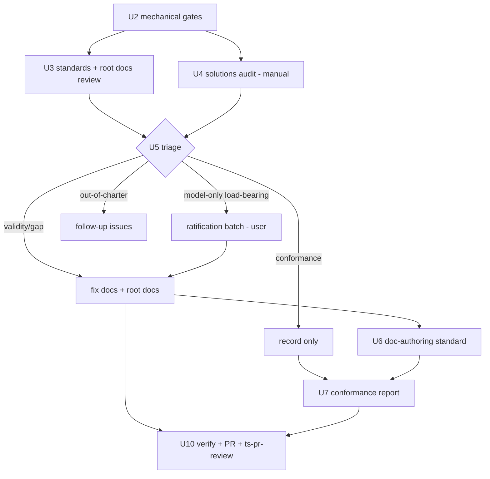

# fix: Repository documentation review (Issue #119)

## Summary

Run a repo-wide documentation review for Issue #119: validate every documented standard, concept, and best practice against current reality; trust-classify every directive (external best-practice verification is the primary signal, since most docs and code were model-authored); identify and remediate documentation gaps; audit repo conformance to the updated docs. Findings live in a Findings Ledger inside this plan. Conformance findings are recorded and reported, not fixed (user decision). Execution is ledger-first (user decision 2026-09-10): the first pass outputs the Findings Ledger only; every document fix waits for the user's explicit approval of that ledger (KTD 11). The effort closes with a PR reviewed through the newly rewritten `/ts-pr-review` pipeline; knowledge capture runs manually via `/ts-compound` afterwards, outside this plan (user decision 2026-09-10).

---

## Problem Frame

The repo's documentation layer has accumulated without a full audit: every doc under `docs/standards/`, every solutions doc under `docs/solutions/` (INDEX files excluded), the root docs (`README.md`, `CLAUDE.md`, `CONCEPTS.md`, `STRATEGY.md`), `docs/ROUTING.md` plus INDEX files everywhere, every `skills/*/SKILL.md` with its `references/` tree, and the `scripts/` corpus. Corpus sizes are deliberately unstated — counts drift during execution, so scope is defined by criteria, not numbers (user decision 2026-09-10). Exploration already surfaces drift candidates — `README.md`'s skills table lists fewer skills than `skills/` holds (`ts-compound-refresh` missing), `index-standards.md`'s own example table contradicts its link-format rule, `STRATEGY.md` carries `last_updated: 2026-06-22`, and no doc-authoring standard exists despite docs being this repo's primary product surface. Nothing verifies the documented claims match current code and skill behavior.

Audit volume is unknowable at plan time, so the plan defines an audit → ledger → triage → remediate workflow rather than pre-writing fixes.

---

## Requirements

From Issue #119 plus user decisions (2026-09-09):

**Validation and gap analysis**

- R1. Every standards doc, root doc, solutions doc, `docs/ROUTING.md`, and every `skills/*/SKILL.md` carries a recorded validity verdict (`valid` / `drifted` / `obsolete`) with `file:line` or command evidence — including docs verified as still correct (`kept-valid` rows). Verdict-to-ledger encoding: `valid` → `kept-valid` row; `drifted`/`obsolete` → `Verdict:` prefix in the Claim/Item field plus a terminal disposition (`fixed-in-U<n>` if a unit fixes it, else `deferred-issue-#<n>`). SKILL.md drifted claims dispose `deferred-issue-#<n>` (no `skills/**` remediation this cycle, per R4); their `references/` files stay U2-mechanical-only.
- R2. Documentation gaps are identified and classified (missing standards, missing coverage, stale structure).

**Remediation**

- R3. Validity and gap findings in `docs/**` and root docs are remediated in this effort: docs updated to match reality, gaps closed with new docs where in-charter.
- R4. Conformance findings (repo content violating docs) are recorded and reported only — no `skills/**` or `scripts/**` content edits from conformance findings in this cycle.

**Reporting and capture**

- R5. The conformance report is posted as a comment on Issue #119; large clusters may become follow-up issues.
- R6. The review lifecycle itself is captured as a solutions doc via `ts-compound` — descoped from plan execution (user decision 2026-09-10): the user runs `/ts-compound` manually after this effort; no unit executes it.
- R7. INDEX files stay consistent with doc additions and deletions throughout (generated tables only, never hand-edited).

**Hygiene and verification**

- R8. All local `.claude/worktrees/*` copies are inspected and removed.
- R9. The PR is reviewed via `/ts-pr-review` and the pipeline's output is inspected against its post-7847ab7 behavior contract; misbehavior is reported as a finding.

**Trust and provenance**

- R10. Every directive-level claim in `docs/standards/` and the two KTD policy docs (`docs/solutions/ktd-normalization-policy.md`, `docs/solutions/behavioral-ktd-verification.md`) carries a trust classification — `verified-external` (with citation), `user-confirmed` (only via ratification), `potential-human` (account plus forensic markers), or `model-only` — because most existing documentation and the code it describes were model-authored, so behavior consistency and account attribution alone cannot establish legitimacy.
- R11. Model-authored claims that carry load-bearing weight pass through explicit user ratification (keep / drop / rewrite) before the docs shipping in this PR retain them — including externally-backed claims, where the citation serves as review context but does not bypass the batch.

---

## Key Technical Decisions

1. **Mechanical-first ordering.** Deterministic validators run before semantic passes. They are cheap, they cover surfaces CI never checks (`README.md`, `skills/`), and they seed the ledger so semantic review only judges what machines can't.
2. **Findings Ledger as the single source of truth.** A ledger section of this plan (schema below; append-only for row creation — an existing row's Disposition and Fixed-in update in place) replaces scratch files. Every finding gets an ID, evidence, class, severity, and disposition; ledger verification is an explicit U10 step (every row terminal-dispositioned, every U3/U4-reviewed doc rowed), with `/ts-verify-implementation` running in parallel as standard diff review.
3. **Composition over invention.** Reuse `scripts/validate-index-standards.py`, `scripts/update-indexes.py`, `scripts/verify-script-refs.sh`, `scripts/verify-scripts.sh`, `skills/ts-compound-refresh/scripts/validate-doc-claims.py`, and `skills/ts-compound-refresh/scripts/validate-frontmatter.py` — direct script invocations only; no `/ts-compound` or `/ts-compound-refresh` skill runs in this plan (user decision 2026-09-10; capture runs manually post-plan). Zero new scripts (see `docs/solutions/workflow-issues/composition-over-generalization-for-verification.md`).
4. **Conformance is record-only** (user decision, 2026-09-09). The sweep produces a report and ledger rows, not edits to `skills/**` or `scripts/**`. Remediation becomes follow-up work: non-noise conformance rows carry `deferred-issue-#<n>` (issues filed at U10); `recorded-only` is reserved for S4 noise.
5. **New doc-authoring standard goes to `docs/standards/`**, gated on the audit confirming the gap. It follows the standards-vs-conventions doctrine in `docs/standards/INDEX.md`: direct MUST rules plus a Conformance Checklist, cross-linking `index-standards.md` and `link-convention.md` without duplicating them.
6. **Escalation threshold: >40 S1/S2 findings at triage (all classes — validity, gap, conformance, hygiene)** gates PR-widening escalation only: splitting remediation into per-area commits and offloading out-of-charter S3 gaps to new issues rather than widening the PR. Per-area commits are U5's default at any finding count.
7. **Docs match reality, not the reverse** — except where the code looks wrong. In those cases stop and surface to the user instead of editing the doc to bless a possible regression. The same exception covers prescribing-convention conflicts: when a doc's purpose is to mandate a convention and current repo shape contradicts it, surface the conflict — never rewrite the prescription to bless the status quo.
8. **Trust model: external verification is the primary signal.** Roughly 90% of the validation corpus (docs and the code they describe) was written by the same models, so in-repo consistency proves nothing about authority. Trust ladder, heaviest first: (a) `verified-external` — the rule is a documented community/expert best practice, cited from authoritative sources outside the repo (the primary metric); (b) `user-confirmed` — exists only after the user ratifies it; no in-repo record earns this pre-ratification; (c) `potential-human` — Taegost-account content that passes forensic marker verification; (d) `model-only` — everything else, which must justify itself through the ratification gate. Attribution rules: `Cinandriel`-authored content is AI by definition (user's AI-helper persona). The user's own accounts carry no human guarantee — AI regularly works under the `Taegost` identity (PR reviews, quality passes), the user sometimes forgets to switch to Cinandriel, and git author `Mike Wheway` is shared with Claude sessions. PR-review comments under `Taegost` skew AI for this reason (`ts-pr-review` posts through the active token). `potential-human` therefore requires account attribution **plus** forensic markers: typos and grammar slips, casual register, short directive sentences, first-person decisions — versus the polished, heavily-structured, hedged shape of drafted output. Untagged Taegost commits are candidates, never confirmations (other models did not consistently tag). Marker verification is a heuristic, not proof — which is why every `potential-human` row still enters the ratification batch, carrying its source reference (commit SHA or issue/comment URL) so the user can confirm or deny authorship in one glance.
9. **Ratification, not silent resolution, for load-bearing claims.** Every load-bearing claim enters the U5 ratification batch regardless of external backing — external research accelerates review (citation shown as context) but never bypasses it. A load-bearing `model-only` claim with no external backing gets disposition `needs-ratification`; one with external backing enters the batch carrying its citation. The user keeps, drops, or rewrites each. A kept externally-backed claim becomes `externally-corroborated` with the citation recorded — the label reflects model assessment plus citation, not user ratification of the underlying rule. No silent retention and no silent deletion (deleting an unrecorded real directive loses tribal knowledge). Batch processing: weight order first (behavior-changing directives lead), chunks of ~10 per sitting. Outcomes: keep → Trust flips to `user-confirmed` (this IS the ratified-keep state — no separate disposition value); kept externally-backed → `externally-corroborated`; drop/rewrite → `fixed-in-U5`; user-deferred or unanswered → `deferred-issue-#<n>` (issue filed at U10), claim stays recorded-and-tracked — the no-silent-retention prohibition binds only items never presented to the user. **Load-bearing** (shared definition for R11, U3, U5, and KTD 10): a directive whose removal would change skill or CI behavior, or that other documents cross-reference.
10. **External verification scopes to rule-bearing surfaces.** `docs/standards/`, root policy docs, and load-bearing conventions (load-bearing per the KTD 9 definition) get the external-research pass — U3 researches only load-bearing rules, not every directive. `docs/solutions/` learnings are incident records, inherently local — they get trust classification via attribution only, not external verification.
11. **Ledger-first execution** (user decision, 2026-09-10). The first execution pass outputs the Findings Ledger only — no document fix is implemented without the user's explicit approval of the ledger. Remediation in U5 begins only after that approval; the ratification batch is presented within it. Exceptions require explicit user approval — the U6 doc-authoring standard's own drafting is one (DR19 decision).

---

## Findings Ledger Design

Section at the end of this plan. Append-only governs row creation only: rows are added, never deleted or reordered, while an existing row's **Disposition** and **Fixed-in** fields update in place as work completes. Row schema:

```markdown
| ID | Surface | Location | Claim/Item | Evidence | Class | Severity | Trust | Disposition | Fixed-in |
```

- **Class:** `validity` (doc wrong vs reality) · `gap` (missing doc/coverage) · `conformance` (repo violates doc) · `hygiene`
- **Severity (validity/gap):** S1 contradicts reality · S2 stale facts · S3 gap · S4 cosmetic
- **Severity (conformance):** S1 violates a MUST rule · S2 violates a SHOULD rule or current convention · S3 minor deviation · S4 cosmetic
- **Severity (hygiene):** S4 by default; S2 when the issue blocks a tool or gate
- **Trust:** `verified-external <source URL + direct quote of cited passage>` — missing either field downgrades the row to `model-only` · `user-confirmed <source>` · `potential-human <sha-or-url>` · `model-only` — attribution per KTD 8; `user-confirmed` only ever set at ratification
- **Disposition:** `fixed-in-U<n>` · `deferred-issue-#<n>` (out-of-charter gaps and non-noise conformance/hygiene rows — issue filed at U10, issue number recorded in the row before merge) · `recorded-only` (S4 noise only) · `wont-fix-churn` · `kept-valid` · `externally-corroborated` (kept externally-backed claim, KTD 9) · `needs-ratification`
- **Fixed-in:** filled only when the row's disposition is not `fixed-in-U<n>`; otherwise `—` (the disposition already names the unit)

`kept-valid` rows carry evidence too — task 1 of the issue demands proof of validation, not just a list of problems.

Acceptance bar (checked at U10): zero unaddressed S1/S2 findings — every S1/S2 row carries a terminal disposition; every S3 finding has a row with a legal disposition; S4 rows are recorded but never block.

---

## High-Level Technical Design


```mermaid
flowchart TB
    A[U2 mechanical gates] --> B[U3 standards + root docs review]
    A --> C[U4 solutions audit - manual]
    B --> D{U5 triage}
    C --> D
    D -->|validity/gap| E[fix docs + root docs]
    D -->|model-only load-bearing| R[ratification batch - user]
    R --> E
    D -->|conformance| F[record only]
    D -->|out-of-charter| G[follow-up issues]
    E --> H[U6 doc-authoring standard]
    F --> I[U7 conformance report]
    H --> I
    E --> K[U10 verify + PR + ts-pr-review]
    I --> K
```

The ledger is written by U2–U4 and U7, consumed by U5 (triage), and checked by `ts-verify-implementation` at U10. U8 is descoped — knowledge capture runs manually via `/ts-compound` after this effort (user decision 2026-09-10). U9 (worktree cleanup) is local-only and runs outside the PR.

---

## Implementation Units

### U1. Branch and ledger scaffold

- **Goal:** Feature branch `docs/119-repo-documentation-review` with this plan committed and the empty Findings Ledger section in place.
- **Requirements:** R1, R2, R7 (scaffold)
- **Dependencies:** none
- **Files:** `docs/plans/2026-09-09-001-fix-repo-documentation-review-plan.md`, `docs/plans/INDEX.md` (regenerated)
- **Approach:** Branch from current `main`. All units run in the main checkout on this branch — no worktrees (user preference, 2026-09-10). Ledger section carries the schema and severity definitions verbatim.
- **Verification:** `python3 scripts/validate-index-standards.py docs/` passes.
- **Test scenarios:** Test expectation: none — documentation scaffold; verification via the index validator.

### U2. Mechanical gate sweep, all surfaces

- **Goal:** Every deterministic validator run over every surface, including surfaces CI never covers; findings seeded into the ledger with command output as evidence.
- **Requirements:** R1, R2
- **Dependencies:** U1
- **Files:** ledger rows only
- **Approach:** Zero new scripts. Run `scripts/validate-index-standards.py` over `docs/ README.md CONCEPTS.md STRATEGY.md CLAUDE.md skills/`; `scripts/update-indexes.py` followed by an empty-`git diff` idempotency check; `scripts/verify-script-refs.sh`; `scripts/verify-scripts.sh --all`; `skills/ts-compound-refresh/scripts/validate-doc-claims.py` over every `docs/standards/*.md` and `docs/solutions/**/*.md`; grep sweeps for references to deleted or renamed artifacts.
- **Patterns to follow:** CI invocation shapes in `.github/workflows/ci.yml`.
- **Verification:** Every command's exit status recorded as ledger evidence; all mechanically-detectable S2 findings identified before U3 starts.
- **Test scenarios:** Test expectation: none — read-only audit; verification via recorded gate output.

### U3. Standards and root-docs semantic validity and trust review

- **Goal:** Task 1 for `docs/standards/`, root docs, and all `skills/*/SKILL.md`: every documented claim verified against current reality, and every directive-level claim trust-classified per KTD 8.
- **Requirements:** R1, R10
- **Dependencies:** U2
- **Files reviewed:** `docs/standards/agent-standards.md`, `docs/standards/index-standards.md`, `docs/standards/link-convention.md`, `docs/standards/script-extraction-standards.md`, `docs/standards/script-frontmatter-convention.md`, `docs/standards/script-security-standards.md`, `docs/standards/testing-standards.md`, `README.md`, `CLAUDE.md`, `CONCEPTS.md`, `STRATEGY.md`, `docs/ROUTING.md`, all `skills/*/SKILL.md`
- **Approach:** Three passes per doc. First, claim extraction: list every testable claim (named scripts and their behavior, file paths, counts, "MUST be validated by X"), verify each against code or skill behavior, record a verdict row with evidence. Second, external verification: for each load-bearing directive rule (load-bearing per the KTD 9 definition), research what authoritative external sources advise for the domain (shellcheck and shell scripting guidance for script-security-standards, GitHub Actions docs for CI conventions, CommonMark for link rules, pytest/bats community practice for testing-standards, prompt-engineering and agent-design practice for agent-standards) and record `verified-external` with source URL plus a direct quote of the cited passage (missing either = `model-only`), or note no external backing found. Third, attribution: gather Taegost-account candidates (GitHub issues, PR comments via `gh`; commits lacking an AI co-author trailer) and apply forensic marker verification per KTD 8 — account alone never yields human, because AI works under that identity regularly. Candidates passing marker checks rate `potential-human`; `Cinandriel`-authored content counts as model-written. Nothing rates above `potential-human` before ratification. No file edits in this unit. Known seeds: the `index-standards.md` example-vs-rule column inconsistency; `link-convention.md` claims vs actual `validate-index-standards.py` behavior; `testing-standards.md` vs `run-test-suites.sh` globs and `detect-coverage-gaps.sh`; `agent-standards.md` vs the `skills/*/references/agents/*.md` corpus; README skills tables; `STRATEGY.md` staleness; `CONCEPTS.md` glossary entries pointing at real machinery. SKILL.md files get the claim-extraction pass too (named scripts, paths, counts, described behavior); drifted SKILL.md claims get verdict rows disposed `deferred-issue-#<n>` per R4, and their `references/` files stay U2-mechanical-only.
- **Verification:** Every listed doc has a completed verdict table in the ledger with reality evidence and trust classification, `kept-valid` rows included with evidence.
- **Test scenarios:** Test expectation: none — read-only audit; verification via ledger completeness.

### U4. Solutions docs audit — record only, manual

- **Goal:** Task 1 for `docs/solutions/`: freshness, overlap, and supersession verdicts for every solutions doc — record-only, no edits. No `/ts-compound` or `/ts-compound-refresh` runs in this plan (user decision 2026-09-10; capture runs manually post-plan).
- **Requirements:** R1
- **Dependencies:** U2
- **Files reviewed:** `docs/solutions/**` (INDEX files excluded) including both root policy docs; ledger rows out only
- **Approach:** Manual audit: per-doc freshness pass (each testable claim vs current reality), overlap and supersession scan across the set, inbound-link check plus repo-wide filename grep before any delete recommendation. Outcomes land as `validity` ledger rows with verdicts and evidence, trust classification by attribution only (KTD 10 — incident learnings are local records, no external verification pass). Root policy docs (`docs/solutions/ktd-normalization-policy.md`, `docs/solutions/behavioral-ktd-verification.md`) get explicit verdicts — load-bearing for KTD verification, and as rule-bearing policy they additionally get the U3 external-verification treatment. Edits (once approved per KTD 11) and INDEX regeneration move to U5.
- **Verification:** Every solutions doc carries a verdict row with evidence in the ledger; zero doc edits made in this unit.
- **Test scenarios:** Test expectation: none — read-only audit; verification via ledger completeness.

### U5. Triage and documentation remediation

- **Goal:** Ledger-driven fixes for `validity` and `gap` classes, gated by the ratification batch; remediation volume discovered and executed here, not assumed.
- **Requirements:** R3, R7, R11
- **Dependencies:** U2, U3, U4
- **Files:** whatever the ledger implicates — expected clusters: `docs/standards/*.md`, `README.md`, `CONCEPTS.md`, `STRATEGY.md`, `docs/solutions/*`
- **Approach:** Triage first; no edits until the user approves the ledger (KTD 11) — the first pass outputs the ledger only. Present the sorted ledger plus the ratification batch together: every load-bearing claim per KTD 9 (`needs-ratification` rows, externally-backed load-bearing rows with citations as review context, `potential-human` rows awaiting authorship confirmation), processed in weight order (behavior-changing directives first) in chunks of ~10; keep / drop / rewrite per item, candidate commit SHAs shown for `potential-human` entries. Batch outcomes per KTD 9: keep → Trust flips to `user-confirmed`; kept externally-backed → `externally-corroborated`; drop/rewrite → `fixed-in-U5`; user-deferred or unanswered → `deferred-issue-#<n>` (issue filed at U10). After approval, fix S1/S2 in batches, one commit per doc area (standards batch, root-docs batch, solutions batch). S3 in-scope fixes flow to U6 or are fixed here; S3 out-of-charter becomes follow-up issues; S4 marked `wont-fix-churn`. Conformance rows get `recorded-only` when S4 noise, else `deferred-issue-#<n>` (issues filed at U10). Where the code looks wrong rather than the doc, stop and surface to the user. INDEX regeneration happens here (R7). Apply the U2 gate set after each batch to catch link breakage introduced by edits.
- **Verification:** Ledger rows flipped to `fixed-in-U5`; gates green after every batch.
- **Test scenarios:** Test expectation: none — documentation edits; verification via re-run gate set per batch.

### U6. Doc-authoring standard

- **Goal:** Close the confirmed gap: no standard governs prose, audience, or placement decisions.
- **Requirements:** R2, R3, R7
- **Dependencies:** U3, U5 (gap confirmation)
- **Files:** `docs/standards/doc-authoring-standards.md` (new), `docs/standards/INDEX.md`, cross-reference in `docs/ROUTING.md` if warranted
- **Approach:** Conditional on U3/U5 evidence confirming the gap (strongly pre-seeded). Ratify before shipping: draft the standard's directive claims first, run a ratification mini-batch on them per R11/KTD 9, then finalize — the standard ships ratified, not model-only (approved exception to KTD 11, DR19 decision 2026-09-10). Content: audience, tone, placement decision rule (standard vs solutions doc vs README entry vs `CONCEPTS.md` term), an authoring-time trust-classification MUST rule — every new directive-level claim gets a trust classification when written, per R10/KTD 8 — and a Conformance Checklist that includes it. Cross-link `index-standards.md` and `link-convention.md`; do not duplicate their rules.
- **Patterns to follow:** structure of `docs/standards/testing-standards.md` and the standards-vs-conventions doctrine in `docs/standards/INDEX.md`.
- **Verification:** One `/ts-doc-review` pass on the new standard; `validate-index-standards.py docs/` passes; the doc satisfies its own checklist.
- **Test scenarios:** Test expectation: none — new standard document; verification via doc-review pass and index validator.

### U7. Conformance audit — record only

- **Goal:** Task 4: repo content checked against the now-current docs; findings recorded, no fixes.
- **Requirements:** R4, R5
- **Dependencies:** U6 (sweep runs against updated docs)
- **Files:** report content only — no `skills/**` or `scripts/**` edits
- **Approach:** Mechanical layer first: `validate-index-standards.py skills/ scripts/`; grep sweeps per standard (bare-URL links, line-2 `# <script-name> -- <description>` header comments per `docs/standards/script-frontmatter-convention.md`); `agent-standards.md` conformance across the agent corpus; README skills-listing check against actual `skills/` directories. Manual layer for judgment calls (agent definition structure, prose conventions). Findings land as `conformance` ledger rows and a structured report posted to Issue #119 at U10. Follow-up issues only for large clusters — decide at execution.
- **Verification:** Ledger conformance rows match the report 1:1 — one row per enumerated mechanical-sweep finding plus one per named manual check; report drafted.
- **Test scenarios:** Test expectation: none — read-only audit; verification via ledger completeness.

### U8. Descoped — manual capture post-plan

- **Goal:** None in this plan. Knowledge capture via `/ts-compound` is descoped (user decision 2026-09-10): the user runs it manually after this effort closes. R6 is satisfied outside this plan.
- **Requirements:** none (R6 descoped)
- **Dependencies:** none
- **Files:** none
- **Approach:** No work. If the user's manual capture run surfaces findings about this effort, they enter follow-up issues, not this PR.
- **Verification:** n/a.
- **Test scenarios:** n/a.

### U9. Worktree cleanup

- **Goal:** All local `.claude/worktrees/*` copies inspected and removed.
- **Requirements:** R8
- **Dependencies:** none (local-only; run any time before U10)
- **Files:** no files from the worktree enter the PR or source control (`.claude/worktrees/` is gitignored); only output is the `hygiene` ledger row in this plan
- **Approach:** For each worktree directory: check for uncommitted changes and unmerged branches (`git worktree list`, `git -C <path> status`). If clean, `git worktree remove` then `git worktree prune`. Surface anything non-trivial to the user before removing. Record as a `hygiene` ledger row.
- **Verification:** `git worktree list` shows only the main checkout (implementation runs on the feature branch in the main checkout — no worktrees, user preference 2026-09-10).
- **Test scenarios:** Test expectation: none — local housekeeping; verification via `git worktree list`.

### U10. Verification, PR, and pipeline watch

- **Goal:** Ship with full gate coverage; exercise the newly rewritten review pipeline; deliver the conformance report.
- **Requirements:** R5, R7, R9
- **Dependencies:** U1–U9
- **Files:** `docs/pull_requests/<PR#>_verification.md` (new), Issue #119 comment
- **Approach:** Full battery: pytest, `scripts/run-test-suites.sh`, shellcheck, `scripts/verify-script-refs.sh`, `scripts/verify-scripts.sh --all`, `validate-index-standards.py` over all surfaces, `update-indexes.py` idempotency. Then an explicit ledger-verification step — every row carries a terminal disposition and every U3/U4-reviewed doc has a row, checked against the acceptance bar (Findings Ledger Design); `/ts-verify-implementation` runs in parallel as standard diff review. Open the PR, post the U7 conformance report as an Issue #119 comment, then run `/ts-pr-review` on the PR. Use `/ts-pr-fix-findings` for any review feedback.
- **Execution note:** `/ts-pr-review` was rewritten in 7847ab7 — scripted payload via `skills/ts-pr-review/scripts/build-review-payload.sh`, deterministic P0–P3 severity mapping, P2+ posts REQUEST_CHANGES, pre-existing findings land report-only in the fallback comment, zero-findings runs still execute the full pipeline. Watch for: payload construction succeeding from the run artifact, severity mapping stable across re-runs, P2+ actually blocking, pre-existing findings on untouched files staying report-only, clean runs completing end-to-end. **Pipeline misbehavior is itself a ledger finding — report it, do not work around it silently.**
- **Verification:** All gates green; verification doc written per the `docs/pull_requests/` naming convention; Issue #119 comment confirmed visible via `gh issue view 119 --json comments --jq '.comments[-1].body'` (R5); `/ts-pr-review` output inspected against the behavior contract above; PR merged with `Closes #119`.
- **Test scenarios:** Test expectation: none — verification and review orchestration; verification via the gate battery and the review run itself.

---

## Scope Boundaries

**In scope**

- Edits to `docs/**` and root docs (`README.md`, `CLAUDE.md`, `CONCEPTS.md`, `STRATEGY.md`) from validity and gap findings
- New `docs/standards/doc-authoring-standards.md`
- Conformance report (record-only) and its Issue #119 comment
- `docs/pull_requests/<PR#>_verification.md` (U10 verification doc)
- Local worktree cleanup

**Out of scope (this cycle)**

- Conformance *fixes* to `skills/**` or `scripts/**` — recorded, remediated in follow-up issues
- Code behavior changes anywhere
- New CI tooling (for example a markdown linter) — record as a gap finding, defer
- Hand-edits to generated INDEX tables

### Deferred to Follow-Up Work

- Conformance remediation issues spawned from the U7 report (created at U5/U10 depending on cluster size)
- Any S3 gaps judged out-of-charter at triage
- Knowledge capture via `/ts-compound` — user runs it manually after this effort (descoped 2026-09-10)

---

## Risks & Dependencies

- **Audit scope ballooning** (the full standards, solutions, and skills-doc corpus — criteria-defined, counts deliberately unstated per the 2026-09-10 ruling). Mitigation: ledger plus dedicated triage unit between discovery and fixes; conformance record-only bounds the PR; the >40 S1/S2 threshold splits remediation.
- **Solutions-doc deletion breaks citations.** Mitigation: inbound-link check plus repo-wide filename grep before any delete recommendation (manual, per U4).
- **INDEX drift after doc additions and deletions.** Mitigation: rely on `update-indexes.py` regeneration (pre-commit runs it); empty-diff idempotency check.
- **Remediation blesses broken code.** Mitigation: doc-matches-reality rule with the explicit stop-and-surface exception.
- **Newly rewritten `/ts-pr-review` misbehaving mid-PR.** Mitigation: U10 execution note; misbehavior becomes a finding rather than a silent workaround.
- **Dependencies:** none external. All machinery already exists in-repo.

---

## Findings Ledger

Append audit rows below. Schema and severity definitions live in the Findings Ledger Design section.

| ID | Surface | Location | Claim/Item | Evidence | Class | Severity | Trust | Disposition | Fixed-in |
|---|---|---|---|---|---|---|---|---|---|

### Plan-review rows (ts-doc-review, 2026-09-09)

Rows below record this plan's own `/ts-doc-review` pass (7 reviewers). Plan-review dispositions: `applied-2026-09-10` (user approved 2026-09-09; fix applied to this plan 2026-09-10), `needs-plan-review` (awaiting user decision), `recorded-only` (advisory). Rows applied in the 2026-09-10 DR7–DR28 session may embody user-modified fixes — that session's rulings govern. Trust is `model-only` for all rows — reviewer claims are model-authored until user-ratified, per this plan's own KTD 8.

| ID | Surface | Location | Claim/Item | Evidence | Class | Severity | Trust | Disposition | Fixed-in |
|---|---|---|---|---|---|---|---|---|---|
| DR1 | plan | R1 / Scope Boundaries / U3 | Skills corpus (16 SKILL.md + ~104 refs) counted in audit scope but gets no validity verdict — U3 stops at standards/root docs, U4 at solutions, U7 is conformance-only; drifted SKILL.md claim gets neither verdict nor remediation. Fix: extend R1/U3 so all 16 SKILL.md files get claim-validity verdict rows (drift disposed `deferred-issue-#<n>`; refs stay U2-mechanical-only) | "16 `SKILL.md` files with ~104 reference files" in corpus counts; R1 verdict scope omits them | gap | S1 | model-only | applied-2026-09-10 | — |
| DR2 | plan | KTD 2 / U10 | Plan attributes ledger-reading to `ts-verify-implementation`, which dispatches only diff-based reviewers — nothing reads the ledger, so R1 compliance has no mechanized verifier. Fix: explicit U10 ledger-verification step (every row terminal disposition; each U3/U4 doc has a row); `ts-verify-implementation` runs in parallel as standard diff review | "`ts-verify-implementation` reads it as the completion checklist" (KTD 2); "ledger completeness is the satisfaction check" (U10) | validity | S1 | model-only | applied-2026-09-10 | — |
| DR3 | plan | KTD 6 / U5 | Escalation threshold (>40 S1/S2) gates as conditional what U5 mandates unconditionally (per-area commits, S3 offload) — threshold changes nothing at 12 or 80 findings. Fix: KTD 6 gates only PR-widening escalation and S3 offload; per-area commits stay U5 default | KTD 6 text vs U5 "Sort by severity. Fix S1/S2 in batches, one commit per doc area" | validity | S1 | model-only | applied-2026-09-10 | — |
| DR4 | plan | R10 / KTD 8 | "root policy docs" in R10 reads as synonym of "root docs" (README, CLAUDE.md, CONCEPTS.md, STRATEGY.md) but names two files in `docs/solutions/`, defined only at U4. Fix: R10 names the two KTD policy docs explicitly at first use | R10 first use; definition appears three sections later in U4 | validity | S2 | model-only | applied-2026-09-10 | — |
| DR5 | plan | KTD 8 / R10 / Ledger Design | `verified-external` citations are model-self-attested and never validated — a fabricated citation silently converts model-only to verified-external with zero human touchpoint. Fix: every verified-external row records source URL plus direct quote of cited passage; missing either = model-only | Ratification gate covers only claims lacking external backing; ledger schema requires only "verified-external \<citation\>" | gap | S2 | model-only | applied-2026-09-10 | — |
| DR6 | plan | KTD 7 / U4-U5 | Docs-match-reality rule can rewrite prescribing docs (e.g. `docs/solutions/documentation-gaps/readme-lifecycle-documentation.md` prescribes per-skill README Usage subsections vs current skills-table README). Fix: extend KTD 7 stop-and-surface exception to prescribing-convention conflicts | KTD 7 exception covers only "code looks wrong" | gap | S2 | model-only | applied-2026-09-10 | — |
| DR7 | plan | Problem Frame / U4 / Risks | Solutions-doc count is 17 in four locations; tree holds 15 non-INDEX solutions docs. Fix: 17 → 15 everywhere (Broad-scope routing unaffected, threshold is 9+) | Problem Frame, U4 Goal, U4 Approach, Risks all say 17; 5 reviewers counted the tree | validity | S1 | model-only | applied-2026-09-10 | — |
| DR8 | plan | Problem Frame | Root-doc count is 5; body names exactly 4 root docs everywhere else (U2 surfaces, U3 list, Scope Boundaries). Fix: 5 → 4 | "5 root docs" vs four-file enumerations | validity | S2 | model-only | applied-2026-09-10 | — |
| DR9 | plan | U9 | Files line says "none in the PR" but the unit records a hygiene ledger row — and the ledger lives in this plan, which is in the PR. Fix: Files names the plan file (hygiene ledger row only) | U9 Files vs "Record as a `hygiene` ledger row" | validity | S2 | model-only | applied-2026-09-10 | — |
| DR10 | plan | Scope Boundaries | U10's `docs/pull_requests/<PR#>_verification.md` missing from In-scope list though every other deliverable is declared. Fix: add in-scope bullet | U10 Files vs In-scope list | gap | S2 | model-only | applied-2026-09-10 | — |
| DR11 | plan | U5 | U5 serializes all remediation behind the ratification batch, but mechanical S1/S2 fixes don't depend on trust outcomes. Fix: split U5 — S1/S2 doc-vs-reality batches start after triage; only ratification-affected docs wait | "only then remediate the affected docs" | validity | S2 | model-only | applied-2026-09-10 | — |
| DR12 | plan | Requirements / Units | R7 (INDEX consistency) claimed by no unit though U1, U4, U6, U8 all regenerate INDEX files. Fix: add R7 to those units' Requirements lines | No Requirements line lists R7 | gap | S2 | model-only | applied-2026-09-10 | — |
| DR13 | plan | KTD 9 / U5 | No path for deferred or unanswered ratification items — KTD 9 forbids silent retain and delete, U5 remediates only after batch resolves, U10 requires merge: partial answers deadlock. Fix: user-deferred items get `deferred-issue-#<n>` (issue at U10), claim stays recorded-and-tracked; retention prohibition applies only to never-presented items | KTD 9 + U5 sequencing | gap | S2 | model-only | applied-2026-09-10 | — |
| DR14 | plan | Findings Ledger Design / KTD 9 | Ratification outcomes lack disposition mapping — no value means "user ratified: keep". Fix: keep → Trust `user-confirmed` + `ratified-keep` disposition; drop/rewrite → `fixed-in-U5` | Disposition enum vs KTD 9 outcomes | gap | S2 | model-only | applied-2026-09-10 | — |
| DR15 | plan | U2 | Idempotency gate invokes `update-indexes.py` in mutating form inside a read-only audit — rewrites drifted INDEX files, dirties tree, fails its own empty-diff check. Fix: U2 uses `--dry-run` (output recorded as findings); mutating runs move to U5/U10 | "Files: ledger rows only" vs mutating invocation | validity | S2 | model-only | recorded-only | — |
| DR16 | plan | U4 | Skill mode and edit timing unspecified — goal reads audit-only, verification presupposes edited docs; "apply" mode lands edits before U5 triage outside its commit scheme. Fix: declare U4 record-only (outcomes as ledger rows; edits and INDEX regen move to U5) | U4 Goal/Approach vs Verification clause | gap | S2 | model-only | applied-2026-09-10 | — |
| DR17 | plan | U5 / KTD 9 | Ratification batch unbounded and "load-bearing" never defined — rubber-stamp-under-fatigue risk reintroduces silent retention. Fix: define load-bearing operationally (removal changes skill/CI behavior or other docs cross-reference it); process list in weight order, chunks of ~10 | "collect every needs-ratification row ... into one user review list" | gap | S2 | model-only | applied-2026-09-10 | — |
| DR18 | plan | U6 / R11 | New U6 standard bypasses the ratification gate — U5's batch completes before U6 authors the file, so its MUST rules ship model-only and unratified. Fix: U6 drafts directive claims first, runs a ratification mini-batch before finalizing | U6 Dependencies: U3, U5 | gap | S2 | model-only | applied-2026-09-10 | — |
| DR19 | plan | U6 | New doc-authoring standard omits trust classification for future directives — new model-authored directives enter unclassified after merge, drift resumes. Fix: authoring-time trust-classification MUST rule in U6's standard content and Conformance Checklist | U6 content list: audience, tone, placement, checklist only | gap | S2 | model-only | applied-2026-09-10 | — |
| DR20 | plan | U7 | Ledger-completeness check has no denominator — "full conformance row set" has undefined membership (manual layer open-ended). Fix: one row per enumerated mechanical-sweep finding plus one per named manual check, matching the U7 report 1:1 | U7 Verification line | gap | S2 | model-only | applied-2026-09-10 | — |
| DR21 | plan | U10 | Pipeline watch items unverifiable in a single run — "stable across re-runs" needs two runs; P2+ blocking and clean-run completion are mutually exclusive. Fix: five watch items stated as conditional checks; stability verified by post-fix re-review; clean first run records not-exercised | U10 Execution note watch list | gap | S2 | model-only | recorded-only | — |
| DR22 | plan | U10 | Dependencies "U1–U8" omits U9's stated before-U10 ordering | U9 vs U10 dependency lines | gap | S4 | model-only | applied-2026-09-10 | — |
| DR23 | plan | Design diagram | Mermaid ratification edge omits potential-human rows that KTD 8/U5 batch in | "D -->\|model-only load-bearing\| R" | validity | S4 | model-only | recorded-only | — |
| DR24 | plan | Requirements | Plan R-IDs R7/R8 collide with corpus wave-2 rule tags (link format, index standards) in validator output | validator help text vs plan R7/R8 | validity | S4 | model-only | recorded-only | — |
| DR25 | plan | U9 | Verification expects feature worktree; work runs in main checkout — end state is one `git worktree list` entry | U9 Verification line | validity | S4 | model-only | applied-2026-09-10 | — |
| DR26 | plan | Findings Ledger Design | Severity enum (S1–S4) has no value for kept-valid rows — S4 falsely implies defect. Fix candidate: kept-valid rows record Severity `n/a` | R1 mandates kept-valid rows | gap | S4 | model-only | recorded-only | — |
| DR27 | plan | KTD 8 / U3 | Forensic-marker outcome only relabels rows — potential-human and model-only enter the same batch. Fix candidate: demote to batch-level aid | KTD 8 "heuristic, not proof" | validity | S4 | model-only | recorded-only | — |
| DR28 | plan | Findings Ledger Design | Fixed-in column duplicates `fixed-in-U<n>` disposition; pair can drift | Ledger row schema | validity | S4 | model-only | applied-2026-09-10 | — |

Decisions log for this review pass: `/tmp/ts-doc-review-decisions-20260909-182600-5ebd.jsonl` (session-local).
### U2-U4 audit rows (execution pass, 2026-09-10)

Consolidated from 44 per-document auditor passes (12 standards/root-doc wave, 16 SKILL.md wave, 8 solutions/retry wave, 9 solutions + set-level + subagent-bootstrap-dispatch final wave). `deferred-issue-#tbd` rows receive real issue numbers at U10 before merge. Kept-valid rows carry Severity `n/a` (DR26 decision). Set-scan Class/Severity values were normalized to the ledger enums. Trust downgrade rule applied per DR5: `verified-external` retained only where the row cell itself carries a source URL; externally-verified substance otherwise lives in the audit notes below.

### U3 standards rows

docs/standards/ audits (U3, 2026-09-10).

#### AS — agent-standards.md

| ID | Surface | Location | Claim/Item | Evidence | Class | Severity | Trust | Disposition | Fixed-in |
|---|---|---|---|---|---|---|---|---|---|
| AS1 | agent-standards.md | agent-standards.md:102 | Verdict: drifted — "If all 3 attempts fail, the orchestrator falls back to inline-content dispatch" | False universally: ts-compound SKILL.md:339 aborts instead ("inline-content fallback is removed per the Bootstrap-only dispatch contract"); ts-compound-refresh:317 notes-and-continues; also self-contradicts lines 88 and 120-122 (Direct-Seed deprecated) | validity | S1 | model-only | deferred-issue-#tbd | — |
| AS2 | agent-standards.md | agent-standards.md:31 | Verdict: drifted — "model ... Defaults to 'haiku'" as platform behavior | Claude docs: omitted model resolves via subagent model order to main-conversation model, not haiku; repo has no default mechanism, 53/53 files set model: haiku explicitly (grep uniq) | validity | S2 | model-only | fixed-in-U5 | — |
| AS3 | agent-standards.md | agent-standards.md:51-53 | Verdict: drifted — "Agent files use one of these heading sub-templates" (present-tense) | ts-doc-review corpus: "Output Format" 0/9 files, "What You Check" 4/9; conformance item at line 171 would fail 5/9 reviewer agents; ts-code-review exempted by line 84, ts-doc-review is not | validity | S2 | model-only | fixed-in-U5 | — |
| AS4 | agent-standards.md | agent-standards.md:164-173 | Conformance checklist as a whole | Passes: name==filename 53/53; no persona; identity text; frontmatter. Fails corpus: heading-match items (see rows for lines 51-66); checklist drifted relative to reviewer corpus | validity | S2 | model-only | fixed-in-U5 | — |
| AS5 | agent-standards.md | agent-standards.md:55-66 | Implementer template incl. "Failure Handling" heading | implementer-tests.md:38 has "Failure handling"; implementer-general.md:16 substitutes "When a test fails" (no general failure-handling heading) — 4/5 headings match modulo casing | validity | S3 | model-only | fixed-in-U5 | — |
| AS6 | agent-standards.md | agent-standards.md:102 | Verdict: drifted — "mismatched counts trigger re-dispatch" | Both ack verifiers check paths only: ts-code-review subagent-bootstrap.md:105, ts-doc-review subagent-bootstrap.md:51; ts-compound SKILL.md:154 "Missing files trigger re-dispatch"; no count verification anywhere | validity | S3 | model-only | fixed-in-U5 | — |
| AS7 | agent-standards.md | agent-standards.md:130-132 | MUST locate scripts via scripts/INDEX.md, not hardcoded paths | Rule itself valid: scripts/INDEX.md + 9 skill-local INDEX.md exist; DS-004 restoration per user decision recorded in merge fa89db1 message. Conformance gap: ts-work SKILL.md:67,171,203 and ts-doc-review:250 hardcode ${CLAUDE_PLUGIN_ROOT}/scripts/... directly | conformance | S3 | model-only | deferred-issue-#tbd | — |
| AS8 | agent-standards.md | agent-standards.md:149-154 | File placement table: skills/<skill>/references/agents/ and repo-level agents/ | First location real (53 files). Verdict: drifted for agents/ — directory does not exist (ls: No such file or directory); validator flags it; merge fa89db1 records it as intentional groundwork for the planned dedup pass | validity | S3 | model-only | fixed-in-U5 | — |
| AS9 | agent-standards.md | agent-standards.md:38-45 | Example frontmatter: omits model (Required=Yes per line 31); description matches no real agent | Doc example lacks model field; real skills/ts-code-review/references/agents/security-reviewer.md:3 has a different description; same fictional desc reused in agent-definition-convention.md:64 | hygiene | S4 | model-only | fixed-in-U5 | — |
| AS10 | agent-standards.md | agent-standards.md:92-100 | Verdict: drifted — read-list block presented as universal for all skills | ts-work has no references/subagent-template.md or findings-schema.json (ls); its bootstrap is 2-slot (agent file + unit context, ts-work SKILL.md:175); ts-verify has no findings-schema.json (ls) | validity | S4 | model-only | fixed-in-U5 | — |
| AS11 | agent-standards.md | agent-standards.md:7,172 | Terminology "agent", never "persona"; conformance item no-persona | grep -i persona over all 53 agent files + SKILL.md: only ts-brainstorm SKILL.md:118 "product persona" (out of scope); agent corpus clean | validity | n/a | model-only | kept-valid | — |
| AS12 | agent-standards.md | agent-standards.md:13-34 | Frontmatter schema: name/description/model/tools/effort required, disallowedTools optional | Loop check: 53/53 files have all 5 required fields, 0 missing; fields exist in Claude Code platform spec though only name+description are required there (see NOTES) | validity | n/a | model-only | needs-ratification | — |
| AS13 | agent-standards.md | agent-standards.md:30 | Orchestrator uses description to decide dispatch | Platform docs: description drives delegation (see NOTES quote); convention doc agent-definition-convention.md:62 agrees; corpus descriptions single-line | validity | n/a | model-only | needs-ratification | — |
| AS14 | agent-standards.md | agent-standards.md:33 | Effort tiers low/medium/high/xhigh/max | Platform docs list exactly these values for the effort field; corpus uses high(41)+medium(12) only, all in-tier | validity | n/a | model-only | needs-ratification | — |
| AS15 | agent-standards.md | agent-standards.md:34 | disallowedTools optional, e.g. Write, Edit for read-only reviewers | Platform docs document disallowedTools as deny-list; corpus: used in ts-doc-review test-documentation-reviewer.md and documentation-reviewer.md with "Write, Edit" | validity | n/a | model-only | needs-ratification | — |
| AS16 | agent-standards.md | agent-standards.md:49 | Identity text: 1-2 paragraphs after frontmatter, all agent files | Spot-checks: implementer-general.md:8, security-reviewer.md:11 (after H1 title), architecture-strategist.md:8 — prose identity present corpus-wide; some files add structured pre-heading lists (count heuristic fuzzy) | validity | n/a | model-only | kept-valid | — |
| AS17 | agent-standards.md | agent-standards.md:75 | Shared confidence rubric 0/25/50/75/100 | ts-doc-review references/subagent-template.md:33: anchors 0/25/50/75/100, authoritative source findings-schema.json | validity | n/a | model-only | kept-valid | — |
| AS18 | agent-standards.md | agent-standards.md:83 | Verification agents use "What You Verify" | grep: 4/4 skills/ts-verify-implementation/references/agents/*.md contain "What You Verify" (completeness, correctness, scope, standards) | validity | n/a | model-only | kept-valid | — |
| AS19 | agent-standards.md | agent-standards.md:84 | ts-code-review "What you're hunting for" predates this standard | git log -S: phrase first appears 22c4912 (2026-06-25); agent-standards.md created f1aa1d4 (2026-07-04) | validity | n/a | model-only | kept-valid | — |
| AS20 | agent-standards.md | agent-standards.md:88-92 | Bootstrap is the only allowed dispatch pattern, all skills | All dispatching skills bootstrap: ts-work SKILL.md:175, ts-doc-review:207, ts-code-review:333, ts-compound:339, ts-compound-refresh:317, ts-verify:106; no primary inline dispatch found | validity | n/a | model-only | needs-ratification | — |
| AS21 | agent-standards.md | agent-standards.md:94-104 | Bootstrap read-list (subagent-template.md, agents/name.md, findings-schema.json, doc) + schema-as-guidance quote | Verbatim in ts-doc-review references/subagent-bootstrap.md:16-21; quote line 18 matches doc line 104; but block is reviewer-shaped (see next row) | validity | n/a | model-only | kept-valid | — |
| AS22 | agent-standards.md | agent-standards.md:102 | Ack format "one line per file, path (N lines)"; verify expected paths; up to 3 attempts | Verbatim in ts-doc-review subagent-bootstrap.md:23,51 and ts-code-review subagent-bootstrap.md:23,105 ("Up to 3 attempts total") | validity | n/a | model-only | kept-valid | — |
| AS23 | agent-standards.md | agent-standards.md:108-118 | Template-Wrapped deprecated, not used for new work | No primary-dispatch usage; agent_file references survive only in fallback sections (ts-doc-review subagent-template.md "Template (fallback — inline content)"; ts-verify subagent-template.md same role) | validity | n/a | model-only | kept-valid | — |
| AS24 | agent-standards.md | agent-standards.md:120-124 | Direct-Seed deprecated; deferral needs owner approval + tracked issue | No skill dispatches by direct seed; kept-valid as stated — but tension with line 102 fallback tracked in the S1 row above | validity | n/a | model-only | kept-valid | — |
| AS25 | agent-standards.md | agent-standards.md:134-136 | Routing-first target resolution; docs/ROUTING.md central hub | docs/ROUTING.md exists at repo root; rule carried from DS-005 per merge fa89db1 message ("restored two rules ... DS-004 ... DS-005 ... per user confirmation") | validity | n/a | model-only | kept-valid | — |
| AS26 | agent-standards.md | agent-standards.md:9 | Agent files live "under references/agents/" | Adjudicated: skill-relative path prose (real dirs skills/<skill>/references/agents/, 53 files in 7 skills); validate-doc-claims.py flags it only because it resolves from repo root — not genuine drift | validity | n/a | model-only | kept-valid | — |
| AS27 | agent-standards.md | agent-standards.md:156-160 | Issue #83: duplicate pairs exist; divergence is deliberate per-caller tailoring | Pairs confirmed by find (security-sentinel ts-compound+ts-plan; learnings-researcher ts-code-review+ts-plan); quotes verbatim: ts-code-review .../learnings-researcher.md:24 "review context: known risks against this diff"; ts-plan .../learnings-researcher.md:24 "planning inputs: constraints, sequencing risks" | validity | n/a | model-only | kept-valid | — |
| AS28 | agent-standards.md | agent-standards.md:158 | Shared script logic precedent scripts/lib/input-validation.sh, Issue #109 | File exists; referenced by scripts in ts-work, ts-verify-implementation, ts-pr-fix-findings; #109 appears in git log | validity | n/a | model-only | kept-valid | — |
| AS29 | agent-standards.md | agent-standards.md:162 | Dispatch unification resolved; agent-definition-convention.md carries the taxonomy | File exists (ls docs/solutions/conventions/) and contains the Dispatch Patterns taxonomy incl. bootstrap and deprecated-inline sections | validity | n/a | model-only | kept-valid | — |
| AS30 | agent-standards.md | agent-standards.md:128 | Line 128 provenance note: DS-001 covered above; DS-002/003 intentionally dropped; DS-004/005 carried over | Old file (git 4ddd3dd~1) had DS-001..DS-005; DS-001 substance at lines 88-106; merge fa89db1 message states DS-002/003 "intentionally dropped, not restored" per user confirmation; hedge makes claim consistent | validity | n/a | model-only | kept-valid | — |

#### IS — index-standards.md

| ID | Surface | Location | Claim/Item | Evidence | Class | Severity | Trust | Disposition | Fixed-in |
|---|---|---|---|---|---|---|---|---|---|
| IS1 | index-standards.md | 16-38 | Verdict: drifted — frontmatter template and Required-fields list omit `owner`; following the template fails validation | validate-index-standards.py:166-167 requires owner; generators emit owner (update-indexes.py:230); doc's own good example line 144 has owner | validity | S1 | model-only | fixed-in-U5 | — |
| IS2 | index-standards.md | 127 | Verdict: obsolete — item 1: generators read standards from standards/index-standards.md | grep: zero references to any standards file in update-indexes.py and index-scripts.py; standards/index-standards.md does not exist (real path is docs/standards/) | validity | S1 | model-only | fixed-in-U5 | — |
| IS3 | index-standards.md | 129 | Verdict: drifted — item 3: generators produce Path and Description columns | index_common.py:33 TABLE_HEADER is Link-Description; scripts/INDEX.md:19; contradicts doc's own line 53 and validator:246 | validity | S1 | model-only | fixed-in-U5 | — |
| IS4 | index-standards.md | 130 | Verdict: drifted — item 4: generators validate existing INDEX.md against standards | grep validate in update-indexes.py and index-scripts.py: zero hits; validation is validate-index-standards.py, a separate script the doc never names | validity | S1 | model-only | fixed-in-U5 | — |
| IS5 | index-standards.md | 98 | Verdict: drifted — the root docs/ folder must not have an INDEX.md; ROUTING.md is its navigation | update-indexes.py:509 processes docs/ itself and generated docs/INDEX.md exists (generator-maintained, last-updated 2026-09-09); validator warns only for repo root, not docs/; line 45 itself uses docs/INDEX.md as the scoping example | validity | S1 | model-only | deferred-issue-#tbd | — |
| IS6 | index-standards.md | 151-155 | Verdict: drifted — Good example: table with Path header and bare unlinked filenames | Fails doc's own rules (lines 53, 61, 184) and validator:246 (requires link column); header is Path not Link; rows lack markdown links; all three cited md files missing from docs/standards/ (the plan's seed, confirmed) | validity | S1 | model-only | fixed-in-U5 | — |
| IS7 | index-standards.md | 131 | Verdict: drifted — item 5: generators exit non-zero on validation failure | Generators exit 1 only on write failure or unpreservable structure (update-indexes.py:337-339; index-scripts.py:308-310); no standards validation exists to fail | validity | S2 | model-only | fixed-in-U5 | — |
| IS8 | index-standards.md | 116 | Verdict: drifted — docs/plans/INDEX.md lists all plan documents, 10+ files | docs/plans/ holds 4 plan files plus INDEX.md (ls 2026-09-07-001 through 2026-09-09-001) | validity | S2 | model-only | fixed-in-U5 | — |
| IS9 | index-standards.md | 117 | Verdict: obsolete — skills/ts-commit/scripts/INDEX.md lists skill-specific scripts, 5+ files | Path does not exist (validate-doc-claims.py flag line 117); skills/ts-commit/ contains only SKILL.md, no scripts/ directory | validity | S2 | model-only | fixed-in-U5 | — |
| IS10 | index-standards.md | 122 | Verdict: drifted — skills/ts-work/INDEX.md bad because skill has no scripts/ subdirectory | skills/ts-work/scripts/ EXISTS with INDEX.md (detect-missing-artifacts.sh, find-precommit-hook.sh); rationale factually false, and example path is skill root, not the scripts index | validity | S2 | model-only | fixed-in-U5 | — |
| IS11 | index-standards.md | 175 | Verdict: drifted — bad example marks leading ./ as a violation | Contradicts lines 57-61 which mandate name-link with ./ prefix; generators emit ./name; GitHub docs: ./ and ../ operands valid; no repo tool flags ./ | validity | S2 | model-only | fixed-in-U5 | — |
| IS12 | index-standards.md | 72-83 | Gap: link-existence rule and no-trailing-slash rule have no enforcing tool; doc never names the real validator | validate-index-standards.py checks format/scope only; trailing-slash unchecked anywhere; scripts/validate-index-standards.py appears nowhere in the doc | gap | S3 | model-only | fixed-in-U5 | — |
| IS13 | index-standards.md | 78-83 | Gap: Validation script behavior section describes a generic test -f snippet but omits the repo's actual validator | scripts/validate-index-standards.py is CI-exercised via tests/test_validate_index_standards.py (ci.yml runs pytest tests/) and cross-referenced from docs/standards/link-convention.md:32 | gap | S3 | model-only | fixed-in-U5 | — |
| IS14 | index-standards.md | 55-58 | Format-example table with file1.md and file2.md targets | UNFENCED rendered table — links render live and both targets are missing from repo; validate-doc-claims.py flags lines 57-58 | hygiene | S4 | model-only | fixed-in-U5 | — |
| IS15 | index-standards.md | 38 | tags must be array including "index" | validate-index-standards.py:205-221 enforces both; index_common.py looks_generated fingerprints the index tag for regeneration safety | validity | n/a | model-only | needs-ratification | — |
| IS16 | index-standards.md | 44-49 | Scope: own folder plus one subfolder deep; only ROUTING.md exempt | validate-index-standards.py:335-343 flags depth over 2 parts; :274 exempts ROUTING.md; live docs/INDEX.md rows pass | validity | n/a | model-only | needs-ratification | — |
| IS17 | index-standards.md | 53-56 | Table MUST use Link and Description columns | validate-index-standards.py:246 requires both; index_common.py:33 TABLE_HEADER is Link-Description; scripts/INDEX.md:19 live header confirms | validity | n/a | model-only | needs-ratification | — |
| IS18 | index-standards.md | 61 | Link column is markdown link, relative path; generators (index-scripts.py, update-indexes.py) produce it | update-indexes.py:264 and index-scripts.py:260 emit name-in-brackets with ./name; verified-external: CommonMark 6.3 and GitHub docs (see NOTES) | validity | n/a | model-only | needs-ratification | — |
| IS19 | index-standards.md | 70-76 | All links MUST be valid, filesystem paths, relative from INDEX.md, validated by filesystem checks | Directive is enforced nowhere for INDEX files: validate-index-standards.py has no link-existence check (grep is_file/exists: only sibling counting and input paths); validate-doc-claims.py check 3 covers links but is ad-hoc, not CI-wired | validity | n/a | model-only | needs-ratification | — |
| IS20 | index-standards.md | 128 | Item 2: generators produce compliant frontmatter | update-indexes.py:222-233 and index-scripts.py:228-239 emit all validator-required fields incl. owner, quoted version, index tag; validator passes docs/ 48 of 48 | validity | n/a | model-only | kept-valid | — |
| IS21 | index-standards.md | 88, 93 | Placement: create only for directories with 2+ related files; skip single-file dirs | validate-index-standards.py:361-372 warns when fewer than 2 sibling md/py/sh files (warnings only, not errors) | validity | n/a | model-only | needs-ratification | — |
| IS22 | index-standards.md | 96 | No INDEX.md in root directories; use ROUTING.md | validate-index-standards.py:390-411 warns for repo-root INDEX.md; no repo-root INDEX.md exists | validity | n/a | model-only | needs-ratification | — |
| IS23 | index-standards.md | 102-112 | Placement decision framework pseudocode calls check_if_files_are_related | Fictional function; nearest real analog is the extension-diversity heuristic at validate-index-standards.py:375-385 | hygiene | n/a | model-only | kept-valid | — |
| IS24 | index-standards.md | 115 | scripts/INDEX.md lists all utility scripts, 20+ files | INDEX.md exists; 31 top-level sh and py files under scripts/ (ls scripts/*.sh scripts/*.py count 31), plus lib entries | validity | n/a | model-only | kept-valid | — |
| IS25 | index-standards.md | 120 | notes/INDEX.md as bad placement (single unrelated note file) | notes/ directory does not exist; negative example instantiates the line 93 rule and asserts no repo state — acceptable as illustrative | validity | n/a | model-only | kept-valid | — |
| IS26 | index-standards.md | 121 | archive/INDEX.md as bad placement (archive dir not for navigation) | archive/ does not exist; same illustrative-hypothetical adjudication as notes/INDEX.md | validity | n/a | model-only | kept-valid | — |
| IS27 | index-standards.md | 190 | Checklist cites docs/standards/script-frontmatter-convention.md | File exists; already corrected by the repo-hygiene plan (2026-09-08-001 R11: line-190 convention-name fix) | validity | n/a | model-only | kept-valid | — |

#### LC — link-convention.md

| ID | Surface | Location | Claim/Item | Evidence | Class | Severity | Trust | Disposition | Fixed-in |
|---|---|---|---|---|---|---|---|---|---|
| LC1 | link-convention.md | docs/standards/link-convention.md:32 | Verdict: drifted — script "verifies that all markdown links in a file use the [name](uri) format" | Probes: ref-style links, autolinks, HTML anchors, empty text, bad display text, nonexistent targets, broken-paren links ALL accepted; only bare URLs flagged | validity | S2 | model-only | fixed-in-U5 | — |
| LC2 | link-convention.md | docs/standards/link-convention.md:30-32 | Validation section implies R7 compliance checking is available and meaningful | ci.yml runs pytest (synthetic fixtures only); .pre-commit-config.yaml runs update-indexes, shellcheck, verify-script-refs, verify-scripts — none run the validator on docs/ | gap | S3 | model-only | deferred-issue-#tbd | — |
| LC3 | link-convention.md | docs/standards/link-convention.md:1-33 | Missing Conformance/Conformance Checklist section | docs/standards/INDEX.md:23 says standards docs end in a Conformance section; this doc ends with ### Validation; 4 of 6 siblings also lack it — set-level | conformance | S3 | model-only | deferred-issue-#tbd | — |
| LC4 | link-convention.md | docs/standards/link-convention.md:17 | Example target ktd-normalization-policy.md (bare filename) | docs/standards/ktd-normalization-policy.md does not exist; only the docs/solutions/ copy does; L25 of same doc uses ../solutions/ form | hygiene | S4 | model-only | fixed-in-U5 | — |
| LC5 | link-convention.md | docs/standards/link-convention.md:5 | Rule ID "R7" uniqueness | tests/scripts/test-fleet-help.sh:112 uses R7 for exec-bit; docs/brainstorms R7 is README deps; no registry coordinates rule IDs repo-wide | hygiene | S4 | model-only | deferred-issue-#tbd | — |
| LC6 | link-convention.md | docs/standards/link-convention.md:3 | Canonical standard for markdown links repo-wide | docs/standards/INDEX.md:32 repeats the description; no conflicting link convention in docs/solutions/, README, ROUTING, CONTRIBUTING | validity | n/a | model-only | needs-ratification | — |
| LC7 | link-convention.md | docs/standards/link-convention.md:5,:7 | Rule (R7): all markdown links must use [name](uri) format | validate-index-standards.py:110,137 emit rule R7; tests assert on it; CommonMark 0.31.2 sec 6.3 defines the inline form (see NOTES) | validity | n/a | model-only | needs-ratification | — |
| LC8 | link-convention.md | docs/standards/link-convention.md:12 | Fenced format template [descriptive-name](relative-or-absolute-uri) | Seed flag false positive: fenced block; validator accepts both relative and absolute forms (probe) — seed was example, not drift | validity | n/a | model-only | kept-valid | — |
| LC9 | link-convention.md | docs/standards/link-convention.md:17 | Display text must be descriptive; [click here] forbidden | Not enforced: probe accepted [click here](ktd.md); Google style guide cross-references page bans click here link text | validity | n/a | model-only | needs-ratification | — |
| LC10 | link-convention.md | docs/standards/link-convention.md:18 | URI must be relative for in-repo references | Example ../solutions/ktd-normalization-policy.md resolves; not enforced (probe accepted /docs/... absolute target); GitHub docs recommend relative (see NOTES) | validity | n/a | model-only | needs-ratification | — |
| LC11 | link-convention.md | docs/standards/link-convention.md:19 | Bare URLs not permitted as standalone references | Enforced: check_r7_links flags both bare-URL forms (probes at validate-index-standards.py:100-141); markdownlint MD034 is the same practice | validity | n/a | model-only | needs-ratification | — |
| LC12 | link-convention.md | docs/standards/link-convention.md:20 | Image links follow same convention  | Policy only: extract_links excludes images (validate-index-standards.py:64-65); probe accepted all image forms; no external quote fetched | validity | n/a | model-only | needs-ratification | — |
| LC13 | link-convention.md | docs/standards/link-convention.md:25,:27 | Example links to ../solutions/ktd-normalization-policy.md and agent-standards.md | Both targets exist (docs/solutions/, docs/standards/); validate-doc-claims flagged only the 3 code-span links, not these | validity | n/a | model-only | kept-valid | — |
| LC14 | link-convention.md | docs/standards/link-convention.md:32 | Use scripts/validate-index-standards.py to check R7 compliance | Script exists; run on this doc it exits 0 passed; but nothing in CI or pre-commit ever invokes it on real docs | validity | n/a | model-only | needs-ratification | — |

#### SX — script-extraction-standards.md

| ID | Surface | Location | Claim/Item | Evidence | Class | Severity | Trust | Disposition | Fixed-in |
|---|---|---|---|---|---|---|---|---|---|
| SX1 | script-extraction-standards.md | docs/standards/script-extraction-standards.md:24 | Verdict: drifted (repo, not doc) — conformance gap against the test requirement | scripts/extract-ktds.py, locate-plan.py, verify-ktd-literal.py, run-shellcheck.sh have no dedicated tests/scripts test — only test-fleet-help.sh --help smoke | conformance | S3 | model-only | deferred-issue-#tbd | — |
| SX2 | script-extraction-standards.md | docs/standards/script-extraction-standards.md:38 | Seed: validator flags `scripts/foo.sh` (line 38) | Intentional example of the forbidden bare shape; path never existed in repo; validator docstring L30-33: flags are adjudication input, agent confirms intentional | hygiene | S4 | model-only | kept-valid | — |
| SX3 | script-extraction-standards.md | docs/standards/script-extraction-standards.md:49 | Seed: validator flags `lib/nested/helper.sh` (line 49) | Explicit "e.g." hypothetical illustrating non-recursion; verified behavior at index-scripts.py:160-176; nothing to fix | hygiene | S4 | model-only | kept-valid | — |
| SX4 | script-extraction-standards.md | docs/standards/script-extraction-standards.md:44 | Seed: validator flags `lib/` "at line 44" | Location artifact: validator loc_suffix() returns first body line containing substring "lib/" — that is the L44 "scripts/lib/" heading; real generic tokens are on L49 | hygiene | S4 | model-only | kept-valid | — |
| SX5 | script-extraction-standards.md | docs/standards/script-extraction-standards.md:12-17 | Extract-to-script criteria (duplicated across skills; complex fallback chains; enables unit testing) | Policy criteria only, no factual assertions; doc is the canonical reference cross-cited by standards INDEX and security doc | validity | n/a | model-only | needs-ratification | — |
| SX6 | script-extraction-standards.md | docs/standards/script-extraction-standards.md:22 | Frontmatter standard path `docs/standards/script-frontmatter-convention.md` | File exists (ls docs/standards/); contains scope sections incl. Test Scripts (Excluded) at line 37 | validity | n/a | model-only | kept-valid | — |
| SX7 | script-extraction-standards.md | docs/standards/script-extraction-standards.md:23 | Extracted scripts must be executable (chmod +x) | verify-scripts.sh:131-135 enforces exec bit for full-scope; tests/scripts/test-fleet-help.sh asserts exec bit per fleet script | validity | n/a | model-only | kept-valid | — |
| SX8 | script-extraction-standards.md | docs/standards/script-extraction-standards.md:24 | Extracted scripts must have corresponding tests in `tests/scripts/` | tests/scripts/ exists with 40 entries; most scripts have dedicated tests | validity | n/a | model-only | kept-valid | — |
| SX9 | script-extraction-standards.md | docs/standards/script-extraction-standards.md:26 | Trivial non-duplicated one-liners (git status, gh pr view) may remain inline | Policy exemption; exercised in practice — skills keep inline git/gh snippets while gates only scan script invocations | validity | n/a | model-only | needs-ratification | — |
| SX10 | script-extraction-standards.md | docs/standards/script-extraction-standards.md:30 | Runtime invocations must resolve against plugin installation, never CWD | See external quote E1: CLAUDE_SKILL_DIR exists to reference bundled files "regardless of the current working directory" | validity | n/a | model-only | needs-ratification | — |
| SX11 | script-extraction-standards.md | docs/standards/script-extraction-standards.md:32 | Plugin-shared tier: invoke as ${CLAUDE_PLUGIN_ROOT}/scripts/<script> | E1 (plugin installation dir); live usage: skills/ts-commit/SKILL.md:40-41 invokes ${CLAUDE_PLUGIN_ROOT}/scripts/context-gather.sh | validity | n/a | model-only | needs-ratification | — |
| SX12 | script-extraction-standards.md | docs/standards/script-extraction-standards.md:33 | Cross-skill tier: ${CLAUDE_PLUGIN_ROOT}/skills/<skill-name>/scripts/<script> | E1 covers files "bundled anywhere in the plugin, including resources shared between the plugin's skills"; usage: skills/ts-code-review/SKILL.md:58 | validity | n/a | model-only | needs-ratification | — |
| SX13 | script-extraction-standards.md | docs/standards/script-extraction-standards.md:34 | Skill-local tier: ${CLAUDE_SKILL_DIR}/scripts/<script> | E1: "The directory containing the skill's SKILL.md file. For plugin skills, this is the skill's subdirectory within the plugin, not the plugin root" | validity | n/a | model-only | needs-ratification | — |
| SX14 | script-extraction-standards.md | docs/standards/script-extraction-standards.md:36 | Both variables are Claude Code string substitutions, CWD-independent | E1 table is literally "Available string substitutions"; timing detail "at skill-load time" is not in official docs (see note N2) | validity | n/a | model-only | needs-ratification | — |
| SX15 | script-extraction-standards.md | docs/standards/script-extraction-standards.md:38 | Bare CWD-relative paths forbidden; Bash CWD is user's project; Issue #115 | Issue #115 real (d27ebc4, 745b198); E2: docs instruct cd "${CLAUDE_PLUGIN_ROOT}" prefix, implying bare relative paths miss plugin files | validity | n/a | model-only | needs-ratification | — |
| SX16 | script-extraction-standards.md | docs/standards/script-extraction-standards.md:39 | Unset-variable platforms: resolve from skill dir or taegosts-skills checkout; fail visibly, never silently skip | Implemented identically: skills/ts-commit/SKILL.md:37 and scripts/run-bundled-validator.sh:84-85 (exit 2, manual fallback notice) | validity | n/a | model-only | needs-ratification | — |
| SX17 | script-extraction-standards.md | docs/standards/script-extraction-standards.md:40 | Script-to-script refs keep $SCRIPT_DIR-relative paths; correct in every layout | verify-script-refs.sh:228 accepts $SCRIPT_DIR guard; gh-get-pr-state.sh:11 sources lib via $SCRIPT_DIR; E3 canonical SO pattern | validity | n/a | model-only | needs-ratification | — |
| SX18 | script-extraction-standards.md | docs/standards/script-extraction-standards.md:42 | Unprefixed runtime references caught by scripts/verify-script-refs.sh gate | Wired: .pre-commit-config.yaml:18-20 and .github/workflows/ci.yml:60; gate scans SKILL.md + references/*.md only (L295), backtick refs advisory-only | validity | n/a | model-only | kept-valid | — |
| SX19 | script-extraction-standards.md | docs/standards/script-extraction-standards.md:44-46 | scripts/lib/ tier: sourced (input-validation.sh) or imported (index_common after sys.path), never invoked | scripts/lib/ holds index_common.py + input-validation.sh; index-scripts.py:45-49 inserts lib into sys.path then imports; gh-get-pr-state.sh:11 sources via $SCRIPT_DIR | validity | n/a | model-only | kept-valid | — |
| SX20 | script-extraction-standards.md | docs/standards/script-extraction-standards.md:48 | Invocation rules do not apply inside scripts/lib/; gate governs command-position invocations in skill markdown | verify-script-refs.sh scans only SKILL.md/references (L295); verify-scripts.sh:131-143 gates exec-bit and --help to full class only | validity | n/a | model-only | kept-valid | — |
| SX21 | script-extraction-standards.md | docs/standards/script-extraction-standards.md:49 | Generators list top-level lib/ files only, no recursion; nested INDEX gaps expected, not flagged | index-scripts.py:160-176: iterdir top-level only, comment "nested subdirectories of lib/ are intentionally NOT recursed into"; INDEX.md:33-34 lists the 2 top-level lib files | validity | n/a | model-only | kept-valid | — |
| SX22 | script-extraction-standards.md | docs/standards/script-extraction-standards.md:53 | Classification at check time, identical across --all, dir arg, and --file; no mode filters its own file list | verify-scripts.sh:61-67 classify_scope; invoked per-file at L80 in check_file; all three mode branches collect files with no scope filter (L154-214) | validity | n/a | model-only | kept-valid | — |
| SX23 | script-extraction-standards.md | docs/standards/script-extraction-standards.md:55-59 | Gate table: tests/ skipped; scripts/lib/ syntax (bash -n / py_compile) + control chars only; everything else full set | verify-scripts.sh: tests/→skip L63; lib runs syntax+control checks L95-127 with exec/help guarded by scope==full L131-143; cross-ref "Test Scripts (Excluded)" exists at script-frontmatter-convention.md:37 | validity | n/a | model-only | kept-valid | — |
| SX24 | script-extraction-standards.md | docs/standards/script-extraction-standards.md:61 | Out-of-scope files neither passed nor failed, reported as skip count; failures reported by repo-relative path | verify-scripts.sh: skip counter L85, skip line L230-232; total_files incremented only on zero-failure pass L146-148; failures use rel_path L71-73 | validity | n/a | model-only | kept-valid | — |

#### SF — script-frontmatter-convention.md

| ID | Surface | Location | Claim/Item | Evidence | Class | Severity | Trust | Disposition | Fixed-in |
|---|---|---|---|---|---|---|---|---|---|
| SF1 | script-frontmatter-convention.md | docs/standards/script-frontmatter-convention.md:41-44 | Verdict: drifted — tests/ scripts uniformly use `# Test: <description>` | 25 of 46 test .sh use `# Test:`; 9 reuse the same ` -- ` format; 8 have no L2 comment; 3 use em-dash ` — ` separators (test-to-json.sh, test-verify-fix.sh, test-sync-taegosts-skills.sh) | validity | S2 | model-only | fixed-in-U5 | — |
| SF2 | script-frontmatter-convention.md | docs/standards/script-frontmatter-convention.md:50-51 | Gap: scope silent on .sh in subdirectories of the covered trees | Live ambiguity: scripts/lib/input-validation.sh and skills/ts-compound/scripts/session-history/discover-sessions.sh are nested; both happen to conform, but rules neither require nor exempt nested files | gap | S3 | model-only | fixed-in-U5 | — |
| SF3 | script-frontmatter-convention.md | docs/standards/script-frontmatter-convention.md:7 | Gap: MUST rule with no enforcement mechanism named or existing | scripts/verify-scripts.sh checks bash -n, control chars, --help, exec bit only — no header check; docs/plans/2026-09-08-001-fix-repo-hygiene-gates-ci-plan.md:129 states "no tool enforces it — verify by inspection" | gap | S3 | model-only | deferred-issue-#tbd | — |
| SF4 | script-frontmatter-convention.md | docs/standards/script-frontmatter-convention.md:1 | Hygiene: title term "frontmatter" is a misnomer for a plain comment | Repo-wide the term means YAML frontmatter (index-standards.md:16, agent-standards.md:13); validate-frontmatter.py validates docs/solutions/ YAML — term collision invites confusion | hygiene | S4 | model-only | deferred-issue-#tbd | — |
| SF5 | script-frontmatter-convention.md | docs/standards/script-frontmatter-convention.md:7 | Core rule: every .sh in scripts/ and skills/*/scripts/ must carry L2 `# <name> -- <1-3 sentence description>` | All 44 in-scope .sh verified (25 scripts/, 1 scripts/lib/, 17 skills/*/scripts/, 1 session-history/): shebang L1, header L2, zero missing | validity | n/a | model-only | needs-ratification | — |
| SF6 | script-frontmatter-convention.md | docs/standards/script-frontmatter-convention.md:18 | Separator rule: ` -- ` between name and description; never `:`, `—`, or `-` | 0 of 44 in-scope L2 headers use any separator other than ` -- `; no colon or em-dash separators found | validity | n/a | model-only | kept-valid | — |
| SF7 | script-frontmatter-convention.md | docs/standards/script-frontmatter-convention.md:19 | Name rule: bare filename, no path | scripts/lib/input-validation.sh:2 reads `# input-validation.sh --` (path stripped); all 44 conform | validity | n/a | model-only | kept-valid | — |
| SF8 | script-frontmatter-convention.md | docs/standards/script-frontmatter-convention.md:20 | Description is 1-3 sentences | All 44 in-scope descriptions are single-sentence; none exceed 3 | validity | n/a | model-only | kept-valid | — |
| SF9 | script-frontmatter-convention.md | docs/standards/script-frontmatter-convention.md:21 | Placement: L2, before `set -euo pipefail` or any other code | scripts/classify-document.sh:1-6: shebang, header, Input/Output/Exit-codes comments, then `set -euo pipefail`; all 44 conform | validity | n/a | model-only | kept-valid | — |
| SF10 | script-frontmatter-convention.md | docs/standards/script-frontmatter-convention.md:22 | Case rule: description starts with imperative or gerund verb | 3 of 44 violate: scripts/to-json.sh:2 "Safe JSON output", scripts/verify-scripts.sh:2 "Pre-commit gate for scripts", scripts/load-dispatch-standards.sh:2 "Sourceable validation library" | conformance | n/a | model-only | recorded-only | — |
| SF11 | script-frontmatter-convention.md | docs/standards/script-frontmatter-convention.md:26-35 | Example block reproduces a real script header | Verbatim match with scripts/classify-document.sh:1-6 incl. Input/Output/Exit-codes lines and `set -euo pipefail` | validity | n/a | model-only | kept-valid | — |
| SF12 | script-frontmatter-convention.md | docs/standards/script-frontmatter-convention.md:39 | tests/ scripts are excluded from this standard | scripts/verify-scripts.sh classify_scope: `tests/*) echo "skip"`; cited by script-extraction-standards.md:57 gate-scope table | validity | n/a | model-only | needs-ratification | — |
| SF13 | script-frontmatter-convention.md | docs/standards/script-frontmatter-convention.md:50-56 | Scope: all .sh in scripts/ and skills/*/scripts/; not tests/, not .py/.js | Coverage verified over find of all .sh outside tests/ and .git/; .py exclusion matches gate (.py checked via py_compile, docstrings, no L2 rule) | validity | n/a | model-only | kept-valid | — |
| SF14 | script-frontmatter-convention.md | docs/standards/script-frontmatter-convention.md:60 | Migration: `# U<id>:` prefixes normalized to standard format | grep `# U[0-9]` across scripts/, scripts/lib/, skills/*/scripts/ = zero hits; residue exists only in tests/ (test-classify-document.sh:54,58, test-select-reviewers.sh:24-42) which is out of scope | validity | n/a | model-only | kept-valid | — |
| SF15 | script-frontmatter-convention.md | docs/standards/script-frontmatter-convention.md:61 | Migration: em-dash separators normalized to ` -- ` | All 44 in-scope L2 headers use ` -- `; em-dash persists in 3 tests/ L2 headers (out of scope) and in in-scope help-text prose (not separators) | validity | n/a | model-only | kept-valid | — |
| SF16 | script-frontmatter-convention.md | docs/standards/script-frontmatter-convention.md:62 | Migration: scripts lacking frontmatter had L2 description added | 44 of 44 in-scope .sh now carry the L2 header; zero gaps | validity | n/a | model-only | kept-valid | — |

#### SS — script-security-standards.md

| ID | Surface | Location | Claim/Item | Evidence | Class | Severity | Trust | Disposition | Fixed-in |
|---|---|---|---|---|---|---|---|---|---|
| SS1 | script-security-standards.md | docs/standards/script-security-standards.md:8 | Verdict: drifted. Scope claim "standards for all bash scripts in this repository" — repo-wide, but key rules (S1, S5) are followed only by the skill command-script subset | 26 of 45 tests/ scripts and 24 of 25 scripts/ scripts violate §1 or §5 as written; rule corpus actually governs gh-facing skill scripts | validity | S1 | model-only | deferred-issue-#tbd | — |
| SS2 | script-security-standards.md | docs/standards/script-security-standards.md:25 | Verdict: drifted. "Never use set -uo pipefail without -e" — flatly contradicted in-repo | 26 tests/ scripts open with set -uo pipefail (e.g. tests/scripts/test-input-validation.sh:3); deliberate failure-counting convention; verify-scripts.sh gate skips tests/ | validity | S1 | model-only | deferred-issue-#tbd | — |
| SS3 | script-security-standards.md | docs/standards/script-security-standards.md:14 | Verdict: drifted. "All scripts must use strict shell flags" — one scripts/ file has no set line at all | scripts/git-default-branch.sh is sourced (header line 3 "source git-default-branch.sh"), deliberately omits set flags; doc's tier model has no carve-out for sourceable files in scripts/ | validity | S1 | model-only | deferred-issue-#tbd | — |
| SS4 | script-security-standards.md | docs/standards/script-security-standards.md:98 | Verdict: drifted. "All errors must be JSON objects written to stderr" — majority of repo scripts emit plain text | 24 of 25 scripts/ and 6 of 18 skills scripts lack ok:false (e.g. scripts/request-reviews.sh:49, skills/ts-plan/scripts/scan-repo-structure.sh:14); 12 skills scripts conform; build-review-payload.sh:32 cites §5 | validity | S1 | model-only | deferred-issue-#tbd | — |
| SS5 | script-security-standards.md | docs/standards/script-security-standards.md:10 | Verdict: drifted. Claims canonical implementation of "sections 2, 3, and 6" lives in scripts/lib/input-validation.sh — false for §3 | lib (input-validation.sh) has no path-traversal helper; the .. check exists only inline: generate-plan-filename.sh:83, detect-missing-artifacts.sh:74,78. §2 and §6 claims true (lib:62,67,100,106 byte-identical to doc:36,48,123,132) | validity | S2 | model-only | fixed-in-U5 | — |
| SS6 | script-security-standards.md | docs/standards/script-security-standards.md:197 | Gap. Pre-commit is documented as the only enforcement path; CI also runs the gate | .github/workflows/ci.yml:40-46 installs shellcheck 0.10.0, :57 runs scripts/run-shellcheck.sh, :63 runs verify-scripts.sh --all on every CI run | gap | S3 | model-only | fixed-in-U5 | — |
| SS7 | script-security-standards.md | docs/standards/script-security-standards.md:171 | Gap. No rule for temporary-file creation or curl-pipe-shell, despite doc claiming shell security canon | Corpus currently conforms anyway: mktemp -d + trap rm -rf EXIT (build-review-payload.sh:236-237, test-fleet-help.sh:44-45); zero curl usage repo-wide | gap | S3 | model-only | deferred-issue-#tbd | — |
| SS8 | script-security-standards.md | docs/standards/script-security-standards.md:31 | Verdict: drifted (cosmetic clause). "they match literal two-character sequences" is imprecise; the $'...' prescription itself is correct | bash 5.2.21 empirical: regex var 'a\nb' does not match real newline (claim motivation correct) but matches plain 'anb' — backslash-n collapses to plain n, not a 2-char match | validity | S4 | model-only | fixed-in-U5 | — |
| SS9 | script-security-standards.md | docs/standards/script-security-standards.md:14 | Strict flags prescription (§1) valid for command scripts: every scripts/ and skills script carries #!/usr/bin/env bash + set -euo pipefail | grep across 25 scripts/ + 18 skills scripts: zero missing shebangs; zero skill scripts missing set -euo pipefail; run-shellcheck.sh corpus run: "All scripts pass shellcheck." | validity | n/a | model-only | needs-ratification | — |
| SS10 | script-security-standards.md | docs/standards/script-security-standards.md:36 | Metacharacter regexes (§2) byte-identical to canonical lib implementation | scripts/lib/input-validation.sh:62 NO_SLASH and :67 PATH regexes match doc:36 and doc:48 exactly incl. ANSI-C quoting; tests/scripts/test-input-validation.sh exercises them | validity | n/a | model-only | needs-ratification | — |
| SS11 | script-security-standards.md | docs/standards/script-security-standards.md:77 | Path traversal blocking pattern (§3) matches inline implementations exactly | [[ "$slug" == *".."* ]] in skills/ts-plan/scripts/generate-plan-filename.sh:83 and detect-missing-artifacts.sh:74,78 — same pattern as doc:77 | validity | n/a | model-only | needs-ratification | — |
| SS12 | script-security-standards.md | docs/standards/script-security-standards.md:85 | §4 unbound-variable crash claim and guard placement valid | redsymbol backs set -u exit ("firstname: unbound variable... the script exits"); guards present: request-reviews.sh:48,98; fetch-pr-data.sh:39, all before parse loop | validity | n/a | model-only | needs-ratification | — |
| SS13 | script-security-standards.md | docs/standards/script-security-standards.md:113 | §5 JSON error contract where it applies (skill gh-facing scripts) is real and code-cited | 12 of 18 skills scripts emit ok:false JSON; skills/ts-pr-review/scripts/build-review-payload.sh:32,38 cite "script-security-standards.md #5" in source | validity | n/a | model-only | needs-ratification | — |
| SS14 | script-security-standards.md | docs/standards/script-security-standards.md:123 | §6 regexes byte-identical to lib validators | input-validation.sh:100 repo regex and :106 numeric regex match doc:123,132 exactly; plus PR-URL/reviewer/thread validators beyond doc scope | validity | n/a | model-only | needs-ratification | — |
| SS15 | script-security-standards.md | docs/standards/script-security-standards.md:147 | §7 no-eval and double-quoted expansion valid and conformed | zero eval usage in scripts/ or skills scripts (grep); gh api endpoints quoted; -f array args (request-reviews.sh:115-116, post-pr-comment.sh:72) | validity | n/a | model-only | needs-ratification | — |
| SS16 | script-security-standards.md | docs/standards/script-security-standards.md:155 | §8 unknown-arg rejection valid; zero violators | all scripts with while $# parse loops contain a *) catch-all (checked scripts/ and skills scripts: none missing) | validity | n/a | model-only | needs-ratification | — |
| SS17 | script-security-standards.md | docs/standards/script-security-standards.md:165 | §9 gh-delegated credentials valid and conformed | pr-metadata.sh:23 matches doc:168 verbatim; validate_gh_environment wraps gh auth status (lib:76); zero GITHUB_TOKEN/GH_TOKEN handling repo-wide | validity | n/a | model-only | needs-ratification | — |
| SS18 | script-security-standards.md | docs/standards/script-security-standards.md:179 | §10 command-script surface + scripts/lib exemption matches the gate exactly | verify-scripts.sh:61-67 classify_scope (tests skip, scripts/lib lib-tier, else full) and :131-143 (--help+exec-bit only in full) as described | validity | n/a | model-only | needs-ratification | — |
| SS19 | script-security-standards.md | docs/standards/script-security-standards.md:190 | run-shellcheck.sh exists, scans tests/, scripts/, skills/; corpus clean | run-shellcheck.sh:45 find on tests+scripts+skills (recursive — also covers nested skills/ts-compound/scripts/session-history/); full run: "All scripts pass shellcheck." | validity | n/a | model-only | needs-ratification | — |
| SS20 | script-security-standards.md | docs/standards/script-security-standards.md:203 | Disabled-checks table: all 8 codes disabled in .shellcheckrc; severity column empirically confirmed for 7 of 8 | .shellcheckrc:14-51 disables all 8; runtime probes (rc disabled): SC2015 info, SC2016 info, SC2317 info, SC2140 warning, SC2155 warning, SC2034 warning, SC2181 style; SC2329 never emitted by 0.10.0 on corpus | validity | n/a | model-only | needs-ratification | — |
| SS21 | script-security-standards.md | docs/standards/script-security-standards.md:197 | Pre-commit hook description accurate: runs run-shellcheck.sh, .sh trigger, blocks on finding, fails closed | .pre-commit-config.yaml:11-17 (entry scripts/run-shellcheck.sh, files \.sh$); run-shellcheck.sh:34-39 exit 1 when shellcheck missing = fail closed; install lines in --help (:23) | validity | n/a | model-only | needs-ratification | — |
| SS22 | script-security-standards.md | docs/standards/script-security-standards.md:14 | Conformance, record-only. 26 tests/ scripts violate the §1 never-rule (set -uo pipefail without -e) | tests/scripts/test-input-validation.sh:3 and 25 more under tests/ (grep -rlE 'set -uo pipefail' tests/ = 26); deliberate: tests tally failures instead of aborting | conformance | n/a | model-only | deferred-issue-#tbd | — |
| SS23 | script-security-standards.md | docs/standards/script-security-standards.md:14 | Conformance, record-only. scripts/git-default-branch.sh has no strict flags | file has no set line (lines 1-38); header says sourced at top of caller scripts; sourced set -u would mutate caller shell state — doc lacks a carve-out | conformance | n/a | model-only | deferred-issue-#tbd | — |
| SS24 | script-security-standards.md | docs/standards/script-security-standards.md:98 | Conformance, record-only. 24 scripts/ + 6 skills scripts emit plain-text errors against §5 | e.g. scripts/run-shellcheck.sh:35, scripts/default-branch.sh:57, skills/ts-pr-review/scripts/map-diff-lines.sh:39; JSON actually used only by gh-facing skill scripts | conformance | n/a | model-only | deferred-issue-#tbd | — |
| SS25 | script-security-standards.md | docs/standards/script-security-standards.md:10 | Conformance, record-only. 3 skill scripts re-implement the .. check inline despite "source rather than re-implement" | generate-plan-filename.sh:83, detect-missing-artifacts.sh:74,78 — no lib helper exists to source (lib has no traversal function), so line 10's directive is unsatisfiable for §3 | conformance | n/a | model-only | deferred-issue-#tbd | — |

#### TS — testing-standards.md

| ID | Surface | Location | Claim/Item | Evidence | Class | Severity | Trust | Disposition | Fixed-in |
|---|---|---|---|---|---|---|---|---|---|
| TS1 | testing-standards.md | :23-29 | Verdict: drifted — three independent gates, ANY passing triggers dispatch | skills/ts-work/SKILL.md:171 requires gate1 AND gate2 together; gate3 (Files list, :173) is the only independent OR trigger | validity | S1 | model-only | fixed-in-U5 | — |
| TS2 | testing-standards.md | :14 | Verdict: valid as standard but repo non-conformant: 5 scripts have no test anywhere | No tests for context-gather.sh, extract-ktds.py, locate-plan.py, run-shellcheck.sh, verify-ktd-literal.py in tests/ | conformance | S3 | model-only | deferred-issue-#tbd | — |
| TS3 | testing-standards.md | :16 | Bash suites use ok()/die() helpers | 9 of 43 shell suites use ad-hoc PASS/FAIL counters instead, e.g. tests/scripts/test-to-json.sh:13, test-pr-metadata.sh:12, test-detect-diff-scope.sh:12 | conformance | S3 | model-only | deferred-issue-#tbd | — |
| TS4 | testing-standards.md | :18 | tmpdir with trap rm -rf EXIT for cleanup | 4 suites mktemp -d with NO trap and no rm: test-fetch-review-comments.sh:111, test-post-pr-comment.sh:136, test-resolve-thread.sh:167, test-select-reviewers.sh:56 | conformance | S3 | model-only | deferred-issue-#tbd | — |
| TS5 | testing-standards.md | :35 | Changed-file discovery via git diff name-only base + ls-files others | scripts/detect-coverage-gaps.sh:51-57 also adds git diff --cached and excludes .claude/worktrees/ paths; doc omits both | gap | S3 | model-only | fixed-in-U5 | — |
| TS6 | testing-standards.md | :47 | Gap: bats suites declared part of standard battery but no conformance criteria defined for .bats suites, unlike .sh and .py checklists | :73-85 covers only bash and python; 4 .bats files in battery (test-git-context.bats etc.) have no stated standard | gap | S3 | model-only | deferred-issue-#tbd | — |
| TS7 | testing-standards.md | :14 | Says tests live in tests/scripts/ but repo also uses tests/ root and tests/skills/; own runner section :46 contradicts | tests/test_validate_index_standards.py is at tests/ root; runner discovers tests/skills/*/test-*.sh | hygiene | S4 | model-only | fixed-in-U5 | — |
| TS8 | testing-standards.md | :43 | Gap: doc omits runner exit code 2 when .bats found but bats not installed | scripts/run-test-suites.sh:19-25, 70-80 aborts exit 2; CI installs bats@1.13.0 so this can fire locally only | gap | S4 | model-only | fixed-in-U5 | — |
| TS9 | testing-standards.md | :69 | Python convention is plain test_* functions with asserts | Mostly true; tests/test_validate_index_standards.py also uses Test-prefixed classes, which pytest docs bless — wording imprecise | hygiene | S4 | model-only | fixed-in-U5 | — |
| TS10 | testing-standards.md | :10 | Core principle: changed script needs test, no line threshold | scripts/detect-coverage-gaps.sh:7 and skills/ts-verify-implementation/SKILL.md:131 repeat it verbatim | validity | n/a | model-only | needs-ratification | — |
| TS11 | testing-standards.md | :15 | Naming convention test-<name>.sh and test_<name>.py | tests tree conforms; renames done per docs/plans/2026-09-08-001-fix-repo-hygiene-gates-ci-plan.md:117 | validity | n/a | model-only | needs-ratification | — |
| TS12 | testing-standards.md | :17 | Every cd guarded with or-exit-1 | All bare cd lines carry guard, e.g. test-default-branch.sh:34; others use safe $(cd..) subshells (test-verify-scripts.sh:210) | validity | n/a | model-only | needs-ratification | — |
| TS13 | testing-standards.md | :19 | Suites assert exit codes, not just output | rc= captured in nearly all suites (e.g. test-verify-script-refs.sh 33 uses); bats uses status -eq 0 (test-git-context.bats:17) | validity | n/a | model-only | needs-ratification | — |
| TS14 | testing-standards.md | :33 | Detector runs during ts-verify-implementation | skills/ts-verify-implementation/SKILL.md:128 invokes the script with base_branch | validity | n/a | model-only | needs-ratification | — |
| TS15 | testing-standards.md | :36 | Checks corresponding test exists in tests/ | scripts/detect-coverage-gaps.sh:89-103 checks 12 test-name patterns under tests/ and test/ | validity | n/a | model-only | needs-ratification | — |
| TS16 | testing-standards.md | :37 | Reports gaps as findings severity Major | scripts/detect-coverage-gaps.sh outputs JSON gaps only; skills/ts-verify-implementation/SKILL.md:131 assigns severity Major to consumer findings | validity | n/a | model-only | needs-ratification | — |
| TS17 | testing-standards.md | :39 | Detector needs no plan pre-listing, works regardless of plan quality | scripts/detect-coverage-gaps.sh:50-57 autonomous git discovery, no plan input | validity | n/a | model-only | kept-valid | — |
| TS18 | testing-standards.md | :43 | Runner runs every bash and bats suite in one command, exits non-zero on any failure | scripts/run-test-suites.sh:93-121 aggregates failures, exits 1 if failed count non-zero | validity | n/a | model-only | needs-ratification | — |
| TS19 | testing-standards.md | :45-47 | Runner scope: tests/scripts/test-*.sh, tests/skills/*/test-*.sh, tests/scripts/*.bats | scripts/run-test-suites.sh:56-58 identical globs, one dir level for tests/skills/ | validity | n/a | model-only | needs-ratification | — |
| TS20 | testing-standards.md | :49 | tests/baselines/ excluded; manual drift-prone tooling rationale | scripts/run-test-suites.sh:16-17 and 61-68 same exclusion and same rationale wording | validity | n/a | model-only | needs-ratification | — |
| TS21 | testing-standards.md | :53 | Every Python test suite is pytest-collectable | Empirical: python3 -m pytest tests/ --collect-only -q = 141 tests collected, all 6 py test files | validity | n/a | model-only | needs-ratification | — |
| TS22 | testing-standards.md | :56 | No standalone test-*.py runners; test_detect_overlap.py converted from dash-named runner in Issue #118 | docs/plans/2026-09-08-001-fix-repo-hygiene-gates-ci-plan.md:2,117-118 (issue 118); git 05a1483 deleted dash file, created underscore file | validity | n/a | model-only | needs-ratification | — |
| TS23 | testing-standards.md | :57 | No pytest config exists or needed; bare pytest tests/ collects all with zero config | ls confirms no pytest.ini, pyproject.toml, setup.cfg, tox.ini, conftest.py anywhere; 141 tests collected config-free | validity | n/a | model-only | needs-ratification | — |
| TS24 | testing-standards.md | :63-64 | ok() increments pass and prints PASS; die() increments fail and prints FAIL | tests/scripts/test-map-diff-lines.sh:11-12 exactly: ok() pass+1 echo PASS; die() fail+1 echo FAIL | validity | n/a | model-only | needs-ratification | — |
| TS25 | testing-standards.md | :65 | tmpdir cleanup pattern mktemp -d plus trap EXIT | Conformant majority e.g. test-detect-diff-scope.sh:18,79; violations tracked in :18 row above | validity | n/a | model-only | needs-ratification | — |
| TS26 | testing-standards.md | :73-85 | Conformance checklists for .sh and .py suites | Normative; deviations recorded in :16 and :18 conformance rows; checklists themselves consistent with script behavior | validity | n/a | model-only | needs-ratification | — |
| TS27 | testing-standards.md | :92 | .github/workflows/ci.yml runs full battery pytest, runner, shellcheck, gates on push/PR to main | .github/workflows/ci.yml triggers push/pull_request on main; steps pytest, run-test-suites.sh, run-shellcheck.sh, verify-script-refs.sh, verify-scripts.sh --all | validity | n/a | model-only | needs-ratification | — |
| TS28 | testing-standards.md | :89-94 | Related: all six referenced paths exist and match described roles | scripts/detect-changed-code-files.sh, detect-coverage-gaps.sh, run-test-suites.sh, .github/workflows/ci.yml, skills/ts-work/SKILL.md, skills/ts-verify-implementation/SKILL.md all present | validity | n/a | model-only | kept-valid | — |


### U3 root docs rows

Root-doc audits (U3, 2026-09-10).

#### RM — README.md

| ID | Surface | Location | Claim/Item | Evidence | Class | Severity | Trust | Disposition | Fixed-in |
|---|---|---|---|---|---|---|---|---|---|
| RM1 | README.md | README.md:38 | Verdict: drifted — ts-pr-review deps cell says code-review plugin (claude-plugins-official) | skills/ts-pr-review/SKILL.md:9,25,31-36 dispatch the in-repo /ts-code-review skill mode:agent; zero refs to external plugin in either SKILL.md | validity | S1 | model-only | fixed-in-U5 | — |
| RM2 | README.md | README.md:85,87 | Verdict: drifted — ts-pr-review "Requires the code-review plugin to be installed" and "runs /code-review" | ts-pr-review SKILL.md:25 mandates findings come from /ts-code-review; no /code-review or claude-plugins-official refs in any skill | validity | S1 | model-only | fixed-in-U5 | — |
| RM3 | README.md | README.md:122 | Verdict: drifted — Dependencies section: code-review plugin required by ts-pr-review, install from claude-plugins-official marketplace | grep claude-plugins-official across skills/ = no hits; ts-code-review is self-contained (only self-references) | validity | S1 | model-only | fixed-in-U5 | — |
| RM4 | README.md | README.md:57 | Verdict: drifted — ts-work deps cell "ts-plan, ts-debug" | ts-work SKILL.md:43,418 cite /ts-plan only as large-input routing; ts-debug appears only in description line 3 as alternate-route pointer; neither is an execution dep | validity | S2 | model-only | fixed-in-U5 | — |
| RM5 | README.md | README.md:58 | Verdict: drifted — ts-plan deps cell "ts-brainstorm" | ts-plan SKILL.md:11 "A prior brainstorm is useful context but never required"; refs are handoff routing, not dependency | validity | S2 | model-only | fixed-in-U5 | — |
| RM6 | README.md | README.md:172-179,235 | Verdict: drifted — new-skill frontmatter must include user_invocable: true; every SKILL.md claimed to carry it | Only 5 of 16 SKILL.md files contain user_invocable (load-plan, ts-pr-review, ts-verify-implementation, ts-pr-fix-findings, ts-do-work-loop); grep of tests/ and scripts/ finds no frontmatter validation | conformance | S2 | model-only | fixed-in-U5 | — |
| RM7 | README.md | README.md:224-228,236 | Verdict: drifted — docs/ is planning/knowledge capture, "Not consumed by Claude Code at runtime" | ts-verify-implementation SKILL.md:96 reads docs/solutions/behavioral-ktd-verification.md at runtime; scripts/solutions-search.sh queries docs/solutions | validity | S2 | model-only | fixed-in-U5 | — |
| RM8 | README.md | README.md:35-65 | Verdict: drifted — skills tables cover all repo skills | 15 skills listed across both tables vs 16 dirs in skills/; ts-compound-refresh (has SKILL.md with name frontmatter) appears in neither table | gap | S3 | model-only | fixed-in-U5 | — |
| RM9 | README.md | README.md:191-232 | Verdict: drifted — Repository Structure tree is complete | Tree lists 14 skills (omits load-plan, ts-compound-refresh); root also holds CLAUDE.md, CONCEPTS.md, scripts/ (30+ scripts, INDEX.md), tests/, .github/, .pre-commit-config.yaml, .shellcheckrc; docs/ also has INDEX.md, ROUTING.md, pull_requests/, standards/; docs/solutions/ has 4 more category dirs plus ktd-normalization-policy.md | gap | S3 | model-only | fixed-in-U5 | — |
| RM10 | README.md | README.md:234 | Verdict: drifted — marketplace.json is "The plugin manifest. Claude Code reads this to discover skills in the repo" | marketplace.json is the marketplace manifest (registers plugin with source ./); repo has no plugin.json; skills are discovered from the plugin root skills/ dir, not from marketplace.json contents | validity | S4 | model-only | fixed-in-U5 | — |
| RM11 | README.md | README.md:3 | Plugin described as custom skills for PR review, PR fix, and implementation verification | Matches .claude-plugin/marketplace.json description field near-verbatim; description understates current 16-skill scope (see NOTES) | validity | n/a | model-only | kept-valid | — |
| RM12 | README.md | README.md:7-31 | Install via extraKnownMarketplaces + enabledPlugins key taegosts-skills@taegosts-skills | marketplace.json name taegosts-skills, plugins[0].name taegosts-skills, owner.url github.com/Taegost — plugin key and URL align with manifest | validity | n/a | model-only | kept-valid | — |
| RM13 | README.md | README.md:35-42 | Skills table 1 lists 6 skills, all present in skills/ | ls skills/ shows all 6 dirs: load-plan, ts-pr-review, ts-pr-fix-findings, ts-verify-implementation, ts-coding-workflow, ts-do-work-loop | validity | n/a | model-only | kept-valid | — |
| RM14 | README.md | README.md:39 | Deps cell ts-pr-fix-findings: /ts-debug, /load-plan, /ts-verify-implementation | skills/ts-pr-fix-findings/SKILL.md:44 load-plan, 53-55 ts-debug required, 193 ts-verify-implementation — all confirmed | validity | n/a | model-only | kept-valid | — |
| RM15 | README.md | README.md:41 | Deps cell ts-coding-workflow: /ts-plan, /ts-doc-review, /ts-do-work-loop | skills/ts-coding-workflow/SKILL.md:42,44,53 invoke all three in sequence — confirmed | validity | n/a | model-only | kept-valid | — |
| RM16 | README.md | README.md:42 | Deps cell ts-do-work-loop: /ts-work, /ts-verify-implementation, /ts-compound | skills/ts-do-work-loop/SKILL.md:23,29,41 — all confirmed; blurb at line 45 matches SKILL.md:10 verbatim | validity | n/a | model-only | kept-valid | — |
| RM17 | README.md | README.md:59-65 | Deps cells None for ts-doc-review, ts-code-review, ts-brainstorm, ts-commit, ts-commit-push-pr | grep -cE /ts-[a-z-]+ per SKILL.md: 0 in ts-doc-review, ts-commit, ts-commit-push-pr; ts-brainstorm hits are /ts-plan handoff and /tmp path; ts-code-review self-refs only | validity | n/a | model-only | kept-valid | — |
| RM18 | README.md | README.md:53 | These 9 skills were extracted from EveryInc/compound-engineering-plugin; link to ce-skills-extraction.md | docs/solutions/tooling-decisions/ce-skills-extraction.md exists and lists exactly 9 ce-* skills in its Skills Extracted table | validity | n/a | model-only | kept-valid | — |
| RM19 | README.md | README.md:57-65 | Table 2 lists 9 skills, all present in skills/ | ls skills/ contains all 9 named dirs (ts-work through ts-commit-push-pr) | validity | n/a | model-only | kept-valid | — |
| RM20 | README.md | README.md:69-71 | docs/solutions/ has frontmatter (module, tags, problem_type) organized by category; CONCEPTS.md is shared vocabulary | docs/solutions/ has INDEX.md plus category dirs incl. tooling-decisions; solution files carry module/problem_type/tags frontmatter (ce-skills-extraction.md:7-9); CONCEPTS.md at root | validity | n/a | model-only | kept-valid | — |
| RM21 | README.md | README.md:80-85 | ts-pr-review usage forms (link, PR #1, 1); no-arg lists open PRs and prompts | ts-pr-review SKILL.md:14-16 shows all three forms; line 19 no-arg lists open PRs — exact match | validity | n/a | model-only | kept-valid | — |
| RM22 | README.md | README.md:99-101 | ts-pr-fix-findings uses /ts-debug now included in this repo; runs ts-verify-implementation when plan available | ts-pr-fix-findings SKILL.md:53-55 and 193 — confirmed | validity | n/a | model-only | kept-valid | — |
| RM23 | README.md | README.md:105-115,125 | ts-verify-implementation launches 4 parallel subagents (correctness, completeness, scope, standards); no external plugin deps; no-arg lists plans | SKILL.md:9,79,106,110-111 confirm 4 named agents; line 19 no-arg lists plans (dir docs/plans/ exists; skill text does not name it) | validity | n/a | model-only | kept-valid | — |
| RM24 | README.md | README.md:131-141 | pre-commit runs checks before every commit; without install the hooks do not run | .pre-commit-config.yaml:11-17 shellcheck hook with entry scripts/run-shellcheck.sh, described as blocking on any finding — confirmed | validity | n/a | model-only | kept-valid | — |
| RM25 | README.md | README.md:142-159 | ShellCheck 0.10.0 with sha256 6c881ab069...; pytest==9.1.0; bats@1.13.0; ci.yml is canonical version record | .github/workflows/ci.yml:31,35,42-43 pins match all three exactly including the sha256 line; run-shellcheck.sh --help works; .shellcheckrc exists | validity | n/a | model-only | kept-valid | — |
| RM26 | README.md | README.md:151 | Test suite run via pytest tests/ and scripts/run-test-suites.sh | tests/ exists (baselines, scripts, skills, test_validate_index_standards.py); scripts/run-test-suites.sh present and executable; ci.yml:48-57 runs both | validity | n/a | model-only | kept-valid | — |

#### CM — CLAUDE.md

| ID | Surface | Location | Claim/Item | Evidence | Class | Severity | Trust | Disposition | Fixed-in |
|---|---|---|---|---|---|---|---|---|---|
| CM1 | CLAUDE.md | CLAUDE.md:3 | Self-description: file is project-level instructions for Claude Code in this repo | git ls-files tracks it; session harness loads it as project instructions; ts-code-review project-standards-reviewer.md:11 and ts-verify-implementation standards-verifier.md:17 treat it as a standards source | validity | n/a | model-only | kept-valid | — |
| CM2 | CLAUDE.md | CLAUDE.md:7 | Verdict: valid (directive) — verify proposed fixes/worked examples produce correct outcome before documenting or implementing | Commit e0ee91e 2026-07-09 grounded in real incident ca44c43; incident doc exists at skills/ts-work/references/merge-conflict-resolution.md; no conflicting duplicate found repo-wide | validity | n/a | model-only | needs-ratification | — |
| CM3 | CLAUDE.md | CLAUDE.md:13 | docs/ROUTING.md is a complete map of documentation, scripts, standards, solutions | ROUTING.md 74 lines; all 12 referenced paths exist incl 9/9 skill script INDEX.md; 7 unlisted skills have no scripts dir; caveat: ROUTING.md omits docs/INDEX.md from its map | validity | n/a | model-only | kept-valid | — |
| CM4 | CLAUDE.md | CLAUDE.md:13 | docs/ROUTING.md is the central entry point for repo navigation | Corroborated by agent-standards.md:136 central-hub rule; docs/INDEX.md:21; 3 SKILL.md files say consult ROUTING.md first; index-standards.md:47-49 and validate-index-standards.py:274 grant it unique R7 exemption | validity | n/a | model-only | kept-valid | — |

#### CC — CONCEPTS.md

| ID | Surface | Location | Claim/Item | Evidence | Class | Severity | Trust | Disposition | Fixed-in |
|---|---|---|---|---|---|---|---|---|---|
| CC1 | CONCEPTS.md | CONCEPTS.md:27 | Agent Profile follows one of the two heading sub-templates (implementer or reviewer) | Verdict: drifted. agent-standards.md:78-84 adds Specialized Templates (verification, code-review agents) conformant without either base template; checklist line 170 says "or a recognized specialized template". Glossary omits the third conformant category | validity | S2 | model-only | fixed-in-U5 | — |
| CC2 | CONCEPTS.md | CONCEPTS.md:67 | Agreement across reviewers promotes the anchor one step | Verdict: drifted (incomplete). merge-findings.py:77,384 — 50 to 75, 75 to 100 only; 0 and 25 are saturated and stay. Glossary states promotion universally | validity | S4 | model-only | fixed-in-U5 | — |
| CC3 | CONCEPTS.md | CONCEPTS.md:3 | Accretes via ts-compound and ts-compound-refresh learnings; seeded with core domain vocabulary | ts-compound SKILL.md:106,386-388 Phase 2.4 capture; ts-compound-refresh SKILL.md:463-471 Phase 4.5 reconcile plus seed | validity | n/a | model-only | kept-valid | — |
| CC4 | CONCEPTS.md | CONCEPTS.md:3 | Direct edits are fine; glossary only, not a spec or catch-all | No gate restricts the file; concepts-vocabulary.md:3 qualifying bar; refresh SKILL.md:470 refines entries directly | validity | n/a | model-only | needs-ratification | — |
| CC5 | CONCEPTS.md | CONCEPTS.md:7 | KTD = labeled spec in Key Technical Decisions section; type marker, title, spec text | scripts/extract-ktds.py:32-38 parses section header; lines 5-6 extract marker, title, spec | validity | n/a | model-only | needs-ratification | — |
| CC6 | CONCEPTS.md | CONCEPTS.md:7 | Unmarked KTDs default to [literal] | extract-ktds.py:20 and 81 — old format defaults to [literal] | validity | n/a | model-only | needs-ratification | — |
| CC7 | CONCEPTS.md | CONCEPTS.md:11 | Literal KTD verified deterministically by scripts/verify-ktd-literal.py | Script exists; wired into ts-verify-implementation SKILL.md; fixed normalization then exact compare, no judgment | validity | n/a | model-only | needs-ratification | — |
| CC8 | CONCEPTS.md | CONCEPTS.md:11 | Literal KTD uses normalization rules from docs/solutions/ktd-normalization-policy.md | verify-ktd-literal.py:5 cites that path; policy file exists | validity | n/a | model-only | needs-ratification | — |
| CC9 | CONCEPTS.md | CONCEPTS.md:15 | Behavioral KTD verified by LLM subagent judgment per docs/solutions/behavioral-ktd-verification.md | Doc exists; ts-verify-implementation SKILL.md:96-98 dispatches subagent with those criteria | validity | n/a | model-only | needs-ratification | — |
| CC10 | CONCEPTS.md | CONCEPTS.md:19 | Normalization policy covers whitespace, ANSI-C quoting, backtick removal, multi-line compare | Policy rules 1-2, 4, 5, 6 match; verify-ktd-literal.py:106-108 applies ANSI-C, backtick, whitespace in order | validity | n/a | model-only | needs-ratification | — |
| CC11 | CONCEPTS.md | CONCEPTS.md:23 | Agent is canonical term; persona deprecated; files live in references/agents/ | agent-standards.md:7 (never persona), 9, 154; all 7 skill agent dirs are skill-local today. Caveat: standard 149-152 adds shared agents/ tier, empty until Issue #83 | validity | n/a | model-only | needs-ratification | — |
| CC12 | CONCEPTS.md | CONCEPTS.md:23 | Full definition format at docs/standards/agent-standards.md | File exists with schema, templates, dispatch patterns | validity | n/a | model-only | kept-valid | — |
| CC13 | CONCEPTS.md | CONCEPTS.md:27 | Agent Profile: frontmatter name, description, tools, effort | agent-standards.md:13-33 marks exactly those four required (disallowedTools optional, not claimed) | validity | n/a | model-only | kept-valid | — |
| CC14 | CONCEPTS.md | CONCEPTS.md:31 | Bootstrap: orchestrator hands read-list, subagent reads own contract from disk | agent-standards.md:88-97 — Bootstrap is the only allowed dispatch pattern, read-list shape shown | validity | n/a | model-only | needs-ratification | — |
| CC15 | CONCEPTS.md | CONCEPTS.md:33 | Ack per path and line count; reject and bounded re-dispatch; fallback to embedding | agent-standards.md:102 — ack format, up to 3 attempts, then inline-content dispatch fallback | validity | n/a | model-only | needs-ratification | — |
| CC16 | CONCEPTS.md | CONCEPTS.md:33 | Dynamic per-run values (scope mode, refs, staged paths) stay inline | review-orchestrator-token-reduction.md:83 dynamic-slot table: scope mode, head/base refs, PR context, staged diff paths | validity | n/a | model-only | needs-ratification | — |
| CC17 | CONCEPTS.md | CONCEPTS.md:37 | Three-tier discovery: explicit path, PR body scanning, branch-name keywords | load-plan SKILL.md:30-32 lists exactly these three; locate-plan.py:125-162 implements explicit plus branch tiers, PR scan in SKILL.md:72-83 | validity | n/a | model-only | needs-ratification | — |
| CC18 | CONCEPTS.md | CONCEPTS.md:37 | Implemented by skills/load-plan/ and scripts/locate-plan.py | Both paths exist; load-plan SKILL.md:92 calls the script | validity | n/a | model-only | needs-ratification | — |
| CC19 | CONCEPTS.md | CONCEPTS.md:41 | Plugin cache keyed by marketplace, plugin name, version | claude-code-plugin-script-path-resolution.md:26 — cache path .claude/plugins/cache/marketplace/plugin/version | validity | n/a | model-only | needs-ratification | — |
| CC20 | CONCEPTS.md | CONCEPTS.md:41 | Marketplace install copies whole plugin root; script-not-found is a reference problem, not distribution | Same doc: cache copy verified complete, "Distribution was never broken"; root cause was bare CWD-relative paths | validity | n/a | model-only | needs-ratification | — |
| CC21 | CONCEPTS.md | CONCEPTS.md:45 | Three reference tiers (plugin-shared, skill-local, cross-skill), one correct form each | script-extraction-standards.md:32-34 defines exactly three with one canonical form apiece | validity | n/a | model-only | needs-ratification | — |
| CC22 | CONCEPTS.md | CONCEPTS.md:45 | Form resolves at skill-load time regardless of working directory | script-extraction-standards.md:36-38 and solution doc 54-56: substitutions at skill load, CWD-independent | validity | n/a | model-only | needs-ratification | — |
| CC23 | CONCEPTS.md | CONCEPTS.md:49 | Guarded fallback: resolve from skill dir or checkout, else visible error plus manual fallback, never silent skip | script-extraction-standards.md:39; load-plan SKILL.md:88-96 implements the exact pattern | validity | n/a | model-only | needs-ratification | — |
| CC24 | CONCEPTS.md | CONCEPTS.md:53 | Content-idempotent: regeneration preserves hand-maintained frontmatter and sections | update-indexes.py:11-18, 300-302: keeps created date, preserves text around generated table, aborts on malformed index | validity | n/a | model-only | kept-valid | — |
| CC25 | CONCEPTS.md | CONCEPTS.md:53 | Generators run automatically on every commit | .pre-commit-config.yaml update-indexes hook always_run true; update-indexes.py:514 delegates to index-scripts.py without --skip-scripts, so both generators run | validity | n/a | model-only | kept-valid | — |
| CC26 | CONCEPTS.md | CONCEPTS.md:57 | Check Class: three tiers full, lib, skip assigned by repo-relative path | verify-scripts.sh:58-65 — tests/ skip, scripts/lib/ lib, all else full | validity | n/a | model-only | kept-valid | — |
| CC27 | CONCEPTS.md | CONCEPTS.md:59 | Classification at a single choke point inside per-file check function, all invocation modes | verify-scripts.sh:77-84 — classify_scope called in check_file; comment: dir, --file, --all share this one choke point | validity | n/a | model-only | kept-valid | — |
| CC28 | CONCEPTS.md | CONCEPTS.md:59 | Skipped files counted in a skip summary, never as passed | verify-scripts.sh:14-15, 85-87, 230-231 — skipped_scope counter, separate summary line | validity | n/a | model-only | kept-valid | — |
| CC29 | CONCEPTS.md | CONCEPTS.md:59 | Lib tier keeps cheap checks because a broken library breaks importers | verify-scripts.sh:15-17, 36, 113-131 — lib gets syntax plus control-characters only, full tier gets the rest | validity | n/a | model-only | kept-valid | — |
| CC30 | CONCEPTS.md | CONCEPTS.md:63 | Command-surface scripts owe a --help branch and an executable bit | verify-scripts.sh:130-141 — full tier checks exec bit and --help; lib tier exempt (sourced, never invoked) | validity | n/a | model-only | needs-ratification | — |
| CC31 | CONCEPTS.md | CONCEPTS.md:63 | Compliance means help answered before arg validation or side effects, not string presence | tests/scripts/test-fleet-help.sh:9-14 asserts --help exits 0 pre-validation, Usage output, no stderr, no files created; gate line 141 grep is only a proxy | validity | n/a | model-only | needs-ratification | — |
| CC32 | CONCEPTS.md | CONCEPTS.md:67 | Anchor: reviewer confidence on a fixed ladder, distinct from severity | findings-schema.json:75,104 — exactly 0/25/50/75/100 with behavioral criteria; merge-findings.py:327-328 severity and anchor are independent maxima | validity | n/a | model-only | needs-ratification | — |
| CC33 | CONCEPTS.md | CONCEPTS.md:67 | Low anchors suppressed late in the merge except most severe findings | merge-findings.py:89-90 — step 7 late gate suppresses below 75 except P0/P1 at 50-plus; suppressed count by anchor recorded | validity | n/a | model-only | needs-ratification | — |
| CC34 | CONCEPTS.md | CONCEPTS.md:71 | Linemap: every added line mapped to head-side file and line, computed before posting | ts-pr-review SKILL.md:89-95 — map-diff-lines.sh emits file:new-file-line for every added line; side RIGHT in payload | validity | n/a | model-only | needs-ratification | — |
| CC35 | CONCEPTS.md | CONCEPTS.md:71 | Inline comment valid only at a linemap line; everything else routes to flat comment, never dropped | ts-pr-review SKILL.md:95; build-review-payload.sh:86 — inline only when file:line in linemap and not pre-existing, rest to fallback-findings.md | validity | n/a | model-only | needs-ratification | — |

#### SG — STRATEGY.md

| ID | Surface | Location | Claim/Item | Evidence | Class | Severity | Trust | Disposition | Fixed-in |
|---|---|---|---|---|---|---|---|---|---|
| SG1 | STRATEGY.md | STRATEGY.md:3 | Verdict: drifted — last_updated 2026-06-22 is accurate for the file but content describes a pre-infra repo; 66 commits since, incl. script extraction, tests, marketplace path fix | git log --follow shows sole commit 3e424e8 2026-06-22; git log --since=2026-06-22 = 66 commits, 161 files changed | validity | S2 | model-only | fixed-in-U5 | — |
| SG2 | STRATEGY.md | STRATEGY.md:14 | Verdict: drifted — "`git pull` is the entire update process... works out of the box when cloned". Install needs settings.json extraKnownMarketplaces + enabledPlugins; update flows via plugin autoUpdate; marketplace installs needed a script-path fix (PR #116) | README.md:5-30 install via extraKnownModes/enabledPlugins; commit cf09c7b "fix: resolve bundled script paths for marketplace-installed skills" | validity | S2 | model-only | fixed-in-U5 | — |
| SG3 | STRATEGY.md | STRATEGY.md:40 | Verdict: drifted — restates "matching harness expectations makes `git pull` the entire deployment"; same drift as line 14 (marketplace registration, not bare clone) | Same evidence as line 14: README.md:5-30; cf09c7b | validity | S2 | model-only | fixed-in-U5 | — |
| SG4 | STRATEGY.md | STRATEGY.md:28-40 | Gap — consumers expect attributes the doc does not provide: ts-plan:212,226 asks for "active tracks" (tracks unmarked active/inactive); ts-brainstorm:118 asks for "persona" (no persona section; closest is "Who it's for") | skills/ts-plan/SKILL.md:212,226; skills/ts-brainstorm/SKILL.md:118 vs STRATEGY.md section headers | gap | S3 | model-only | deferred-issue-#tbd | — |
| SG5 | STRATEGY.md | STRATEGY.md:18 | Verdict: drifted — "Taegotss Skills" typo persists; commit 3e424e8 message claims the Taegotss-to-Taegosts fix was applied, so the recorded fix never landed in the body text | grep shows Taegotss at line 18 only; 3e424e8 message bullet "fix plugin name typo (Taegotss -> Taegosts)" | hygiene | S4 | model-only | fixed-in-U5 | — |
| SG6 | STRATEGY.md | STRATEGY.md:10 | Target problem framing — skills scattered, no established packaging pattern; consumed at runtime by ts-plan/ts-brainstorm as "target problem" | skills/ts-plan/SKILL.md:212 and ts-brainstorm/SKILL.md:118 read STRATEGY.md target problem | validity | n/a | model-only | needs-ratification | — |
| SG7 | STRATEGY.md | STRATEGY.md:14 | Core approach valid in substance — repo-as-package via harness manifest; consumed by skills as "approach" | .claude-plugin/marketplace.json with marketplace.schema.json and plugins entry exists | validity | n/a | model-only | needs-ratification | — |
| SG8 | STRATEGY.md | STRATEGY.md:18 | "Primary: Claude Code users... ready-made skills" — 16 skills present | ls skills/ = 16 entries (load-plan, ts-work, ts-plan, ts-code-review, etc.) | validity | n/a | model-only | kept-valid | — |
| SG9 | STRATEGY.md | STRATEGY.md:20 | Secondary audience — skill authors using repo as reference implementation | docs/solutions/tooling-decisions/ce-skills-extraction.md and docs/standards/ exist as reference material | validity | n/a | model-only | kept-valid | — |
| SG10 | STRATEGY.md | STRATEGY.md:24-26 | Key metrics (setup/update/contribution steps, lower is better) — aspirational targets, no factual repo claim to contradict; update steps now near zero via autoUpdate | README.md autoUpdate true in extraKnownMarketplaces block | validity | n/a | model-only | kept-valid | — |
| SG11 | STRATEGY.md | STRATEGY.md:30-34 | Documentation track — "making everything explicit" | docs/ contains ROUTING.md, INDEX.md, standards/, solutions/, plans/, brainstorms/ | validity | n/a | model-only | kept-valid | — |
| SG12 | STRATEGY.md | STRATEGY.md:37-38 | Structure track — repo format consumable by harness directly | marketplace.json schema-valid plugin manifest, source "./" | validity | n/a | model-only | kept-valid | — |

#### RT — docs/ROUTING.md

| ID | Surface | Location | Claim/Item | Evidence | Class | Severity | Trust | Disposition | Fixed-in |
|---|---|---|---|---|---|---|---|---|---|
| RT1 | docs/ROUTING.md | docs/ROUTING.md:66 | Coverage gap: docs/INDEX.md exists (tracked) but is absent from the map; index-standards.md:98 forbids INDEX.md in docs/ root | index-standards.md:96-98: docs/ root is the provenance of ROUTING.md; validator only warns at repo root so docs/INDEX.md passes | gap | S3 | model-only | deferred-issue-#tbd | — |
| RT2 | docs/ROUTING.md | docs/ROUTING.md:46 | Claim: solutions are organized by category — mostly true, 2 exceptions | behavioral-ktd-verification.md and ktd-normalization-policy.md sit at solutions/ top level outside any category dir; both indexed in solutions/INDEX.md | hygiene | S4 | model-only | deferred-issue-#tbd | — |
| RT3 | docs/ROUTING.md | docs/ROUTING.md:64 | Inconsistent entry pattern: plans/, brainstorms/, pull_requests/ linked as bare dirs though each has INDEX.md; standards/ and solutions/ link INDEX.md directly | docs/INDEX.md:22-24 links the three dir indexes; ROUTING.md does not | hygiene | S4 | model-only | deferred-issue-#tbd | — |
| RT4 | docs/ROUTING.md | docs/ROUTING.md:2 | Cosmetic: map-of-content tag and Repo Map of Content heading vs conventional Map of Contents | Nonstandard term, used consistently with docs/INDEX.md so self-coherent | hygiene | S4 | model-only | deferred-issue-#tbd | — |
| RT5 | docs/ROUTING.md | docs/ROUTING.md:10 | Verdict: drifted — directive: resolve paths via CLAUDE_PLUGIN_ROOT on marketplace installs. Load-bearing runtime resolution rule | Identical boilerplate in all 5 sibling INDEX files; matches marketplace path-resolution fix in commit cf09c7b (PR 116) | validity | n/a | model-only | needs-ratification | — |
| RT6 | docs/ROUTING.md | docs/ROUTING.md:18 | scripts/INDEX.md exists; described as index of repo-level scripts — accurate | test -f OK; target frontmatter says Index of all scripts in scripts/; table lists 30 scripts plus lib/ helpers | validity | n/a | model-only | kept-valid | — |
| RT7 | docs/ROUTING.md | docs/ROUTING.md:18 | Verdict: drifted — directive: read scripts/INDEX.md before any repeatable or ad-hoc task. Load-bearing behavioral rule | Directive text present at L18; no other doc carries this usage rule; target exists and is current | validity | n/a | model-only | needs-ratification | — |
| RT8 | docs/ROUTING.md | docs/ROUTING.md:22 | Claim: each skill scripts dir has its own index — verified true | 9 of 16 skills have scripts dirs; 9 of 9 have INDEX.md; zero skills with scripts dir lack one | validity | n/a | model-only | kept-valid | — |
| RT9 | docs/ROUTING.md | docs/ROUTING.md:26 | All nine skill script INDEX paths at L26-34 exist and are the complete set | test -f OK for all 9; no unlisted skill has a scripts dir | validity | n/a | model-only | kept-valid | — |
| RT10 | docs/ROUTING.md | docs/ROUTING.md:42 | standards/INDEX.md exists; described as index of all standards — accurate | Target lists all 7 standards docs present in docs/standards/ | validity | n/a | model-only | kept-valid | — |
| RT11 | docs/ROUTING.md | docs/ROUTING.md:50 | solutions/INDEX.md exists; described as index of all solution documents — accurate | Target indexes 2 top-level docs plus 5 category indexes; matches tree exactly | validity | n/a | model-only | kept-valid | — |
| RT12 | docs/ROUTING.md | docs/ROUTING.md:52 | Five solutions category dirs exist; descriptions match contents | All 5 dirs exist; conventions holds agent and dispatch docs; workflow-issues holds resilience docs; etc. | validity | n/a | model-only | kept-valid | — |
| RT13 | docs/ROUTING.md | docs/ROUTING.md:60 | Claim: plans follow dated naming convention with status tracking — verified | 4 files match YYYY-MM-DD-NNN-slug-plan.md; plan frontmatter carries status field (status: completed) | validity | n/a | model-only | kept-valid | — |
| RT14 | docs/ROUTING.md | docs/ROUTING.md:64 | plans/ dir link exists and holds all plans | dir exists; 4 plan files present | validity | n/a | model-only | kept-valid | — |
| RT15 | docs/ROUTING.md | docs/ROUTING.md:70 | README described as overview, installation, skill docs — accurate | Header plus Installation section with marketplace config present | validity | n/a | model-only | kept-valid | — |
| RT16 | docs/ROUTING.md | docs/ROUTING.md:71 | STRATEGY described as strategy and goals — accurate | Target has Target problem and Our approach sections | validity | n/a | model-only | kept-valid | — |
| RT17 | docs/ROUTING.md | docs/ROUTING.md:72 | CONCEPTS described as shared vocabulary and named processes — accurate | Target intro: shared domain vocabulary, entities, named processes, status concepts | validity | n/a | model-only | kept-valid | — |
| RT18 | docs/ROUTING.md | docs/ROUTING.md:73 | brainstorms/ described as requirements and idea exploration — accurate | Contains 2026-06-22-import-skills-requirements.md plus INDEX.md | validity | n/a | model-only | kept-valid | — |
| RT19 | docs/ROUTING.md | docs/ROUTING.md:74 | pull_requests/ described as PR artifacts and fix plans — accurate | 9 tracked artifacts (fix, remediation, verification for PRs 97, 104, 116, 120, 123) | validity | n/a | model-only | kept-valid | — |


### U3 skills rows

SKILL.md audits (U3, 2026-09-10). Drifted SKILL.md rows are disposed `deferred-issue-#<n>` per R4 — issue numbers recorded at U10; `#tbd` is the pre-issue placeholder.

#### LP — skills/load-plan/SKILL.md

| ID | Surface | Location | Claim/Item | Evidence | Class | Severity | Trust | Disposition | Fixed-in |
|---|---|---|---|---|---|---|---|---|---|
| LP1 | load-plan/SKILL.md | SKILL.md:128 | Verdict: drifted — error table row "No remote" is unreachable: no pipeline step errors on missing remote; gh step is silent (2>/dev/null per SKILL.md:76) and script never checks remotes | scripts/locate-plan.py uses only git symbolic-ref and local docs/plans; no remote check in file | validity | S2 | model-only | deferred-issue-#tbd | — |
| LP2 | load-plan/SKILL.md | SKILL.md:100-102 | Verdict: drifted — "If the script returns a path" implies plain-path output; script actually prints JSON only ({path,error} or {status:ambiguous,candidates}); JSON contract never documented | Ran script: output is {"path": "...", "error": ""}; locate-plan.py:133-198 all outputs json.dumps | validity | S3 | model-only | deferred-issue-#tbd | — |
| LP3 | load-plan/SKILL.md | SKILL.md:2-5 | Frontmatter name load-plan matches dir; description's three sources (branch PR explicit) match body L28-32; user_invocable true matches ts-pr-review and ts-verify-implementation convention | head SKILL.md vs skills/load-plan dir listing | validity | n/a | model-only | kept-valid | — |
| LP4 | load-plan/SKILL.md | SKILL.md:17-24 | Usage forms `/load-plan [plan:]` and `/load-plan --non-interactive` are the forms consumers actually use | ts-verify-implementation SKILL.md:47 uses plan:$ARGUMENTS; ts-pr-fix-findings SKILL.md:44 uses --non-interactive | validity | n/a | model-only | kept-valid | — |
| LP5 | load-plan/SKILL.md | SKILL.md:23,66-70 | Explicit path takes precedence over all discovery; implemented as Step 1 and as script positional-arg branch | scripts/locate-plan.py:126-137 validates explicit path before discovery | validity | n/a | model-only | kept-valid | — |
| LP6 | load-plan/SKILL.md | SKILL.md:31,72-83 | PR body scanning is priority 2 via gh pr view; JSON field names body,url,headRefName are real gh fields; silent skip with 2>/dev/null | SKILL.md:76 command; gh pr view --json accepts body url headRefName | validity | n/a | model-only | kept-valid | — |
| LP7 | load-plan/SKILL.md | SKILL.md:32,84-102 | Branch extraction calls locate-plan.py to keyword-match docs/plans | scripts/locate-plan.py:49-117 extract_keywords_from_branch and find_plan_by_keywords; script exists | validity | n/a | model-only | kept-valid | — |
| LP8 | load-plan/SKILL.md | SKILL.md:44,114-118 | Multiple matches: interactive asks user to choose, non-interactive errors with candidates | Ran scripts/locate-plan.py on this branch: JSON status ambiguous with 3 candidates exit 0 | validity | n/a | model-only | kept-valid | — |
| LP9 | load-plan/SKILL.md | SKILL.md:56 | Consumers in agent mode MUST use --non-interactive; at least one consumer conforms | ts-pr-fix-findings SKILL.md:44 invokes with --non-interactive | validity | n/a | model-only | kept-valid | — |
| LP10 | load-plan/SKILL.md | SKILL.md:88-97 | CLAUDE_PLUGIN_ROOT substitution paragraph and dual-path resolution snippet with visible-failure fallback | Fallback arithmetic skills/load-plan/../../scripts/locate-plan.py resolves; identical convention at ts-pr-review SKILL.md:71 and ts-doc-review SKILL.md:136 | validity | n/a | model-only | kept-valid | — |
| LP11 | load-plan/SKILL.md | SKILL.md:124-127 | Error table rows No plan found, Multiple matches, File unreadable, Detached HEAD all reachable | Ran script on missing path: JSON error exit 1; locate-plan.py:153-159 detached-HEAD error exit 1 | validity | n/a | model-only | kept-valid | — |
| LP12 | load-plan/SKILL.md | SKILL.md:135 | Example plan path docs/plans/2026-09-08-002-feat-review-pipeline-token-reduction-plan.md exists | ls docs/plans/ shows the file | validity | n/a | model-only | kept-valid | — |
| LP13 | load-plan/SKILL.md | SKILL.md:150-152 | Dependency ${CLAUDE_PLUGIN_ROOT}/scripts/locate-plan.py exists at plugin-root-relative path (plugin source ./) | scripts/locate-plan.py present; indexed in scripts/INDEX.md:36 | validity | n/a | model-only | kept-valid | — |
| LP14 | load-plan/SKILL.md | SKILL.md:2-5 | Verdict: drifted — frontmatter defines two argument forms (plan:, --non-interactive) but lacks argument-hint; 10 of 16 sibling skills that take arguments declare it | grep frontmatter across skills/: ts-plan, ts-work, ts-debug etc. have argument-hint; load-plan does not | conformance | n/a | model-only | deferred-issue-#tbd | — |

#### BR — skills/ts-brainstorm/SKILL.md

| ID | Surface | Location | Claim/Item | Evidence | Class | Severity | Trust | Disposition | Fixed-in |
|---|---|---|---|---|---|---|---|---|---|
| BR1 | ts-brainstorm/SKILL.md | skills/ts-brainstorm/SKILL.md:106 | Verdict: drifted — requires reading references/visual-probes.md at five touchpoints (L35, L106, L181, L183, L208), including the mandatory Phase 1.3 visual-probe gate on inherently-visual topics | ls: No such file; git log --all --follow on that path returns zero commits (never existed in repo history) | validity | S1 | model-only | deferred-issue-#tbd | — |
| BR2 | ts-brainstorm/SKILL.md | skills/ts-brainstorm/SKILL.md:134 | Verdict: drifted — requires reading references/agents/slack-researcher.md on the opt-in Slack path; references/agents/ dir absent, orphaning the entire 3-branch Slack routing block L132-136 | ls references/agents: No such file; ce-skills-extraction.md:44 lists slack-researcher.md under What Was Removed (No Slack integration in this workflow) | validity | S1 | model-only | deferred-issue-#tbd | — |
| BR3 | ts-brainstorm/SKILL.md | skills/ts-brainstorm/SKILL.md:106 | Verdict: drifted — instructs running helper scripts/visual-probe-server.js if user chooses visual; no scripts/ dir exists; L106 fallback predicate tests wrong failure mode (see NOTES) | ls skills/ts-brainstorm/scripts: No such file; find . -name visual-probe-server.js: no hits; extraction doc:50 lists it as removed (optional) | validity | S2 | model-only | deferred-issue-#tbd | — |
| BR4 | ts-brainstorm/SKILL.md | skills/ts-brainstorm/SKILL.md:2 | Frontmatter fields name ts-brainstorm, description, argument-hint present and well-formed | sed 1-6 of ts-plan, ts-work, ts-doc-review shows same 3-field house pattern; description matches installed skill listing | validity | n/a | model-only | kept-valid | — |
| BR5 | ts-brainstorm/SKILL.md | skills/ts-brainstorm/SKILL.md:9 | The current year is 2026, for dating requirements documents | Today is 2026-09-10; claim currently true | validity | n/a | model-only | kept-valid | — |
| BR6 | ts-brainstorm/SKILL.md | skills/ts-brainstorm/SKILL.md:11 | Workflow precedes /ts-plan, which answers HOW | ls skills/ shows ts-plan directory; ts-plan SKILL.md:2 exists | validity | n/a | model-only | kept-valid | — |
| BR7 | ts-brainstorm/SKILL.md | skills/ts-brainstorm/SKILL.md:30 | references/universal-brainstorming.md exists and (L77) replaces Phases 0.2-4 on the non-software route | ls references/ shows universal-brainstorming.md (6347 bytes); Phase 0.2 through 4 headings all present in this file | validity | n/a | model-only | kept-valid | — |
| BR8 | ts-brainstorm/SKILL.md | skills/ts-brainstorm/SKILL.md:56 | This repo always uses markdown; read references/markdown-rendering.md for format principles | ls references/ shows markdown-rendering.md; grep -i html finds no output-format residue (commit 0dbc441 cleanup complete) | validity | n/a | model-only | kept-valid | — |
| BR9 | ts-brainstorm/SKILL.md | skills/ts-brainstorm/SKILL.md:60 | Resume check scans docs/brainstorms/ for recent matching *-requirements.md; L266 writes YYYY-MM-DD-topic-requirements.md | ls docs/brainstorms: 2026-06-22-import-skills-requirements.md and INDEX.md exist; naming matches stated convention | validity | n/a | model-only | kept-valid | — |
| BR10 | ts-brainstorm/SKILL.md | skills/ts-brainstorm/SKILL.md:118 | Constraint Check reads STRATEGY.md and CONCEPTS.md at repo root if they exist | ls STRATEGY.md CONCEPTS.md: both exist at repo root (5835 and 1829 bytes); conditional framing valid either way | validity | n/a | model-only | kept-valid | — |
| BR11 | ts-brainstorm/SKILL.md | skills/ts-brainstorm/SKILL.md:52 | Phase and section ID structure: 0, 0.1, 0.1b, 0.2, 0.3, 1, 1.1, 1.2, 1.3, 2, 2.5, 2.6, 3, Vocabulary Capture, 4 | grep of headings confirms all present; cross-refs (Phase 1.3 gate L35, 0.2 fast-path L243, 2.5 call-outs L196, 1.1 verify rule L253) resolve | validity | n/a | model-only | kept-valid | — |
| BR12 | ts-brainstorm/SKILL.md | skills/ts-brainstorm/SKILL.md:32 | Interaction Rules numbered 1-6 with internal cross-references to Rules 4, 5, 6 | Rules 1-6 at L32-37; refs at L183 (Rule 4) and L188 (Rules 5, 6) resolve; Core Principles 1-6 at L21-26 | validity | n/a | model-only | kept-valid | — |
| BR13 | ts-brainstorm/SKILL.md | skills/ts-brainstorm/SKILL.md:234 | references/synthesis-summary.md holds nine named contracts: two-stage shape, three-bucket draft, four scoping sections with keep tests, affirmability and detail tests, tier-aware budget with re-cut, anti-patterns, soft-cut, self-redirect, doc-body routing | All present: L5, L15, L58-66, L99-106, L82-93, L117, L228, L243, L256 of synthesis-summary.md | validity | n/a | model-only | kept-valid | — |
| BR14 | ts-brainstorm/SKILL.md | skills/ts-brainstorm/SKILL.md:257 | references/brainstorm-sections.md exists and contains section named "Decide whether a doc is warranted at all" | File exists; named anchor confirmed at brainstorm-sections.md:21 | validity | n/a | model-only | kept-valid | — |
| BR15 | ts-brainstorm/SKILL.md | skills/ts-brainstorm/SKILL.md:282 | references/handoff.md holds option set, visibility conditions, rendering-mode rule, per-selection dispatch incl. ts-plan payload, closing summary formats | handoff.md:9 visibility conditions, L9-12 rendering-mode rule, L62 ts-plan dispatch payload, L74 closing summary reference | validity | n/a | model-only | kept-valid | — |
| BR16 | ts-brainstorm/SKILL.md | skills/ts-brainstorm/SKILL.md:270 | CONCEPTS.md creation is owned by ts-compound and ts-compound-refresh | ls skills/ shows both ts-compound and ts-compound-refresh directories | validity | n/a | model-only | kept-valid | — |
| BR17 | ts-brainstorm/SKILL.md | skills/ts-brainstorm/SKILL.md:46 | Feature description captured via placeholder in feature_description tags | Identical pattern at ts-plan:25, ts-work:19, ts-debug:11 — repo-wide convention, not per-doc drift | validity | n/a | model-only | kept-valid | — |

#### CR — skills/ts-code-review/SKILL.md

| ID | Surface | Location | Claim/Item | Evidence | Class | Severity | Trust | Disposition | Fixed-in |
|---|---|---|---|---|---|---|---|---|---|
| CR1 | ts-code-review/SKILL.md | SKILL.md:118,281,297 | Verdict: drifted — julik-frontend-races-reviewer is a selectable stack reviewer with a local prompt asset | No references/agents/julik-frontend-races-reviewer.md; absent from agent-catalog.md and all git history; ce-skills-extraction.md:38 records it as not extracted | validity | S2 | model-only | deferred-issue-#tbd | — |
| CR2 | ts-code-review/SKILL.md | SKILL.md:118 | Verdict: drifted — swift-ios-reviewer is a selectable stack reviewer with a local prompt asset | No references/agents/swift-ios-reviewer.md; absent from catalog and git history; ce-skills-extraction.md:37 says not extracted, not relevant to DevOps | validity | S2 | model-only | deferred-issue-#tbd | — |
| CR3 | ts-code-review/SKILL.md | SKILL.md:104,621-623 | Agent catalog inlined at bottom is the full per-agent selection criteria and spawn gates | agent-catalog.md exists, @-included at SKILL.md:623; covers 13 reviewers but omits the 2 dead stack names (see drift rows) | validity | S3 | model-only | deferred-issue-#tbd | — |
| CR4 | ts-code-review/SKILL.md | SKILL.md:2-4 | Frontmatter fields name, description, argument-hint present; description (interactive fixes locally, mode:agent reports only) matches body rules | Frontmatter parsed; behavior restated at SKILL.md:43 and :495 consistently | validity | n/a | model-only | kept-valid | — |
| CR5 | ts-code-review/SKILL.md | SKILL.md:54 | docs/ROUTING.md is the central navigation hub to consult for script/agent paths | docs/ROUTING.md exists at repo root | validity | n/a | model-only | kept-valid | — |
| CR6 | ts-code-review/SKILL.md | SKILL.md:57 | Core scripts index at scripts/INDEX.md | File exists; lists 12+ core scripts with relative-path resolution note | validity | n/a | model-only | kept-valid | — |
| CR7 | ts-code-review/SKILL.md | SKILL.md:58 | Skill scripts index at ${CLAUDE_PLUGIN_ROOT}/skills/ts-code-review/scripts/INDEX.md | File exists; frontmatter last-updated 2026-09-08 | validity | n/a | model-only | kept-valid | — |
| CR8 | ts-code-review/SKILL.md | SKILL.md:59,104 | Reviewer prompt assets live in references/agents/ and each selected reviewer is seeded from a local prompt file there | Dir exists with 13 prompt .md files | validity | n/a | model-only | kept-valid | — |
| CR9 | ts-code-review/SKILL.md | SKILL.md:106 | Always-on roster correctness, testing, maintainability, project-standards, learnings-researcher each has a prompt file | All 5 exist under references/agents/ | validity | n/a | model-only | kept-valid | — |
| CR10 | ts-code-review/SKILL.md | SKILL.md:87 | references/action-class-rubric.md exists for agent guidance | File exists | validity | n/a | model-only | kept-valid | — |
| CR11 | ts-code-review/SKILL.md | SKILL.md:37,72,209,333,394,402,453,543,612-615,619,623 | All referenced reference files exist: argument-parsing, quick-review, scope-recipes, subagent-bootstrap, validator-template, subagent-template, review-output-template, agent-catalog (@-include) | All 8 exist under references/; catalog mentions all 13 real reviewer names | validity | n/a | model-only | kept-valid | — |
| CR12 | ts-code-review/SKILL.md | SKILL.md:130-132 | Protected artifact dirs docs/brainstorms, docs/plans, docs/solutions exist and hold pipeline docs | All three exist with content and INDEX.md files | validity | n/a | model-only | kept-valid | — |
| CR13 | ts-code-review/SKILL.md | SKILL.md:377 | Merge script lives at skills/ts-code-review/scripts/merge-findings.py | File exists; --help runs, exit 0 | validity | n/a | model-only | kept-valid | — |
| CR14 | ts-code-review/SKILL.md | SKILL.md:380 | Script takes one positional compact-dir arg; prints one JSON object with keys findings, pre_existing, residual_risks, testing_gaps, partition, coverage | --help documents identical keys and shape; matches described partition actionable/report_only | validity | n/a | model-only | kept-valid | — |
| CR15 | ts-code-review/SKILL.md | SKILL.md:380 | Exit code 1 on usage/input error (compact dir missing or no *.json returns) | Ran on /nonexistent-dir: exit 1, reason on stderr | validity | n/a | model-only | kept-valid | — |
| CR16 | ts-code-review/SKILL.md | SKILL.md:46,377,380 | Merge rules: fingerprint dedup file+line within +/-3 + normalized title; cross-reviewer promotion; P2/P3 advisory single non-testing demotion to residual_risks; late gate below 75 except P0/P1 at 50+; stable sort with monotonic numbering | Script help rules 2,3,6b,7,9 match; CONFIDENCE_ANCHORS at py:123, PROMOTIONS at py:384, gate at py:538-540 | validity | n/a | model-only | kept-valid | — |
| CR17 | ts-code-review/SKILL.md | SKILL.md:99 | Reject safe_auto and review-fixer, remap to gated_auto / downstream-resolver | Script help rule 1: safe_auto -> gated_auto, owner review-fixer -> downstream-resolver | validity | n/a | model-only | kept-valid | — |
| CR18 | ts-code-review/SKILL.md | SKILL.md:530 | ts-pr-review build-review-payload.sh routes pre-existing findings to fallback; routing pinned by tests/scripts/test-build-review-payload.sh | skills/ts-pr-review/scripts/build-review-payload.sh and tests/scripts/test-build-review-payload.sh both exist | validity | n/a | model-only | kept-valid | — |
| CR19 | ts-code-review/SKILL.md | SKILL.md:555 | ts-work named as example caller that applies mode:agent results | skills/ts-work/ exists in repo | validity | n/a | model-only | kept-valid | — |

#### CW — skills/ts-coding-workflow/SKILL.md

| ID | Surface | Location | Claim/Item | Evidence | Class | Severity | Trust | Disposition | Fixed-in |
|---|---|---|---|---|---|---|---|---|---|
| CW1 | ts-coding-workflow/SKILL.md | skills/ts-coding-workflow/SKILL.md:4-9 | Verdict: drifted — triggers frontmatter field with 5 trigger phrases | grep -l ^triggers skills/*/SKILL.md matches only this file (1 of 16); no script or docs/standards reads the field; grep repo-wide finds no consumer | conformance | S3 | model-only | deferred-issue-#tbd | — |
| CW2 | ts-coding-workflow/SKILL.md | skills/ts-coding-workflow/SKILL.md:56 | Heading ### Phase 3 follows list item with no blank line (line 55 to 56) | Read output: line 55 is a list continuation, line 56 is the heading directly adjacent | hygiene | S4 | model-only | deferred-issue-#tbd | — |
| CW3 | ts-coding-workflow/SKILL.md | skills/ts-coding-workflow/SKILL.md:2 | Frontmatter name ts-coding-workflow | Matches directory skills/ts-coding-workflow and harness registration taegosts-skills:ts-coding-workflow | validity | n/a | model-only | kept-valid | — |
| CW4 | ts-coding-workflow/SKILL.md | skills/ts-coding-workflow/SKILL.md:3 | Description text | Matches harness-registered skill description verbatim incl. Plan → review → doc-review → work | validity | n/a | model-only | kept-valid | — |
| CW5 | ts-coding-workflow/SKILL.md | skills/ts-coding-workflow/SKILL.md:26 | Probe file scripts/context-gather.sh locates checkout fallback | scripts/context-gather.sh exists (header line 2); actual repo at HOME/_ws/taegosts-skills matches candidate list line 25 | validity | n/a | model-only | kept-valid | — |
| CW6 | ts-coding-workflow/SKILL.md | skills/ts-coding-workflow/SKILL.md:32-35 | PATH gains scripts/ and skills/*/scripts/ | Root scripts/ exists (28 entries incl. verify-fix.sh); ls -d skills/*/scripts shows 9 skill-level dirs | validity | n/a | model-only | kept-valid | — |
| CW7 | ts-coding-workflow/SKILL.md | skills/ts-coding-workflow/SKILL.md:42 | /ts-plan creates plan document in docs/plans/ | skills/ts-plan/SKILL.md:353-354 builds docs/plans/YYYY-MM-DD-NNN-name and creates dir if missing | validity | n/a | model-only | kept-valid | — |
| CW8 | ts-coding-workflow/SKILL.md | skills/ts-coding-workflow/SKILL.md:44-49 | /ts-doc-review reviews plan iteratively until approval | skills/ts-doc-review/SKILL.md exists and classifies plan docs (line 48); review loop structure present | validity | n/a | model-only | kept-valid | — |
| CW9 | ts-coding-workflow/SKILL.md | skills/ts-coding-workflow/SKILL.md:53-55 | ts-do-work-loop cycles /ts-work and /ts-verify-implementation | skills/ts-do-work-loop/SKILL.md:3,10,21-36 describes identical cycle with PASS gate and 5-iteration cap | validity | n/a | model-only | kept-valid | — |
| CW10 | ts-coding-workflow/SKILL.md | skills/ts-coding-workflow/SKILL.md:66 | Never raw /ts-work; always ts-do-work-loop | skills/ts-work exists as inner step; ts-do-work-loop SKILL.md:10 calls itself the central loop wrapping ts-work | validity | n/a | model-only | kept-valid | — |
| CW11 | ts-coding-workflow/SKILL.md | skills/ts-coding-workflow/SKILL.md:58 | /ts-pr-fix-findings addresses PR review feedback from CodeRabbit or Mike | skills/ts-pr-fix-findings/SKILL.md:3 description names CodeRabbit, Mike, inline findings, thread resolution | validity | n/a | model-only | kept-valid | — |
| CW12 | ts-coding-workflow/SKILL.md | skills/ts-coding-workflow/SKILL.md:73-77 | Bootstrap dispatch: pass file paths not inline content; target reads own operating contract from disk | docs/standards/agent-standards.md:92-96 defines the same pattern; skills/ts-code-review/SKILL.md:50 applies it | validity | n/a | model-only | kept-valid | — |
| CW13 | ts-coding-workflow/SKILL.md | skills/ts-coding-workflow/SKILL.md:95-96 | verify-fix.sh --file --should-contain and --should-not-contain | Ran bash scripts/verify-fix.sh --help; both flags listed verbatim plus extras; exit 0/1 documented | validity | n/a | model-only | kept-valid | — |
| CW14 | ts-coding-workflow/SKILL.md | skills/ts-coding-workflow/SKILL.md:99 | verify-scripts.sh --all checks all scripts pre-commit | Ran bash scripts/verify-scripts.sh --help; usage shows dir, --file, --all with scope rules | validity | n/a | model-only | kept-valid | — |
| CW15 | ts-coding-workflow/SKILL.md | skills/ts-coding-workflow/SKILL.md:102 | to-json.sh key1=value1 builds JSON instead of printf | Ran bash scripts/to-json.sh --help; jq wrapper taking key=value args, coercion rules documented | validity | n/a | model-only | kept-valid | — |
| CW16 | ts-coding-workflow/SKILL.md | skills/ts-coding-workflow/SKILL.md:105 | Verification scripts live in skills repo, reachable via Phase 0 PATH recipe | All three named scripts exist only in root scripts/; recipe adds both scripts/ and skills/*/scripts/ so bare names resolve | validity | n/a | model-only | kept-valid | — |

#### TC — skills/ts-commit/SKILL.md

| ID | Surface | Location | Claim/Item | Evidence | Class | Severity | Trust | Disposition | Fixed-in |
|---|---|---|---|---|---|---|---|---|---|
| TC1 | ts-commit/SKILL.md | skills/ts-commit/SKILL.md:2-3 | Verdict: valid — frontmatter name matches dir and description matches registered skill text verbatim | name ts-commit equals dir; description identical to skill listing entry | validity | n/a | model-only | kept-valid | — |
| TC2 | ts-commit/SKILL.md | skills/ts-commit/SKILL.md:14 | Verdict: valid — "five labeled sections below" count is exact | Labels at lines 16, 19, 22, 25, 28: Git status, Working tree diff, Current branch, Recent commits, Remote default branch | validity | n/a | model-only | kept-valid | — |
| TC3 | ts-commit/SKILL.md | skills/ts-commit/SKILL.md:16-29 | Verdict: valid — all five `!cmd` context commands are valid git syntax | Ran line 29 cmd: returns origin/main exit 0 matching line 57 description; git status, diff HEAD, branch --show-current, log --oneline -10 all valid | validity | n/a | model-only | kept-valid | — |
| TC4 | ts-commit/SKILL.md | skills/ts-commit/SKILL.md:29,57 | Verdict: valid — unresolved-branch sentinel echoed at 29 and checked at 57 are the identical string `__DEFAULT_BRANCH_UNRESOLVED__` | grep shows both lines use same sentinel; internally consistent | validity | n/a | model-only | kept-valid | — |
| TC5 | ts-commit/SKILL.md | skills/ts-commit/SKILL.md:37-45 | Verdict: valid — both script resolution paths resolve to a real file | marketplace.json has source ./ so plugin root equals repo root; scripts/context-gather.sh exists; skills/ts-commit/../../scripts/ equals same dir | validity | n/a | model-only | kept-valid | — |
| TC6 | ts-commit/SKILL.md | skills/ts-commit/SKILL.md:40-44 | Verdict: valid — named script scripts/context-gather.sh exists and --help works, contract matches described usage | bash scripts/context-gather.sh --help exit 0; usage text lists branch, commits, working tree, unpushed, dirty, PR status | validity | n/a | model-only | kept-valid | — |
| TC7 | ts-commit/SKILL.md | skills/ts-commit/SKILL.md:47 | Verdict: valid — all 8 claimed JSON keys exist in script output dict | context-gather.sh lines 166-178 emit current_branch, default_branch, recent_commits, working_tree staged/modified/untracked, unpushed_count, is_dirty, has_open_pr, has_open_pr_error | validity | n/a | model-only | kept-valid | — |
| TC8 | ts-commit/SKILL.md | skills/ts-commit/SKILL.md:26,77 | Verdict: valid — commit count is consistent end to end | SKILL.md gathers git log --oneline -10; Step 2 says 10 most recent; context-gather.sh uses git log -10 (line 62) and header says last 10 | validity | n/a | model-only | kept-valid | — |
| TC9 | ts-commit/SKILL.md | skills/ts-commit/SKILL.md:60-63 | Verdict: valid — gh fallback command is valid syntax; main fallback matches script behavior | same gh repo view pattern used in scripts/default-branch.sh:49; context-gather.sh defaults default_branch_raw to main | validity | n/a | model-only | kept-valid | — |
| TC10 | ts-commit/SKILL.md | skills/ts-commit/SKILL.md:78 | Verdict: valid — conventional-commit type list is the standard 10-type set | feat fix docs refactor test chore perf ci style build matches Conventional Commits 1.0.0 | validity | n/a | model-only | kept-valid | — |
| TC11 | ts-commit/SKILL.md | skills/ts-commit/SKILL.md:99-113 | Verdict: valid — workflow commands are valid bash | heredoc commit pattern, git checkout -b, git branch --show-current, git status verify all standard | validity | n/a | model-only | kept-valid | — |
| TC12 | ts-commit/SKILL.md | skills/ts-commit/SKILL.md:3 | Verdict: valid — cross-skill dependency ts-commit-push-pr exists | skills/ts-commit-push-pr/SKILL.md present | validity | n/a | model-only | kept-valid | — |
| TC13 | ts-commit/SKILL.md | skills/ts-commit/SKILL.md:67 | Verdict: valid within scope — platform blocking-tool names consistent across repo | AskUserQuestion/request_user_input/ask_question/pi-ask-user pattern appears in 9 of 16 skills; external tool facts untestable under no-external-verification constraint | validity | n/a | model-only | kept-valid | — |

#### TP — skills/ts-commit-push-pr/SKILL.md

| ID | Surface | Location | Claim/Item | Evidence | Class | Severity | Trust | Disposition | Fixed-in |
|---|---|---|---|---|---|---|---|---|---|
| TP1 | ts-commit-push-pr/SKILL.md | SKILL.md:56 | Verdict: drifted — staged/modified/untracked enumerated as flat JSON keys; output nests them under working_tree; jq .staged would return null | context-gather.sh:169-173 working_tree.staged/modified/untracked; doc omits parent key (also omits recent_commits key name) | validity | S3 | model-only | deferred-issue-#tbd | — |
| TP2 | ts-commit-push-pr/SKILL.md | SKILL.md:58 | Verdict: drifted — unpushed_count>0 read as commit-made-but-unpushed; with no upstream the script returns total HEAD commit count instead | context-gather.sh:68-74 rev-list count @{upstream}..HEAD, else count HEAD with comment "matches legacy behavior" | validity | S3 | model-only | deferred-issue-#tbd | — |
| TP3 | ts-commit-push-pr/SKILL.md | SKILL.md:106, 109 | Verdict: drifted — residual legacy brand "CE" (Compound Engineering) after repo rebranded to ts- naming; also ce-pr-body mktemp prefix line 138 | Commit 2c6c517 message: "rebrand from compound-engineering"; all 16 skills now ts- prefixed; CE unexplained for new readers | hygiene | S4 | model-only | deferred-issue-#tbd | — |
| TP4 | ts-commit-push-pr/SKILL.md | SKILL.md:2-3 | Frontmatter: name matches directory, description present | Dir skills/ts-commit-push-pr exists; name equals dirname; description non-empty; matches ts-commit frontmatter convention | validity | n/a | model-only | kept-valid | — |
| TP5 | ts-commit-push-pr/SKILL.md | SKILL.md:20-36 | Inline Context commands valid (git status, diff HEAD, branch --show-current, log -10, rev-parse origin/HEAD with DEFAULT_BRANCH_UNRESOLVED fallback, gh pr view --json url,title,state) | Ran origin/HEAD command in repo: returns origin/main exit 0; gh pr view accepts --json (context-gather.sh:83 uses --json state); log -10 matches script -10 | validity | n/a | model-only | kept-valid | — |
| TP6 | ts-commit-push-pr/SKILL.md | SKILL.md:45-50 | Dispatch to ${CLAUDE_PLUGIN_ROOT}/scripts/context-gather.sh resolves | scripts/context-gather.sh exists; marketplace.json plugin source "./" so plugin root equals repo root; --help runs, exit 0, usage matches | validity | n/a | model-only | kept-valid | — |
| TP7 | ts-commit-push-pr/SKILL.md | SKILL.md:42 | Fallback path skill-dir/../../scripts/ resolves | skills/ts-commit-push-pr/../../scripts/context-gather.sh exists at repo root | validity | n/a | model-only | kept-valid | — |
| TP8 | ts-commit-push-pr/SKILL.md | SKILL.md:52-58 | context-gather.sh JSON keys current_branch, default_branch, has_open_pr, has_open_pr_error, is_dirty, unpushed_count | context-gather.sh:165-178 emits all six top-level; has_open_pr_error set on gh failure (lines 79-94) matching doc lines 54-55 | validity | n/a | model-only | kept-valid | — |
| TP9 | ts-commit-push-pr/SKILL.md | SKILL.md:64 | Default-branch chain: origin/HEAD returns origin-prefixed value, strip prefix; gh repo view --json defaultBranchRef --jq fallback; main last resort | origin/HEAD returned origin/main locally; scripts/default-branch.sh:49 runs the identical gh query, corroborating field name | validity | n/a | model-only | kept-valid | — |
| TP10 | ts-commit-push-pr/SKILL.md | SKILL.md:81 | references/branch-creation.md exists | ls confirms skills/ts-commit-push-pr/references/branch-creation.md (1896 bytes); contents out of audit scope | validity | n/a | model-only | kept-valid | — |
| TP11 | ts-commit-push-pr/SKILL.md | SKILL.md:104 | references/pr-description-writing.md exists, declared MUST-read | ls confirms references/pr-description-writing.md (7415 bytes); contents out of audit scope | validity | n/a | model-only | kept-valid | — |
| TP12 | ts-commit-push-pr/SKILL.md | SKILL.md:133-150 | Applying via gh: gh pr create/edit accept --title and --body-file; mktemp body-file pattern and sentinel-quoting rationale | gh help confirms -F --body-file file and -t --title on both create and edit; mktemp "${TMPDIR:-/tmp}/...XXXXXX" template valid bash | validity | n/a | model-only | kept-valid | — |
| TP13 | ts-commit-push-pr/SKILL.md | SKILL.md:10-14, 120-129 | Mode dispatch internally consistent (description-only: Step 4 then print; description update: Steps 4+5 with preview then gh pr edit; full: Steps 1-5) | Step 5 blocks restate the same three modes with matching routing; no contradictory path found | conformance | n/a | model-only | kept-valid | — |

#### CO — skills/ts-compound/SKILL.md

| ID | Surface | Location | Claim/Item | Evidence | Class | Severity | Trust | Disposition | Fixed-in |
|---|---|---|---|---|---|---|---|---|---|
| CO1 | ts-compound/SKILL.md | :62 | Verdict: drifted — Support Files lists references/agents/session-historian.md as the skill-local synthesis prompt for session-history compounding | find repo-wide returns no session-historian file; references/agents/ holds 9 files, none named session-historian.md; guards at :61 :263 :316 force permanent skip | validity | S2 | model-only | deferred-issue-#tbd | — |
| CO2 | ts-compound/SKILL.md | :748 | Verdict: drifted — ce-simplify-code named as a surviving skill users can run after compound completes | skills/ has 16 dirs, none ce-simplify-code; only mentions live in ts-work/SKILL.md:346 and ts-work/references/shipping-workflow.md:21,127; contradicts :506 of this doc | validity | S2 | model-only | deferred-issue-#tbd | — |
| CO3 | ts-compound/SKILL.md | :752 | Verdict: obsolete — /research command listed as a Related Command that searches docs/solutions | No research skill in skills/ (16 dirs); no commands dir at repo root or .claude; this line is the sole definition | validity | S2 | model-only | deferred-issue-#tbd | — |
| CO4 | ts-compound/SKILL.md | :336 | Solution Extractor expected-ack list repeats references/yaml-schema.md twice | Line 336 reads schema.yaml, yaml-schema.md, yaml-schema.md — third entry duplicate | hygiene | S4 | model-only | deferred-issue-#tbd | — |
| CO5 | ts-compound/SKILL.md | :4 | argument-hint value carries a trailing space inside the quotes | Line 4 ends [mode:headless] followed by space before closing quote | hygiene | S4 | model-only | deferred-issue-#tbd | — |
| CO6 | ts-compound/SKILL.md | :1-5 | Frontmatter fields name, description, argument-hint present and consistent with plugin registry | name ts-compound; description byte-identical to registry listing; ts-plan and ts-brainstorm exist in skills/; argument-hint used by 9 sibling skills | validity | n/a | model-only | kept-valid | — |
| CO7 | ts-compound/SKILL.md | :55-63 | Support files exist: schema.yaml, yaml-schema.md, concepts-vocabulary.md, 3 agent contracts, assets/resolution-template.md | ls confirms references/schema.yaml, yaml-schema.md, concepts-vocabulary.md; agents context-analyzer, solution-extractor, related-docs-finder; assets/resolution-template.md | validity | n/a | model-only | kept-valid | — |
| CO8 | ts-compound/SKILL.md | :503-505 :735-744 | Phase 3 and enhancement agent files all exist | references/agents/ contains performance-oracle, security-sentinel, data-integrity-guardian, pattern-recognition-specialist, best-practices-researcher, framework-docs-researcher | validity | n/a | model-only | kept-valid | — |
| CO9 | ts-compound/SKILL.md | :65 :363-376 | validate-frontmatter.py scope as described: full-line delimiters, top-level unquoted space-hash and colon-space checks, no schema rules, stdlib only, exit 1 stderr | --help output matches all points; source lines 94-127 implement top-level-only checks skipping quoted or structured values; exit 0/1/2 confirmed | validity | n/a | model-only | kept-valid | — |
| CO10 | ts-compound/SKILL.md | :363-371 | run-bundled-validator.sh resolves skill dir, exits 2 with manual-checklist notice when unresolvable | scripts/run-bundled-validator.sh exists; --skill-dir --script -- flags; CLAUDE_SKILL_DIR fallback; exit 2 notice confirmed in source | validity | n/a | model-only | kept-valid | — |
| CO11 | ts-compound/SKILL.md | :64 :291-313 | session-history scripts exist with described CLIs | All 4 present; discover-sessions.sh takes repo-name days --cwd; extract-metadata.py has --cwd-filter and --keyword; extract-skeleton.py has --output plus stdin; extract-errors.py present | validity | n/a | model-only | kept-valid | — |
| CO12 | ts-compound/SKILL.md | :301 | _meta.files_processed key and Pi sessions under ~/.pi/agent/sessions | extract-metadata.py:440 emits files_processed; discover-sessions.sh discover_pi defaults to HOME/.pi/agent/sessions, env-overridable | validity | n/a | model-only | kept-valid | — |
| CO13 | ts-compound/SKILL.md | :64 :96 | ce-sessions public skill deleted, no standalone surface | skills/ listing contains no ce-sessions directory | validity | n/a | model-only | kept-valid | — |
| CO14 | ts-compound/SKILL.md | :506 | code-simplicity-reviewer deleted | references/agents/ has 9 files, none named code-simplicity-reviewer | validity | n/a | model-only | kept-valid | — |
| CO15 | ts-compound/SKILL.md | :154 :339 | Bootstrap-ack mechanics: re-dispatch up to 3 attempts, then abort, inline-content fallback removed | Both lines carry the exact prior-audit wording at the same cited line numbers on the current branch | validity | n/a | model-only | kept-valid | — |
| CO16 | ts-compound/SKILL.md | :28 :71 :347 :363 | Internal phase cross-references resolve | Phase 2.4 at :382; Phase 2.5 at :402; Phase 2 step 8 at :363; Phase 1 step 4 at :260 | validity | n/a | model-only | kept-valid | — |
| CO17 | ts-compound/SKILL.md | :28 | ts-compound-refresh asks concept-map vs refresh cycle on bootstrap request | ts-compound-refresh/SKILL.md:53-58 implements exactly that disambiguation, with headless defaulting to refresh | validity | n/a | model-only | kept-valid | — |
| CO18 | ts-compound/SKILL.md | :171 :181 :341 | Artifact-write inline fallback retained, distinct from removed ack fallback | Consistent: inline return only on failed or unresolvable artifact write; ack fallback removal covers unread contract files only — no contradiction | validity | n/a | model-only | kept-valid | — |
| CO19 | ts-compound/SKILL.md | :591-610 | Category taxonomy: 9 bug-track and 8 knowledge-track directories | docs/solutions/ holds 5 knowledge dirs, all present in the list (architecture-patterns, conventions, documentation-gaps, tooling-decisions, workflow-issues); full mapping lives in yaml-schema.md, out of scope | validity | n/a | model-only | kept-valid | — |

#### CF — skills/ts-compound-refresh/SKILL.md

| ID | Surface | Location | Claim/Item | Evidence | Class | Severity | Trust | Disposition | Fixed-in |
|---|---|---|---|---|---|---|---|---|---|
| CF1 | ts-compound-refresh/SKILL.md | SKILL.md:1-5 | Frontmatter fields name, description, argument-hint are valid and conform | argument-hint used by 9 skills (ts-compound, ts-plan, ts-work, etc.); description matches plugin registry entry verbatim | validity | n/a | model-only | kept-valid | — |
| CF2 | ts-compound-refresh/SKILL.md | SKILL.md:15-25 | All 11 listed support files exist at stated paths | ls confirms schema.yaml, yaml-schema.md, concepts-vocabulary.md, per-action-flows.md, document-set-analysis.md, decision-questions.md, 2 agents/, resolution-template.md, 2 validators | validity | n/a | model-only | kept-valid | — |
| CF3 | ts-compound-refresh/SKILL.md | SKILL.md:15-17,23-24 | Five files claimed as "synced copy of ts-compound's canonical version" are actually identical | diff -q identical for schema.yaml, yaml-schema.md, concepts-vocabulary.md, resolution-template.md, validate-frontmatter.py vs skills/ts-compound/ | validity | n/a | model-only | kept-valid | — |
| CF4 | ts-compound-refresh/SKILL.md | SKILL.md:24 | validate-frontmatter.py is a "frontmatter parser-safety validator" run via run-bundled-validator.sh with manual-checklist fallback | --help says "Validate ... frontmatter for parser-safety issues", exit codes 0/1/2; scripts/run-bundled-validator.sh exists, resolves CLAUDE_SKILL_DIR, prints "apply the manual checklist instead" and exits 2 | validity | n/a | model-only | kept-valid | — |
| CF5 | ts-compound-refresh/SKILL.md | SKILL.md:25 | validate-doc-claims.py checks "cited paths, commit SHAs, relative links, and drafting scaffold" | --help lists exactly those 4 checks (cited repo-relative paths, commit SHAs, relative markdown links, dangling scaffold + {{...}}); file exists in scripts/, listed in scripts/INDEX.md:21 | validity | n/a | model-only | kept-valid | — |
| CF6 | ts-compound-refresh/SKILL.md | SKILL.md:13 | Script discovery via docs/ROUTING.md INDEX.md files; path skills/ts-compound-refresh/scripts/INDEX.md | docs/ROUTING.md:28 links exactly that path; scripts/INDEX.md:21-22 lists both validators; index-standards doc backs the convention | validity | n/a | model-only | kept-valid | — |
| CF7 | ts-compound-refresh/SKILL.md | SKILL.md:19,237 | document-set-analysis.md contains "the five document-set checks" with the five names given | reference has exactly 5 H2 headings matching verbatim: Overlap Detection, Supersession Signals, Canonical Doc Identification, Retrieval-Value Test, Cross-Doc Conflict Check | validity | n/a | model-only | kept-valid | — |
| CF8 | ts-compound-refresh/SKILL.md | SKILL.md:229 | Category mapping splits patterns across architecture-patterns, design-patterns, conventions; no single patterns/ dir | yaml-schema.md:76-79 maps exactly those three problem_types to those three dirs; docs/solutions/ has no patterns/ dir (ls confirmed) | validity | n/a | model-only | kept-valid | — |
| CF9 | ts-compound-refresh/SKILL.md | SKILL.md:125 | INDEX.md excluded per docs/standards/index-standards.md convention | docs/standards/index-standards.md exists ("INDEX.md Standards", frontmatter, depth rules); docs/solutions INDEX.md at root + all 5 category subdirs | validity | n/a | model-only | kept-valid | — |
| CF10 | ts-compound-refresh/SKILL.md | SKILL.md:117,126-128 | No _archived/ directory; conditional legacy flag; "several category subdirectories carry their own" INDEX.md | docs/solutions/_archived absent (ls); INDEX.md present in root + 5 of 5 category subdirs, so "several" is accurate | validity | n/a | model-only | kept-valid | — |
| CF11 | ts-compound-refresh/SKILL.md | SKILL.md:117 | Recovery command `git log --diff-filter=D -- docs/solutions/` finds deleted docs | command runs, returns commit cf09c7b which deleted files under docs/solutions | validity | n/a | model-only | kept-valid | — |
| CF12 | ts-compound-refresh/SKILL.md | SKILL.md:255-257 | RUN_ID bash snippet produces a usable run id for the /tmp artifact dir | executed the generation expression: 20260910-135132-32807372 (mkdir skipped, read-only audit); matches artifact path pattern at SKILL.md:267 | validity | n/a | model-only | kept-valid | — |
| CF13 | ts-compound-refresh/SKILL.md | SKILL.md:17-20,55 | Phase cross-references are internally consistent (Phases 0-4 exist; reads wired to 1.75/3/4/4.5) | phases present at lines 146/187/227/235/329/435/449/461/539; decision-questions at Phase 3 (447), per-action-flows at Phase 4 (451), concepts-vocabulary at 4.5 (465), document-set-analysis at 1.75 (237) | validity | n/a | model-only | kept-valid | — |
| CF14 | ts-compound-refresh/SKILL.md | SKILL.md:64,143,590-597 | Cross-skill deps: ts-compound and ts-brainstorm exist with the described relationship | skills/ts-compound/ and skills/ts-brainstorm/ both present; ts-compound has references/agents, assets, scripts/validate-frontmatter.py as SKILL.md implies | validity | n/a | model-only | kept-valid | — |
| CF15 | ts-compound-refresh/SKILL.md | SKILL.md:whole | No references to deprecated or removed machinery (U2 follow-up on this surface) | grep -i for deprecated/script-index/script_index across SKILL.md and references/: only prose hits (SKILL.md:393 deprecated-API example, document-set-analysis.md:55) — no path citations | validity | n/a | model-only | kept-valid | — |
| CF16 | ts-compound-refresh/SKILL.md | SKILL.md:31 | Question-tool names per platform (AskUserQuestion, request_user_input, ask_question in agy, ask_user + pi-ask-user in Pi) | Claude Code side consistent with harness; Codex/Antigravity/Pi claims not verifiable in this environment (external research prohibited) — recorded, no verdict either way | validity | n/a | model-only | kept-valid | — |

#### DB — skills/ts-debug/SKILL.md

| ID | Surface | Location | Claim/Item | Evidence | Class | Severity | Trust | Disposition | Fixed-in |
|---|---|---|---|---|---|---|---|---|---|
| DB1 | ts-debug/SKILL.md | SKILL.md:2-4 | Frontmatter name matches directory; field set name-description-argument-hint matches repo convention | ls shows skills/ts-debug; same field set in 10+ sibling SKILL.md files (ts-plan, ts-commit, ts-work) | conformance | n/a | model-only | kept-valid | — |
| DB2 | ts-debug/SKILL.md | SKILL.md:3 | Description string identical to installed plugin listing for ts-debug | Session skill list renders line 3 text verbatim, word for word | conformance | n/a | model-only | kept-valid | — |
| DB3 | ts-debug/SKILL.md | SKILL.md:11 | $ARGUMENTS substitution tag in bug_description wrapper | grep finds $ARGUMENTS in 9 of 16 sibling SKILL.md files | conformance | n/a | model-only | kept-valid | — |
| DB4 | ts-debug/SKILL.md | SKILL.md:22-28 | Phase table names 0 Triage, 1 Investigate, 2 Root Cause, 3 Fix, 4 Handoff match section headers | Headers at lines 34, 59, 107, 180, 210 all match the table | validity | n/a | model-only | kept-valid | — |
| DB5 | ts-debug/SKILL.md | SKILL.md:39 | gh issue view accepts issue numbers and URLs; --json with title,body,comments,labels | gh issue view --help confirms --json fields flag; URL arg and those field names are standard gh issue fields (field list not independently verified, see notes) | validity | n/a | model-only | kept-valid | — |
| DB6 | ts-debug/SKILL.md | SKILL.md:67,97 | references/investigation-techniques.md exists (pointer target for intermittent bugs and git bisect) | ls skills/ts-debug/references shows investigation-techniques.md, 22989 bytes | validity | n/a | model-only | kept-valid | — |
| DB7 | ts-debug/SKILL.md | SKILL.md:111 | references/anti-patterns.md exists, read before hypothesis formation | ls shows anti-patterns.md, 6213 bytes | validity | n/a | model-only | kept-valid | — |
| DB8 | ts-debug/SKILL.md | SKILL.md:203 | references/defense-in-depth.md exists for the conditional defense-in-depth step | ls shows defense-in-depth.md, 2828 bytes | validity | n/a | model-only | kept-valid | — |
| DB9 | ts-debug/SKILL.md | SKILL.md:99 | Named observability tools Sentry, AppSignal, Datadog, BetterStack, Bugsnag are real error trackers | All five are real products; no repo counter-evidence | validity | n/a | model-only | kept-valid | — |
| DB10 | ts-debug/SKILL.md | SKILL.md:96-97,189 | git syntax: log --oneline -10 -- file; bisect; checkout -b; rev-parse --abbrev-ref origin/HEAD returns origin-prefixed name | Ran rev-parse in repo: output was origin/main, confirming line 189 unstripped-comparison warning is correct | validity | n/a | model-only | kept-valid | — |
| DB11 | ts-debug/SKILL.md | SKILL.md:145,236 | Blocking-question roster: AskUserQuestion plus ToolSearch select pre-load, Codex request_user_input, agy ask_question, Pi ask_user | Roster verbatim-identical in 8 sibling skills (ts-commit SKILL.md:67, ts-plan SKILL.md:19, ts-brainstorm SKILL.md:35) | conformance | n/a | model-only | kept-valid | — |
| DB12 | ts-debug/SKILL.md | SKILL.md:151,169 | /ts-brainstorm exists as the design-rethink handoff target | skills/ts-brainstorm present; its description (exploratory framing) matches the design-change role | validity | n/a | model-only | kept-valid | — |
| DB13 | ts-debug/SKILL.md | SKILL.md:165-172,201 | Smart escalation table exists; 3-failed-fix rule at 201 references the same Phase 2 table | Table present at 167-172 with 4 pattern rows; cross-reference resolves | validity | n/a | model-only | kept-valid | — |
| DB14 | ts-debug/SKILL.md | SKILL.md:197 | ts-code-review is a multi-agent flow, over-sized for one bug fix vs the harness lightweight /review | ts-code-review SKILL.md:9 reviewer-agent dispatch and Dispatch Model section confirm multi-agent; /review is a built-in Claude Code command | validity | n/a | model-only | kept-valid | — |
| DB15 | ts-debug/SKILL.md | SKILL.md:46 | Fast-path cross-refs resolve: Phase 2 fix-or-diagnosis gate, Phase 3 workspace and branch check, Phase 4 structured summary | Gate at 147-150; workspace and branch check at 186-189; summary template at 212-222 | validity | n/a | model-only | kept-valid | — |
| DB16 | ts-debug/SKILL.md | SKILL.md:232,240 | /ts-commit-push-pr commits, pushes, and opens a PR | skills/ts-commit-push-pr present; description: Commit, push, and open a PR | validity | n/a | model-only | kept-valid | — |
| DB17 | ts-debug/SKILL.md | SKILL.md:241 | /ts-commit is a local commit only | ts-commit description routes pushing and PRs to ts-commit-push-pr, matching local-only claim | validity | n/a | model-only | kept-valid | — |
| DB18 | ts-debug/SKILL.md | SKILL.md:246,252 | docs/solutions exists; /ts-compound writes a learning doc there, committed to the open branch | ls docs/solutions shows populated tree with INDEX.md; ts-compound description cites docs/solutions durable doc | validity | n/a | model-only | kept-valid | — |
| DB19 | ts-debug/SKILL.md | SKILL.md:30,184,224 | Verdict: drifted — blanket rule "no further phase skipping" is contradicted by the document's own Diagnosis-only and Rethink-design exits that skip Phase 3 | Line 30 no further skipping vs line 184 skip to Phase 4 and line 224 stop after summary; user-choice exits, so cosmetic | validity | n/a | model-only | deferred-issue-#tbd | — |

#### DV — skills/ts-doc-review/SKILL.md

| ID | Surface | Location | Claim/Item | Evidence | Class | Severity | Trust | Disposition | Fixed-in |
|---|---|---|---|---|---|---|---|---|---|
| DV1 | ts-doc-review/SKILL.md | SKILL.md:2-4 | Verdict: valid. Frontmatter fields name, description, argument-hint present; name matches directory; description identical to registered skill listing | SKILL.md:2-3; ls skills/ts-doc-review shows dir name; frontmatter style matches ts-code-review/SKILL.md | validity | n/a | model-only | kept-valid | — |
| DV2 | ts-doc-review/SKILL.md | SKILL.md:140-147 | Verdict: valid. U2 seed adjudicated: references CURRENT skill-local paths, not dead ce-doc-review paths. Both scripts exist and are git-tracked at skills/ts-doc-review/scripts/ | git ls-files shows both; ce-doc-review deleted in 1abb2b5 (PR 73); SKILL.md strings contain no ce-doc-review path | validity | n/a | model-only | kept-valid | — |
| DV3 | ts-doc-review/SKILL.md | SKILL.md:140-152 | Verdict: valid. py script behavior: exit 0 findings, 1 error, 2 clean; prints JSON array; directory arg | Script tail: `return 0 if unique_findings else 2`; usage_fail exit 1; `print(json.dumps(...))` | validity | n/a | model-only | kept-valid | — |
| DV4 | ts-doc-review/SKILL.md | SKILL.md:146-147,155 | Verdict: valid. sh script behavior: exit 0 issues, 1 error, 2 clean; JSON array output | Script: found_any exit 0 else exit 2; dir check exit 1; --help states same codes | validity | n/a | model-only | kept-valid | — |
| DV5 | ts-doc-review/SKILL.md | SKILL.md:155 | Verdict: valid. "Scan for kind: ConfigMap / kind: NetworkPolicy manifests" — py gates on kind ConfigMap YAML+JSON; sh gates on kind NetworkPolicy | py: `kind:\s*ConfigMap` + JSON form gate; sh: `grep -qE '^\s*kind:\s*NetworkPolicy'` | validity | n/a | model-only | kept-valid | — |
| DV6 | ts-doc-review/SKILL.md | SKILL.md:155 | Verdict: valid. "rc applies only when a script actually runs" — matches the -f file guards in the snippet before each invocation | SKILL.md:140,146 `if [[ -f ... ]]` guards; else branch sets rc=unavailable | validity | n/a | model-only | kept-valid | — |
| DV7 | ts-doc-review/SKILL.md | SKILL.md:176-186 | Verdict: valid. Reviewer count = 9 (3 always-on: coherence, feasibility, documentation; 6 conditional: test-documentation, product-lens, design-lens, security-lens, scope-guardian, adversarial). Exactly 9 files in references/agents/, 1:1 name match | ls references/agents/ = 9 .md files; names match SKILL.md list exactly | validity | n/a | model-only | kept-valid | — |
| DV8 | ts-doc-review/SKILL.md | SKILL.md:36,192,205,207,256 | Verdict: valid. All referenced reference files exist: walkthrough.md, bulk-preview.md, subagent-bootstrap.md, subagent-template.md, findings-schema.json, synthesis-and-presentation.md | ls references/ shows all six present | validity | n/a | model-only | kept-valid | — |
| DV9 | ts-doc-review/SKILL.md | SKILL.md:266,270 | Verdict: valid. @./references include syntax is an established repo convention, targets exist | Same pattern at skills/ts-code-review/SKILL.md:623; both targets in references/ | validity | n/a | model-only | kept-valid | — |
| DV10 | ts-doc-review/SKILL.md | SKILL.md:136,250 | Verdict: valid. ${CLAUDE_PLUGIN_ROOT}/scripts/wait-for-file.sh exists; plugin root maps to repo root (.claude-plugin/marketplace.json) | find: ./scripts/wait-for-file.sh at root; .claude-plugin/marketplace.json present; text updated in cf09c7b PR 116 | validity | n/a | model-only | kept-valid | — |
| DV11 | ts-doc-review/SKILL.md | SKILL.md:250 | Verdict: valid. Cross-skill dep docs/solutions/workflow-issues/notification-resilience-via-disk-state.md exists | ls docs/solutions/workflow-issues/ lists the file | validity | n/a | model-only | kept-valid | — |
| DV12 | ts-doc-review/SKILL.md | SKILL.md:42 | Verdict: valid. docs/brainstorms/ and docs/plans/ exist as Phase 1 default search locations | ls -d docs/plans docs/brainstorms both exist | validity | n/a | model-only | kept-valid | — |
| DV13 | ts-doc-review/SKILL.md | SKILL.md:30-34 | Verdict: valid. Skill invocation form Skill("ts-doc-review", "mode:headless path") consistent with Phase 0 arg parsing; harness accepts skill name plus args string | Phase 0 token parsing at SKILL.md:18 handles flag + path; internal consistency only, not runtime-tested | validity | n/a | model-only | kept-valid | — |
| DV14 | ts-doc-review/SKILL.md | SKILL.md:9,256-258 | Verdict: valid (existence scope). Four-option routing, bulk preview, synthesis pipeline delegated to references files that all exist; per audit scope their contents were not verified | Files present: walkthrough.md, bulk-preview.md, synthesis-and-presentation.md | validity | n/a | model-only | kept-valid | — |

#### DW — skills/ts-do-work-loop/SKILL.md

| ID | Surface | Location | Claim/Item | Evidence | Class | Severity | Trust | Disposition | Fixed-in |
|---|---|---|---|---|---|---|---|---|---|
| DW1 | ts-do-work-loop/SKILL.md | skills/ts-do-work-loop/SKILL.md:40 | Verdict: drifted — Post-completion step 4.1 says update plan frontmatter status from pending (or active) to completed | skills/ts-plan/references/plan-sections.md:220-222 "Plans carry no status field... Do not add"; skills/ts-work/SKILL.md:63 "Do not edit the plan body... ignore [status] as state" | validity | S1 | model-only | deferred-issue-#tbd | — |
| DW2 | ts-do-work-loop/SKILL.md | skills/ts-do-work-loop/SKILL.md:41 | Verdict: drifted — Invocation "/ts-compound Full, No Session History" implies arguments pre-select Full mode and skip session history | skills/ts-compound/SKILL.md:32 only mode: tokens are flags; :37 headless = Full without session history; :86 interactive must not pre-select; bare args become context hint | validity | S2 | model-only | deferred-issue-#tbd | — |
| DW3 | ts-do-work-loop/SKILL.md | skills/ts-do-work-loop/SKILL.md:2-5 | Frontmatter well-formed: name matches directory, description and argument-hint present, user_invocable true | Read of SKILL.md:1-6; ls confirms dir skills/ts-do-work-loop exists; YAML parses as four scalar fields | validity | n/a | model-only | kept-valid | — |
| DW4 | ts-do-work-loop/SKILL.md | skills/ts-do-work-loop/SKILL.md:3 | Description claim: loops ts-work and ts-verify-implementation until plan satisfied; requires plan path | Body lines 10, 15, 21-36 implement exactly this; ts-verify-implementation accepts plan path arg (its SKILL.md:14,47) | validity | n/a | model-only | kept-valid | — |
| DW5 | ts-do-work-loop/SKILL.md | skills/ts-do-work-loop/SKILL.md:21-23 | ts-work exists and reads the plan, creates the task list, implements the work | skills/ts-work/SKILL.md:49 Phase 1 step 1 Read Plan; :138 step 3 Create Task List; :232 Phase 2 Execute | validity | n/a | model-only | kept-valid | — |
| DW6 | ts-do-work-loop/SKILL.md | skills/ts-do-work-loop/SKILL.md:25 | Gate: verify implementation files were created or modified before continuing | Internal policy; coherent with ts-work incremental-commit flow (skills/ts-work/SKILL.md:289-303); no contradicting contract found | validity | n/a | model-only | kept-valid | — |
| DW7 | ts-do-work-loop/SKILL.md | skills/ts-do-work-loop/SKILL.md:29 | ts-verify-implementation launches 4 parallel review subagents for correctness, completeness, scope, standards | skills/ts-verify-implementation/SKILL.md:9 "4 parallel review agents... correctness, completeness, scope, and standards"; :79 "Launch 4 parallel subagents"; :108-113 verifier table | validity | n/a | model-only | kept-valid | — |
| DW8 | ts-do-work-loop/SKILL.md | skills/ts-do-work-loop/SKILL.md:33-36 | Verdict vocabulary PASS / PARTIAL / FAIL, loop until PASS | skills/ts-verify-implementation/SKILL.md:135 "verdict (PASS / FAIL / PARTIAL)"; :140 consolidated final verdict | validity | n/a | model-only | kept-valid | — |
| DW9 | ts-do-work-loop/SKILL.md | skills/ts-do-work-loop/SKILL.md:16 | Example plan path docs/plans/2026-09-08-002-feat-review-pipeline-token-reduction-plan.md exists | ls docs/plans shows the file; head confirms real plan with frontmatter | validity | n/a | model-only | kept-valid | — |
| DW10 | ts-do-work-loop/SKILL.md | skills/ts-do-work-loop/SKILL.md:41 | ts-compound exists as a skill | skills/ts-compound/SKILL.md:2 name ts-compound; dir present in ls skills/ | validity | n/a | model-only | kept-valid | — |
| DW11 | ts-do-work-loop/SKILL.md | skills/ts-do-work-loop/SKILL.md:45-50 | Loop guard: 5-iteration cap, then report to user, no silent looping | Self-contained policy; ts-coding-workflow/SKILL.md:53-66 routes plan work through do-work-loop with no contradicting cap | validity | n/a | model-only | kept-valid | — |

#### PN — skills/ts-plan/SKILL.md

| ID | Surface | Location | Claim/Item | Evidence | Class | Severity | Trust | Disposition | Fixed-in |
|---|---|---|---|---|---|---|---|---|---|
| PN1 | ts-plan/SKILL.md | 199-205, 351-357 | Verdict: gap — SKILL.md never references its two bundled skill-local scripts; Phase 3.1 manual sequence-number check duplicates skills/ts-plan/scripts/generate-plan-filename.sh, and no phase dispatches scan-repo-structure.sh | grep of SKILL.md for script names hits only shared-tier wait-for-file.sh (line 205); both scripts exist with INDEX.md entries | gap | S3 | model-only | deferred-issue-#tbd | — |
| PN2 | ts-plan/SKILL.md | 9 | Hardcoded note The current year is 2026 | Today is 2026-09-10 so currently true; static text cannot roll forward | hygiene | S4 | model-only | kept-valid | — |
| PN3 | ts-plan/SKILL.md | 62, 385, 477, 545 | references/markdown-rendering.md read for format principles | File exists at skills/ts-plan/references/markdown-rendering.md | validity | n/a | model-only | kept-valid | — |
| PN4 | ts-plan/SKILL.md | 79, 101, 105 | Non-software and answer-seeking tasks route to references/universal-planning.md | File exists at skills/ts-plan/references/universal-planning.md | validity | n/a | model-only | kept-valid | — |
| PN5 | ts-plan/SKILL.md | 95 | Approach-altitude entry reads references/approach-altitude.md | File exists at skills/ts-plan/references/approach-altitude.md | validity | n/a | model-only | kept-valid | — |
| PN6 | ts-plan/SKILL.md | 193, 531 | Phases 0.7 and 5.1.5 read references/synthesis-summary.md | File exists at skills/ts-plan/references/synthesis-summary.md | validity | n/a | model-only | kept-valid | — |
| PN7 | ts-plan/SKILL.md | 385, 476, 545, 547 | references/plan-sections.md is the section contract | File exists at skills/ts-plan/references/plan-sections.md | validity | n/a | model-only | kept-valid | — |
| PN8 | ts-plan/SKILL.md | 567, 573, 575, 586, 590 | Phase 5.3.8-5.4 loads references/plan-handoff.md | File exists at skills/ts-plan/references/plan-handoff.md | validity | n/a | model-only | kept-valid | — |
| PN9 | ts-plan/SKILL.md | 569 | Deepening procedure 5.3.3-5.3.7 lives in references/deepening-workflow.md | File exists at skills/ts-plan/references/deepening-workflow.md | validity | n/a | model-only | kept-valid | — |
| PN10 | ts-plan/SKILL.md | 201, 217-218, 286-289, 325 | Six agent prompt assets under references/agents/ (repo-research-analyst, learnings-researcher, best-practices-researcher, framework-docs-researcher, web-researcher, spec-flow-analyzer) | All six exist in skills/ts-plan/references/agents/ which holds 14 md files | validity | n/a | model-only | kept-valid | — |
| PN11 | ts-plan/SKILL.md | 205 | Polling fallback script at CLAUDE_PLUGIN_ROOT/scripts/wait-for-file.sh | scripts/wait-for-file.sh exists in shared tier; solution doc references same path | validity | n/a | model-only | kept-valid | — |
| PN12 | ts-plan/SKILL.md | 205 | Solution doc docs/solutions/workflow-issues/notification-resilience-via-disk-state.md | File exists; doc itself references wait-for-file.sh consistently | validity | n/a | model-only | kept-valid | — |
| PN13 | ts-plan/SKILL.md | 109 | Phase 0.2 searches docs/brainstorms/ for *-requirements.md | docs/brainstorms/ exists with matching file 2026-06-22-import-skills-requirements.md | validity | n/a | model-only | kept-valid | — |
| PN14 | ts-plan/SKILL.md | 353-357, 540-543 | Filename convention docs/plans/YYYY-MM-DD-NNN-type-name-plan.md, NNN zero-padded 3 digits from 001, always .md | docs/plans/ contains 2026-09-08-001-fix-repo-hygiene-gates-ci-plan.md and 2026-09-08-002-feat-review-pipeline-token-reduction-plan.md matching pattern | validity | n/a | model-only | kept-valid | — |
| PN15 | ts-plan/SKILL.md | 212-213, 226, 557 | Conditional reads of STRATEGY.md and CONCEPTS.md at repo root (gated on existence) | Both exist at repo root; skill correctly gates on presence | validity | n/a | model-only | kept-valid | — |
| PN16 | ts-plan/SKILL.md | 557 | CONCEPTS.md creation owned by ts-compound and ts-compound-refresh | ts-compound-refresh SKILL.md lines 51-56 own CONCEPTS.md bootstrap and seeding | validity | n/a | model-only | kept-valid | — |
| PN17 | ts-plan/SKILL.md | 563 | ts-doc-review checks coherence/feasibility/scope | ts-doc-review SKILL.md has coherence-reviewer (line 167) and feasibility reviewer (line 81) | validity | n/a | model-only | kept-valid | — |
| PN18 | ts-plan/SKILL.md | 11, 141, 159, 504, 588-589 | Cross-skill dependencies ts-brainstorm, ts-work, ts-debug, ts-doc-review | All four directories exist under skills/ | validity | n/a | model-only | kept-valid | — |
| PN19 | ts-plan/SKILL.md | 2-4 | Frontmatter fields name, description, argument-hint | Matches sibling skill frontmatter schema (ts-work uses identical three fields) | conformance | n/a | model-only | kept-valid | — |

#### PF — skills/ts-pr-fix-findings/SKILL.md

| ID | Surface | Location | Claim/Item | Evidence | Class | Severity | Trust | Disposition | Fixed-in |
|---|---|---|---|---|---|---|---|---|---|
| PF1 | ts-pr-fix-findings/SKILL.md | SKILL.md:38 | Verdict: drifted — names tool `honcho_conclude`, which does not exist; Honcho MCP tool is `create_conclusion` | grep honcho_conclude hits only this file; tool name elsewhere is create_conclusion; hedged "or equivalent" softens but name is stale | validity | S2 | model-only | deferred-issue-#tbd | — |
| PF2 | ts-pr-fix-findings/SKILL.md | SKILL.md:127 | Verdict: drifted — cites `safe_auto` as example autofix_class; rubric explicitly forbids emitting it; enum is gated_auto/manual/advisory | skills/ts-code-review/references/action-class-rubric.md:7-16: table lacks safe_auto; line 16 "Do not emit safe_auto" | validity | S2 | model-only | deferred-issue-#tbd | — |
| PF3 | ts-pr-fix-findings/SKILL.md | SKILL.md:2-5 | Verdict: valid — frontmatter name matches dir; user_invocable true matches sibling convention | skills/ts-pr-review/SKILL.md:1-4 uses identical name+description+user_invocable shape | validity | n/a | model-only | kept-valid | — |
| PF4 | ts-pr-fix-findings/SKILL.md | SKILL.md:14-21 | Verdict: valid — usage forms incl optional owner/repo; example repos real | git remote -v shows Taegost/taegosts-skills; cinandriel is active reviewer in docs/pull_requests/123_001_review-remediation-plan.md:3 | validity | n/a | model-only | kept-valid | — |
| PF5 | ts-pr-fix-findings/SKILL.md | SKILL.md:25 | Verdict: valid — CLAUDE_PLUGIN_ROOT/CLAUDE_SKILL_DIR load-time substitution + skill-dir/../../scripts fallback | Verbatim pattern in docs/solutions/tooling-decisions/claude-code-plugin-path-resolution; exercised by 116_fix_002.md; used by 7 skills | validity | n/a | model-only | kept-valid | — |
| PF6 | ts-pr-fix-findings/SKILL.md | SKILL.md:44 | Verdict: valid — /load-plan --non-interactive is real and agent-mode consumers are told to use it | skills/load-plan/SKILL.md:19,24,56 documents flag; MUST-use for agent-mode consumers | validity | n/a | model-only | kept-valid | — |
| PF7 | ts-pr-fix-findings/SKILL.md | SKILL.md:46 | Verdict: valid — scripts/extract-ktds.py exists; invocation and purpose match | python3 scripts/extract-ktds.py --help prints KTD extraction usage matching described call | validity | n/a | model-only | kept-valid | — |
| PF8 | ts-pr-fix-findings/SKILL.md | SKILL.md:55 | Verdict: valid — ts-debug availability gate; dependency exists | skills/ts-debug/SKILL.md present with diagnosis-loop description | validity | n/a | model-only | kept-valid | — |
| PF9 | ts-pr-fix-findings/SKILL.md | SKILL.md:61 | Verdict: valid — fetch-review-comments.sh exists; --repo/--pr flags and threaded inline purpose match | script --help matches verbatim; output includes resolved and thread_id fields as cited | validity | n/a | model-only | kept-valid | — |
| PF10 | ts-pr-fix-findings/SKILL.md | SKILL.md:64 | Verdict: valid — `resolved` field from fetch-review-comments.sh; check-thread-resolution.sh as resolution-focused view | both scripts exist; --help confirms resolved field and per-thread is_resolved output | validity | n/a | model-only | kept-valid | — |
| PF11 | ts-pr-fix-findings/SKILL.md | SKILL.md:68 | Verdict: valid — fetch-issue-comments.sh returns issue-level comments with created_at timestamps | script --help: issue-level comments, JSON {id, user, body, created_at} | validity | n/a | model-only | kept-valid | — |
| PF12 | ts-pr-fix-findings/SKILL.md | SKILL.md:83,96-106 | Verdict: valid — Hermes kanban probe-once + full graceful degradation when unavailable | hermes not on PATH yet design anticipates it; docs/pull_requests/116_fix_002.md:7 records "Hermes: unavailable... card operations no-op" as exercised | validity | n/a | model-only | kept-valid | — |
| PF13 | ts-pr-fix-findings/SKILL.md | SKILL.md:85,94 | Verdict: valid — docs/pull_requests/<pr#>_verification.md tracker convention; not committed to branch | docs/pull_requests/116_verification.md exists; naming pattern corroborated | validity | n/a | model-only | kept-valid | — |
| PF14 | ts-pr-fix-findings/SKILL.md | SKILL.md:110 | Verdict: valid — remediation plans at docs/pull_requests/<pr#>_xxx iterating from 001 | docs/pull_requests/ holds 116_fix_001.md, 120_001-remediation-plan.md, 123_001_review-remediation-plan.md | validity | n/a | model-only | kept-valid | — |
| PF15 | ts-pr-fix-findings/SKILL.md | SKILL.md:137,182 | Verdict: valid — 10-iteration loop cap consistent across Step 4 and Step 6 | both lines state identical 10-loop skip policy | validity | n/a | model-only | kept-valid | — |
| PF16 | ts-pr-fix-findings/SKILL.md | SKILL.md:193 | Verdict: valid — /ts-verify-implementation takes plan path; delegates discovery to load-plan; example plan exists | skills/ts-verify-implementation exists; load-plan handles explicit paths/PR body/branch (its description); docs/plans/2026-09-08-002-feat-review-pipeline-token-reduction-plan.md exists | validity | n/a | model-only | kept-valid | — |
| PF17 | ts-pr-fix-findings/SKILL.md | SKILL.md:202 | Verdict: valid — 4-dimension model (correctness, completeness, scope, standards) shared with ts-do-work-loop | ts-verify-implementation/SKILL.md:110-113 agent table; ts-do-work-loop/SKILL.md:29 same four dimensions | validity | n/a | model-only | kept-valid | — |
| PF18 | ts-pr-fix-findings/SKILL.md | SKILL.md:208 | Verdict: valid — verify output is consolidated table with columns # / Severity / File / Issue | ts-verify-implementation/SKILL.md:137 shows identical header row | validity | n/a | model-only | kept-valid | — |
| PF19 | ts-pr-fix-findings/SKILL.md | SKILL.md:237 | Verdict: valid — resolve-thread.sh with --pr-url --thread-id --reviewer | script --help shows exactly these three required flags, GraphQL mutation | validity | n/a | model-only | kept-valid | — |
| PF20 | ts-pr-fix-findings/SKILL.md | SKILL.md:241 | Verdict: valid — post-pr-comment.sh with --repo --pr --body for top-level PR comment | script --help matches; flat-comment-only purpose stated | validity | n/a | model-only | kept-valid | — |
| PF21 | ts-pr-fix-findings/SKILL.md | SKILL.md:250-253 | Verdict: valid — request-reviews.sh positional+--fresh; remove-then-add; gh pr edit fallback; comment fallback when bot lacks write | scripts/request-reviews.sh:137-171 implements all three behaviors; --help usage matches | validity | n/a | model-only | kept-valid | — |
| PF22 | ts-pr-fix-findings/SKILL.md | SKILL.md:255 | Verdict: valid — request-re-review.sh --pr-url/--reviewer, single gh pr edit --add-reviewer, JSON output, no fallback chain | script line 98-99 single gh pr edit call; --help documents JSON output | validity | n/a | model-only | kept-valid | — |
| PF23 | ts-pr-fix-findings/SKILL.md | SKILL.md:267 | Verdict: valid — severity order Critical/High/Moderate/Minor/Info matches PR-payload taxonomy | skills/ts-pr-review/SKILL.md:109,157 uses identical order; P3=Minor, advisory=Info mapping at :124 | validity | n/a | model-only | kept-valid | — |
| PF24 | ts-pr-fix-findings/SKILL.md | SKILL.md:61,64,68 | Verdict: valid — U2 seed adjudicated: check-thread-resolution.sh + fetch-issue-comments.sh cited only via live CLAUDE_SKILL_DIR paths | dead pre-rename dir skills/pr-fix-findings/ deleted in 1abb2b5 (#73) as residue; live copies at skills/ts-pr-fix-findings/scripts/ since 2c6c517 (#20); no dead-path citations exist | validity | n/a | model-only | kept-valid | — |

#### PV — skills/ts-pr-review/SKILL.md

| ID | Surface | Location | Claim/Item | Evidence | Class | Severity | Trust | Disposition | Fixed-in |
|---|---|---|---|---|---|---|---|---|---|
| PV1 | ts-pr-review/SKILL.md | SKILL.md:2-4 | Frontmatter: name ts-pr-review, USE-THIS description, user_invocable true | Name matches dir; description identical to plugin skill listing; user_invocable used by 5 sibling SKILL.md incl. ts-pr-fix-findings | validity | n/a | model-only | kept-valid | — |
| PV2 | ts-pr-review/SKILL.md | SKILL.md:9 | Reviews PR by dispatching ts-code-review then posts findings as inline comments | skills/ts-code-review/SKILL.md exists; pipeline + JSON contract present; posting steps 3a-3e below | validity | n/a | model-only | kept-valid | — |
| PV3 | ts-pr-review/SKILL.md | SKILL.md:13-17 | Usage forms: PR link, "PR #1", bare number | fetch-pr-data.sh usage accepts pr-url-or-number incl. owner/repo#N; prose forms are model-parsed input conventions | validity | n/a | model-only | kept-valid | — |
| PV4 | ts-pr-review/SKILL.md | SKILL.md:19 | No-arg: list open PRs and prompt user | Instructional step; no mechanism contradicts; consistent with skill's dispatch role | validity | n/a | model-only | kept-valid | — |
| PV5 | ts-pr-review/SKILL.md | SKILL.md:25-27 | Review must come from ts-code-review; hard gate on review.json; no tool-call budget | ts-code-review SKILL.md:493 writes review.json on every terminal status so callers can gate on file existence | validity | n/a | model-only | kept-valid | — |
| PV6 | ts-pr-review/SKILL.md | SKILL.md:33-37 | Dispatch form: /ts-code-review PR-number-or-URL mode:agent | ts-code-review argument-hint "[mode:agent] [blank or PR link]"; mode:agent returns JSON (SKILL.md:25,66) | validity | n/a | model-only | kept-valid | — |
| PV7 | ts-pr-review/SKILL.md | SKILL.md:41 | Do NOT pass base: with PR target — ts-code-review aborts | ts-code-review SKILL.md:35,157: base: with PR number or branch target is a conflict, stop with failure | validity | n/a | model-only | kept-valid | — |
| PV8 | ts-pr-review/SKILL.md | SKILL.md:42 | No checkout; ts-code-review detects pr-remote/local-aligned without tree mutation | ts-code-review SKILL.md:45 forbids gh pr checkout; SKILL.md:184-191 defines local-aligned vs pr-remote classification | validity | n/a | model-only | kept-valid | — |
| PV9 | ts-pr-review/SKILL.md | SKILL.md:43-47 | mode:agent returns one JSON object; artifact at /tmp/taegosts-skills/ts-code-review/run-id/; statuses skipped/failed/degraded/complete | ts-code-review SKILL.md:320,493,523 artifact path; SKILL.md:501,536 status values exactly match, skipped on closed/merged/trivial | validity | n/a | model-only | kept-valid | — |
| PV10 | ts-pr-review/SKILL.md | SKILL.md:49-59 | GATE: test -f RUN_DIR/review.json; findings/severities/paths/lines come only from review.json | ts-code-review SKILL.md:493 file-missing means pipeline never ran; schema has findings with # severity file line | validity | n/a | model-only | kept-valid | — |
| PV11 | ts-pr-review/SKILL.md | SKILL.md:61 | Zero findings: still run 3b-3e; builder emits clean APPROVE for fully-empty; 0-byte fallback keeps test -s closed; residual_risks/testing_gaps render as Info | build-review-payload.sh:370 empty-findings APPROVE; :384+:420 jq -j yields 0-byte file; :376-379,:345 Info sections in fallback | validity | n/a | model-only | kept-valid | — |
| PV12 | ts-pr-review/SKILL.md | SKILL.md:71 | CLAUDE_SKILL_DIR and CLAUDE_PLUGIN_ROOT substituted at skill-load; manual resolution fallback otherwise | Repo-wide convention: ts-code-review SKILL.md:380 same vars; scripts INDEX.md states same resolution rule; commit cf09c7b fixed marketplace paths | validity | n/a | model-only | kept-valid | — |
| PV13 | ts-pr-review/SKILL.md | SKILL.md:74 | fetch-pr-data.sh takes PR URL, returns PR data | scripts/fetch-pr-data.sh exists; usage: fetch-pr-data.sh pr-url-or-number; outputs gh JSON | validity | n/a | model-only | kept-valid | — |
| PV14 | ts-pr-review/SKILL.md | SKILL.md:80-84 | jq fields .headRefOid and .title; headRefOid becomes commit_id; cross-check scope.head_sha and scope.pr_url | fetch-pr-data.sh help lists headRefOid,title; builder --head-sha becomes commit_id; review.json schema has scope.head_sha and scope.pr_url | validity | n/a | model-only | kept-valid | — |
| PV15 | ts-pr-review/SKILL.md | SKILL.md:89-95 | gh pr diff piped to map-diff-lines.sh yields file:new-line for added lines; builder partitions on it; unchanged, out-of-diff, pre-existing route to fallback | map-diff-lines.sh help: stdin diff to file:line pairs for added lines; builder anchor() null routes to fallback; inline requires not pre_existing (:361) | validity | n/a | model-only | kept-valid | — |
| PV16 | ts-pr-review/SKILL.md | SKILL.md:109 | Severity mapping lives in script: P0-P3 and advisory to Critical/High/Moderate/Minor/Info | build-review-payload.sh:283-284 sevname map plus autofix_class advisory to Info | validity | n/a | model-only | kept-valid | — |
| PV17 | ts-pr-review/SKILL.md | SKILL.md:113-120 | Builder flags: --review-json --linemap --pr-number --head-sha --pr-title --run-id --out-dir --assessment-file | build-review-payload.sh --help lists exactly these options, same required/optional split | validity | n/a | model-only | kept-valid | — |
| PV18 | ts-pr-review/SKILL.md | SKILL.md:122 | Writes review-payload.json and fallback-findings.md into out-dir only; prints inline=N fallback=N event=EVENT | build-review-payload.sh help Outputs section; :420-421 writes files and prints identical summary format | validity | n/a | model-only | kept-valid | — |
| PV19 | ts-pr-review/SKILL.md | SKILL.md:124 | Event rule: P2+ REQUEST_CHANGES; P3-only COMMENT with body note; Info-only or zero APPROVE; pre-existing excluded from rankings so all-pre-existing P2+ posts APPROVE | build-review-payload.sh:367 actionable filters pre_existing; :370-373 rank thresholds 2/1/else; :392-393 COMMENT body note text | validity | n/a | model-only | kept-valid | — |
| PV20 | ts-pr-review/SKILL.md | SKILL.md:126 | Manual fallback payload contract: body, commit_id, event, comments with path, line, side RIGHT | build-review-payload.sh:405 emits side RIGHT inline objects; matches GitHub PR reviews API shape | validity | n/a | model-only | kept-valid | — |
| PV21 | ts-pr-review/SKILL.md | SKILL.md:128-130 | Event set deterministically by script; only judgment override is own-PR REQUEST_CHANGES rejection to COMMENT | Builder computes event internally; override step is instructional, consistent with script-as-source-of-truth design | validity | n/a | model-only | kept-valid | — |
| PV22 | ts-pr-review/SKILL.md | SKILL.md:137 | Post via gh api repos/owner/repo/pulls/N/reviews --input review-payload.json | build-review-payload.sh help names this exact POST body target | validity | n/a | model-only | kept-valid | — |
| PV23 | ts-pr-review/SKILL.md | SKILL.md:140-146 | post-pr-comment.sh has no --body-file; reads body from stdin when --body omitted; lives at ts-pr-fix-findings cross-skill path | post-pr-comment.sh:26 "If omitted, read from stdin", no --body-file anywhere; file exists at skills/ts-pr-fix-findings/scripts/ | validity | n/a | model-only | kept-valid | — |
| PV24 | ts-pr-review/SKILL.md | SKILL.md:148-157 | Summary: counts, verdict, artifact path, severity-grouped table reusing stable # from review.json, order Critical to Info | review.json has verdict and stable monotonic # (merge-findings.py); builder ranks Critical 4 down to Info 0 | validity | n/a | model-only | kept-valid | — |
| PV25 | ts-pr-review/SKILL.md | SKILL.md (whole) | Implicit claim: no references/ directory cited | No references/ dir exists and SKILL.md references none — consistent; run-id.sh and request-reviews.sh are never named, so no claims to audit for them | hygiene | n/a | model-only | kept-valid | — |

#### VF — skills/ts-verify-implementation/SKILL.md

| ID | Surface | Location | Claim/Item | Evidence | Class | Severity | Trust | Disposition | Fixed-in |
|---|---|---|---|---|---|---|---|---|---|
| VF1 | ts-verify-implementation/SKILL.md | SKILL.md:72-78 | Verdict: drifted — Step 3a committed gitignored missing taxonomy is exactly what bundled detect-file-status.sh returns but SKILL.md never names the script | detect-file-status.sh --help emits statuses committed on_disk_gitignored missing; grep of SKILL.md finds zero references to it | gap | S3 | model-only | deferred-issue-#tbd | — |
| VF2 | ts-verify-implementation/SKILL.md | SKILL.md:15 | Verdict: drifted — Usage example cites plan file 2026-06-18-003-feat-migration-to-knap-dir-plan.md which does not exist | ls docs/plans shows only 2026-09-07 through 2026-09-09 plans plus INDEX.md; target filename absent | hygiene | S4 | model-only | deferred-issue-#tbd | — |
| VF3 | ts-verify-implementation/SKILL.md | SKILL.md:2-4 | Frontmatter fields name matches dir, description present, user_invocable true | sed of SKILL.md:1-5; user_invocable used by 5 SKILL.md files incl load-plan ts-pr-review ts-do-work-loop ts-pr-fix-findings | validity | n/a | model-only | kept-valid | — |
| VF4 | ts-verify-implementation/SKILL.md | SKILL.md:9 | 4 parallel review agents named correctness completeness scope standards via file-path dispatch | find shows exactly 4 files under references/agents/ matching those names | validity | n/a | model-only | kept-valid | — |
| VF5 | ts-verify-implementation/SKILL.md | SKILL.md:30,106 | Reviewer agents at references/agents/ and template at references/subagent-template.md read from disk | find lists all 4 agent files plus references/subagent-template.md | validity | n/a | model-only | kept-valid | — |
| VF6 | ts-verify-implementation/SKILL.md | SKILL.md:27-29 | ROUTING.md routes to scripts/INDEX.md and skills/ts-verify-implementation/scripts/INDEX.md | docs/ROUTING.md:18 links scripts/INDEX.md; ROUTING.md:33 links this skill's INDEX.md; both files exist | validity | n/a | model-only | kept-valid | — |
| VF7 | ts-verify-implementation/SKILL.md | SKILL.md:39 | context-gather.sh emits JSON with default_branch key piped to python json.load | context-gather.sh --help plus grep shows default_branch at context-gather.sh:8,50-54 | validity | n/a | model-only | kept-valid | — |
| VF8 | ts-verify-implementation/SKILL.md | SKILL.md:46-48 | Cross-skill dependency /load-plan discovers plans via explicit path PR body branch name | skills/load-plan/SKILL.md exists; taegosts-skills:load-plan listed in plugin | validity | n/a | model-only | kept-valid | — |
| VF9 | ts-verify-implementation/SKILL.md | SKILL.md:56-59 | extract-ktds.py returns JSON with plan ktds count fields and type markers literal behavioral | extract-ktds.py --help and lines 181-192 return plan ktds count; help documents both markers | validity | n/a | model-only | kept-valid | — |
| VF10 | ts-verify-implementation/SKILL.md | SKILL.md:64 | KTD with no type marker defaults to literal | extract-ktds.py --help line old format defaults to literal matches claim | validity | n/a | model-only | kept-valid | — |
| VF11 | ts-verify-implementation/SKILL.md | SKILL.md:91,94 | verify-ktd-literal.py accepts --spec-file and --file and returns JSON match true/false plus diff on mismatch | --help shows both invocation forms and JSON keys match found_at diff | validity | n/a | model-only | kept-valid | — |
| VF12 | ts-verify-implementation/SKILL.md | SKILL.md:96 | Behavioral KTD criteria read at runtime from docs/solutions/behavioral-ktd-verification.md | file exists at docs/solutions/behavioral-ktd-verification.md | validity | n/a | model-only | kept-valid | — |
| VF13 | ts-verify-implementation/SKILL.md | SKILL.md:128-131 | detect-coverage-gaps.sh takes base_branch discovers changed scripts via git diff needs test in tests/ no line threshold | --help matches all four claims; tests/ candidates at detect-coverage-gaps.sh:90-93; shared INDEX.md:26 agrees | validity | n/a | model-only | kept-valid | — |
| VF14 | ts-verify-implementation/SKILL.md | SKILL.md:42 | Worktree checkouts live under .claude/worktrees/ and must be excluded from scanning | detect-coverage-gaps.sh:56 greps out ^\.claude/worktrees/ confirming the path convention | validity | n/a | model-only | kept-valid | — |
| VF15 | ts-verify-implementation/SKILL.md | SKILL.md:32 | Unsubstituted CLAUDE_PLUGIN_ROOT fallback via skill-dir/../../scripts reaches repo scripts tier | skills/ts-verify-implementation minus two levels is repo root where scripts/INDEX.md exists; consistent with INDEX.md boilerplate | validity | n/a | model-only | kept-valid | — |
| VF16 | ts-verify-implementation/SKILL.md | SKILL.md:29 | U2 seed adjudication INDEX.md basename detect-file-status.sh after deletion of skills/verify-implementation/scripts/detect-file-status.sh | basename is CURRENT not dead old-dir copy deleted in 1abb2b5 after ts- rename 2c6c517; live copy runs and --help matches INDEX.md description | validity | n/a | model-only | kept-valid | — |

#### WK — skills/ts-work/SKILL.md

| ID | Surface | Location | Claim/Item | Evidence | Class | Severity | Trust | Disposition | Fixed-in |
|---|---|---|---|---|---|---|---|---|---|
| WK1 | ts-work/SKILL.md | skills/ts-work/SKILL.md:54 | Verdict: drifted. Plan section named Work Breakdown | Zero hits in skills/ts-plan, docs/plans, docs/brainstorms; no producer emits it; hedged by "sections such as" so impact low | validity | S2 | model-only | deferred-issue-#tbd | — |
| WK2 | ts-work/SKILL.md | skills/ts-work/SKILL.md:67 | Verdict: drifted. Invocation hardcodes docs/plans/$ARGUMENTS | Siblings pass plan path directly (ts-verify-implementation SKILL.md:56, ts-pr-fix-findings SKILL.md:46); prefix breaks absolute paths and bare prompts that argument-hint:4 allows | validity | S2 | model-only | deferred-issue-#tbd | — |
| WK3 | ts-work/SKILL.md | skills/ts-work/SKILL.md:171 | Verdict: drifted. "Auto-dispatch follows R4 conventions" label | No R4 dispatch standard exists anywhere: zero hits in docs/standards, docs/solutions, load-dispatch-standards.sh (defines DS-002 only); content itself matches automatic-test-dispatch.md:45-46 | validity | S2 | model-only | deferred-issue-#tbd | — |
| WK4 | ts-work/SKILL.md | skills/ts-work/SKILL.md:187 | Verdict: drifted. Instructs passing run_in_background: true to Agent | Current harness Agent schema exposes only description, prompt, subagent_type, model, isolation; backgrounding is intrinsic, no such parameter | validity | S2 | model-only | deferred-issue-#tbd | — |
| WK5 | ts-work/SKILL.md | skills/ts-work/SKILL.md:354 | Verdict: drifted. "Phase 4's screenshot capture still applies when the change is user-visible" | shipping-workflow.md Phase 4 (line 86 onward) has no screenshot-capture step; line 90 permits harness capture only when user asks or artifact exists — condition mismatch | validity | S2 | model-only | deferred-issue-#tbd | — |
| WK6 | ts-work/SKILL.md | skills/ts-work/SKILL.md:369 | Verdict: drifted. "ts-code-review is review-only... never edits the checkout, commits, or applies fixes" | Contradicted by ts-code-review SKILL.md:43 — default interactive mode applies safe fixes and commits; statement true only in mode:agent, which :373 does prescribe. Cross-surface misdescription | conformance | S2 | model-only | deferred-issue-#tbd | — |
| WK7 | ts-work/SKILL.md | skills/ts-work/SKILL.md:152 | Manual reference-vs-plan file diff to detect missing convention artifacts | skills/ts-work/scripts/detect-missing-artifacts.sh automates exactly this (JSON file,status; INDEX.md:21; tests/skills/ts-work/test-detect-missing-artifacts.sh) but SKILL.md never invokes it | gap | S3 | model-only | deferred-issue-#tbd | — |
| WK8 | ts-work/SKILL.md | skills/ts-work/SKILL.md:249 | Manual pre-commit hook discovery (.git/hooks or .githooks/pre-commit) | skills/ts-work/scripts/find-precommit-hook.sh automates discovery (JSON hook_path,scripts; INDEX.md:22; tests/skills/ts-work/test-find-precommit-hook.sh) but SKILL.md never invokes it | gap | S3 | model-only | deferred-issue-#tbd | — |
| WK9 | ts-work/SKILL.md | skills/ts-work/SKILL.md:2-4 | Frontmatter name ts-work, description, argument-hint | Name matches directory; description verbatim in harness skill listing | validity | n/a | model-only | kept-valid | — |
| WK10 | ts-work/SKILL.md | skills/ts-work/SKILL.md:15 | CLAUDE_PLUGIN_ROOT substituted at load; fallback resolve from <skill-dir>/../../scripts/ | Repo-root scripts/ exists; skills/ts-work/../../scripts resolves; matches cf09c7b (#116) fix | validity | n/a | model-only | kept-valid | — |
| WK11 | ts-work/SKILL.md | skills/ts-work/SKILL.md:27 | execution: knowledge-work marker routes to references/non-code-execution.md | File exists; marker emitted by ts-plan references/approach-altitude.md:37,43 | validity | n/a | model-only | kept-valid | — |
| WK12 | ts-work/SKILL.md | skills/ts-work/SKILL.md:51-52 | Plans may be .md or .html; blank invocation globs both extensions | scripts/locate-plan.py:94 globs *.md and *.html | validity | n/a | model-only | kept-valid | — |
| WK13 | ts-work/SKILL.md | skills/ts-work/SKILL.md:55-57,143 | Vocabulary: Execution note, Deferred to Implementation, Implementation-Time Unknowns, Scope Boundaries, Patterns to follow | ts-plan SKILL.md:403,407,419; real corpus docs/plans/2026-09-08-001:108,119 carries Execution note and Patterns to follow | validity | n/a | model-only | kept-valid | — |
| WK14 | ts-work/SKILL.md | skills/ts-work/SKILL.md:67 | extract-ktds.py lives at CLAUDE_PLUGIN_ROOT/scripts/ | scripts/extract-ktds.py exists; --help matches described purpose | validity | n/a | model-only | kept-valid | — |
| WK15 | ts-work/SKILL.md | skills/ts-work/SKILL.md:69-72 | Output is JSON with plan/ktds/count; [literal]/[behavioral] markers; no marker defaults to literal | extract-ktds.py --help: "JSON object with 'plan', 'ktds', and 'count'"; "old format, defaults to [literal]" | validity | n/a | model-only | kept-valid | — |
| WK16 | ts-work/SKILL.md | skills/ts-work/SKILL.md:89-95 | Default-branch detection via symbolic-ref with origin/main rev-parse fallback | Ran both: symbolic-ref returns main exit 0; origin/main verifies in this repo | validity | n/a | model-only | kept-valid | — |
| WK17 | ts-work/SKILL.md | skills/ts-work/SKILL.md:122-126 | Option B invokes external skill ce-worktree | No ce-* skill in repo; convention doc skill-namespace-prefix-convention.md:104 cites ce-worktree by name as external-plugin reference, out of scope | validity | n/a | model-only | kept-valid | — |
| WK18 | ts-work/SKILL.md | skills/ts-work/SKILL.md:139 | TaskCreate/TaskUpdate/TaskList on Claude Code; update_plan on Codex | Claude Code tools confirmed present in current harness toolset; Codex half not locally verifiable (no external check) | validity | n/a | model-only | kept-valid | — |
| WK19 | ts-work/SKILL.md | skills/ts-work/SKILL.md:141,361 | U-IDs preserved in task subjects; R/A/F/AE IDs anchor brainstorm-plan handoff | ts-plan references/plan-sections.md:253-254 and ts-brainstorm references/brainstorm-sections.md:252 define U/R/A/F/AE ID namespaces | validity | n/a | model-only | kept-valid | — |
| WK20 | ts-work/SKILL.md | skills/ts-work/SKILL.md:167-168,175 | implementer-general.md and implementer-tests.md exist as bootstrap dispatch contracts | Both exist under skills/ts-work/references/agents/ | validity | n/a | model-only | kept-valid | — |
| WK21 | ts-work/SKILL.md | skills/ts-work/SKILL.md:171 | Auto-dispatch gate: detect-changed-code-files.sh non-empty AND Test Scenarios non-manual-only then implementer-tests | Script --help: returns modified code files, filters out test files — gate semantics coherent; matches docs/solutions/conventions/automatic-test-dispatch.md | validity | n/a | model-only | kept-valid | — |
| WK22 | ts-work/SKILL.md | skills/ts-work/SKILL.md:187 | isolation:"worktree" param; verify .claude/worktrees/ is gitignored | .gitignore:3 contains .claude/worktrees/; isolation param with worktree enum is real in harness Agent tool | validity | n/a | model-only | kept-valid | — |
| WK23 | ts-work/SKILL.md | skills/ts-work/SKILL.md:203 | wait-for-file.sh as polling fallback for agent completion | scripts/wait-for-file.sh --help: polls file existence, exit 0 found, 1 timeout — matches | validity | n/a | model-only | kept-valid | — |
| WK24 | ts-work/SKILL.md | skills/ts-work/SKILL.md:203 | docs/solutions/workflow-issues/notification-resilience-via-disk-state.md exists | File present at that exact path | validity | n/a | model-only | kept-valid | — |
| WK25 | ts-work/SKILL.md | skills/ts-work/SKILL.md:219-221 | git worktree unlock/remove cleanup; branch outlives worktree; -d refuses unmerged | Standard git semantics as described; commands valid as written | validity | n/a | model-only | kept-valid | — |
| WK26 | ts-work/SKILL.md | skills/ts-work/SKILL.md:316 | Merge conflicts route to references/merge-conflict-resolution.md triage-first workflow | File exists; described triage-then-verify flow is a pointer claim (contents out of audit scope) | validity | n/a | model-only | kept-valid | — |
| WK27 | ts-work/SKILL.md | skills/ts-work/SKILL.md:318 | Incremental commits carry no attribution footers; final Phase 4 commit/PR carries attribution | No Co-Authored machinery in ts-commit or ts-commit-push-pr (consistent with no-footer claim); PR badges incl. model badge at ts-commit-push-pr references/pr-description-writing.md:103-104; shipping-workflow.md:96 "attribution badges" | validity | n/a | model-only | kept-valid | — |
| WK28 | ts-work/SKILL.md | skills/ts-work/SKILL.md:346 | If ce-simplify-code available invoke it, else manual pass | External ce-* reference per convention doc:104; guarded by in-line fallback and shipping-workflow.md:25 "If the skill is unavailable... skip or do a brief manual pass" | validity | n/a | model-only | kept-valid | — |
| WK29 | ts-work/SKILL.md | skills/ts-work/SKILL.md:363-367 | Phase 3-4 must read references/shipping-workflow.md; Tier 1 default, Tier 2 only on escalation criteria | File exists with Phase 3 Quality Check :5, Phase 4 Ship It :86, escalation criteria :41-48, Code Review Tiers :132 | validity | n/a | model-only | kept-valid | — |
| WK30 | ts-work/SKILL.md | skills/ts-work/SKILL.md:373 | ts-code-review accepts mode:agent, plan:<path>, base:<ref>; invocation at review-findings-followup.md § Fallback | ts-code-review SKILL.md:25,29,30 define all three params; review-findings-followup.md:18 "Fallback — invoke review only for cold callers" | validity | n/a | model-only | kept-valid | — |
| WK31 | ts-work/SKILL.md | skills/ts-work/SKILL.md:374-375 | review-findings-followup.md governs fix batching; Residual Work Gate lives in shipping-workflow.md | review-findings-followup.md:61,102 gate sections; shipping-workflow.md:50-64 full gate definition | validity | n/a | model-only | kept-valid | — |
| WK32 | ts-work/scripts/INDEX.md | skills/ts-work/scripts/INDEX.md:21-22 | Index lists detect-missing-artifacts.sh and find-precommit-hook.sh (U2 seed adjudication) | Both files present in same dir; descriptions match script headers verbatim; history: renamed with skill in 2c6c517, ce-work dir removed 1abb2b5 — seed premise (deleted ce-work scripts) is stale, nothing dangling | validity | n/a | model-only | kept-valid | — |


### U4 solutions rows

docs/solutions/ audits (U4, 2026-09-10, record-only). Rows sorted S1 to n/a within each surface.

#### RO — review-orchestrator-token-reduction

| ID | Surface | Location | Claim/Item | Evidence | Class | Severity | Trust | Disposition | Fixed-in |
|---|---|---|---|---|---|---|---|---|---|
| RO1 | solutions/review-orchestrator-token-reduction | docs/solutions/architecture-patterns/review-orchestrator-token-reduction.md:50 | Verdict: drifted — After word counts stale: doc says ts-code-review SKILL.md 9,094, ts-pr-review 1,312, total 9,636, 36% cut; shipped tree measures 9,248 and 1,409 (wc -w), total-equivalent 9,790, 34.7% cut. Counts frozen at authoring commit 9a89c45 (measured 9,092 and 1,312 there); grew via d9e5b84, b1bc9f2, 0978e76, 7847ab7 | wc -w now vs git show 9a89c45; doc:120-129 | validity | S2 | model-only | fixed-in-U5 | — |
| RO2 | solutions/review-orchestrator-token-reduction | docs/solutions/architecture-patterns/review-orchestrator-token-reduction.md:36 | Verdict: drifted — "verified by /ts-verify-implementation in 2 iterations to a final PASS" superseded: commit b1bc9f2 "verification round 3" (2026-09-09 09:40) landed after doc freeze 9a89c45 (2026-09-08 21:57) with substantive ts-pr-review fixes (fnum numbering, pre_existing type gate, event-prose sync) | git show -s --format="%ci %s" b1bc9f2 9a89c45 | validity | S2 | model-only | fixed-in-U5 | — |
| RO3 | solutions/review-orchestrator-token-reduction | docs/solutions/architecture-patterns/review-orchestrator-token-reduction.md:73-77 | Verdict: drifted — quoted SKILL.md invocation omits --assessment-file flag present in shipped call (skills/ts-pr-review/SKILL.md:113-119); flag specified in plan line 95, entered merged tree at 7847ab7 | grep -n assessment-file SKILL.md; git log -S | validity | S4 | model-only | fixed-in-U5 | — |
| RO4 | solutions/review-orchestrator-token-reduction | docs/solutions/architecture-patterns/review-orchestrator-token-reduction.md:125 | Verdict: drifted — table row labels "findings-schema.md"; on-disk file is findings-schema.json (rest of doc uses .json correctly, e.g. line 89) | wc -w references/findings-schema.json | validity | S4 | model-only | fixed-in-U5 | — |
| RO5 | solutions/review-orchestrator-token-reduction | docs/solutions/architecture-patterns/review-orchestrator-token-reduction.md:150 | Verdict: drifted — says update-indexes fires on "any commit touching scripts/ or docs/"; .pre-commit-config.yaml:4-10 sets always_run true (runs every commit; idempotent regen limits churn). Behavior description otherwise accurate | sed -n 1,10p .pre-commit-config.yaml | validity | S4 | model-only | fixed-in-U5 | — |
| RO6 | solutions/review-orchestrator-token-reduction | docs/solutions/architecture-patterns/review-orchestrator-token-reduction.md:50,98,132 | Kept-valid — named scripts and test pins all exist: skills/ts-pr-review/scripts/build-review-payload.sh, skills/ts-code-review/scripts/merge-findings.py, map-diff-lines.sh, tests/scripts/test-build-review-payload.sh, tests/skills/ts-code-review/test_merge_findings.py | ls of all five paths | validity | n/a | model-only | kept-valid | — |
| RO7 | solutions/review-orchestrator-token-reduction | docs/solutions/architecture-patterns/review-orchestrator-token-reduction.md:53 | Kept-valid — severity map P0 to Critical, P1 High, P2 Moderate, P3 Minor; advisory, residual_risks, testing_gaps to Info matches script exactly | build-review-payload.sh:22-23,283-284 | validity | n/a | model-only | kept-valid | — |
| RO8 | solutions/review-orchestrator-token-reduction | docs/solutions/architecture-patterns/review-orchestrator-token-reduction.md:60-67 | Kept-valid — jq event rule quoted verbatim in script; pre-existing findings excluded from ranking, report-only | build-review-payload.sh:364-373 | validity | n/a | model-only | kept-valid | — |
| RO9 | solutions/review-orchestrator-token-reduction | docs/solutions/architecture-patterns/review-orchestrator-token-reduction.md:54,56 | Kept-valid — linemap partition (inline iff line in map and not pre-existing, rest to fallback not dropped) and nothing-written-until-validation both hold | SKILL.md:95; build-review-payload.sh:34 | validity | n/a | model-only | kept-valid | — |
| RO10 | solutions/review-orchestrator-token-reduction | docs/solutions/architecture-patterns/review-orchestrator-token-reduction.md:83-96 | Kept-valid — bootstrap read-list is exactly the five named files, ack format matches, 3-attempt recovery then inline fallback; only agent-catalog.md stays @-included | references/subagent-bootstrap.md:14-23,105,107; SKILL.md:623 | validity | n/a | model-only | kept-valid | — |
| RO11 | solutions/review-orchestrator-token-reduction | docs/solutions/architecture-patterns/review-orchestrator-token-reduction.md:100-110 | Kept-valid — merge rules match code: min-of-rank severity, two-independent-maxima comment verbatim, confidence max, PROMOTIONS 50-75-75-100-100-100, CONSERVATIVE dicts identical to doc listing, coverage report in output | merge-findings.py:119,327-341,384; SKILL.md:380 | validity | n/a | model-only | kept-valid | — |
| RO12 | solutions/review-orchestrator-token-reduction | docs/solutions/architecture-patterns/review-orchestrator-token-reduction.md:79 | Kept-valid — U1 claim: legacy ts-code-review availability check existed at branch base and is absent now | git show 05a1483:skills/ts-pr-review/SKILL.md line 31; grep now empty | validity | n/a | model-only | kept-valid | — |
| RO13 | solutions/review-orchestrator-token-reduction | docs/solutions/architecture-patterns/review-orchestrator-token-reduction.md:120-127 | Kept-valid — Before column exact at branch base 05a1483: SKILL.md 9,624, pr-review 1,484, template 3,172, schema 1,054, scope 381, rubric 229, catalog 542; sums to exactly 15,002 | git show 05a1483 wc -w per file | validity | n/a | model-only | kept-valid | — |
| RO14 | solutions/review-orchestrator-token-reduction | docs/solutions/architecture-patterns/review-orchestrator-token-reduction.md:215-221 | Kept-valid — all four outbound solution links exist and describe claimed content; issue 117 guard question confirmed via docs/plans/2026-09-08-001-fix-repo-hygiene-gates-ci-plan.md:175; issue 113 = plan file | ls targets; grep 117 and 113 | validity | n/a | model-only | kept-valid | — |
| RO15 | solutions/review-orchestrator-token-reduction | docs/solutions/architecture-patterns/review-orchestrator-token-reduction.md:79,135 | Kept-valid — manual fallback contract and REQUEST_CHANGES-rejected-to-COMMENT judgment call in SKILL.md:126-130; gates exist (shellcheck and verify-script-refs hooks, scripts/verify-scripts.sh, .github/workflows/ci.yml) | SKILL.md:126-130; ls gates | validity | n/a | model-only | kept-valid | — |

#### BK — behavioral-ktd-verification

| ID | Surface | Location | Claim/Item | Evidence | Class | Severity | Trust | Disposition | Fixed-in |
|---|---|---|---|---|---|---|---|---|---|
| BK1 | solutions/behavioral-ktd-verification | docs/solutions/behavioral-ktd-verification.md:114,124 | Verdict: drifted. Doc instructs verifiers to report ADVISORY; runtime verdict grammar has no ADVISORY value, so doc-literal output is out-of-schema | subagent-template.md:36 and both verifier agents: VERDICT: PASS or FAIL or PARTIAL; grep for advisory in all three files: no match | validity | S2 | model-only | fixed-in-U5 | — |
| BK2 | solutions/behavioral-ktd-verification | docs/solutions/behavioral-ktd-verification.md:100 | Verdict: drifted. "Advisory confidence level defined in the subagent template's confidence rubric" — template defines no rubric and no advisory level | subagent-template.md:45-47 "Use the confidence anchors defined in your agent file"; anchors 100/75/50/25/0 live in agent files | validity | S3 | model-only | fixed-in-U5 | — |
| BK3 | solutions/behavioral-ktd-verification | docs/solutions/behavioral-ktd-verification.md:128-135 | Verdict: drifted. ts-work implementer section: post-implementation constraint confirmation and scope self-check are not instructed anywhere in ts-work | skills/ts-work/SKILL.md:65-74 covers KTD extraction only; grep for self-check, citing, persistence in ts-work: no match | validity | S3 | model-only | fixed-in-U5 | — |
| BK4 | solutions/behavioral-ktd-verification | docs/solutions/behavioral-ktd-verification.md:18,29-42 | Verdict: drifted. Plan-author applicability is unwired: ts-plan never mentions [behavioral] markers or this doc; extract-ktds.py defaults unmarked KTDs to [literal] | grep KTD in skills/ts-plan: no marker convention; extract-ktds.py --help: old format "defaults to [literal]"; only 1 of 5 plans uses [behavioral] | gap | S3 | model-only | deferred-issue-#tbd | — |
| BK5 | solutions/behavioral-ktd-verification | docs/solutions/behavioral-ktd-verification.md:126 | Verdict: drifted. "Correctness skips it as N/A" — no N/A skip vocabulary in correctness-verifier.md, though the lane boundary substance is correct | correctness-verifier.md "What You Don't Flag: Completeness gaps" conveys same boundary without N/A language | validity | S4 | model-only | fixed-in-U5 | — |
| BK6 | solutions/behavioral-ktd-verification | docs/solutions/behavioral-ktd-verification.md:20-33 | Verdict: valid. [literal]/[behavioral] taxonomy and classification test match the extraction and verification tooling | extract-ktds.py --help: "type marker ([literal] or [behavioral])"; verify-ktd-literal.py does exact normalized line match for [literal] | validity | n/a | model-only | kept-valid | — |
| BK7 | solutions/behavioral-ktd-verification | docs/solutions/behavioral-ktd-verification.md:24-27 | Verdict: valid. Examples cite real precedent: ts-code-review plan discovery; script returns path or empty | skills/ts-code-review/SKILL.md:252 "Stage 2b: Plan discovery"; scripts/locate-plan.py docstring "returns the plan path or empty string" | validity | n/a | model-only | kept-valid | — |
| BK8 | solutions/behavioral-ktd-verification | docs/solutions/behavioral-ktd-verification.md:44-102 | Verdict: valid. Three-dimension rubric and constraint definition; load-bearing, consumed verbatim by verifier agents | skills/ts-verify-implementation/references/agents/correctness-verifier.md:18, completeness-verifier.md:20, subagent-template.md:53 all cite this doc | validity | n/a | model-only | needs-ratification | — |
| BK9 | solutions/behavioral-ktd-verification | docs/solutions/behavioral-ktd-verification.md:76-80 | Verdict: valid. Scope creep owned by Scope subagent, not rubric lanes; significance test load-bearing | scope-verifier.md owns scope creep; correctness-verifier.md What You Don't Flag: "Scope creep... scope-verifier's territory" | validity | n/a | model-only | needs-ratification | — |
| BK10 | solutions/behavioral-ktd-verification | docs/solutions/behavioral-ktd-verification.md:18 | Verdict: valid. Behavioral KTDs verified by LLM subagent judgment with fresh context (platform mechanism) | code.claude.com/docs/en/sub-agents: "Each subagent runs in its own context window with a custom system prompt" | validity | n/a | model-only | needs-ratification | — |
| BK11 | solutions/behavioral-ktd-verification | docs/solutions/behavioral-ktd-verification.md:1-14 | Verdict: valid. Doc is tracked and reachable: listed in solutions INDEX, link resolves, frontmatter category matches location | docs/solutions/INDEX.md:21 links ./behavioral-ktd-verification.md; description ellipsis is update-indexes.py:143-145 truncation, by design | validity | n/a | model-only | kept-valid | — |

#### AD — agent-definition-convention

| ID | Surface | Location | Claim/Item | Evidence | Class | Severity | Trust | Disposition | Fixed-in |
|---|---|---|---|---|---|---|---|---|---|
| AD1 | solutions/agent-definition-convention | docs/solutions/conventions/agent-definition-convention.md:49-58 | Verdict: drifted — Frontmatter schema says "exactly these fields" name, description, tools, effort; canonical standard requires `model` too and all 53 real agent files carry it | `grep -L "^model:" skills/*/references/agents/*.md` returns empty; docs/standards/agent-standards.md:31 lists model as Required | validity | S3 | model-only | fixed-in-U5 | — |
| AD2 | solutions/agent-definition-convention | docs/solutions/conventions/agent-definition-convention.md:79-85 | Verdict: drifted — Reviewer template (attributed to ts-doc-review) only partial in corpus: Output Format heading 0 of 9 files; What you check 4 of 9 | `grep "^## "` ts-doc-review agents: doc-type-adaptation 9, confidence-calibration 9, dont-flag 9, what-you-check 4, output-format 0 | validity | S4 | model-only | fixed-in-U5 | — |
| AD3 | solutions/agent-definition-convention | docs/solutions/conventions/agent-definition-convention.md:92 | Verdict: drifted — Inline fallback cause narrowed to "harnesses without file-read tools"; standard also routes 3-failed-ack reviewers to inline fallback | docs/standards/agent-standards.md:102 ack-failure fallback; skills/ts-code-review/SKILL.md:333 implements it | validity | S4 | model-only | fixed-in-U5 | — |
| AD4 | solutions/agent-definition-convention | docs/solutions/conventions/agent-definition-convention.md:94 | Verdict: drifted — "the file carries the full context including output contract" no longer holds for reviewer skills; contract lives in findings-schema.json | skills/ts-doc-review/SKILL.md:205 reviewer reads findings-schema.json from disk; 0 of 9 reviewer files have Output Format heading | validity | S4 | model-only | fixed-in-U5 | — |
| AD5 | solutions/agent-definition-convention | docs/solutions/conventions/agent-definition-convention.md:103 | Verdict: drifted — root `agents/` "staging area" does not exist; purpose also mismatches standard ("Agents used by multiple skills", Issue #83 dedup target) | `ls agents` at repo root: No such file; docs/standards/agent-standards.md:152,158 | validity | S4 | model-only | fixed-in-U5 | — |
| AD6 | solutions/agent-definition-convention | docs/solutions/conventions/agent-definition-convention.md:90-92 | Bootstrap is the dispatch pattern for every skill that dispatches subagents — verified across all 6 dispatching skills | skills/ts-code-review/SKILL.md:333, ts-doc-review:192, ts-plan:201, ts-work:175, ts-compound:58, ts-verify-implementation:9 | validity | n/a | model-only | needs-ratification | — |
| AD7 | solutions/agent-definition-convention | docs/solutions/conventions/agent-definition-convention.md:62-66 | Field rules verified: name equals filename 53/53; description single-line 53/53; tools values match stated common sets; disallowedTools used by 2 files | awk name-vs-basename loop clean; `grep -rl "^disallowedTools:"` hits documentation-reviewer.md, test-documentation-reviewer.md | validity | n/a | model-only | kept-valid | — |
| AD8 | solutions/agent-definition-convention | docs/solutions/conventions/agent-definition-convention.md:72-78 | Implementer template matches ts-work agents: all five listed headings present substantively (case differs; extra Sequencing heading) | `grep "^## "` skills/ts-work/references/agents/*.md shows Scope boundary, Fidelity, What done looks like, What you dont do, Failure handling | validity | n/a | model-only | kept-valid | — |
| AD9 | solutions/agent-definition-convention | docs/solutions/conventions/agent-definition-convention.md:86 | Specialized adaptation example verified: all 4 ts-verify-implementation agents use "What You Verify" in place of "What You Check" | `grep "^## "` skills/ts-verify-implementation/references/agents/*.md: What You Verify 4 of 4 | validity | n/a | model-only | kept-valid | — |
| AD10 | solutions/agent-definition-convention | docs/solutions/conventions/agent-definition-convention.md:174-178 | Pitfall 1 pattern grounded: cited example agent-native-reviewer is a real historical file, and a live instance exists today | docs/solutions/tooling-decisions/ce-skills-extraction.md:39 lists agent-native-reviewer.md | validity | n/a | model-only | kept-valid | — |
| AD11 | solutions/agent-definition-convention | docs/solutions/conventions/agent-definition-convention.md:204-210 | Related links verified: all 3 repo paths exist; persona claim on ce-skills-extraction accurate; agent-standards.md:162 cross-references this doc back | ls checks all EXISTS; `grep -c -i persona` ce-skills-extraction.md = 3; agent-standards.md:162 names this doc as taxonomy carrier | hygiene | n/a | model-only | kept-valid | — |
| AD12 | solutions/agent-definition-convention | docs/solutions/conventions/agent-definition-convention.md:176 | Gap confirmed by live instance: ts-brainstorm SKILL.md:134 instructs reading references/agents/slack-researcher.md; neither file nor agents dir exists, no absence guard | `ls skills/ts-brainstorm/references/` has no agents dir; skills/ts-brainstorm/SKILL.md:134 unguarded read instruction | gap | n/a | model-only | deferred-issue-#tbd | — |
| AD13 | solutions/agent-definition-convention | docs/solutions/conventions/agent-definition-convention.md:107,184 | Never hardcode agent counts — rule valid but one corpus violation: ts-verify-implementation SKILL.md:106 "Launch all 4 verifiers" (currently accurate, still hardcoded) | grep for numeric-count verifiers hits skills/ts-verify-implementation/SKILL.md:106 | conformance | n/a | model-only | deferred-issue-#tbd | — |
| AD14 | solutions/agent-definition-convention | docs/solutions/conventions/agent-definition-convention.md:43-45 | Never "persona" — rule valid but residue: ts-brainstorm/references/handoff.md:49 "persona-specific issues" describes doc-review agents | `grep -rin persona skills/` real hit handoff.md:49; ts-brainstorm/SKILL.md:118 persona is product-domain, out of scope | conformance | n/a | model-only | deferred-issue-#tbd | — |
| AD15 | solutions/agent-definition-convention | docs/solutions/conventions/INDEX.md:30 | INDEX listing accurate: category INDEX links doc with verbatim Context excerpt; parent docs/solutions/INDEX.md:24 links the category INDEX; navigation chain intact | grep agent-definition across INDEX files; docs/solutions/INDEX.md:24 conventions row | hygiene | n/a | model-only | kept-valid | — |

#### AX — automatic-test-dispatch

| ID | Surface | Location | Claim/Item | Evidence | Class | Severity | Trust | Disposition | Fixed-in |
|---|---|---|---|---|---|---|---|---|---|
| AX1 | solutions/automatic-test-dispatch | docs/solutions/conventions/automatic-test-dispatch.md:52-54 | Verdict: drifted. Failure handling: "orchestrator logs the failure and continues ... non-blocking" — no such semantics encoded in ts-work skill text | grep "non-blocking" and "logs the failure" across skills/ts-work/ returns nothing; SKILL.md:208 covers test failures only, not dispatch failure | validity | S3 | model-only | deferred-issue-#tbd | — |
| AX2 | solutions/automatic-test-dispatch | docs/solutions/conventions/automatic-test-dispatch.md:23 | Verdict: drifted. Context: implementer-tests "only writes tests for scenarios already documented in the plan's Files: list" — current contract permits called-out additions; scenarios live in Test Scenarios: not Files: | skills/ts-work/references/agents/implementer-tests.md Fidelity section allows explicitly-called-out additions; SKILL.md:194 instructs supplementing coverage gaps | validity | S4 | model-only | deferred-issue-#tbd | — |
| AX3 | solutions/automatic-test-dispatch | docs/solutions/conventions/automatic-test-dispatch.md:75 | Example shows script returning a JSON array; script outputs one path per line | scripts/detect-changed-code-files.sh:7 "one file path per line"; cosmetic mismatch in illustrative block | hygiene | S4 | model-only | deferred-issue-#tbd | — |
| AX4 | solutions/automatic-test-dispatch | docs/solutions/conventions/automatic-test-dispatch.md:29-33 | Gates 1 and 2 restate the same conjunction (code changed AND scenarios non-manual-only) from two angles — redundancy, not inaccuracy | conditions 1 and 2 both end in "dispatch implementer-tests" under the identical AND-condition | hygiene | S4 | model-only | deferred-issue-#tbd | — |
| AX5 | solutions/automatic-test-dispatch | docs/solutions/conventions/automatic-test-dispatch.md:29-35 | Verdict: valid. Auto-dispatch gates = detect-changed-code-files.sh non-empty AND Test Scenarios non-manual-only → dispatch implementer-tests | skills/ts-work/SKILL.md:171 wording matches gate-for-gate incl. non-manual-only qualifier | validity | n/a | model-only | needs-ratification | — |
| AX6 | solutions/automatic-test-dispatch | docs/solutions/conventions/automatic-test-dispatch.md:31 | Verdict: valid. Script exists and behavior matches: extensions .sh/.py/.js/.ts etc., filters test + non-script files | scripts/detect-changed-code-files.sh:44-61 extension allowlist and test/non-script filters; file present | validity | n/a | model-only | needs-ratification | — |
| AX7 | solutions/automatic-test-dispatch | docs/solutions/conventions/automatic-test-dispatch.md:31 | Simplification: "diffs the agent's worktree against the base branch" — script also unions staged, unstaged, untracked | scripts/detect-changed-code-files.sh:34-37 unions base diff with --cached and ls-files --others; net effect equals worktree-vs-base, doc summary fair | validity | n/a | model-only | kept-valid | — |
| AX8 | solutions/automatic-test-dispatch | docs/solutions/conventions/automatic-test-dispatch.md:37-39 | Verdict: valid. Existing trigger preserved: Files: list contains test files → implementer-tests MUST dispatch; new gates only post-implementer-general | skills/ts-work/SKILL.md:173 "hard constraint ... regardless of the auto-dispatch gates above"; SKILL.md:171 "After implementer-general completes" | validity | n/a | model-only | needs-ratification | — |
| AX9 | solutions/automatic-test-dispatch | docs/solutions/conventions/automatic-test-dispatch.md:43-48 | Verdict: valid. Bash conventions ok()/die(), tmpdir+trap EXIT, exit-code assertions, negative verification | 35 files under tests/ define ok(); tmpdir+rm-rf-trap present e.g. tests/scripts/test-detect-diff-scope.sh; testing-standards.md:69 | validity | n/a | model-only | kept-valid | — |
| AX10 | solutions/automatic-test-dispatch | docs/solutions/conventions/automatic-test-dispatch.md:50 | Verdict: valid. Python rule: pytest functions in test_(underscore).py, collected by bare pytest tests/ | docs/standards/testing-standards.md:53-57,83-84; refreshed by commit 05a1483 (#120) which added the bash/pytest split to this doc | validity | n/a | model-only | kept-valid | — |
| AX11 | solutions/automatic-test-dispatch | docs/solutions/conventions/automatic-test-dispatch.md:83,85 | Verdict: valid. Related refs: detect-coverage-gaps.sh and ts-work SKILL.md both live; relative link ../../standards/testing-standards.md resolves | scripts/detect-coverage-gaps.sh present and wired at skills/ts-verify-implementation/SKILL.md:128; docs/standards/testing-standards.md exists | validity | n/a | model-only | kept-valid | — |
| AX12 | solutions/automatic-test-dispatch | docs/solutions/conventions/INDEX.md:31 | Verdict: valid. INDEX listing present, description is an accurate truncation of the doc Context | INDEX.md:31 text matches doc lines 21-23 verbatim up to ellipsis | conformance | n/a | model-only | kept-valid | — |
| AX13 | solutions/automatic-test-dispatch | docs/solutions/tooling-decisions/compliance-gate-scope-classification.md:268 | Verdict: valid. Inbound cross-ref accurate: claims this doc's Test conventions section cites the same test_(underscore).py rule | doc line 50 cites test_(underscore).py; cross-ref text "shares the test-naming convention" holds | conformance | n/a | model-only | kept-valid | — |

#### NS — skill-namespace-prefix-convention

| ID | Surface | Location | Claim/Item | Evidence | Class | Severity | Trust | Disposition | Fixed-in |
|---|---|---|---|---|---|---|---|---|---|
| NS1 | solutions/skill-namespace-prefix-convention | docs/solutions/conventions/skill-namespace-prefix-convention.md:22 | Verdict: drifted — "originally shipped 13 skills with the `ce-` prefix": repo never had 13 ce- skills. Peak was 9 (ce-brainstorm, ce-code-review, ce-commit, ce-commit-push-pr, ce-compound, ce-debug, ce-doc-review, ce-plan, ce-work), all added in 22c4912 2026-06-25. The 13 figure matches total dirs renamed, not ce- count | git log --diff-filter=A -- 'skills/*/SKILL.md' shows exactly 9 ce- adds at 22c4912 plus 3 bare adds at 3e424e8 | validity | S2 | model-only | fixed-in-U5 | — |
| NS2 | solutions/skill-namespace-prefix-convention | docs/solutions/conventions/skill-namespace-prefix-convention.md:24 | Verdict: drifted — "rename all skills from `ce-` to `ts-`": only 9 of 13 renamed dirs were ce-; 4 were bare-name (coding-workflow, pr-fix-findings, pr-review, verify-implementation); do-work-loop (bare) was deleted, not renamed | git diff -M 2c6c517^ 2c6c517 dir pairs: 9 ce-→ts-, 4 bare→ts-, plus D skills/do-work-loop/SKILL.md | validity | S3 | model-only | fixed-in-U5 | — |
| NS3 | solutions/skill-namespace-prefix-convention | docs/solutions/conventions/skill-namespace-prefix-convention.md:92-99,171-177 | Verdict: drifted — Step 6 "Expected: empty output" fails on live tree: repo-wide old-prefix grep hits ce-worktree (ts-work/SKILL.md:123), ce-simplify-code (ts-work + ts-compound), ce-sessions mentions, ce-pr-body temp string (ts-commit-push-pr/SKILL.md:138). The :101-105 carve-outs cover external refs only; ce-pr-body predates the rename commit itself | git show 2c6c517:skills/ts-commit-push-pr/SKILL.md line 122 contains ce-pr-body.XXXXXX; grep \bce- skills/ returns 10+ hits | hygiene | S3 | model-only | fixed-in-U5 | — |
| NS4 | solutions/skill-namespace-prefix-convention | docs/solutions/conventions/skill-namespace-prefix-convention.md:1-16 | Missing `applies_when` frontmatter field. conventions/INDEX.md:23 says convention docs carry ts-compound's YAML frontmatter including applies_when; all 3 sibling convention docs have it, this one does not | grep -c applies_when docs/solutions/conventions/*.md — target 0, siblings 1 each | conformance | S3 | model-only | fixed-in-U5 | — |
| NS5 | solutions/skill-namespace-prefix-convention | docs/solutions/conventions/skill-namespace-prefix-convention.md:30 | Gap — convention has no bare-name policy yet repo ships unprefixed load-plan (added d23e5f7 2026-07-04, post-dating this doc); exactly the ambiguity risk the convention exists to prevent. Needs a bare-name/exception note | ls skills/: load-plan + 15 ts-*. git log --diff-filter=A skills/load-plan/SKILL.md = d23e5f7 | gap | S3 | model-only | fixed-in-U5 | — |
| NS6 | solutions/skill-namespace-prefix-convention | docs/solutions/conventions/skill-namespace-prefix-convention.md:104 | ce-worktree "defined by a different plugin", external refs out of scope — consistent with tree: no in-repo definition, ts-work/SKILL.md:123 invokes it as external, and no doc anywhere claims ce-worktree or ce-simplify-code exists in-repo | grep ce-worktree docs/: only this doc; no skills/ce-worktree dir | validity | n/a | model-only | needs-ratification | — |
| NS7 | solutions/skill-namespace-prefix-convention | docs/solutions/conventions/skill-namespace-prefix-convention.md:22,110 | Load-bearing core claims: .claude/plugins/cache prefix-collision mechanic and SKILL.md `name:` frontmatter indexing — Claude Code behavior, unverifiable in-repo per audit scope (no external verification) | Not verifiable in-repo; doc cross-referenced by agent-definition-convention.md:208 so load-bearing | validity | n/a | model-only | needs-ratification | — |
| NS8 | solutions/skill-namespace-prefix-convention | docs/solutions/conventions/skill-namespace-prefix-convention.md:181-182 | Related links: ce-skills-extraction.md and claude-code-plugin-repository-structure.md — both targets exist in docs/solutions/tooling-decisions/ | ls docs/solutions/tooling-decisions/ shows both files | validity | n/a | model-only | kept-valid | — |
| NS9 | solutions/skill-namespace-prefix-convention | docs/solutions/conventions/skill-namespace-prefix-convention.md:3,150-155 | Frontmatter date 2026-07-01 matches rebrand commit 2c6c517 (2026-07-01); runtime-path After example matches live usage pattern /tmp/taegosts-skills/ts-code-review/; zero compound-engineering residuals in skills/ | git show -s --format=%ad 2c6c517 = 2026-07-01; grep tmp/taegosts-skills skills/ hits 5 files | validity | n/a | model-only | kept-valid | — |

#### SB — subagent-bootstrap-dispatch

| ID | Surface | Location | Claim/Item | Evidence | Class | Severity | Trust | Disposition | Fixed-in |
|---|---|---|---|---|---|---|---|---|---|
| SB1 | solutions/subagent-bootstrap-dispatch | docs/solutions/conventions/subagent-bootstrap-dispatch.md:10,73,75 | Verdict: drifted — Universality claim "Every skill that dispatches subagents uses this pattern" (added 7847ab7) contradicted by two skills' current prose | ts-brainstorm SKILL.md:134 reads agent file and seeds content into generic subagent (direct-seed, unconditional); ts-brainstorm:120 scout is pure inline prompt; ts-pr-fix-findings SKILL.md:141-153 launches ts-debug subagents with inline context, no read list | conformance | S3 | model-only | deferred-issue-#tbd | — |
| SB2 | solutions/subagent-bootstrap-dispatch | docs/solutions/conventions/subagent-bootstrap-dispatch.md:46-49 | Verdict: drifted — Dynamic-slot inline list omits {supplementary_context} slot that the reference implementation dispatches | skills/ts-doc-review/references/subagent-bootstrap.md:30,36-48 defines it; SKILL.md:81,157 use it for feasibility and security-lens reviewers; doc list predates slot | gap | S4 | model-only | deferred-issue-#tbd | — |
| SB3 | solutions/subagent-bootstrap-dispatch | docs/solutions/conventions/subagent-bootstrap-dispatch.md:24,26,67 | Token figures: inline ~10k tokens per reviewer; bootstrap ~150-300 (~97% savings) | Identical figures in skills/ts-doc-review/references/subagent-bootstrap.md:5 and agent-standards.md:118; arithmetic checks (10k to 300 = 97%) | validity | n/a | model-only | needs-ratification | — |
| SB4 | solutions/subagent-bootstrap-dispatch | docs/solutions/conventions/subagent-bootstrap-dispatch.md:34-44 | Bootstrap prompt shape: 4-file read list (template, agent, schema, document) plus no-analysis-before-read clause | Verbatim match skills/ts-doc-review/references/subagent-bootstrap.md:12-20 modulo slot names; ts-code-review variant is 5-file (its :14-19) — archetype only, doc claims no exact-4 universality | validity | n/a | model-only | needs-ratification | — |
| SB5 | solutions/subagent-bootstrap-dispatch | docs/solutions/conventions/subagent-bootstrap-dispatch.md:51-55 | Ack format one line per file path (N lines); path-presence check; reject and re-dispatch up to 3 attempts; then inline fallback | Matches ts-doc-review bootstrap:20,50-52; ts-code-review bootstrap:23,78,105,107-109; agent-standards.md:102 | validity | n/a | model-only | needs-ratification | — |
| SB6 | solutions/subagent-bootstrap-dispatch | docs/solutions/conventions/subagent-bootstrap-dispatch.md:59 | Schema-as-guidance sentence, exact wording | Verbatim in ts-doc-review bootstrap:18, ts-code-review bootstrap:21, agent-standards.md:104 | validity | n/a | model-only | needs-ratification | — |
| SB7 | solutions/subagent-bootstrap-dispatch | docs/solutions/conventions/subagent-bootstrap-dispatch.md:61-63 | Inline fallback fires when harness subagent primitive lacks file-read tools | Matches both bootstrap refs fallback sections; ts-work SKILL.md:175 and ts-plan SKILL.md:201 carry the same fallback | validity | n/a | model-only | needs-ratification | — |
| SB8 | solutions/subagent-bootstrap-dispatch | docs/solutions/conventions/subagent-bootstrap-dispatch.md:79-104 | ts-doc-review dispatch example: 4-file list, ack line, agent-file-path and schema-path tags, prior-decisions wrap, origin_path none | Matches references/subagent-bootstrap.md:12-34; prior-decisions wrap matches SKILL.md:213-218; coherence-reviewer.md exists in references/agents/; slot omission correct per bootstrap:36 rule | validity | n/a | model-only | needs-ratification | — |
| SB9 | solutions/subagent-bootstrap-dispatch | docs/solutions/conventions/subagent-bootstrap-dispatch.md:106-112 | Related: all five linked files exist; claim that subagent-bootstrap.md is the one default-loaded file | All paths resolve on disk; skills/ts-doc-review/SKILL.md:266 includes it via @-include | validity | n/a | model-only | needs-ratification | — |
| SB10 | solutions/subagent-bootstrap-dispatch | docs/solutions/conventions/INDEX.md:33 | INDEX listing present with truncated-Context description | Row present; description is accurate first-paragraph truncation; docs/solutions/INDEX.md reaches it via conventions/INDEX.md link | hygiene | n/a | model-only | kept-valid | — |

#### KN — ktd-normalization-policy

| ID | Surface | Location | Claim/Item | Evidence | Class | Severity | Trust | Disposition | Fixed-in |
|---|---|---|---|---|---|---|---|---|---|
| KN1 | solutions/ktd-normalization-policy | docs/solutions/ktd-normalization-policy.md:34-36 | Verdict: drifted. Rule 1 example claims leading+trailing whitespace stripped yields MATCH; script preserves leading whitespace within lines (rstrip only), returns match:False | Run: --spec '  ^[a-z][a-z0-9_-]*$  ' vs file '^[a-z][a-z0-9_-]*$' → match:False; code verify-ktd-literal.py:44 rstrip only | validity | S2 | model-only | fixed-in-U5 | — |
| KN2 | solutions/ktd-normalization-policy | docs/solutions/ktd-normalization-policy.md:54 | Verdict: drifted. Rule 3 text "Only leading whitespace on the first line and trailing whitespace on each line are normalized" is false: code strips leading blank LINES only, never leading whitespace of a content line | Run: --spec '  outer:' vs file 'outer:' → match:False; code verify-ktd-literal.py:44-49 (rstrip + blank-line pop) | validity | S2 | model-only | fixed-in-U5 | — |
| KN3 | solutions/ktd-normalization-policy | docs/solutions/ktd-normalization-policy.md:18,142-144 | Verdict: drifted. Claims rules "applied by... Completeness/Correctness subagents" and "the rules are included in their context"; agent files contain no normalization rules, they defer to script output as authoritative | grep references/agents/ for normalization: 0 hits; completeness-verifier.md:20 and correctness-verifier.md:19 defer to script; SKILL.md:98 "script result is authoritative" | validity | S3 | model-only | fixed-in-U5 | — |
| KN4 | solutions/ktd-normalization-policy | docs/solutions/ktd-normalization-policy.md:102,139 | Verdict: drifted. Rule 6 and Application ("match: true if the normalized KTD appears in the normalized file content") omit that blank spec lines are filtered pre-match: spec with internal blank line FAILS against identical content, matches content with blank line removed | Run: --spec 'line1\n\nline2' vs file 'line1\n\nline2' → match:False; vs 'line1\nline2' → match:True; code :140-150 | validity | S3 | model-only | fixed-in-U5 | — |
| KN5 | solutions/ktd-normalization-policy | docs/solutions/ktd-normalization-policy.md:73 | Gap. Rule 4 lists only 5 escapes as normalized; bash ANSI-C quoting decodes more (\r, \f, \e, \nnn, \xHH, \uHHHH) and the script leaves all unlisted escapes literal — doc never states this limitation | Code verify-ktd-literal.py:67-89 handles only n,t,\,'," else keeps backslash; bash manual escape table shows 14+ sequences | gap | S4 | model-only | fixed-in-U5 | — |
| KN6 | solutions/ktd-normalization-policy | docs/solutions/ktd-normalization-policy.md:26-117 | Verdict: drifted. Rule list (rules 1-7) maps to script implementation and most examples normalize as claimed, EXCEPT rule-1 example and rule-3 first clause (rows below); core matching semantics (rstrip per line, blank-line trim, ANSI-C 5 escapes, backtick strip, newline join) match code | scripts/verify-ktd-literal.py:33-113; tests T2,T3,T5,T7,T10b all match=True as doc predicts | conformance | n/a | model-only | needs-ratification | — |
| KN7 | solutions/ktd-normalization-policy | docs/solutions/ktd-normalization-policy.md:73-84 | Rule 4 premise: $'...' decodes backslash escapes; \n,\t,\,\,'," decode as doc claims; and $'\n' vs '\n' correctly FAILs comparison (escape-semantics note at :84) | GNU bash manual ANSI-C Quoting: "The sequence expands to string, with backslash-escaped characters in string replaced as specified by the ANSI C standard"; local bash od test; run T4 match:False | validity | n/a | model-only | kept-valid | — |
| KN8 | solutions/ktd-normalization-policy | docs/solutions/ktd-normalization-policy.md:119-132 | Rule 7 unnormalized-differences list: consistent — script does exact literal line comparison with no semantic regex/config normalization, so every listed difference class fails as claimed | Code verify-ktd-literal.py:116-154 exact == line matching only; no regex-eval or semantic compare anywhere | conformance | n/a | model-only | needs-ratification | — |
| KN9 | solutions/ktd-normalization-policy | docs/solutions/ktd-normalization-policy.md:134-140 | Application contract (JSON match/spec/file/found_at/diff; exit semantics) matches the script exactly | scripts/verify-ktd-literal.py --help output verbatim: keys match, spec, file, found_at, diff; exit 0/1/2 | conformance | n/a | model-only | kept-valid | — |
| KN10 | solutions/ktd-normalization-policy | docs/solutions/ktd-normalization-policy.md:146-148 | Precedence claim (rule 4 before rule 1 inside quotes): matches code pipeline order ANSI-C → backticks → whitespace; ANSI-C+trailing-whitespace composition normalizes as claimed | Code verify-ktd-literal.py:110-112 order; run: --spec "$'a\tb'  " vs file 'a\tb' → match:True | conformance | n/a | model-only | kept-valid | — |
| KN11 | solutions/ktd-normalization-policy | docs/solutions/INDEX.md:22 | INDEX listing present and accurate: description quotes doc line 18 verbatim; chain docs/INDEX.md:25 → solutions/INDEX.md:22 → doc satisfies index-standards.md:45 one-subfolder-deep rule | grep outputs; docs/INDEX.md:25 lists solutions/INDEX.md; index-standards.md:45 | hygiene | n/a | model-only | kept-valid | — |
| KN12 | solutions/ktd-normalization-policy | docs/solutions/ktd-normalization-policy.md:1-14 | Root placement in docs/solutions/ (no category subdir) matches sibling policy doc behavioral-ktd-verification.md, plan designation "root policy docs", and no placement standard requires a category subdir | docs/standards/index-standards.md:45; docs/plans/2026-09-09-001-fix-repo-documentation-review-plan.md:157 | hygiene | n/a | model-only | kept-valid | — |
| KN13 | solutions/ktd-normalization-policy | docs/solutions/ktd-normalization-policy.md:18 | All 7 inbound citations resolve and describe the doc accurately: CONCEPTS.md:11,19; link-convention.md:17-18,25; solutions/INDEX.md:22; tooling-decisions/skills-lack-plan-ktd-validation.md:59,135; verify-ktd-literal.py:5 | grep 'ktd-normalization-policy' repo-wide: 7 surfaces, all consistent in direction and description | conformance | n/a | model-only | kept-valid | — |

#### RL — readme-lifecycle-documentation

| ID | Surface | Location | Claim/Item | Evidence | Class | Severity | Trust | Disposition | Fixed-in |
|---|---|---|---|---|---|---|---|---|---|
| RL1 | solutions/readme-lifecycle-documentation | docs/solutions/documentation-gaps/readme-lifecycle-documentation.md:38 | Verdict: drifted — prescribes "each skill gets a subsection"; current README has Usage subsections for only 3 of 16 skills | README.md:75-115 covers 3 skills; ls skills/ = 16; already flagged as DR6 in docs/plans/2026-09-09-001-fix-repo-documentation-review-plan.md:279 | conformance | S3 | model-only | deferred-issue-#tbd | — |
| RL2 | solutions/readme-lifecycle-documentation | docs/solutions/documentation-gaps/readme-lifecycle-documentation.md:99 | Verdict: drifted — illustrative repo tree matched root at authoring (2026-06-22) but root since gained CLAUDE.md, CONCEPTS.md, scripts/, tests/, .github/ | ls -la shows 5 additions post-4a83d75 (scripts in 3633430); tree lacks them | validity | S4 | model-only | fixed-in-U5 | — |
| RL3 | solutions/readme-lifecycle-documentation | docs/solutions/documentation-gaps/readme-lifecycle-documentation.md:47 | Verdict: drifted — examples use pre-rename names /pr-review, /pr-fix-findings, /ce-debug, "Compound Engineering plugin" | 2c6c517 (2026-07-01) renamed all skills to ts- prefix; ts-debug now bundled (README.md:121); /ce-debug no longer exists | validity | S4 | model-only | fixed-in-U5 | — |
| RL4 | solutions/readme-lifecycle-documentation | docs/solutions/documentation-gaps/readme-lifecycle-documentation.md:26 | Context: README "only had a high-level description and installation instructions" — historical, pre-4a83d75 | git show 4a83d75^:README.md = title, description, Installation, skills table, Dependencies only | validity | n/a | model-only | kept-valid | — |
| RL5 | solutions/readme-lifecycle-documentation | docs/solutions/documentation-gaps/readme-lifecycle-documentation.md:28 | Brainstorm wrongly claimed verify-implementation depended on CE plugin; caught via grep | Corroborated: 4a83d75^ README lists /verify-implementation as "None (self-contained)" | validity | n/a | model-only | kept-valid | — |
| RL6 | solutions/readme-lifecycle-documentation | docs/solutions/documentation-gaps/readme-lifecycle-documentation.md:32 | Pattern: consolidate Usage, Contributing, Structure into single README.md | Implemented same day in 4a83d75 (2026-06-22); sections live at README.md:73, 127, 189 today | validity | n/a | model-only | needs-ratification | — |
| RL7 | solutions/readme-lifecycle-documentation | docs/solutions/documentation-gaps/readme-lifecycle-documentation.md:86 | Frontmatter template (name, description, user_invocable: true) matches repo convention | skills/ts-pr-review/SKILL.md:4 has user_invocable: true; README.md:172-178 same template | validity | n/a | model-only | kept-valid | — |
| RL8 | solutions/readme-lifecycle-documentation | docs/solutions/documentation-gaps/readme-lifecycle-documentation.md:115 | Key practice: actual manifest filename is marketplace.json, not plugin.json | .claude-plugin/marketplace.json exists (ls); README.md:234 confirms; matches tooling-decisions/claude-code-plugin-repository-structure.md:28 | validity | n/a | model-only | kept-valid | — |
| RL9 | solutions/readme-lifecycle-documentation | docs/solutions/documentation-gaps/readme-lifecycle-documentation.md:111 | "grep of SKILL.md files for CE or compound-engine returned zero matches" — true only pre-rename (2026-06-22) | grep today hits README.md:53 (compound-engineering-plugin); historical record, era-specific not eternal | validity | n/a | model-only | kept-valid | — |
| RL10 | solutions/readme-lifecycle-documentation | docs/solutions/documentation-gaps/readme-lifecycle-documentation.md:135 | Pattern inapplicable once README exceeds ~300 lines | README.md = 236 lines, approaching the doc's own cutoff; premise of "no separate nav files" eroded by CLAUDE.md/CONCEPTS.md/ROUTING.md | hygiene | n/a | model-only | kept-valid | — |
| RL11 | solutions/readme-lifecycle-documentation | docs/solutions/documentation-gaps/readme-lifecycle-documentation.md:203 | Related: tooling-decisions/claude-code-plugin-repository-structure.md covers marketplace.json vs plugin.json decision and layout | File exists; content at lines 24-40, 111 covers exactly that | validity | n/a | model-only | kept-valid | — |
| RL12 | solutions/readme-lifecycle-documentation | docs/solutions/documentation-gaps/readme-lifecycle-documentation.md:204 | Related: README plan and plugin-cache research "removed from docs/plans/ in ad3b560; U3 was still blocked when the research was removed" | ad3b560 deleted both files (2026-06-22-002, 2026-06-22-003); plan line 71 "blocked by" research; research line 47 "U3 is blocked"; research still status: active at deletion | validity | n/a | model-only | kept-valid | — |
| RL13 | solutions/readme-lifecycle-documentation | docs/solutions/documentation-gaps/INDEX.md:21 | Doc listed in its category INDEX with accurate description | INDEX.md:21 row present; description matches doc Context; chain docs/INDEX.md:25 → solutions/INDEX.md:25 → category INDEX intact | hygiene | n/a | model-only | kept-valid | — |

#### CE — ce-skills-extraction

| ID | Surface | Location | Claim/Item | Evidence | Class | Severity | Trust | Disposition | Fixed-in |
|---|---|---|---|---|---|---|---|---|---|
| CE1 | solutions/ce-skills-extraction | ce-skills-extraction.md:51 | Verdict: drifted. session-historian.md described as "Session history scripts" — the scripts were kept, only the prompt .md dropped | 22c4912 adds ce-compound/scripts/session-history 4 scripts; skills/ts-compound/scripts/session-history exists today | validity | S3 | model-only | fixed-in-U5 | — |
| CE2 | solutions/ce-skills-extraction | ce-skills-extraction.md:18-28 | Verdict: drifted. Per-skill line counts: 3 of 9 rows overstate vs the extraction commit itself | 22c4912 wc: brainstorm 1868 vs ~2541; code-review 2492 vs ~2982; compound 3310 vs ~3495; work 974 debug 752 commit 105 exact | validity | S4 | model-only | fixed-in-U5 | — |
| CE3 | solutions/ce-skills-extraction | ce-skills-extraction.md:30 | Verdict: drifted. Total "~17,700 lines across ~90 files" | 22c4912 skills tree: 96 files 16600 lines (99 under skills incl. 3 pre-existing) | validity | S4 | model-only | fixed-in-U5 | — |
| CE4 | solutions/ce-skills-extraction | ce-skills-extraction.md:14,18-28 | Verdict: valid (historical). ce-* paths acceptable as dated record; no rename note added after 2c6c517 | rename 2c6c517 2026-07-01; git log --follow doc: only 22c4912 and 1e06aba (link formatting) | hygiene | S4 | model-only | deferred-issue-#tbd | — |
| CE5 | solutions/ce-skills-extraction | ce-skills-extraction.md:57-64 | Dependency chain shows work→code-review→commit flows, omits work→debug; README disagreed same-day and still does | README at 22c4912 and HEAD: ts-work deps plan+debug; ts-code-review None | conformance | S4 | model-only | deferred-issue-#tbd | — |
| CE6 | solutions/ce-skills-extraction | ce-skills-extraction.md:68-79 | Verdict: drifted. Status column frozen at "Pending PR 2-5"; at least findings 2-3 since implemented | skills/ts-work/scripts/detect-missing-artifacts.sh + find-precommit-hook.sh exist (2c6c517 U9/U10) | validity | S4 | model-only | fixed-in-U5 | — |
| CE7 | solutions/ce-skills-extraction | ce-skills-extraction.md:14,74-79 | Gap: "uses 9 of them" framing while findings table names verify-implementation and pr-fix-findings, outside the 9 | 3e424e8 2026-06-22 pre-extraction import of verify-implementation, pr-fix-findings, pr-review | gap | S4 | model-only | deferred-issue-#tbd | — |
| CE8 | solutions/ce-skills-extraction | ce-skills-extraction.md:37-39 | Verdict: valid (load-bearing). Personas removed — swift-ios-reviewer.md, julik-frontend-races-reviewer.md, agent-native-reviewer.md absent from tree | find on all 3 names: zero hits; 22c4912 adds no such files | validity | n/a | model-only | needs-ratification | — |
| CE9 | solutions/ce-skills-extraction | ce-skills-extraction.md:44-45 | Verdict: valid (load-bearing). Agents removed — slack-researcher.md, agent-native-planning-strategist.md absent; no ts-brainstorm/references/agents dir | find: zero hits; ls ts-brainstorm/references: no agents dir | validity | n/a | model-only | needs-ratification | — |
| CE10 | solutions/ce-skills-extraction | ce-skills-extraction.md:50 | Verdict: valid (load-bearing). visual-probe-server.js + visual-probes.md removed, labeled optional; both absent | ts-brainstorm has no scripts dir; references lacks visual-probes.md | validity | n/a | model-only | needs-ratification | — |
| CE11 | solutions/ce-skills-extraction | ce-skills-extraction.md:18-28 | Verdict: valid. Skills Extracted table — 9 ce-* skills, maps 1:1 to current ts-* names | 22c4912 adds exactly 9 ce-* dirs; all 9 survive as ts-* today | validity | n/a | model-only | kept-valid | — |

#### RP — claude-code-plugin-repository-structure

| ID | Surface | Location | Claim/Item | Evidence | Class | Severity | Trust | Disposition | Fixed-in |
|---|---|---|---|---|---|---|---|---|---|
| RP1 | solutions/claude-code-plugin-repository-structure | claude-code-plugin-repository-structure.md:72 | Verdict: drifted — SKILL.md frontmatter example uses `user_invocable: true` (underscore); documented field is `user-invocable` (hyphen, false = only Claude invokes); underscore absent from documented field list; repo propagates it in 5/16 SKILL.md plus README plus readme-lifecycle doc | code.claude.com/docs/en/skills frontmatter table lists `user-invocable` hyphenated; grep: underscore form in load-plan, ts-do-work-loop, ts-pr-fix-findings, ts-pr-review, ts-verify-implementation SKILL.md | validity | S3 | model-only | deferred-issue-#tbd | — |
| RP2 | solutions/claude-code-plugin-repository-structure | claude-code-plugin-repository-structure.md:111 | Verdict: drifted — "No error message — the skills just aren't there" (silent-failure absolutism); mechanism valid, silence claim not documented and version-dependent | plugin-marketplaces troubleshooting treats missing marketplace.json as symptom with explicit checks; page never states silent discovery failure | validity | S4 | model-only | deferred-issue-#tbd | — |
| RP3 | solutions/claude-code-plugin-repository-structure | claude-code-plugin-repository-structure.md:3 | Verdict: drifted — frontmatter date 2026-06-22 unchanged after cf09c7b (2026-09-08) added the entire Script path resolution section (lines 97-107); freshness signal stale for a learning record | git show cf09c7b diff adds 12 lines at former line 94 hunk; date line untouched | hygiene | S4 | model-only | fixed-in-U5 | — |
| RP4 | solutions/claude-code-plugin-repository-structure | claude-code-plugin-repository-structure.md:146-147 | Verdict: drifted — Related paths `compound-engineering-plugin/.claude-plugin/marketplace.json` and `caveman/.claude-plugin/marketplace.json` unresolvable in-repo, no location anchor (checkout vs cache) | ls repo root: neither dir exists; paths are bare relative with no base stated | hygiene | S4 | model-only | deferred-issue-#tbd | — |
| RP5 | solutions/claude-code-plugin-repository-structure | claude-code-plugin-repository-structure.md:24,28 | Core decision: repo root manifest must be .claude-plugin/marketplace.json not plugin.json; two manifest formats serve different purposes | code.claude.com/docs/en/plugin-marketplaces: "Create .claude-plugin/marketplace.json in your repository root"; plugins-reference: plugin.json "defines your plugin's metadata" | validity | n/a | model-only | kept-valid | — |
| RP6 | solutions/claude-code-plugin-repository-structure | claude-code-plugin-repository-structure.md:28 | plugin.json is for plugin subdirectories within a discovered marketplace tree | plugin-marketplaces docs: plugin `source` may be subdirectory path e.g. ./plugins/my-plugin; simplification noted in NOTES | validity | n/a | model-only | kept-valid | — |
| RP7 | solutions/claude-code-plugin-repository-structure | claude-code-plugin-repository-structure.md:32-38 | Directory structure: .claude-plugin/marketplace.json plus skills/<name>/SKILL.md | ls .claude-plugin shows only marketplace.json (no plugin.json); 16/16 skills/* contain SKILL.md (loop check) | validity | n/a | model-only | kept-valid | — |
| RP8 | solutions/claude-code-plugin-repository-structure | claude-code-plugin-repository-structure.md:43-64 | marketplace.json format: $schema URL, name, owner{name,url}, plugins array with name/description/source/category; source "./" = repo root is plugin | Actual .claude-plugin/marketplace.json matches field-for-field; plugin-marketplaces schema table confirms name+source required, description/category optional; "./" = marketplace-root source | validity | n/a | model-only | kept-valid | — |
| RP9 | solutions/claude-code-plugin-repository-structure | claude-code-plugin-repository-structure.md:76 | Skill `name` must match directory name; mismatch causes invocation confusion | All 16 skills match (loop check); official docs: plugin-skill frontmatter name sets command last segment, dir name is fallback — simplified but consistent | validity | n/a | model-only | kept-valid | — |
| RP10 | solutions/claude-code-plugin-repository-structure | claude-code-plugin-repository-structure.md:80-95 | Install snippet: extraKnownMarketplaces with git source + autoUpdate; enabledPlugins "name@marketplace": true | settings-reference index rows confirm both keys; README.md:7-29 carries identical working pattern (taegosts-skills@taegosts-skills); git+autoUpdate detail not shown on fetched pages | validity | n/a | model-only | kept-valid | — |
| RP11 | solutions/claude-code-plugin-repository-structure | claude-code-plugin-repository-structure.md:99 | Cache path ~/.claude/plugins/cache/<marketplace>/<plugin>/<version>/ | code.claude.com/docs/en/plugins-reference: installs copied to ~/.claude/plugins/cache "grouped by marketplace and plugin and named for the resolved version" | validity | n/a | model-only | kept-valid | — |
| RP12 | solutions/claude-code-plugin-repository-structure | claude-code-plugin-repository-structure.md:99 | Skills execute with Bash CWD set to the user's project (premise of CWD-relative ban) | Not stated verbatim in official docs (skills page only: substitutions work "regardless of the current working directory"); corroborated by in-repo #115 incident record, claude-code-plugin-script-path-resolution.md:36 | validity | n/a | model-only | needs-ratification | — |
| RP13 | solutions/claude-code-plugin-repository-structure | claude-code-plugin-repository-structure.md:101-105 | Three script-path tiers via CLAUDE_PLUGIN_ROOT / CLAUDE_SKILL_DIR, load-time substitution independent of CWD; matches real tiers (root scripts/ + 9 skill-local scripts/ dirs) | skills docs: CLAUDE_SKILL_DIR "regardless of the current working directory"; plugins-reference: CLAUDE_PLUGIN_ROOT absolute path; gate scripts/verify-script-refs.sh:226-228 enforces exactly these prefixes | validity | n/a | model-only | kept-valid | — |
| RP14 | solutions/claude-code-plugin-repository-structure | claude-code-plugin-repository-structure.md:107 | Cross-refs: ../../standards/script-extraction-standards.md ("Script path resolution") and sibling claude-code-plugin-script-path-resolution.md | Both exist; script-extraction-standards.md:28 has the named heading; relative link resolves from tooling-decisions/ | hygiene | n/a | model-only | kept-valid | — |
| RP15 | solutions/claude-code-plugin-repository-structure | claude-code-plugin-repository-structure.md:113 | Dependency assumptions must be verified per-skill, not per-plugin | README.md Skills table has per-skill Dependencies column — consistent | validity | n/a | model-only | kept-valid | — |
| RP16 | solutions/claude-code-plugin-repository-structure | tooling-decisions/INDEX.md:22 | Inbound listing present; summary text verbatim from doc Context; accurate | INDEX.md:22 row matches doc Context sentence-for-sentence; 5 total inbound refs found (see NOTES) | hygiene | n/a | model-only | kept-valid | — |

#### PP — claude-code-plugin-script-path-resolution

| ID | Surface | Location | Claim/Item | Evidence | Class | Severity | Trust | Disposition | Fixed-in |
|---|---|---|---|---|---|---|---|---|---|
| PP1 | solutions/claude-code-plugin-script-path-resolution | claude-code-plugin-script-path-resolution.md:46 | "conventions belong in docs/standards/, never in CLAUDE.md" — placement rule. Verdict: valid as scoped, but overgeneral; tensions with CLAUDE.md:7 (see Notes) | Quote at line 46; CLAUDE.md:7 carries the verify-proposed-fixes workflow convention; no other doc repeats the blanket rule (grep CLAUDE.md in standards: zero hits) | conformance | S3 | model-only | needs-ratification | — |
| PP2 | solutions/claude-code-plugin-script-path-resolution | claude-code-plugin-script-path-resolution.md:172 | "24 R4 tests" in tests/scripts/test-verify-script-refs.sh. Verdict: drifted | File has 25 ok() PASS cases (25 also at cf09c7b); 24 only if the --help surface check is excluded; "R4" appears nowhere in test file or fix plan (nearest anchor: plan line 94 "4. Regression gate") | hygiene | S4 | model-only | fixed-in-U5 | — |
| PP3 | solutions/claude-code-plugin-script-path-resolution | claude-code-plugin-script-path-resolution.md:54 | Substitution: both variables are Claude Code substitutions independent of Bash CWD. Verdict: valid | Verified-external: code.claude.com/docs/en/skills — "Claude Code substitutes ${CLAUDE_SKILL_DIR} ... in two places: the skill's markdown content, and Bash rules in the allowed-tools frontmatter" | validity | n/a | model-only | needs-ratification | — |
| PP4 | solutions/claude-code-plugin-script-path-resolution | claude-code-plugin-script-path-resolution.md:50-52 | Three resolution tiers (plugin-shared, cross-skill, skill-local). Verdict: valid | Implemented verbatim: ts-commit/SKILL.md:40-41 (shared), ts-pr-review/SKILL.md:74 (skill-local), ts-pr-fix-findings example in doc:112-115 matches real script skills/ts-pr-fix-findings/scripts/post-pr-comment.sh | validity | n/a | model-only | needs-ratification | — |
| PP5 | solutions/claude-code-plugin-script-path-resolution | claude-code-plugin-script-path-resolution.md:58 | Guarded fallback resolves from <skill-dir>/../../scripts/ or a checkout, visible failure, never silent. Verdict: valid | Identical prose blocks in 10+ SKILL.md files (ts-commit:37, ts-work:15, load-plan:88, ts-verify-implementation:32, ts-pr-review:71, ts-doc-review:136, ts-compound-refresh:27, ts-pr-fix-findings:25); live code load-plan/SKILL.md:93-96 | validity | n/a | model-only | needs-ratification | — |
| PP6 | solutions/claude-code-plugin-script-path-resolution | claude-code-plugin-script-path-resolution.md:36 | Marketplace installs copy whole plugin root; marketplace.json declares source "./". Verdict: valid | .claude-plugin/marketplace.json:13 "source": "./"; cache-copy observation corroborated by fix plan line 21 (474b19e4f24b) — historical attestation, model-attested | validity | n/a | model-only | kept-valid | — |
| PP7 | solutions/claude-code-plugin-script-path-resolution | claude-code-plugin-script-path-resolution.md:74 | "Fifteen skill files changed in commit d27ebc4, plus the exec bit on run-bundled-validator.sh". Verdict: valid | git show d27ebc4: exactly 15 skills/ files (13 SKILL.md + 2 references); mode change 100644 => 100755 on scripts/run-bundled-validator.sh | validity | n/a | model-only | kept-valid | — |
| PP8 | solutions/claude-code-plugin-script-path-resolution | claude-code-plugin-script-path-resolution.md:76 | Round-1 minors all remediated in 910cc74. Verdict: valid | git show 910cc74 touches verify-script-refs.sh, ts-pr-fix-findings/SKILL.md, index-scripts.py, update-indexes.py, both cited INDEX.md files, test files | validity | n/a | model-only | kept-valid | — |
| PP9 | solutions/claude-code-plugin-script-path-resolution | claude-code-plugin-script-path-resolution.md:40 | Research plan removed in ad3b560; dated Correction appended 2026-09-07. Verdict: valid | ad3b560 removes 2026-06-22-003-research-plugin-cache-behavior-plan.md; cf09c7b appended "## Correction (2026-09-07)" to it (verified in git history) | validity | n/a | model-only | kept-valid | — |
| PP10 | solutions/claude-code-plugin-script-path-resolution | claude-code-plugin-script-path-resolution.md:46 | Canonical rule lives in script-extraction-standards.md "Script path resolution". Verdict: valid | Section exists at docs/standards/script-extraction-standards.md:28; all relative links in Related (195-198) resolve | validity | n/a | model-only | kept-valid | — |
| PP11 | solutions/claude-code-plugin-script-path-resolution | claude-code-plugin-script-path-resolution.md:165-171 | Gate design: scans SKILL.md + references, skips INDEX.md, denylist command position, backtick advisories exit 0, three whitelists. Verdict: valid | scripts/verify-script-refs.sh:83,295 (scan/skip), 41-43 (advisories), 47-57,246-258 (--script whitelist), 280 (ts-compound rev-parse), 228 (SCRIPT_DIR), 180-184 (find -exec denylist) | validity | n/a | model-only | kept-valid | — |
| PP12 | solutions/claude-code-plugin-script-path-resolution | claude-code-plugin-script-path-resolution.md:172 | Gate wired into .pre-commit-config.yaml always_run alongside update-indexes and shellcheck. Verdict: valid | .pre-commit-config.yaml:4 (update-indexes), 11 (shellcheck), 18-23 (verify-script-refs, always_run: true) | validity | n/a | model-only | kept-valid | — |
| PP13 | solutions/claude-code-plugin-script-path-resolution | claude-code-plugin-script-path-resolution.md:176-182 | Index-generator claims: owner: preservation, extract_extra_sections, lib/ rows, one-line resolution note in every generated INDEX.md, ROUTING.md carries same note. Verdict: valid | index-scripts.py:13-15,55,148-171 (lib listing; note wording caveat below); notes live at scripts/INDEX.md:17, docs/solutions/tooling-decisions/INDEX.md:17, docs/ROUTING.md:10 | validity | n/a | model-only | kept-valid | — |
| PP14 | solutions/claude-code-plugin-script-path-resolution | claude-code-plugin-script-path-resolution.md:188-191 | Both inherited pre-existing issues resolved 2026-09-08 by Issue #118 hygiene work. Verdict: valid | 05a1483 diff rewrites exactly these two bullets to resolution status; no test-*.py dash-named files remain; test_index_scripts.py and test_update_indexes.py exist | validity | n/a | model-only | kept-valid | — |
| PP15 | solutions/claude-code-plugin-script-path-resolution | claude-code-plugin-script-path-resolution.md:70,140-155 | Phase 0 bootstrap snippet matches ts-coding-workflow implementation. Verdict: valid | skills/ts-coding-workflow/SKILL.md:23-34 matches abridged snippet verbatim (same three candidate checkout paths, same stderr notice, same PATH loop) | validity | n/a | model-only | kept-valid | — |
| PP16 | solutions/claude-code-plugin-script-path-resolution | claude-code-plugin-script-path-resolution.md:58,199 | run-bundled-validator.sh exits 2 with stderr notice; added during Issue #109 work. Verdict: valid | scripts/run-bundled-validator.sh:33,84-85 ("prints a one-line notice to stderr and exits 2"); added in 977c920, same work stream as d50627c "(Issue #109)" | validity | n/a | model-only | kept-valid | — |

#### CG — compliance-gate-scope-classification

| ID | Surface | Location | Claim/Item | Evidence | Class | Severity | Trust | Disposition | Fixed-in |
|---|---|---|---|---|---|---|---|---|---|
| CG1 | solutions/compliance-gate-scope-classification | docs/solutions/tooling-decisions/compliance-gate-scope-classification.md (absent) | Verdict: drifted — load-dispatch-standards.sh keyword exemption (whole-file grep for example/documentation/reference/legacy/deprecated/comment/inline silences DS-002 checks) is documented nowhere | scripts/load-dispatch-standards.sh:40,59 implement it; grep of docs/standards and docs/solutions finds load-dispatch-standards.sh mentioned only in this doc (:261, orphan context); no standards doc records the exemption. Affects bats outcomes run under CI | gap | S3 | model-only | deferred-issue-#tbd | — |
| CG2 | solutions/compliance-gate-scope-classification | docs/solutions/tooling-decisions/compliance-gate-scope-classification.md:168 | Verdict: drifted — "as separate steps — one job per step keeps failure location legible" | ci.yml:13-16 defines a single job "battery" containing the five gates as steps; not one job per step. Intent (legibility) holds | validity | S4 | model-only | fixed-in-U5 | — |
| CG3 | solutions/compliance-gate-scope-classification | docs/solutions/tooling-decisions/compliance-gate-scope-classification.md:190-198 | Snippet labeled "the scripts/to-json.sh exemplar" is actually verify-scripts.sh's own help block (line 194: "Usage: verify-scripts.sh") | scripts/to-json.sh:20 does carry the early check (citation itself correct); only the code block source is mislabeled | hygiene | S4 | model-only | fixed-in-U5 | — |
| CG4 | solutions/compliance-gate-scope-classification | docs/solutions/tooling-decisions/compliance-gate-scope-classification.md:57-89 | Central claim: scope classified in classify_scope() at the check_file() choke point; tests/ = skip, scripts/lib/ = lib (syntax + control chars), else full | Exact match to scripts/verify-scripts.sh:57-67 (same three classes, same order) and :75-90; pre-commit hook description repeats it (.pre-commit-config.yaml:31) | validity | n/a | model-only | needs-ratification | — |
| CG5 | solutions/compliance-gate-scope-classification | docs/solutions/tooling-decisions/compliance-gate-scope-classification.md:109-122 | Lib tier drops only command checks (--help grep, exec bit); cheap checks stay | scripts/verify-scripts.sh:129-143 — both command checks gated on scope == full; bash -n / py_compile / control-char scan run for skip-exempt files | validity | n/a | model-only | kept-valid | — |
| CG6 | solutions/compliance-gate-scope-classification | docs/solutions/tooling-decisions/compliance-gate-scope-classification.md:91-104 | REL_BASE inference from tests/ or scripts/lib/ segment for out-of-repo targets | scripts/verify-scripts.sh:174-204 implements both --file and dir branches verbatim, tests/ arm first | validity | n/a | model-only | kept-valid | — |
| CG7 | solutions/compliance-gate-scope-classification | docs/solutions/tooling-decisions/compliance-gate-scope-classification.md:152 | Gate joined pre-commit as fourth fast hook: verify-scripts.sh --all, language script, pass_filenames false, always_run true | .pre-commit-config.yaml:25-31 — all four attributes present; 4 hooks total | validity | n/a | model-only | kept-valid | — |
| CG8 | solutions/compliance-gate-scope-classification | docs/solutions/tooling-decisions/compliance-gate-scope-classification.md:153-166,172-173 | Runner discovers the three globs, aggregates failures, exits 2 if bats missing with .bats present, filters tests/baselines/ | scripts/run-test-suites.sh:56-68 (globs + baselines filter), :70-80 (exit 2), :93-117 (rc capture, no abort) | validity | n/a | model-only | kept-valid | — |
| CG9 | solutions/compliance-gate-scope-classification | docs/solutions/tooling-decisions/compliance-gate-scope-classification.md:175-186,257 | CI pins: checkout/setup-python SHAs with # v7, py 3.12, pytest==9.1.0, bats@1.13.0, shellcheck 0.10.0 asserted with grep -Fx; push/PR to main, per-ref concurrency cancel | .github/workflows/ci.yml:3-11 (triggers + concurrency), :18-46 (all pins and the version assertion, plus a sha256sum the doc omits) | validity | n/a | model-only | kept-valid | — |
| CG10 | solutions/compliance-gate-scope-classification | docs/solutions/tooling-decisions/compliance-gate-scope-classification.md:51,227 | Verified green 2026-09-08: 46 bash/bats suites, gate 58/0 both modes, pytest collects 101 | At 05a1483: git ls-tree = 32+10+4 = 46 suites; 33+25 = 58 gate-enumerated files. Today 47/60/141 after PR #123 growth — point-in-time record accurate | validity | n/a | model-only | kept-valid | — |
| CG11 | solutions/compliance-gate-scope-classification | docs/solutions/tooling-decisions/compliance-gate-scope-classification.md:126,253 | #118 pytest-discovery ruling: 4 dash-to-underscore renames, zero pytest config, standalone runners prohibited, test_detect_overlap.py precedent | git 05a1483~1 shows exactly 4 dash-named py files; today no pytest.ini/pyproject/setup.cfg/tox/conftest anywhere; docs/standards/testing-standards.md "Python test discovery" states all three rules with the same precedent | validity | n/a | model-only | kept-valid | — |
| CG12 | solutions/compliance-gate-scope-classification | docs/solutions/tooling-decisions/compliance-gate-scope-classification.md:214,261 | Orphan prune: 9 tests removed — 6 referencing dispatch-standards.md in enforcement bats, 3 get_dispatch_rule tests, 5 enforcement tests remain | git show 123b6a5: exactly 6 minus-@test in test-dispatch-standards-enforcement.bats, 3 in test-load-dispatch-standards.bats; current counts 5 and 8; get_dispatch_rule gone from scripts/load-dispatch-standards.sh | validity | n/a | model-only | kept-valid | — |
| CG13 | solutions/compliance-gate-scope-classification | docs/solutions/tooling-decisions/compliance-gate-scope-classification.md:200,259 | All 26 fleet scripts behaviorally verified; exit codes documented for all 26 incl. the three session-history extract-*.py | tests/scripts/test-fleet-help.sh:44-71 lists exactly 26 FLEET_SCRIPTS; :72-80 comment says all 26 document exit codes and lists them incl. extract-errors/metadata/skeleton — round-2 remediation applied | validity | n/a | model-only | kept-valid | — |
| CG14 | solutions/compliance-gate-scope-classification | docs/solutions/tooling-decisions/compliance-gate-scope-classification.md:263 | Gate scope policy lives in a standard, not only gate code | docs/standards/script-extraction-standards.md:51 "## Gate scope" exists; verify-scripts.sh:11 cites it | validity | n/a | model-only | kept-valid | — |

#### KL — skills-lack-plan-ktd-validation

| ID | Surface | Location | Claim/Item | Evidence | Class | Severity | Trust | Disposition | Fixed-in |
|---|---|---|---|---|---|---|---|---|---|
| KL1 | solutions/skills-lack-plan-ktd-validation | docs/solutions/tooling-decisions/skills-lack-plan-ktd-validation.md:109 | Examples use bare python3 scripts/... paths; convention deprecated by #116 (CLAUDE_PLUGIN_ROOT required in skills; examples not gated but show copy-paste paths that fail in marketplace installs) | cf09c7b commit msg; skills now use ${CLAUDE_PLUGIN_ROOT}/scripts/ (SKILL.md:91) | hygiene | S4 | model-only | deferred-issue-#tbd | — |
| KL2 | solutions/skills-lack-plan-ktd-validation | docs/solutions/tooling-decisions/skills-lack-plan-ktd-validation.md:44 | Usage examples cite docs/plans/2026-07-02-004-fix-plan.md, a file removed in ad3b560; syntax-illustrative only and removal disclosed at :137, but example path is dead | ls docs/plans/ = 4 plans, no 2026-07-02-004 | hygiene | S4 | model-only | deferred-issue-#tbd | — |
| KL3 | solutions/skills-lack-plan-ktd-validation | docs/solutions/tooling-decisions/skills-lack-plan-ktd-validation.md:5 | Frontmatter module field lists ts-verify-implementation, ts-work, load-plan but omits ts-pr-fix-findings, which body section 5 records as an enhanced skill | frontmatter :5 vs body :73 | hygiene | S4 | model-only | deferred-issue-#tbd | — |
| KL4 | solutions/skills-lack-plan-ktd-validation | docs/solutions/tooling-decisions/skills-lack-plan-ktd-validation.md:26 | Verdict: valid. Recorded gap (skills never validated plan KTDs) was closed by the fix this doc records; all 3 skills now consume KTDs programmatically | skills/ts-verify-implementation/SKILL.md:56 skills/ts-work/SKILL.md:65 skills/ts-pr-fix-findings/SKILL.md:42 | validity | n/a | model-only | kept-valid | — |
| KL5 | solutions/skills-lack-plan-ktd-validation | docs/solutions/tooling-decisions/skills-lack-plan-ktd-validation.md:30 | "Five components" count correct: load-plan skill, locate-plan.py, extract-ktds.py, verify-ktd-literal.py, skill enhancements — all 5 exist in repo | ls scripts/ skills/load-plan/ all present | validity | n/a | model-only | kept-valid | — |
| KL6 | solutions/skills-lack-plan-ktd-validation | docs/solutions/tooling-decisions/skills-lack-plan-ktd-validation.md:34 | load-plan three-tier discovery, --non-interactive flag, plan: prefix, priority explicit-path > PR body (gh pr view) > branch extraction all confirmed | skills/load-plan/SKILL.md:18-31,72-86 | validity | n/a | model-only | kept-valid | — |
| KL7 | solutions/skills-lack-plan-ktd-validation | docs/solutions/tooling-decisions/skills-lack-plan-ktd-validation.md:51 | locate-plan.py: strips feature/fix/etc prefixes and ticket numbers, scores docs/plans/ by keyword overlap, JSON path+error fields, never prompts | scripts/locate-plan.py:53-65,87,117 | validity | n/a | model-only | kept-valid | — |
| KL8 | solutions/skills-lack-plan-ktd-validation | docs/solutions/tooling-decisions/skills-lack-plan-ktd-validation.md:55 | extract-ktds.py: literal/behavioral markers, old+new heading formats, unmarked defaults to literal, per-KTD type field all confirmed | scripts/extract-ktds.py:84,106,120 | validity | n/a | model-only | kept-valid | — |
| KL9 | solutions/skills-lack-plan-ktd-validation | docs/solutions/tooling-decisions/skills-lack-plan-ktd-validation.md:59 | All 5 normalization bullets match script and policy doc rules 1-6; exit codes 0/1/2 and JSON match/spec/diff confirmed | scripts/verify-ktd-literal.py:12-22,33-111; docs/solutions/ktd-normalization-policy.md:26-102 | validity | n/a | model-only | kept-valid | — |
| KL10 | solutions/skills-lack-plan-ktd-validation | docs/solutions/tooling-decisions/skills-lack-plan-ktd-validation.md:71 | ts-verify-implementation claim: extract-ktds after plan load, verify-ktd-literal per literal KTD, script output authoritative, behavioral criteria from companion doc — matches current skill | skills/ts-verify-implementation/SKILL.md:56,85-96 | conformance | n/a | model-only | kept-valid | — |
| KL11 | solutions/skills-lack-plan-ktd-validation | docs/solutions/tooling-decisions/skills-lack-plan-ktd-validation.md:73 | ts-pr-fix-findings claim: /load-plan --non-interactive, KTD cross-reference, KTD-conflict and scope-violation detection — matches current skill | skills/ts-pr-fix-findings/SKILL.md:44-46,115-120 | conformance | n/a | model-only | kept-valid | — |
| KL12 | solutions/skills-lack-plan-ktd-validation | docs/solutions/tooling-decisions/skills-lack-plan-ktd-validation.md:75 | ts-work claim: extract-ktds after plan read, KTD spec inlined into IU context, literal = verification-constraint checklist items — matches current skill | skills/ts-work/SKILL.md:65-74 | conformance | n/a | model-only | kept-valid | — |
| KL13 | solutions/skills-lack-plan-ktd-validation | docs/solutions/tooling-decisions/skills-lack-plan-ktd-validation.md:134-136 | Related doc links resolve: behavioral-ktd-verification.md, ktd-normalization-policy.md, standards/script-security-standards.md all exist at linked paths | ls confirmed all 3 files exist | hygiene | n/a | model-only | kept-valid | — |
| KL14 | solutions/skills-lack-plan-ktd-validation | docs/solutions/tooling-decisions/skills-lack-plan-ktd-validation.md:137 | Both plan links correctly annotated as removed in ad3b560; commit verified as plan-removal commit | git log ad3b560 = remove 18 completed or superseded June-July 2026 plans | hygiene | n/a | model-only | kept-valid | — |
| KL15 | solutions/skills-lack-plan-ktd-validation | docs/solutions/tooling-decisions/INDEX.md:25 | Inbound citation (only one repo-wide): INDEX.md listing present, summary snippet accurately paraphrases doc Context section | grep repo for filename = INDEX.md only | hygiene | n/a | model-only | kept-valid | — |

#### OG — composition-over-generalization-for-verification

| ID | Surface | Location | Claim/Item | Evidence | Class | Severity | Trust | Disposition | Fixed-in |
|---|---|---|---|---|---|---|---|---|---|
| OG1 | solutions/composition-over-generalization-for-verification | docs/solutions/workflow-issues/composition-over-generalization-for-verification.md:32 | Verdict: drifted — skill "prepends docs/plans/" so pass filename only, never full path | True at d382b80 (Read docs/plans/$ARGUMENTS); now delegates to load-plan (SKILL.md:44-48); ts-pr-fix-findings:193 instructs pass the FULL plan path | validity | S2 | model-only | fixed-in-U5 | — |
| OG2 | solutions/composition-over-generalization-for-verification | docs/solutions/workflow-issues/composition-over-generalization-for-verification.md:34,63 | Verdict: drifted — holistic verification conditional on plan load; without a plan only per-finding Step 6 runs | Step 6a now ALWAYS executes, writes skipped-no-plan verdict; Step 7 hard gate requires tracker verdict (ts-pr-fix-findings/SKILL.md:184-200,219-225) | validity | S3 | model-only | fixed-in-U5 | — |
| OG3 | solutions/composition-over-generalization-for-verification | docs/solutions/workflow-issues/composition-over-generalization-for-verification.md:24 | Verdict: drifted — "takes a plan filename" as entry point description | Argument now optional with auto-discovery via load-plan (ts-verify-implementation SKILL.md:16,44-48: explicit path, PR body, branch name) | validity | S4 | model-only | fixed-in-U5 | — |
| OG4 | solutions/composition-over-generalization-for-verification | docs/solutions/workflow-issues/composition-over-generalization-for-verification.md:3,24 | Typo "runs4 parallel verifiers" (missing space); frontmatter date 2026-07-04 matches origin commit d382b80 | Read of line 24; git log --follow shows single origin commit dated 2026-07-04 | hygiene | S4 | model-only | fixed-in-U5 | — |
| OG5 | solutions/composition-over-generalization-for-verification | docs/solutions/workflow-issues/composition-over-generalization-for-verification.md:24,28 | Core principle: compose an existing verification skill as sub-skill rather than generalize; demonstrated by ts-do-work-loop invoking ts-work and ts-verify-implementation | skills/ts-do-work-loop/SKILL.md:21-36 still runs both in a verdict loop; principle intact in current architecture | validity | n/a | model-only | kept-valid | — |
| OG6 | solutions/composition-over-generalization-for-verification | docs/solutions/workflow-issues/composition-over-generalization-for-verification.md:24 | ts-verify-implementation runs 4 parallel verifiers | skills/ts-verify-implementation/SKILL.md:9,79,106-113; 4 files in references/agents/ (correctness, completeness, scope, standards) | validity | n/a | model-only | kept-valid | — |
| OG7 | solutions/composition-over-generalization-for-verification | docs/solutions/workflow-issues/composition-over-generalization-for-verification.md:36 | Failure handling: log warning, continue to next step, do not block workflow | Direction preserved and strengthened: INFRA-FAILURE verdict must be written to tracker, not silent (ts-pr-fix-findings/SKILL.md:194) | validity | n/a | model-only | kept-valid | — |
| OG8 | solutions/composition-over-generalization-for-verification | docs/solutions/workflow-issues/composition-over-generalization-for-verification.md:38,64 | Iteration cap: re-enter fix loop on PARTIAL or FAIL, cap at 2, report remaining findings | ts-pr-fix-findings/SKILL.md:215 "Cap at 2 iterations" writes FAIL-CAPPED verdict and reports; doc said "2 is a reasonable default", now fixed at 2 | validity | n/a | model-only | kept-valid | — |
| OG9 | solutions/composition-over-generalization-for-verification | docs/solutions/workflow-issues/composition-over-generalization-for-verification.md:52-66 | Before/After example: verification loop added to Steps 5-7 as 6/6a/6b | Parent of d382b80 had only Steps 5,6,7 (git show d382b80^ confirms no 6a/6b); incident claim verifies against git history | validity | n/a | model-only | kept-valid | — |
| OG10 | solutions/composition-over-generalization-for-verification | docs/solutions/workflow-issues/composition-over-generalization-for-verification.md:68-73 | ts-do-work-loop composition pattern block (work, verify, verdict loop) | skills/ts-do-work-loop/SKILL.md:21-36 matches; block omits Step 4 post-completion and 5-iteration loop guard but is accurate as far as quoted | validity | n/a | model-only | kept-valid | — |
| OG11 | solutions/composition-over-generalization-for-verification | docs/solutions/workflow-issues/composition-over-generalization-for-verification.md:77,78 | Related links: ce-skills-extraction.md and ts-do-work-loop SKILL.md | Both targets exist; ce-skills-extraction.md title matches "original skill extraction from compound-engineering-plugin" | validity | n/a | model-only | kept-valid | — |
| OG12 | solutions/composition-over-generalization-for-verification | docs/solutions/workflow-issues/INDEX.md:21 | INDEX.md listing present and description accurate | Row 21 quotes doc Context verbatim (truncated); link resolves | conformance | n/a | model-only | kept-valid | — |

#### NR — notification-resilience-via-disk-state

| ID | Surface | Location | Claim/Item | Evidence | Class | Severity | Trust | Disposition | Fixed-in |
|---|---|---|---|---|---|---|---|---|---|
| NR1 | solutions/notification-resilience-via-disk-state | notification-resilience-via-disk-state.md:36 | Verdict: drifted — ts-work output convention "completion status (exit code + summary)" | No such convention defined anywhere — grep of ts-work SKILL.md and references/agents/ for output/status/exit-code file formats returns nothing; ts-work SKILL.md:203 says only "writes its output to disk" | gap | S3 | model-only | deferred-issue-#tbd | — |
| NR2 | solutions/notification-resilience-via-disk-state | notification-resilience-via-disk-state.md:44,50-55,85 | Verdict: drifted — bare repo-relative invocation `scripts/wait-for-file.sh` throughout | Skills use `${CLAUDE_PLUGIN_ROOT}/scripts/wait-for-file.sh` (ts-work:203, ts-plan:205, ts-doc-review:250); path-resolution decision exists (docs/solutions/tooling-decisions/claude-code-plugin-script-path-resolution.md) but Related section does not cross-link it | hygiene | S3 | model-only | deferred-issue-#tbd | — |
| NR3 | solutions/notification-resilience-via-disk-state | notification-resilience-via-disk-state.md:55-58 | Polling usage signature and defaults — `<file_path> [timeout_seconds] [poll_interval_seconds]`, timeout 180s, interval 10s | scripts/wait-for-file.sh:3,6,27-28 identical signature and defaults; `bash scripts/wait-for-file.sh --help` exits 0 printing same | validity | n/a | model-only | needs-ratification | — |
| NR4 | solutions/notification-resilience-via-disk-state | notification-resilience-via-disk-state.md:58 | Exit contract — returns 0 when file appears, 1 after timeout | wait-for-file.sh:5,22,32-41 exit 0 on find, exit 1 on timeout; tests/scripts/test-wait-for-file.sh:14-55 asserts rc 0 and rc 1 | validity | n/a | model-only | needs-ratification | — |
| NR5 | solutions/notification-resilience-via-disk-state | notification-resilience-via-disk-state.md:60,64 | Retry and hang-detection bounds — 5 retries = 15 minutes total; 3 minutes per check cycle | 5 x 180s default = 900s = 15min; exit 1 = "returns false"; arithmetic consistent with wait-for-file.sh:6,27 | validity | n/a | model-only | kept-valid | — |
| NR6 | solutions/notification-resilience-via-disk-state | notification-resilience-via-disk-state.md:25 | Background agent completions lost ~40-50% when orchestrator mid-generation | Unverifiable incident record — no measurement artifact in repo; echoed verbatim at skills/ts-doc-review/SKILL.md:250 as "(~40-50% failure rate)" | validity | n/a | model-only | kept-valid | — |
| NR7 | solutions/notification-resilience-via-disk-state | notification-resilience-via-disk-state.md:43 | Monitor detection — `inotifywait -m <dir> -e close_write`, gated on `command -v inotifywait` with polling fallback | Matches skills/ts-doc-review/SKILL.md:250 wording exactly; doc's own gate + fallback makes it environment-safe | validity | n/a | model-only | needs-ratification | — |
| NR8 | solutions/notification-resilience-via-disk-state | notification-resilience-via-disk-state.md:35 | ts-doc-review output convention — findings JSON matching findings-schema.json | skills/ts-doc-review/references/findings-schema.json exists; ts-doc-review/SKILL.md:205,270 name it as the output schema | validity | n/a | model-only | kept-valid | — |
| NR9 | solutions/notification-resilience-via-disk-state | notification-resilience-via-disk-state.md:37 | ts-plan output convention — the plan document (markdown) | ts-plan/SKILL.md:62,87 markdown plan convention confirmed | validity | n/a | model-only | kept-valid | — |
| NR10 | solutions/notification-resilience-via-disk-state | notification-resilience-via-disk-state.md:84-86 | Related links — bootstrap-dispatch doc, wait-for-file.sh, Issue #98 | docs/solutions/conventions/subagent-bootstrap-dispatch.md exists and reciprocates at :112; script exists (scripts/INDEX.md:53); Issue #98 external, unverifiable by design | validity | n/a | model-only | kept-valid | — |
| NR11 | solutions/notification-resilience-via-disk-state | skills/ts-work/SKILL.md:203, skills/ts-plan/SKILL.md:205, skills/ts-doc-review/SKILL.md:250 | Load-bearing inbound consumers — all three route to this doc at runtime for the recovery pattern | All three describe disk-first signal + Monitor or wait-for-file.sh fallback and link this doc; descriptions match doc content; doc frontmatter validates OK via ts-compound-refresh/scripts/validate-frontmatter.py | validity | n/a | model-only | needs-ratification | — |
| NR12 | solutions/notification-resilience-via-disk-state | docs/solutions/workflow-issues/INDEX.md:22 | Index listing and summary accuracy | INDEX summary matches doc Context verbatim (truncated at "when the o..."); parent chain intact (docs/solutions/INDEX.md:27, docs/ROUTING.md:54) | validity | n/a | model-only | kept-valid | — |

#### SZ — solutions set-level scan

| ID | Surface | Location | Claim/Item | Evidence | Class | Severity | Trust | Disposition | Fixed-in |
|---|---|---|---|---|---|---|---|---|---|
| SZ1 | solutions-set | conventions/agent-definition-convention.md:49-66 vs docs/standards/agent-standards.md:13-34 | Overlap pair contradicts on agent frontmatter schema — convention says "exactly these fields" with 4 fields (no `model`); standard requires 5 including `model`; all 53 live agent files carry `model:` | agent-definition-convention "exactly these fields" name+description+tools+effort; agent-standards table `model` Yes "Defaults to haiku"; grep: 53 of 53 agents have `^model:` | validity | S2 | model-only | fixed-in-U5 | — |
| SZ2 | solutions-set | conventions/agent-definition-convention.md:92 vs docs/standards/agent-standards.md:88,108,120 | Dispatch taxonomy mismatch — convention collapses Template-wrapped and Direct-seed into one "deprecated inline dispatch (the fallback)"; standard keeps two distinct deprecated patterns with different revival rules (Template-wrapped "not a fallback"; Direct-seed "only with explicit owner approval") | convention line 92 "(formerly split into Direct-seed and Template-wrapped naming)... survives only as the fallback"; standards heads "Template-Wrapped (deprecated — not a fallback)" and "Direct-Seed (deprecated — only with explicit owner approval)" | validity | S2 | model-only | fixed-in-U5 | — |
| SZ3 | solutions-set | docs/standards/agent-standards.md:102 vs 108,120 + conventions/subagent-bootstrap-dispatch.md:55,63 | Internal contradiction on inline fallback — bootstrap-ack failure path says after 3 failed acks orchestrator "falls back to inline-content dispatch", while the same doc forbids Template-wrapped as "not a fallback" and gates Direct-seed on owner approval; bootstrap convention doc repeats the fallback language | agent-standards 102 "falls back to inline-content dispatch for that reviewer" vs 108 "not a fallback"; subagent-bootstrap-dispatch 55 "falls back to inline-content dispatch" | validity | S2 | model-only | deferred-issue-#tbd | — |
| SZ4 | solutions-set | conventions/automatic-test-dispatch.md:29-39 vs docs/standards/testing-standards.md:23-29 | Overlap pair disagrees on auto-dispatch gate semantics — convention gates 1-2 are the same condition twice (code-changed AND test-scenarios) plus preserved trigger; standards say ANY of three independent gates fires dispatch (code-changed alone suffices) | convention "If non-empty AND the unit has a Test Scenarios section... dispatch" (stated twice as gates 1 and 2) vs standards "If any gate passes, implementer-tests is dispatched"; standards last-touched 7847ab7 2026-09-09, convention 05a1483 2026-09-08 | validity | S2 | model-only | fixed-in-U5 | — |
| SZ5 | solutions-set | tooling-decisions/skills-lack-plan-ktd-validation.md:44,129 | Broken citation — example `/load-plan plan:docs/plans/2026-07-02-004-fix-plan.md` names a path that NEVER existed in git history; the actual deleted plan was `2026-07-02-004-fix-review-skills-plan-validation-plan.md` (deleted in ad3b560). U2 attributed this to ktd-normalization-policy.md:40 — wrong file, that doc contains zero links (verified current and d23e5f7 version) | git log --all on the exact path is empty; ad3b560 deleted `2026-07-02-004-fix-review-skills-plan-validation-plan.md`; doc lines 137-138 annotate the deletion but the example paths are phantoms | validity | S2 | model-only | fixed-in-U5 | — |
| SZ6 | solutions-set | skills/ts-verify-implementation/SKILL.md:96 + references/subagent-template.md:53 + references/agents/correctness-verifier.md:18 + scope-verifier.md:19 + completeness-verifier.md:20 + ts-work/SKILL.md:205 + ts-plan/SKILL.md:205 + ts-doc-review/SKILL.md:250 | Marketplace-resolution gap — 8 citations FROM skills to solutions docs use bare repo-relative `docs/solutions/...` paths with no `${CLAUDE_PLUGIN_ROOT}` resolution; at skill-execution time CWD is the user's project, so subagents cannot read the cited contract — same failure class as Issue #115 but for doc reads; no canonical rule covers doc references (verify-script-refs.sh scans script invocations only; INDEX files carry the resolution note, skill prose does not) | e.g. ts-work 205 "See docs/solutions/workflow-issues/notification-resilience-via-disk-state.md" bare; ts-verify-implementation 96 "criteria from docs/solutions/behavioral-ktd-verification.md" bare | gap | S2 | model-only | deferred-issue-#tbd | — |
| SZ7 | solutions-set | docs/solutions root vs skills/ts-compound/references/yaml-schema.md:63-79 | Category-placement conflict — behavioral-ktd-verification.md and ktd-normalization-policy.md declare `problem_type: best_practice` yet sit at docs/solutions/ ROOT; the ts-compound category mapping sends best_practice to `docs/solutions/best-practices/` (directory does not exist); they are the only 2 non-INDEX docs outside a category dir | frontmatter of both root docs `problem_type: best_practice`; yaml-schema "best_practice -greater-than docs/solutions/best-practices/"; ls docs/solutions shows no best-practices dir | validity | S2 | model-only | deferred-issue-#tbd | — |
| SZ8 | solutions-set | conventions/agent-definition-convention.md:100-101 vs docs/standards/agent-standards.md:149-158 | Overlap pair contradicts on role of root `agents/` dir — convention calls it "staging area for agents being developed before placement"; standard calls it "Agents used by multiple skills" and the Issue #83 dedup target | convention "staging area for agents being developed before placement" vs standard table "Agents used by multiple skills" plus dedup section | validity | S3 | model-only | fixed-in-U5 | — |
| SZ9 | solutions-set | documentation-gaps/readme-lifecycle-documentation.md:85 + tooling-decisions/claude-code-plugin-repository-structure.md:68-76 vs skills reality | Both docs prescribe `user_invocable: true` in SKILL.md frontmatter; only 5 of 16 live SKILL.md files carry it — doc template drifted from repo practice | grep `user_invocable` skills/*/SKILL.md = 5 of 16; readme-lifecycle "required frontmatter: name, description, user_invocable" | validity | S3 | model-only | deferred-issue-#tbd | — |
| SZ10 | solutions-set | supersession chain — dispatch patterns | Two-pattern era (bootstrap for ts-code-review/ts-doc-review; direct-seed for ts-work/ts-compound/ts-plan) superseded by bootstrap-only in PR #123: remediation plan 123_001:32 (N7/CR1) proposed documenting the split; final 7847ab7 rewrote subagent-bootstrap-dispatch "in ts-doc-review, ts-plan, or ts-work" to "in any skill", deleted the ts-work example, and agent-standards:88 declares "Bootstrap is the only allowed dispatch pattern"; agent-definition-convention:92 records the collapse | git show 7847ab7 on subagent-bootstrap-dispatch: "-Dispatching subagents in ts-doc-review, ts-plan, or ts-work" to "+in any skill"; docs/pull_requests/123_001_review-remediation-plan.md:32 | validity | S3 | model-only | recorded-only | — |
| SZ11 | solutions-set | tooling-decisions/ce-skills-extraction.md:68-79 | Superseded status markers — motivating-findings table still says "Pending PR 2/3/4/5" (June 2026); all that work long since landed and the skills were renamed ce- to ts-; doc is historical by design (namespace doc's "What NOT to Rename" blesses historical docs; agent-definition-convention Related flags it as historical origin) | table rows "Pending PR 2" x3, "Pending PR 3/4/5"; doc dated 2026-06-25; README.md:53 still cites it as provenance | validity | S3 | model-only | recorded-only | — |
| SZ12 | solutions-set | workflow-issues/composition-over-generalization-for-verification.md:32 vs tooling-decisions/skills-lack-plan-ktd-validation.md:34-47 | Possible superseded integration guidance — composition doc's "ts-verify-implementation prepends docs/plans/; pass only the filename" predates load-plan's 3-tier discovery (explicit path greater-than PR body greater-than branch name); the two docs were never reconciled | composition "Pass only the filename, not the full path" vs skills-lack doc "Discovery priority: explicit path greater-than PR body greater-than branch name extraction" | validity | S3 | model-only | deferred-issue-#tbd | — |
| SZ13 | solutions-set | architecture-patterns/review-orchestrator-token-reduction.md:36 + tooling-decisions/claude-code-plugin-script-path-resolution.md:196 | Latent broken citations — both cite live docs/plans/ paths in prose; plans are transient (ad3b560 deleted 18, 7847ab7 deleted more), so these break at next purge unless annotated like lines 197/204 of their sibling docs | line 36 "plan docs/plans/2026-09-08-002-feat-review-pipeline-token-reduction-plan.md"; line 196 "Plan: fix plugin script resolution ../../plans/2026-09-07-001..." — both files exist today | validity | S3 | model-only | fixed-in-U5 | — |
| SZ14 | solutions-set | frontmatter across the 15 docs | Frontmatter format drift inside the set — `category` values mixed full-path vs bare (docs/solutions/conventions vs tooling-decisions vs documentation-gaps vs docs/solutions); notification-resilience.md:6 uses `problem_type: workflow-issue` (hyphen) vs mapping's `workflow_issue`; skill-namespace-prefix-convention.md frontmatter lacks `title:` and `category:` entirely | head -20 of each doc; yaml-schema.md:73 maps `workflow_issue` | validity | S3 | model-only | fixed-in-U5 | — |
| SZ15 | solutions-set | skills/load-plan/SKILL.md:2 vs conventions/skill-namespace-prefix-convention.md | Set contradicts its own namespace convention — load-plan is the only unprefixed skill (`name: load-plan`, 15 siblings ts-*); added 2026-07-04 after the rename; skills-lack-plan-ktd-validation.md:35 documents `skills/load-plan/` accurately, so the set records the exception without the namespace doc acknowledging it | ls skills/ shows `load-plan` among ts-* dirs; namespace doc "rename all skills from ce- to ts-... globally unique" | validity | S3 | model-only | deferred-issue-#tbd | — |
| SZ16 | solutions-set | tooling-decisions/claude-code-plugin-repository-structure.md:97-107 vs tooling-decisions/claude-code-plugin-script-path-resolution.md:48-58 | Same 3-tier resolution rule (plugin-root, cross-skill, skill-local) duplicated in both docs; they AGREE — repository-structure is a summary with explicit pointer to standards and the script-path-resolution doc | both list identical tier bullets; repository-structure line 107 defers: "Script Extraction Standards carry the full canonical rule" | hygiene | S4 | model-only | recorded-only | — |
| SZ17 | solutions-set | conventions/subagent-bootstrap-dispatch.md (whole) vs docs/standards/agent-standards.md:86-106 | Bootstrap prompt shape, ack requirement, schema-as-guidance, 3-attempt recovery duplicated in both; AGREE — standard defers ("See docs/solutions/conventions/subagent-bootstrap-dispatch.md for the full pattern") | agent-standards 106 pointer; both docs carry identical read-list shapes and ack format | hygiene | S4 | model-only | recorded-only | — |


### Attribution and hygiene rows

Attribution corpus (U3 pass 3) and worktree cleanup (U9).

#### AT — attribution corpus

| ID | Surface | Location | Claim/Item | Evidence | Class | Severity | Trust | Disposition | Fixed-in |
|---|---|---|---|---|---|---|---|---|---|
| AT1 | attribution | corpus (gh: issues+PRs+comments, commits) | Attribution corpus built per KTD 8: 125 items, 960 comments, 277 commits, 3 identities (Taegost owner, cinandriel, coderabbitai); 9 potential-human candidates, 9 inconclusive; docs plausibly human-transcribed: index-standards.md (PR 97), subagent-bootstrap-dispatch.md (PR 97), agent-definition-convention.md (PR 84/88/89) | Scratch artifacts (session-local): /tmp/all_issue_comments.json, /tmp/all_pr_review_comments.json, /tmp/all_issues.json, /tmp/all_prs.json, /tmp/commits.txt | hygiene | n/a | model-only | recorded-only | — |

#### H9 — worktree cleanup

| ID | Surface | Location | Claim/Item | Evidence | Class | Severity | Trust | Disposition | Fixed-in |
|---|---|---|---|---|---|---|---|---|---|
| H91 | worktree-cleanup | .claude/worktrees/agent-af738a740083dfc3f | Stale agent worktree removed per U9: clean tree at e07b42f, fork cf09c7b, 8 commits fully superseded (squash-landed via 05a1483 PR 120; git cherry 0 patch-equivalent; main carries its own tests/scripts/test-run-test-suites.sh); branch-only files were 18 intentionally-deleted plan docs; worktree and branch worktree-agent-af738a740083dfc3f deleted, pruned | git worktree list now shows only the main checkout | hygiene | n/a | model-only | fixed-in-U9 | — |

### Audit notes (per surface, U2-U4)

Auditor pass-2 notes preserved: code-wrong flags (KTD 7 stop-and-surface candidates for U5 triage), external-verification citations (URL plus quoted passage, per DR5), and cross-surface flags. Subagent-bootstrap-dispatch notes appended from the final wave.

#### CM — CLAUDE.md

1. Placement tension with a solutions doc: `docs/solutions/tooling-decisions/claude-code-plugin-script-path-resolution.md:182` states "conventions belong in docs/standards/, never in CLAUDE.md." That doc's sentence is scoped to script-path resolution, but its generalized phrasing conflicts with CLAUDE.md:7-9 hosting a behavioral convention — added the same day (2026-07-09), one commit after 310fb32 moved the Script Extraction Policy out of CLAUDE.md into docs/standards/. Either that solutions sentence over-generalizes or the ratification of the verify-fixes section should record why CLAUDE.md is the intended surface (it is a directive for acting on findings, arguably instructions rather than a convention). Flag for the solutions-doc auditor and for the ratification batch.
2. ROUTING.md completeness gap (affects the "complete map" wording, not the pointer's validity): ROUTING.md's Other Resources omits `docs/INDEX.md` — an active, generator-owned file (owner: wave-2-dispatch-index-automation, last-updated 2026-09-09) that itself indexes the docs/ sub-INDEXes. ROUTING.md is separately under audit this cycle (plan U3, files list at `docs/plans/2026-09-09-001-fix-repo-documentation-review-plan.md:146`), so route this finding there rather than fixing via CLAUDE.md. ROUTING.md omitting CLAUDE.md itself is defensible (auto-loaded, not a navigation target) and needs no action.
3. Nothing in code contradicts the doc: `python3 scripts/validate-index-standards.py docs` exits 0 with 48 files, 0 failures; every path the doc's pointer transitively relies on resolves; the directive's origin incident commit ca44c43 and its subject file both exist. No code-side remediation flagged.agentId: a48c95b2b9da3d598 (use SendMessage with to: 'a48c95b2b9da3d598', summary: '<5-10 word recap>' to continue this agent)
<usage>subagent_tokens: 64302
tool_uses: 11
duration_ms: 371368</usage>

#### RM — README.md

**Seed (2) did not reproduce.** `grep -n "pull_requests|script-index|14_001" README.md` returns no matches (exit 1). The README does not cite the deleted docs/pull_requests/14_001/plan.md nor the deleted skills/_deprecated/script-index/SKILL.md. If a U2 grep flagged README.md for these, the hit was misattributed — the references may live in another surface. Note that docs/pull_requests/ itself still exists in the repo.

**Skills-table delta (listed vs actual).** Actual skills/: 16 dirs. Table 1 (6 skills): all exist. Table 2 (9 skills): all exist. Missing from both tables: **ts-compound-refresh** — this confirms the plan's seed. Structure tree lists only 14, additionally omitting **load-plan**. Net: two separate completeness fixes (tables and tree).

**S1 family — phantom external dependency.** The strongest finding: README asserts four times (lines 38, 85, 87, 122) that ts-pr-review requires the claude-plugins-official `code-review` plugin. The skill actually hard-gates on the in-repo `/ts-code-review` skill (ts-pr-review SKILL.md:25-26, review.json artifact gate). No skill in the repo references claude-plugins-official. Users following README would install a plugin nothing uses. Treat lines 38, 85, 87, 122 as one fix, not four.

**Doc-vs-code ambiguity worth a decision, not an automatic fix:** the `user_invocable: true` frontmatter requirement (lines 172-179, 235). Either the README states the repo's intended convention and 11 skills under-specify it, or the field was quietly dropped as a concept and the README template is stale. There is no validator either way (no test or script checks frontmatter). U5 should pick one side deliberately rather than just editing the README — this is the one row where "the code looks wrong rather than the doc" is a live possibility.

**Runtime-consumption claim has real blast radius:** line 236 says docs/ is "Not consumed by Claude Code at runtime", but ts-verify-implementation reads docs/solutions/behavioral-ktd-verification.md during verification and scripts/solutions-search.sh queries docs/solutions. A contributor taking the README literally could treat docs/ as inert. S2, fix is a one-line wording change.

**Unverifiable in-repo (model-only trust, no row):** line 7/23 install-instructions settings schema (`extraKnownMarketplaces`/`enabledPlugins` shape — names verified against marketplace.json, schema shape not); lines 165/180 `/reload-plugins` as a Claude Code command. Both plausible, neither checkable without an external pass, which was out of scope.

**Minor observation, no row:** line 3's description ("PR review, PR fix, and implementation verification") mirrors marketplace.json verbatim and so is internally consistent, but the repo now ships 16 skills spanning planning, compounding, and doc tooling. If U5 touches the manifest description, README line 3 should move with it (single source of truth — the manifest is canonical).agentId: a437e52033ade56a0 (use SendMessage with to: 'a437e52033ade56a0', summary: '<5-10 word recap>' to continue this agent)
<usage>subagent_tokens: 73618
tool_uses: 13
duration_ms: 538955</usage>

#### RT — docs/ROUTING.md

Tree/code-side defects (doc is right, tree is wrong — do not "fix" ROUTING.md for these):

1. **`docs/pull_requests/INDEX.md` is not in version control.** It exists on disk (2628 bytes, mode 600) but is excluded by a **local-only** `.git/info/exclude` entry (`docs/pull_requests/`, line 8). Fresh clones get `pull_requests/` with content but no INDEX.md. The exclude file also lists three already-tracked files (`97_fix_001.md`, `97_verification.md`, `104_verification.md`) where it is a no-op. This local exclude state is exactly the kind of thing that makes in-repo consistency checks pass on one machine and fail elsewhere.
2. **`docs/INDEX.md` contradicts `docs/standards/index-standards.md:96-98`**, which places docs/ root under "When NOT to create INDEX.md" ("That is the provenance of ROUTING.md"). The validator (`scripts/validate-index-standards.py:393-406`) only warns for INDEX.md at the **repo** root, so docs/INDEX.md sails through — a written-rule vs enforcement gap. It also copies ROUTING's intro sentence verbatim as its description of ROUTING. Ledger row TBD covers the ROUTING-side gap; the resolution (delete docs/INDEX.md, or amend index-standards and wire it into the validator) belongs to an issue, not this doc.
3. **ROUTING.md itself is unstandardized.** index-standards' frontmatter and table rules scope to "Every INDEX.md file"; the sole exception doc has no format spec anywhere (it carries only `tags` + `description`). Not a violation — a coverage hole in index-standards worth flagging during that doc's own audit.
4. **Trailing-slash directory links** (L51, 53-56, 64, 73-74) sit next to index-standards' "No trailing slashes on file paths" (line 76). Read literally that rule covers file paths only, so no violation — but the validator has no trailing-slash handling at all, so the interpretation is untested by CI.
5. Minor: `scripts/__pycache__/` is untracked but properly gitignored — no action needed.agentId: a640d02863c3be049 (use SendMessage with to: 'a640d02863c3be049', summary: '<5-10 word recap>' to continue this agent)
<usage>subagent_tokens: 72687
tool_uses: 19
duration_ms: 512454</usage>

#### LC — link-convention.md

External verification (verified-external backing):

1. CommonMark 0.31.2, section 6.3 "Links" — <https://spec.commonmark.org/0.31.2/> — verbatim: "A link contains link text (the visible text), a link destination (the URI that is the link destination), and optionally a link title." and "An inline link consists of a link text followed immediately by a left parenthesis `(`, an optional link destination, an optional link title, and a right parenthesis `)`." Backs the `[name](uri)` form in R7. Caveat: same section — "There are two basic kinds of links in Markdown" (inline and reference) — so R7 is a deliberate restriction of CommonMark, not a restatement of it.
2. Google developer documentation style guide, "Cross-references and linking" — <https://developers.google.com/style/cross-references> — verbatim: "Write link text that makes sense without the surrounding text. Don't use phrases such as this document, this article, or click here." and "For the link text itself, use short, unique, descriptive phrases that provide context for the material that you're linking to." Directly backs line 17 including its exact `[click here]` counter-example.
3. GitHub Docs, "Basic writing and formatting syntax" — <https://docs.github.com/en/get-started/writing-on-github/getting-started-with-writing-and-formatting-on-github/basic-writing-and-formatting-syntax> — verbatim (Relative links section): "Relative links are easier for users who clone your repository. Absolute links may not work in clones of your repository - we recommend using relative links to refer to other files within your repository." Backs line 18. Same page, Links section: "You can create an inline link by wrapping link text in brackets `[ ]`, and then wrapping the URL in parentheses `( )`."
4. markdownlint rule MD034 — <https://github.com/DavidAnson/markdownlint/blob/main/doc/Rules.md> — verbatim: "`MD034` - Bare URL used ... Aliases: `no-bare-urls`". The bare-URL prohibition at line 19 is an established linting practice. Nuance: the same GitHub page notes "GitHub automatically creates links when valid URLs are written in a comment" — bare URLs already render as links on GitHub, so line 19 is a consistency/display-control policy, not a rendering necessity.

Code-looks-wrong flags (doc mirrors reality or reality is the weaker party):

1. `scripts/validate-index-standards.py` `check_r7_links` (lines 74-143) under-implements its own R7 definition. Probes confirm it accepts reference-style links `[text][ref]`, angle autolinks `<https://...>`, HTML anchors, empty display text `[](...)`, non-descriptive text, nonexistent targets, and broken-paren links; it flags only bare URLs. Its docstring (line 5) and epilog (line 598) make the same "all markdown links" overstatement the doc repeats — the doc likely mirrored the code's self-description. Fix direction needs a ruling at ratification: narrow the R7 wording to "no bare URLs" in both doc and script, or broaden the checker.
2. `skills/ts-compound-refresh/scripts/validate-doc-claims.py` section 3 (lines 306-321) extracts links with `MD_LINK_RE` without skipping fenced blocks or inline code spans, while the repo's other link checker does strip code (validate-index-standards.py lines 59-63 and 98). Every illustrative link in any doc will flag — this audit's three seeds are instances of that class defect, not doc drift.
3. No enforcement wiring: neither `.github/workflows/ci.yml` (pytest covers `tests/test_validate_index_standards.py`, which tests the validator on synthetic fixtures only) nor `.pre-commit-config.yaml` (update-indexes, shellcheck, verify-script-refs, verify-scripts) ever runs `validate-index-standards.py` against the real docs tree. R7 compliance on real docs is currently manual-only. Logged as TBD gap row; the wiring decision belongs to the consolidator, not this doc's U5 wording fix.
4. Minor: rule ID "R7" is overloaded repo-wide (links here, exec-bit in `tests/scripts/test-fleet-help.sh:112`, README dependencies in a brainstorm) — cosmetic, but worth a rule-ID registry if more standards docs adopt the `Rule (Rn)` pattern; this is currently the only `docs/standards/` doc using it.agentId: ac504e025ee83fc5b (use SendMessage with to: 'ac504e025ee83fc5b', summary: '<5-10 word recap>' to continue this agent)
<usage>subagent_tokens: 94562
tool_uses: 29
duration_ms: 804355</usage>

#### CC — CONCEPTS.md

1. Suppression exemption mismatch across layers (not a CONCEPTS.md defect): `skills/ts-code-review/scripts/merge-findings.py` step 7 exempts P0 AND P1 at anchor 50+ from the late gate, while `skills/ts-code-review/references/findings-schema.json:112` tells reviewers to suppress below anchor 75 with an exception for P0 only. This is coherent layering (reviewer self-censor is stricter than the mechanical gate; a P1 at 50 the reviewer reports anyway survives the merge), but anyone reconciling the two texts should know the asymmetry is deliberate-looking yet undocumented in either file's rationale.
2. Dual pre-commit wiring: the checked-in `.pre-commit-config.yaml` runs `scripts/update-indexes.py` (which delegates to `index-scripts.py` at line 514), while this checkout's `.git/hooks/pre-commit` is an untracked hand-written bash hook that runs the two generators explicitly with `--skip-scripts`. Repo state is consistent; the local hook is environment-only duplication and a candidate for deletion if it ever drifts from the config.
3. `scripts/verify-scripts.sh:141` gates on the literal string `--help` via grep, even though CONCEPTS.md:63 correctly defines compliance behaviorally. The behavioral suite (`tests/scripts/test-fleet-help.sh`) is the real check; the gate is a deliberately crude proxy. A script with a behavioral help branch that omits the literal token would fail the gate despite conforming to the documented definition — worth remembering if a false positive ever lands there, but not a doc bug.
4. CONCEPTS.md:23's "each agent file lives in a skill's references/agents/" is true on disk today (7 of 7 skill agent dirs are skill-local) but agent-standards.md:149-152 already sanctions a shared repo-root `agents/` tier that Issue #83 will populate — this entry will go stale the moment that lands. Flagging for the U5 fix batch to consider a two-location phrasing while editing this file anyway.agentId: abf8f2631086dcd5e (use SendMessage with to: 'abf8f2631086dcd5e', summary: '<5-10 word recap>' to continue this agent)
<usage>subagent_tokens: 98739
tool_uses: 41
duration_ms: 795537</usage>

#### SX — script-extraction-standards.md

**N1 — External quotes (verified-external backing):**

- **E1** — URL: <https://code.claude.com/docs/en/skills> ("Available string substitutions" table, fetched in full 2026-09-10):
  - `${CLAUDE_SKILL_DIR}`: *"The directory containing the skill's SKILL.md file. For plugin skills, this is the skill's subdirectory within the plugin, not the plugin root. Use this in bash injection commands to reference scripts or files bundled with the skill, regardless of the current working directory."*
  - `${CLAUDE_PLUGIN_ROOT}`: *"The plugin's installation directory. Substituted only in plugin skills. Use this to reference scripts or files bundled anywhere in the plugin, including resources shared between the plugin's skills."*
- **E2** — URL: <https://code.claude.com/docs/en/plugins-reference> (via search snippet; full-page section fetch was rate-limited): *"Prefix the command with cd "${CLAUDE_PLUGIN_ROOT}" && if the script needs to run from the plugin's own directory."* Corroborates doc line 38 (bare relative paths do not reach plugin files).
- **E3** — URL: <https://stackoverflow.com/questions/192292/how-best-to-include-other-scripts#12694189> (sacii answer): pattern `DIR="${BASH_SOURCE%/*}"` then `. "$DIR/incl.sh"`; comment on that answer: *"it works as expected across multiple `source`s (i mean, if you `source` a script that `source`s another in another directory and so on, it still works)."* Backs line 40 ("correct in every layout").

**N2 — Residual model-only detail:** "resolved at skill-load time" (line 36) appears nowhere in the official docs — they confirm the variables are string substitutions and CWD-independent but do not state timing. The detail is immaterial (all guidance built on it is the CWD-independence that is quoted) but should not be cited as externally verified. Note ts-coding-workflow/SKILL.md:20 repeats the same timing claim.

**N3 — Seed adjudication summary (all 3 flags reproduced by running `python3 skills/ts-compound-refresh/scripts/validate-doc-claims.py docs/standards/script-extraction-standards.md`; exit 1, "checked 11 paths, 0 SHAs, 0 links; 3 flags"):** all three are false positives on intentional examples, which the validator's own docstring (lines 30-33) designates as adjudication decisions, not hard failures. `scripts/foo.sh` (line 38) is the worked example of the forbidden bare shape; `lib/` "line 44" is a `loc_suffix()` substring artifact (the first line containing "lib/" is the line-44 `scripts/lib/` heading; the real generic tokens are on line 49); `lib/nested/helper.sh` (line 49) is an explicit "e.g." hypothetical whose described behavior (no recursion) I verified in `scripts/index-scripts.py:160-176`. No doc change required. Optional cosmetic hardening if the U5 pass wants the validator clean: rewrite `scripts/foo.sh` as `scripts/<name>.sh` and `lib/nested/helper.sh` as `lib/nested/<helper>.sh` — both would then hit the validator's existing placeholder heuristics.

**N4 — Code-side, not doc-side (flag for follow-up issue, do not edit the doc):** `scripts/extract-ktds.py`, `scripts/locate-plan.py`, `scripts/verify-ktd-literal.py`, and `scripts/run-shellcheck.sh` have no dedicated test under `tests/scripts/` (they appear only in `tests/scripts/test-fleet-help.sh`, a fleet-wide `--help`/exec-bit smoke test) — against the doc's "Have corresponding tests in `tests/scripts/`" requirement, applicability depending on whether these count as "extracted scripts."

**N5 — No code-wrong cases:** in every checked interaction (gate scope classification, skip counting, repo-relative failure reporting, lib-tier check exemptions, INDEX non-recursion) the code matches the doc's described behavior exactly; nothing suggests the code deviated and the doc records a stale intent. Both gates are wired twice (`.pre-commit-config.yaml:18-27` and `.github/workflows/ci.yml:60-63`), supporting the doc's "regression gate" wording.agentId: a8d1cb4bc17c028ad (use SendMessage with to: 'a8d1cb4bc17c028ad', summary: '<5-10 word recap>' to continue this agent)
<usage>subagent_tokens: 108299
tool_uses: 35
duration_ms: 918715</usage>

#### TS — testing-standards.md

**1. U2 seed does not reproduce.** The current doc contains no reference to `skills/_deprecated/script-index/SKILL.md`: `grep -n "deprecated|script-index"` on the file returns nothing (exit 1), `git log --all -S "script-index" -- docs/standards/testing-standards.md` returns no commits, and `skills/_deprecated/` does not exist on disk. The obsolete-reference finding is not attributable to this document.

**2. The one S1 drift (auto-dispatch gates).** Doc :23-29 presents three gates with OR semantics ("If any gate passes, implementer-tests is dispatched"). Actual mechanism in `skills/ts-work/SKILL.md:171` is: "if `detect-changed-code-files.sh` returns non-empty **AND** the unit has a `Test Scenarios:` section with non-manual-only tests, dispatch" — gates 1 and 2 are a conjunction; only gate 3 (`SKILL.md:173`, "If the unit's `Files:` list contains test files, `implementer-tests` MUST be dispatched") is an independent trigger. Effective skill semantics: (gate1 AND gate2) OR gate3. Doc says gate1 OR gate2 OR gate3 — a code-changed unit with no Test Scenarios section dispatches under the doc's reading but not the skill's. U5 should rewrite :23-29 to the conjunction form.

**3. Code looks wrong, not the doc — temp-dir leaks in 4 test suites.** `tests/scripts/test-fetch-review-comments.sh:111`, `tests/scripts/test-post-pr-comment.sh:136`, `tests/scripts/test-resolve-thread.sh:167`, `tests/skills/ts-code-review/test-select-reviewers.sh:56` each `mktemp -d` (or `mktemp`) with no `trap ... EXIT` and no explicit `rm`, violating the doc's :18 convention and leaving mock gh dirs in /tmp after every run. Recommend folding into the deferred conformance issue rather than editing the doc.

**4. External verification quotes.**
- pytest test discovery — <https://docs.pytest.org/en/stable/explanation/goodpractices.html> (Good Integration Practices, "Conventions for Python test discovery"): "In those directories, search for `test_*.py` or `*_test.py` files, imported by their test package name"; "`test` prefixed test functions or methods outside of class"; "If no arguments are specified then collection starts from testpaths(if configured) or the current directory." These back the doc's underscore-naming rule (:15, :53), the pytest-function convention (:69, :84), and the zero-config collection claim (:57).
- bats-core — <https://bats-core.readthedocs.io/en/stable/:> "Bats (Bash Automated Testing System) is a TAP-compliant testing framework for Bash 3.2 or above."; writing-tests page: `run` "invokes its arguments as a command, saves the exit status and output into special global variables"; "You can define special `setup` and `teardown` functions, which run before and after each test case, respectively." The repo's .bats files use exactly this canonical idiom (`@test`, `run`, `[ "$status" -eq 0 ]`, `setup()` in test-git-context.bats), so the doc's inclusion of bats in the battery (:47) is practice-consistent; what's missing is a .bats conformance checklist (ledger row above).
- The doc's bash-suite conventions (ok()/die(), tmpdir trap, exit-code assertions) found no direct external backing as a package — they are repo-local R4 conventions (cross-referenced at `skills/ts-work/SKILL.md:171`), consistent with TAP-style output that bats itself emits. Classified model-only/needs-ratification, not verified-external.

**5. Empirical verification of "bare pytest tests/ collects all" (:57).** No pytest config file exists anywhere (pytest.ini, pyproject.toml, setup.cfg, tox.ini, conftest.py all absent). `PYTHONDONTWRITEBYTECODE=1 python3 -m pytest tests/ --collect-only -q -p no:cacheprovider` collected 141 tests across all 6 Python suites (count grew from the plan-era 101 because test_validate_index_standards.py expanded). Claim verified, not merely plausible.

**6. Minor, not ledgered.** `tests/scripts/__pycache__/` holds stale `.pyc` entries for the renamed dash-named suites (e.g. `test-index-scripts.cpython-312-pytest-9.1.0.pyc`); harmless (gitignored per .gitignore:1-2) but could be swept in the repo-hygiene issue. A leftover worktree exists at `.claude/worktrees/agent-af738a740083dfc3f/` — already covered by the U9 worktree-cleanup task, not this document.

**7. Verified-correct load-bearing cluster needing ratification.** The runner, detector, and CI descriptions (:33-49, :92) all match their sources exactly on the audit date — the drift risk is future, not present. These rows carry needs-ratification so the user affirms them as canonical; none required correction.agentId: a47354b10a192553e (use SendMessage with to: 'a47354b10a192553e', summary: '<5-10 word recap>' to continue this agent)
<usage>subagent_tokens: 84891
tool_uses: 19
duration_ms: 904928</usage>

#### SF — script-frontmatter-convention.md

**External quotes (verified-external backing)**

1. Google Shell Style Guide — <https://google.github.io/styleguide/shellguide.html> — section "File Header", verbatim: *"Start each file with a description of its contents. Every file must have a top-level comment including a brief overview of its contents. A copyright notice and author information are optional."* — Backs the existence of a description comment only. It says nothing about line-2 placement, the ` -- ` separator, basename naming, sentence count, or verb-first case. Those specifics are model-only repo conventions.
2. lexgrog(1) — <https://man7.org/linux/man-pages/man1/lexgrog.1.html> — section "WHATIS PARSING", verbatim: *"When using the traditional man macro set, a correct NAME section looks something like this: .SH NAME / foo \- program to do something"* and *"Sometimes authors include a NAME section, but place free-form text there rather than 'name \- description'."* — This is the origin of the `name -- description` idiom (rendered `name -- description` in `whatis`/`apropos` output). It is analogy-strength backing for a shell-comment convention, not a spec for it.
3. Jekyll Front Matter — <https://jekyllrb.com/docs/front-matter/> — verbatim: *"The front matter must be the first thing in the file and must take the form of valid YAML set between triple-dashed lines."* — Confirms that in docs-as-code usage "frontmatter" means structured YAML/TOML metadata, which is how every other doc in this repo uses the term (index-standards.md:16, agent-standards.md:13, docs/solutions/ schema). Row TBD-P (hygiene) follows from this.

**Code looks wrong, not the doc**

- **Verb-first violations (row TBD-F)**: the doc rule is clear and the three scripts drift from it. Note scripts/verify-scripts.sh is itself the pre-commit gate script — its own header violates the style rule it lives alongside. Fix is a one-line comment edit per file.
- **tests/ residue**: 3 test scripts still carry em-dash separators (`test-to-json.sh`, `test-verify-fix.sh`, `test-sync-taegosts-skills.sh`), 8 have no description comment at all, and 2 contain `# U<id>` comments. This does not violate this doc (tests/ are explicitly excluded), but if the repo ever wants a repo-wide comment standard, these are the outstanding items — the "Migration Notes" narrative is only true inside the convention's scope.
- **No enforcement tool**: `verify-scripts.sh` is the natural home for a line-2 header check (it already walks all in-scope scripts and classifies scope). The convention's MUST is currently honor-system, corroborated by docs/plans/2026-09-08-001-fix-repo-hygiene-gates-ci-plan.md:129. Row TBD-L recommends deciding: add the gate check, or add a line to this doc stating conformance is inspection-only.

**Cross-surface observations (for other auditors)**

- `docs/standards/INDEX.md:34` describes this doc as covering "all shell scripts across the repository" — the doc itself excludes tests/ and non-shell scripts. The subtitle overstates; INDEX.md's row should be aligned when the tests/-convention wording is fixed.
- The doc is load-bearing: cross-referenced by `docs/standards/index-standards.md:190` (checklist item), `docs/standards/script-extraction-standards.md:22` and `:57` (gate-scope table explicitly leans on this doc's "Test Scripts (Excluded)" scope), and indexed in `docs/standards/INDEX.md:34`. The proposed S2 fix (row TBD-I) must reword the tests/ description without touching the exclusion itself, since script-extraction-standards.md:57 depends on it.
- `validate-frontmatter.py` (identical copies in skills/ts-compound/scripts/ and skills/ts-compound-refresh/scripts/) validates docs/solutions/ YAML frontmatter — unrelated to this doc despite the name overlap. No enforcement relationship either direction.
- One earlier session note: the task prompt suggested checking `validate-frontmatter.py` for what it checks under this convention — verified it checks nothing under this convention (YAML parser-safety for solutions docs only), so no row attaches to it beyond the hygiene term-collision row.agentId: a7d335bbd0880c0a4 (use SendMessage with to: 'a7d335bbd0880c0a4', summary: '<5-10 word recap>' to continue this agent)
<usage>subagent_tokens: 85917
tool_uses: 29
duration_ms: 951781</usage>

#### IS — index-standards.md

**External verification (verified-external, with verbatim quotes):**

1. CommonMark Spec 0.31.2, section 6.3 Links — <https://spec.commonmark.org/0.31.2/> — "A link contains link text (the visible text), a link destination (the URI that is the link destination), and optionally a link title." (Quote confirmed verbatim against the official spec text via search index of spec.commonmark.org/current; the full single-page spec truncates in fetchers, so the quote was captured from the official spec page's indexed text.) Backs doc line 61's `[name](uri)` rule. Supplementary, official CommonMark cheatsheet — <https://commonmark.org/help/> — syntax table row: `[Link](http://a.com)`.
2. GitHub Docs, "About READMEs" → section "Relative links and image paths in markdown files" — <https://docs.github.com/en/repositories/managing-your-repositorys-settings-and-features/customizing-your-repository/about-readmes> — "The path of the link will be relative to the current file." and "You can use all relative link operands, such as `./` and `../`." and "Absolute links may not work in clones of your repository - we recommend using relative links to refer to other files within your repository." Backs doc lines 70-76 (relative, filesystem-resolvable paths) and refutes the line 175 "Leading ./" violation annotation.
3. GitHub Docs, "Basic writing and formatting syntax" → Links — <https://docs.github.com/en/get-started/writing-on-github/getting-started-with-writing-and-formatting-on-github/basic-writing-and-formatting-syntax> — "You can create an inline link by wrapping link text in brackets `[ ]`, and then wrapping the URL in parentheses `( )`."
4. **No external backing found** for: the frontmatter required-field list (including `owner`), the one-subfolder scoping depth, the ROUTING.md exception, or the per-directory INDEX.md placement doctrine. MkDocs/GitLab-style docs-as-code guidance uses `index.md`/`README.md` conventions, not repo-root `INDEX.md` files with these semantics. All such rules rate model-only, needs-ratification where load-bearing.

**Seed adjudication (validate-doc-claims.py reproduced all 9 flags live; exit 1):**
- Lines 117-127 path flags: `skills/ts-commit/scripts/INDEX.md` — real drift (obsolete example; no scripts dir). `skills/ts-work/INDEX.md` — real drift (false "no scripts/ subdirectory" rationale; ts-work/scripts/ exists). `standards/index-standards.md` — real drift (wrong path AND no generator reads any standards file). `notes/INDEX.md` and `archive/INDEX.md` — adjudicated illustrative-hypothetical (negative examples asserting no repo state), kept-valid.
- Lines 57-61 link flags: 57-58 are a genuinely rendered (unfenced) table whose links are dead — real drift, fix by fencing or unlinking. Line 61 flags are false positives: the link sits inside inline-code backticks; see code flag below.

**Code-side observations (code looks wrong, not the doc):**
1. `scripts/update-indexes.py:509` processes `docs/` itself and generates `docs/INDEX.md`, which line 98 of the standard forbids. Either the standard or the generator must change — this is a policy decision, hence deferred-issue-#tbd rather than fixed-in-U5.
2. `skills/ts-compound-refresh/scripts/validate-doc-claims.py` link check does not skip inline-code spans (and its INDEX-validator sibling `extract_links` in validate-index-standards.py does skip fenced blocks) — the line 61 flag on a backticked example is a false-positive class worth fixing in the tool.
3. `scripts/validate-index-standards.py:274` exempts **any** file named ROUTING.md from scope checks, broader than the doc's "Only docs/ROUTING.md" — code laxer than doc; harmless today (one ROUTING.md exists) but a latent divergence.
4. `check_r8_table` (validate-index-standards.py:226-258) validates only header names — it never verifies that Link-column cells contain markdown links or that descriptions are non-empty, so checklist items at lines 184-186 are partially unenforced despite the doc's Automation Requirements implying standards validation exists.

**Reality check:** `python3 scripts/validate-index-standards.py docs/` currently passes 48/48 with 10 warnings — the live INDEX corpus complies with the validator; the drift is concentrated in this standards document's own prose, examples, and its description of the automation scripts.

**Key files:** `docs/standards/index-standards.md` (target), `scripts/validate-index-standards.py`, `scripts/update-indexes.py`, `scripts/index-scripts.py`, `scripts/lib/index_common.py`, `skills/ts-compound-refresh/scripts/validate-doc-claims.py`, `docs/INDEX.md`, `skills/ts-work/scripts/INDEX.md`, `.github/workflows/ci.yml`, `tests/test_validate_index_standards.py` (all repo-relative to /home/taegost/_ws/taegosts-skills).agentId: a150ac34dbeb7bf34 (use SendMessage with to: 'a150ac34dbeb7bf34', summary: '<5-10 word recap>' to continue this agent)
<usage>subagent_tokens: 101971
tool_uses: 27
duration_ms: 1048506</usage>

#### AS — agent-standards.md

## External verification (verified-external)
Source for all quotes: <https://code.claude.com/docs/en/sub-agents> (fetched 2026-09-10).

1. Frontmatter requiredness — "The following fields can be used in the YAML frontmatter. Only `name` and `description` are required." The repo standard (line 27-34) marks model/tools/effort required too. That is a deliberate repo-stricter convention, not drift — but ratification should note the platform baseline. The doc's own Example (lines 38-45) then violates the repo's own stricter rule by omitting `model` — internally inconsistent either way.
2. Model default (contradicts line 31) — "When you omit it, Claude Code picks the model in the subagent model order" — resolved as per-invocation `model` parameter, then frontmatter `model`, then `CLAUDE_CODE_SUBAGENT_MODEL` env var, then main conversation's model. Nothing defaults to haiku. The only haiku backing is: "Control costs by routing tasks to faster, cheaper models like Haiku" — which supports the corpus convention (53/53 `model: haiku`), not a "default".
3. Effort — documented field with values "`low`, `medium`, `high`, `xhigh`, `max`" (default "inherits from session") — matches line 21/33 exactly.
4. disallowedTools — "Tools to deny, removed from inherited or specified list." — matches line 34.
5. Description-driven dispatch (backs line 30) — "Claude uses each subagent's description to decide when to delegate tasks."
6. Bootstrap rationale (backs lines 92/118 token argument) — "Use one when a side task would flood your main conversation with search results, logs, or file contents you won't reference again: the subagent does that work in its own context and returns only the summary." and "Preserve context by keeping exploration and implementation out of your main conversation."

## Scope caveat on external checks
Platform docs store registered subagents in `.claude/agents/`, `~/.claude/agents/`, or plugin `agents/` — not `skills/<skill>/references/agents/`. Not a doc defect: this repo's agent files are prompt files read from disk by generic subagents (ts-code-review SKILL.md:333 explicitly forbids `subagent_type`/typed agents), so platform storage rules do not apply. Adjudication of the validator seed: line 9's `references/agents/` and `agents/` flags are repo-root resolution of skill-relative prose (not drift) plus the genuinely-absent planned `agents/` directory (row for line 149-154).

## Code-looks-wrong flags (do not bless via doc edits)
1. **Inline-fallback split (the S1 row).** ts-compound (SKILL.md:154, 339) removed the inline-content fallback entirely ("removed per the Bootstrap-only dispatch contract") and aborts after 3 failed acks; ts-code-review (SKILL.md:333), ts-doc-review (SKILL.md:207), and ts-work (SKILL.md:175) retain an inline fallback; ts-compound-refresh (SKILL.md:317) notes-and-continues. agent-standards.md line 102 universalizes the retaining behavior while line 88 declares bootstrap the only allowed pattern. One behavior must be canonical; the doc cannot be fixed without that ruling — hence deferred-issue, not a silent U5 reword.
2. **INDEX.md MUST rule vs skill reality.** ts-work SKILL.md:67,171,203 and ts-doc-review SKILL.md:250 invoke `${CLAUDE_PLUGIN_ROOT}/scripts/...` directly; both scripts ARE listed in `scripts/INDEX.md` (lines 25, 28, 53), so the registry lookup layer is bypassed. The doc rule is fine (user-confirmed restoration per merge fa89db1); the skills drift from it — belongs in the skills' own audit surfaces, deferred to an issue.
3. **Minor:** ts-doc-review's bootstrap prompt (references/subagent-bootstrap.md) says "passes file paths instead of inline content" yet also inlines `{document_content}`. Benign (the document under review, not the agent's contract), but the sentence overstates.
4. **History guard for U5:** the Issue #83 section's current "deduplication planned, not yet done" text is the operative decision — commit 3ad80ca (2026-07-09 11:53) had decided "accept the duplication, do not consolidate", and merge fa89db1 (2026-07-09 12:18) reversed it "per user clarification", relabeling `agents/` as intentional groundwork for a future dedup pass. The doc at HEAD matches the later decision; U5 must not "correct" it back toward either commit's wording, and the `agents/` table row should be annotated as planned, not deleted.

## Kept-valid summary
Verified correct and load-bearing: bootstrap-only dispatch (all six dispatching skills conform), the 4-file read-list and ack mechanics (verbatim), schema-as-guidance quote, "What You Verify" specialization (4/4), "hunting for predates the standard" (git -S evidence), learnings-researcher tailoring quotes (verbatim in both copies), effort tiers and disallowedTools (platform-documented), no-persona terminology, filename==name (53/53).agentId: ac20314255db5c9b8 (use SendMessage with to: 'ac20314255db5c9b8', summary: '<5-10 word recap>' to continue this agent)
<usage>subagent_tokens: 99759
tool_uses: 34
duration_ms: 1063503</usage>

#### SS — script-security-standards.md

**External verification (URL + verbatim quotes):**

1. **§1/§4 strict mode** — verified-external. <http://redsymbol.net/articles/unofficial-bash-strict-mode/> (doc's own reference; live via reader, TLS cert currently expired on direct fetch): "Your bash scripts will be more robust, reliable and maintainable if you start them like this: #!/bin/bash / set -euo pipefail"; "`set -u` affects variables. When set, a reference to any variable you haven't previously defined ... is an error, and causes the program to immediately exit"; "The `set -e` option instructs bash to immediately exit if any command [1] has a non-zero exit status"; "This setting prevents errors in a pipeline from being masked." Note: redsymbol contains no "never set -uo without -e" rule — that prohibition is repo-authored.
2. **§2 ANSI-C quoting** — verified-external. <https://www.gnu.org/software/bash/manual/html_node/ANSI_002dC-Quoting.html:> "Character sequences of the form `$'string'` are treated as a special kind of single quotes. The sequence expands to string, with backslash-escaped characters in string replaced as specified by the ANSI C standard." (`\n` newline, `\t` horizontal tab, `\xHH` eight-bit character.)
3. **§2 metacharacter blocking** — verified-external. <https://cheatsheetseries.owasp.org/cheatsheets/OS_Command_Injection_Defense_Cheat_Sheet.html:> "Ensure that metacharacters like ones specified in `Note A` and whitespaces are not part of the Regular Expression"; Note A metacharacters: "& | ; $ > < ` \ ! ' " ( )". The doc's blocklist is a superset of Note A (adds ~ * ? { } control chars, whitespace, `/`) — stricter than the OWASP minimum. Also: "The values for commands and the relevant arguments should be both validated."
4. **§7 eval/quoting** — verified-external. <https://google.github.io/styleguide/shellguide.html:> "`eval` should be avoided."; "Always quote strings containing variables, command substitutions, spaces or shell meta characters."
5. **§11 ShellCheck** — verified-external. <https://www.shellcheck.net/:> "finds bugs in your shell scripts." Google Shell Style Guide: "The ShellCheck project identifies common bugs and warnings for your shell scripts. ... It is recommended for all scripts, large or small." (Note: "recommended", not "mandatory" — the doc's "must pass cleanly" is stricter than Google's posture, a repo-author decision.) SC2329 wiki (<https://www.shellcheck.net/wiki/SC2329>): "ShellCheck is currently bad at figuring out functions that are invoked via `trap`. In such cases, please ignore the message with a directive." — directly backs the doc's SC2317/SC2329 rationale.
6. **§3 path traversal** — model-only. "No external backing found": OWASP Path_Traversal and WSTG directory-traversal pages returned 404 from every fetcher during the audit; the command-injection cheat sheet covers metacharacters but not `..`. The rule itself is implemented in-repo exactly as documented.

**Empirical severity evidence** (ShellCheck 0.10.0, run with `--rcfile=/dev/null` so the repo's own disables don't mask results): SC2015 (info) 17 hits, SC2016 (info), SC2317 (info), SC2140 (warning), SC2155 (warning), SC2034 (warning), SC2181 (style) — all seven match the doc's Level column. SC2329 was never emitted by 0.10.0 on the cited files or synthetic probes, so its "info" level is unverified empirically (wiki text confirms the code and rationale). Severity probing was done against the repo's own cited test files (tests/scripts/test-verify-fix.sh etc.), which also confirms the .shellcheckrc rationale — those files really do contain the patterns.

**Code looks wrong, not the doc (flag):**
1. **.pre-commit-config.yaml:17** — hook description says "Requires shellcheck installed locally (see .shellcheckrc)" but .shellcheckrc contains no install instructions; they live in `scripts/run-shellcheck.sh --help` (line 23), which is where the standards doc correctly points. Trivial pointer bug in the YAML.
2. **scripts/lib/input-validation.sh:100** — `validate_repo_format` accepts values like `../repo` (dots are in the allowed class and `..` passes `^[a-zA-Z0-9._-]+/...`). Mitigated in practice because all consumers pass the value as a quoted `gh api` argument (§7), so this is hardening feedback, not an exploitable path.
3. **scripts/verify-scripts.sh:27** — uses `set -eo pipefail` without `-u` in a repo whose standard (§1) requires `-u` on all scripts; deliberately omitted (script indexes arrays that can be empty under arithmetic evaluation), but it belongs in whatever §1 scope carve-out gets ratified.
4. The `.shellcheckrc` header (line 2) cross-references this doc's §11, and `build-review-payload.sh` cites §5 in source — this document is load-bearing for both gates and skill code, which is why the §5/§1 scope drift rows are rated S1 rather than cosmetic.agentId: aec3271e63a9e2a82 (use SendMessage with to: 'aec3271e63a9e2a82', summary: '<5-10 word recap>' to continue this agent)
<usage>subagent_tokens: 117854
tool_uses: 64
duration_ms: 1546946</usage>

#### SG — STRATEGY.md

**Code looks wrong, not the doc (skills-side flags):**
- `skills/ts-plan/SKILL.md:226` instructs flagging plan decisions that "pull away from the active tracks" — STRATEGY.md has no active/inactive track status, so "active tracks" has no referent. Either STRATEGY.md gains status markers or ts-plan's wording should say "tracks". Same class of mismatch at `skills/ts-plan/SKILL.md:212` and `skills/ts-brainstorm/SKILL.md:118` ("persona" — no persona section exists; the audience section under "Who it's for" is the de facto referent). I recorded this once as TBD-12 against STRATEGY.md since it is the smaller fix surface, but the skill wording is the other legitimate side of the fix.
- Repo-history contradiction: commit 3e424e8's message claims "fix plugin name typo (Taegotss -> Taegosts)" in STRATEGY.md, but "Taegotss" is still present at line 18 — the recorded CodeRabbit fix was incomplete. The frontmatter `name: Taegosts Skills` and the H1 are correct; only line 18 keeps the typo.

**What changed since last_updated (2026-06-22), briefly:**
- 66 commits since (47 touching skills/; 161 files changed, +21,999/-258): skills grew from the initial import set to 16, including ts-compound-refresh, ts-do-work-loop, load-plan; scripts/ + scripts/lib/ shared helpers extracted (Wave 2, #97); tests/ and pytest discovery added (#120); docs/standards/ and docs/solutions conventions established (#96, #110); CI and pre-commit shellcheck wired (2026-07-09); marketplace-install script path fix (#116, 2026-09-08). None of this is reflected in STRATEGY.md, whose install/update narrative ("git pull is the entire update process", "works out of the box when cloned") predates the marketplace-registration flow that is now the documented install path.

**Coverage observations for other auditors:**
- `docs/INDEX.md` does not list STRATEGY.md (or CONCEPTS.md); discovery is only via `docs/ROUTING.md:71` and the README tree at `README.md:230`. That is an INDEX.md gap, not a STRATEGY.md defect.
- The plural "harnesses like Claude Code" (line 10) is ecosystem framing; the repo itself ships only a Claude Code marketplace manifest. Left unledgered as non-testable framing.

**Audit boundary:** no external verification performed, per instructions — all verdicts rest on in-repo evidence (git log, grep, file reads). No edits or writes made.agentId: abf97609840ae8c4b (use SendMessage with to: 'abf97609840ae8c4b', summary: '<5-10 word recap>' to continue this agent)
<usage>subagent_tokens: 59885
tool_uses: 13
duration_ms: 237740</usage>

#### TC — ts-commit

1. **U2 seed CONFIRMED drifted — but not on this surface.** `docs/standards/index-standards.md:117` states "`skills/ts-commit/scripts/INDEX.md` -- Lists skill-specific scripts (5+ files)". Verified: `skills/ts-commit/` contains only `SKILL.md` — no `scripts/` dir at all. The claim's home file is index-standards.md, so the `deferred-issue-#tbd` ledger row belongs to the index-standards auditor; handing over the evidence here. Note the standard's own "5+ files" predicate makes the citation doubly wrong for this skill. For contrast, 8 sibling skills do ship `scripts/INDEX.md` (ts-plan, ts-work, ts-code-review, ts-pr-review, ts-pr-fix-findings, ts-doc-review, ts-compound, ts-compound-refresh), so the doc is not universally stale — only for ts-commit and ts-commit-push-pr (also lacks a scripts/ dir).

2. **Cross-surface sentinel divergence (code/doc conformance, neither side wrong alone).** ts-commit uses `__DEFAULT_BRANCH_UNRESOLVED__` (SKILL.md:29,57) while ts-commit-push-pr uses `DEFAULT_BRANCH_UNRESOLVED` (SKILL.md:33,64). Each file is internally consistent (echo and check match), but sibling skills implement the same concept with different sentinel strings. Cosmetic/hygiene; no standard doc I could see names a canonical form.

3. **`!cmd` dynamic-context syntax is used by only 2 of 16 skills** (ts-commit, ts-commit-push-pr — a consistent pair), while ts-coding-workflow and ts-verify-implementation invoke context-gather.sh via a different inline-candidate-path pattern. Three distinct invocation styles for the same script across surfaces. Not a defect in this file; flagging as a repo-level conformance question for the consolidator.

4. **Code looks correct, not the doc.** context-gather.sh's actual output contract matches SKILL.md line 47 key-for-key, including `has_open_pr_error` which the script's own header comment omits but the SKILL documents — the SKILL is more accurate than the script's header here. Nothing to flag as wrong-in-code.

5. **External-platform claims untestable in scope.** Line 37's claim that `${CLAUDE_PLUGIN_ROOT}` is substituted "at skill-load time on Claude Code", line 67's tool names for Codex/Antigravity/Pi, and the `!cmd` Claude Code behavior itself could not be externally verified per audit constraints. Repo-internal evidence (marketplace manifest, verbatim-identical text in ts-commit-push-pr:42, active use) supports them; trust stays model-only.

6. **No references/ exposure.** This SKILL.md makes zero `references/*.md` claims and indeed ships no references/ dir — no U2-style dangling-path risk inside the target itself.agentId: a44e70c5c584c3549 (use SendMessage with to: 'a44e70c5c584c3549', summary: '<5-10 word recap>' to continue this agent)
<usage>subagent_tokens: 63114
tool_uses: 10
duration_ms: 262795</usage>

#### DV — ts-doc-review

1. **U2 seed resolved — no drift.** The prompt's suspicion that SKILL.md might reference deleted `skills/ce-doc-review/scripts/` basenames is disproven. History: scripts were created for ce-doc-review (7352052, 1ec002f), renamed to ts- prefix in 2c6c517 (PR 20), synced back to the ce copy in e69a0b9, then the entire stale ce-doc-review directory was deleted in 1abb2b5 (PR 73, "stale directory cleanup"). SKILL.md was substantially rewritten after that (474b19e wired the scripts into security-lens; cf09c7b/PR 116 added the CLAUDE_SKILL_DIR/CLAUDE_PLUGIN_ROOT resolution) and contains zero ce-doc-review path strings. Repo-wide grep confirms the basenames are referenced only from ts-doc-review surfaces (SKILL.md, scripts/INDEX.md, references/agents/security-lens-reviewer.md). Shared basenames are lineage, not dead links.

2. **Code-side hygiene (flag, not a doc issue):** untracked working-tree artifact `skills/ts-doc-review/scripts/__pycache__/check-credentials-in-configmaps.cpython-312.pyc` exists on disk. It is NOT git-tracked (`git ls-files` shows only INDEX.md and the two scripts), so no repo hygiene row is warranted — but if it keeps regenerating locally, a `.gitignore` entry for `__pycache__/` may be worth a future cycle. Amusingly, the audited script itself excludes `__pycache__` from its own scans (main loop `dirs` filter).

3. **Cross-surface observation:** `references/review-output-template.md` and `references/open-questions-defer.md` exist but are never named in SKILL.md. Not orphans — grep shows they are cross-referenced from walkthrough.md, bulk-preview.md, and synthesis-and-presentation.md, which SKILL.md explicitly delegates to. Delegation chain intact; no gap row.

4. **Minor asymmetry, no doc contradiction:** the NetworkPolicy script scans only `.yaml`/`.yml` while the credentials script also scans `.json` (matching its JSON `kind` gate). SKILL.md makes no claim either way, so no finding.

5. **Claims not offline-testable (no rows):** `${CLAUDE_SKILL_DIR}`/`${CLAUDE_PLUGIN_ROOT}` load-time substitution behavior, the `AskUserQuestion`/`ToolSearch` preload semantics (SKILL.md:13-14), and the ~40-50% notification-loss rate (SKILL.md:250) are platform/runtime assertions that cannot be verified by read-only inspection; the surrounding guard-and-fallback logic is internally consistent.

**Summary:** 14 kept-valid rows, 0 drifted, 0 obsolete. SKILL.md is fully current — it postdates both the ce-doc-review cleanup and the last script change (scripts last touched 1e06aba; SKILL.md last touched cf09c7b), and every verifiable claim checked out against the tracked scripts, reference files, agent count, and cross-skill dependencies.agentId: aefdb087e077d0cfc (use SendMessage with to: 'aefdb087e077d0cfc', summary: '<5-10 word recap>' to continue this agent)
<usage>subagent_tokens: 67264
tool_uses: 9
duration_ms: 327416</usage>

#### LP — load-plan

1. **Doc vs code ambiguity on JSON (row SKILL.md:100-102)** — this is arguably a script-usability gap too: `scripts/locate-plan.py` prints JSON that SKILL.md never tells the reader to parse. The fix belongs in the doc (Step 3: parse JSON `path`/`error`/`candidates`), not the script — the JSON contract is deliberate (ambiguous case is exit 0 with a `status` key, so it is not an error). Flagging so the deferred fix does not "simplify" the script to plain-text output and break ambiguity signaling.
2. **Cross-surface consumer conformance** — `skills/ts-verify-implementation/SKILL.md:46-48` invokes bare `/load-plan` (interactive) with no `--non-interactive`, while `skills/ts-pr-fix-findings/SKILL.md:44` conforms. Whether this violates SKILL.md:56 depends on whether ts-verify-implementation ever runs in agent mode (it is dispatched by ts-do-work-loop and the PR pipeline). Worth checking when that surface is audited; not a defect of load-plan's doc.
3. **Cosmetic phrasing asymmetry** — SKILL.md:88 attributes load-time substitution only to `${CLAUDE_PLUGIN_ROOT}` while the snippet at :93 also depends on `${CLAUDE_SKILL_DIR}`; sibling skills (ts-pr-review:71, ts-doc-review:136) describe both variables as load-time-substituted. S4-level; folded into notes rather than a row since the fallback mechanism itself is correctly described.
4. **Script matches `*.html` too** (`scripts/locate-plan.py:94`) while all doc references to plans say `*.md` (the PR-body scan pattern, SKILL.md:31,79). Doc never claims md-only for branch extraction, so no drift — but if `docs/plans/*.html` files are not a real convention in this repo (none exist), the script glob is dead tolerance.
5. **Vacuous exclusions** — load-plan has no `references/` or `scripts/` bundle (only SKILL.md, 5260 bytes), so the task's references-exclusion rule has nothing to skip here; the script it depends on is shared-tier at repo root.
6. **Recent maintenance** — git log shows SKILL.md last touched by #123, #116, #79. The two drifted rows (JSON contract, No remote) predate and survived those passes; nothing in the current branch's changes affects this file.agentId: a0b812cea6e88ae68 (use SendMessage with to: 'a0b812cea6e88ae68', summary: '<5-10 word recap>' to continue this agent)
<usage>subagent_tokens: 65974
tool_uses: 13
duration_ms: 435001</usage>

#### CO — ts-compound

1. **Headline finding (row :62):** the session-history feature is dead as written. Discovery and extraction are fully functional (all four scripts exist, CLIs match the doc's pipeline at :291-313 exactly), but the synthesis prompt `references/agents/session-historian.md` exists nowhere in the repo, so the guard clauses (:61, :263, :316) always fire and the synthesis dispatch (:315-324) is unreachable. Either the file was dropped in the ce-sessions deletion (:64 says scripts were copied to remove that dependency — the prompt half was not restored) or intentionally removed without pruning the doc. Doc-side remediation per R4 is deferred; a code-side question (restore the file, or delete Phase 1 step 4's synthesis half) belongs in the deferred issue.
2. **Possible dead code (flag):** `skills/ts-compound/scripts/detect-overlap.py` is git-tracked but referenced by no skill — SKILL.md's overlap assessment (:234-237) is described as model judgment across 5 dimensions and never invokes it; only `skills/ts-compound/scripts/INDEX.md` lists it. Candidate for deletion or wiring; not a doc defect.
3. **Stale sibling index:** `skills/ts-compound/scripts/INDEX.md` lists only detect-overlap.py and validate-frontmatter.py — the four session-history scripts (file dates Sep 8, frontmatter last-updated 2026-09-07) are missing. Separate surface, outside this pass.
4. **Unverifiable claim:** :256's fallback "GitHub MCP tools (e.g., `unblocked` data_retrieval)" names a third-party MCP tool I could not verify without external access (barred this audit). Low stakes — third-level fallback behind `gh` CLI. Left out of the ledger for lack of evidence either way.
5. **Ack-list quality:** expected-ack lists at :334-337 look hand-maintained — besides the :336 duplicate, Related Docs Finder's list (:337) names only its agent file while the universal prompt template (:159-164) has every agent read schema.yaml and yaml-schema.md; the subset-style check means RDF's schema reads are never ack-verified. Cosmetic today (subsets pass), but worth folding into the deferred issue.
6. **Prior-audit confirmation:** :154 and :339 still carry the exact re-dispatch / 3-attempt / inline-fallback-removed wording at the same line numbers, and the apparent tension with the retained inline fallback (:171, :181, :341) resolves cleanly — different failure modes (unread contract files vs failed artifact write). No drift there.
7. **Repo-content observation:** loose files at `docs/solutions/` root (behavioral-ktd-verification.md, ktd-normalization-policy.md) sit outside the `docs/solutions/[category]/[filename].md` shape the doc promises — content placement, not a doc claim.
8. **No code-side defects found:** validate-frontmatter.py, run-bundled-validator.sh, and all four session-history scripts behave exactly as SKILL.md describes; nothing looks wrong in the code rather than the doc.

Target audited: `skills/ts-compound/SKILL.md` (repo copy, 754 lines). Read-only throughout; no files written.agentId: a0420e5994131dd43 (use SendMessage with to: 'a0420e5994131dd43', summary: '<5-10 word recap>' to continue this agent)
<usage>subagent_tokens: 87327
tool_uses: 10
duration_ms: 451006</usage>

#### PN — ts-plan

**U2 seed adjudication — refuted; paths are current, not dead.** The seed hypothesized that `skills/ts-plan/scripts/INDEX.md` points at basenames deleted from `skills/ce-plan/scripts/`, making them dead paths. Reality: INDEX.md uses relative links (`./generate-plan-filename.sh`, `./scan-repo-structure.sh`) that resolve to live files in its own directory, and its one-line descriptions match each script's `--help` output. `scripts/lib/input-validation.sh:32` cites the **current** path `skills/ts-plan/scripts/generate-plan-filename.sh` in its PRIMARY CONSUMERS header — zero ce-plan references in either file. Git history (`--follow`) shows continuous lineage: created in 1ec002f (Tier 2 scripts), renamed ce-plan→ts-plan in 2c6c517, with the stale `skills/ce-plan/scripts/*` copies removed in 1abb2b5/7bf801d. `ls skills/ce-plan` fails today. No ledger row needed — INDEX.md and input-validation.sh are internally consistent with current reality.

**U2 seed second assumption — SKILL.md does not name the two scripts at all.** The task framing assumed SKILL.md describes generate-plan-filename.sh and scan-repo-structure.sh behavior; it does not (only shared-tier wait-for-file.sh). The gap row above captures the consequence: the bundled automation is orphaned from the workflow it automates.

**Code-vs-doc divergence (code side suspect):** `generate-plan-filename.sh --help` accepts `--type <feat|fix|chore>` while SKILL.md:352 defines plan types as `feat`, `fix`, or `refactor`. SKILL.md never invokes the script so nothing inside the skill breaks, but if the orphaned script is ever wired in (the S3 gap above), `refactor` would exit 1 as an invalid type. Flagging as a script-side enum drift to resolve if/when the wiring gap is addressed.

**Not testable offline (no external verification per constraints):** platform claims at SKILL.md:19 (AskUserQuestion/ToolSearch, Codex `request_user_input`/`spawn_agent`, Antigravity `ask_question`, Pi `pi-ask-user`) and SKILL.md:203 (`${CLAUDE_PLUGIN_ROOT}` substitution at skill-load time). Nothing in-repo contradicts them; ts-doc-review/SKILL.md:136 states the same plugin-root mechanics, so they are at least internally consistent across surfaces.

**Year time-bomb:** the line 9 hardcoded "current year is 2026" is accurate today but will silently become false in 2027 with no mechanism to catch it. Kept-valid per rules (currently true), but recommend the deferred issue consider deriving the year at runtime or an annual-review hook.

**Cross-surface residue:** a duplicate `scripts/lib/input-validation.sh` exists under `.claude/worktrees/agent-af738a740083dfc3f/` — already covered by pending U9 worktree cleanup, no new action.

**Shared-tier path arithmetic verified:** SKILL.md:203's `<skill-dir>/../../scripts/` fallback resolves correctly (skills/ts-plan → repo root → scripts/), consistent with where wait-for-file.sh and lib/ actually live.

**Line count:** `wc -l` reports 597 vs Read's 598 displayed lines — final line lacks a trailing newline; cosmetic, no finding.agentId: a062edc112a74bb22 (use SendMessage with to: 'a062edc112a74bb22', summary: '<5-10 word recap>' to continue this agent)
<usage>subagent_tokens: 77410
tool_uses: 9
duration_ms: 351442</usage>

#### TP — ts-commit-push-pr

1. **Code flagged, not doc** — `scripts/context-gather.sh:71-73`: the no-upstream `unpushed_count` fallback (total HEAD commit count) is the code side of ledger row 7; the inline comment admits it "matches legacy behavior". Either the script or the doc should change; the deferred row covers the doc side.
2. **Unreferenced scripts** — `build-pr-body.sh` (--plan-path/--pr-number, builds a plan-derived PR body), `pr-metadata.sh`, and `gh-get-pr-state.sh` all exist in `scripts/` with working --help, but this SKILL.md dispatches none of them; it hand-rolls body creation (mktemp) and PR-state checks (context-gather.sh / inline gh). Not a claim mismatch in this file, but cross-surface: worth checking scripts/INDEX.md and other consuming skills for whether a dispatch relationship is claimed elsewhere.
3. **Default-branch resolution triplicated with divergent fallbacks** — SKILL.md:64 (origin/HEAD → gh repo view → main), `scripts/git-default-branch.sh` (verify origin/main or origin/master only, else error), `scripts/default-branch.sh` (layered including gh repo view). Edge behavior differs: context-gather.sh uses git-default-branch.sh, so with no origin/HEAD and gh available the script path yields "main" while the SKILL.md manual path yields the real default. Consolidation candidate for the deferred issue.
4. **Unverifiable within scope** — SKILL.md:8 platform question-tool names (request_user_input in Codex, ask_question in Antigravity/agy, ask_user in Pi with pi-ask-user) not verified; no external verification permitted. The Claude Code half (AskUserQuestion via ToolSearch) is consistent with this environment. No ledger row since no verdict is supportable.
5. **References-contents exclusions** — claims pointing into reference internals were not verified per plan scope: "core principle at the top" and "Steps A through G" (SKILL.md:104, 116) and "Pre-A" (SKILL.md:12). Only file existence was audited.
6. **Non-reproducible rationale** — SKILL.md:135 claims wrappers/stdin can yield an empty PR body while gh exits 0; reproducing would require creating a PR, so it stands as policy rationale, unverified.
7. **History** — last commit touching the skill's script resolution was cf09c7b (#116, marketplace path fix, authored under a personal commit identity); per audit directive trust remains model-only regardless.

Summary: 13 ledger rows — 10 kept-valid, 3 drifted (all deferred-issue-#tbd per plan R4: working_tree JSON nesting S3, unpushed_count no-upstream semantics S3, residual CE branding S4). Target file: `/home/taegost/_ws/taegosts-skills/skills/ts-commit-push-pr/SKILL.md`; primary corroborating code at `/home/taegost/_ws/taegosts-skills/scripts/context-gather.sh`. No writes performed.agentId: a8182fa1b2a3a7a47 (use SendMessage with to: 'a8182fa1b2a3a7a47', summary: '<5-10 word recap>' to continue this agent)
<usage>subagent_tokens: 69542
tool_uses: 11
duration_ms: 457849</usage>

#### CW — ts-coding-workflow

1. Config looks wrong, not the doc: this session's harness lists a legacy user-level (non-repo) skill `do-work-loop` whose description still reads "Run /ce-work ... run /verify-implementation" — pre-rebrand names removed by #20 (commit 2c6c517 renamed skills to the ts- prefix). It shadows/duplicates the repo's ts-do-work-loop and references commands that no longer exist. Fix belongs in the user-level skill config, not in this repo file.
2. Minor internal phrasing tension, not a defect: the Dispatch Model (line 73) says "the skill file path is the single source of truth" while Phases 1-3 invoke sub-skills by slash name. This mirrors how agent-standards and ts-code-review separate slash-invocation from subagent bootstrap dispatch, so I read it as consistent; flagging only in case the team wants stricter path-based language.
3. The `triggers` field (the one drifted item) is inert-looking but harmless: the `description` on line 3 already carries the trigger intent and is what the harness surfaces. Remediation, if any, is deletion or conversion of those phrases into the description — deferred per R4.
4. Phase 0 fallback is functional in this environment: no `CLAUDE_PLUGIN_ROOT` needed since `HOME/_ws/taegosts-skills` is candidate 2 and the probe file exists at repo-root `scripts/context-gather.sh`.
5. No drift from the recent #123 orchestrator-token-reduction refactor: that work touched ts-pr-review and ts-code-review, not this file; every skill and script this file names still exists with matching behavior.agentId: afff9799c100633f2 (use SendMessage with to: 'afff9799c100633f2', summary: '<5-10 word recap>' to continue this agent)
<usage>subagent_tokens: 62442
tool_uses: 11
duration_ms: 484117</usage>

#### VF — ts-verify-implementation

1. **Doc-omission, not code bug (row above, S3):** `skills/ts-verify-implementation/scripts/detect-file-status.sh` is a working, INDEX-listed helper whose four statuses (committed / on_disk_gitignored / on_disk_untracked / missing) map 1:1 onto Step 3a's taxonomy. SKILL.md describes the check procedurally instead of dispatching to the script. Code looks right; the doc under-references its own bundled tooling. INDEX.md routing partially mitigates.
2. **verify-ktd-literal.py normalization layer:** the script's `--help` states it applies normalization rules from `docs/solutions/ktd-normalization-policy.md` (file exists) before comparison. SKILL.md's literal-KTD section (lines 85-94) never mentions this policy layer. Not a contradiction — the script is authoritative and the doc's "deterministic script comparison" claim still holds — but the runtime behavior the doc describes is a subset of actual behavior. Worth naming if this surface is ever remediated.
3. **Cross-surface stale name:** the third-party `caveman:do-work-loop` skill description still says "run /verify-implementation" — the pre-rename name (rename in commit 2c6c517). The repo's own surfaces are consistent: `skills/ts-do-work-loop/SKILL.md:29` and `skills/ts-coding-workflow/SKILL.md:54` both invoke `/ts-verify-implementation`. Outside this audit's target; flagging for whoever owns that surface.
4. **Coverage-detector phrasing:** SKILL.md:131 says the detector checks for "a corresponding test file in `tests/`". The script's candidate test paths are indeed all under `tests/` (lines 90-93), but it also treats changed files matching `test-*` / `*_test.*` / `*spec.*` patterns (line 78) as tests themselves regardless of location. The doc claim is accurate as stated for gap detection; noting the slight simplification only.
5. **Frontmatter variance, no violation:** no repo standard governs SKILL.md frontmatter fields (the docs/standards frontmatter hits cover scripts, agents, and indexes only). `user_invocable` is a consistent minority pattern (5 skills); `argument-hint` (9 skills) is absent here. Cosmetic variance, not a conformance breach — no ledger row.
6. **U2 seed resolution detail:** `skills/verify-implementation/scripts/detect-file-status.sh` (77 lines) was deleted in commit 1abb2b5 ("stale directory cleanup", PR #73) following the ts- rename in 2c6c517 (PR #20). `git log --follow` confirms continuous history from the old path into `skills/ts-verify-implementation/scripts/detect-file-status.sh`, which currently runs and matches its INDEX.md description. INDEX.md link target resolves; entry is live.

**Summary:** 14 claims verified kept-valid, 2 rows deferred per R4 (one S4 stale example filename, one S3 step-3a script-dispatch gap), 0 S1/S2 findings. All three named scripts exist, run, and match their described contracts; all 4 agent files plus the subagent template exist; both referenced solutions docs and ROUTING.md exist; the U2 seed basename is current, not dead.agentId: af2501025f7e8c8bb (use SendMessage with to: 'af2501025f7e8c8bb', summary: '<5-10 word recap>' to continue this agent)
<usage>subagent_tokens: 63719
tool_uses: 17
duration_ms: 367671</usage>

#### CF — ts-compound-refresh

1. **U2 finding does not reproduce on the repo copies.** U2 reported that `references/per-action-flows.md` + `references/decision-questions.md` cite deleted `skills/_deprecated/script-index`. Case-insensitive sweeps (`script-index`, `script_index`, `_deprecated`, `INDEX`) return **zero hits in both files** at this HEAD. Either U2 was raised against plugin-cache copies (which can lag the repo) or against an earlier revision — `per-action-flows.md` mtime is Sep 8 09:45, same as SKILL.md. Recommend the U2 owner re-confirm the surface before writing a deferred-issue row against these files. The SKILL.md itself is clean of any deprecated/removed-machinery references.
2. **`validate-doc-claims.py` sync-claim hygiene is correct as written.** SKILL.md:24 marks `validate-frontmatter.py` as a synced copy (verified byte-identical to ts-compound's) while SKILL.md:25 deliberately does not mark `validate-doc-claims.py` as synced — and indeed ts-compound has no such script. The asymmetry is accurate, not an omission.
3. **`design-patterns/` physically absent from `docs/solutions/`** (dirs present: architecture-patterns, conventions, documentation-gaps, tooling-decisions, workflow-issues). This is not drift: SKILL.md:229 describes the category *mapping* in `references/yaml-schema.md:77` (verified), and mapping dirs are created on demand. Flagging so a future auditor doesn't misread the physical absence as a stale claim.
4. **External-platform claims unverifiable (SKILL.md:31).** `request_user_input` (Codex), `ask_question`/`agy` (Antigravity), `ask_user`/`pi-ask-user` (Pi) could not be checked — external verification was out of scope. No verdict; noted for a future cycle that permits it.
5. **No code-side problems found.** Both validators' `--help` output matches the SKILL.md descriptions check-for-check; `scripts/run-bundled-validator.sh` behaves exactly as SKILL.md:24,27 claims (CLAUDE_SKILL_DIR resolution, existence guard, "manual checklist" fallback message, exit 2). `scripts/__pycache__/` is untracked and gitignored (`.gitignore:1`) — no hygiene issue.
6. **Consistent with recency.** SKILL.md was last modified Sep 8 09:45 alongside the per-action-flows.md update and the #116 bundled-script-path fix; the surface reads as freshly reconciled, which the 16/16 kept-valid result reflects.agentId: a4673c100119cdd29 (use SendMessage with to: 'a4673c100119cdd29', summary: '<5-10 word recap>' to continue this agent)
<usage>subagent_tokens: 76540
tool_uses: 12
duration_ms: 503143</usage>

#### DW — ts-do-work-loop

1. **Row TBD:40 is drift against the orchestrator's own sub-skills, not the descope decision.** ts-plan now forbids the plan `status` field outright (plan-sections.md:220-222, echoed in markdown-rendering.md:184-187), and ts-work explicitly says it never mutates the plan and that a legacy `status:` field should be ignored as state (ts-work/SKILL.md:63). All four current plans carry `status: completed` as legacy; no plan uses `pending`. Step 4.1 instructs an action the skills being orchestrated prohibit — the doc is behind the deliberate convention ("whether it shipped is derived from git"), so this is a doc fix, not a code fix.

2. **ts-compound descope (NOTE only, per plan R4 instruction).** ts-do-work-loop:41 mandates running ts-compound post-completion inside the loop. Plan docs/plans/2026-09-09-001-fix-repo-documentation-review-plan.md descopes ts-compound from that plan's execution only (R6 at line 41, U8 at line 194; user decision 2026-09-10, capture runs manually post-effort). That decision is scoped to plan #119, so this SKILL.md line is not drift under it. Flagging the tension: if manual-capture-after-effort is meant as general policy, step 4.2 is the remaining automated-capture surface.

3. **Operational consequence of the TBD:41 drift.** Because "Full, No Session History" is parsed as a context hint (ts-compound/SKILL.md:32), an automated loop hitting interactive ts-compound will block on the Full-vs-Lightweight and session-history blocking questions (SKILL.md:36, 86). The intent described — Full, no session history, no questions — is exactly the existing `mode:headless` contract (SKILL.md:37), so the fix is a one-token substitution, but that is remediation for the deferred issue, not this cycle.

4. **Frontmatter convention gap (cross-surface).** `user_invocable` appears in only 5 of 16 SKILL.md files (load-plan, ts-do-work-loop, ts-pr-fix-findings, ts-pr-review, ts-verify-implementation) and `argument-hint` in 9 of 16; no repo standard defines the skill frontmatter schema. ts-do-work-loop is internally consistent, so this is not a row against this surface — it supports the plan-exploration finding that no doc-authoring standard exists.

5. **Code looks right, docs look wrong.** Nothing here suggests a code/script defect: the no-status plan convention and the `mode:headless` flag are deliberate, internally consistent behaviors in ts-plan, ts-work, and ts-compound. Both drifted rows dispose as documentation updates.

6. **Consistency confirmed elsewhere.** ts-coding-workflow:53-66 mandates this loop over raw ts-work and describes its cycle accurately; ts-verify-implementation's bootstrap-dispatch and plan-path argument handling match how this skill invokes it (lines 23, 29). The example plan at line 16 is a real, completed plan — path valid, though a completed plan makes a slightly odd usage example (cosmetic, not rowed).agentId: a9ce90d23e4767246 (use SendMessage with to: 'a9ce90d23e4767246', summary: '<5-10 word recap>' to continue this agent)
<usage>subagent_tokens: 77922
tool_uses: 13
duration_ms: 539953</usage>

#### PF — ts-pr-fix-findings

1. **U2 seed discharges clean.** The deleted path `skills/pr-fix-findings/scripts/` (pre-ts-rename residue, removed in #73/1abb2b5) shared basenames with the live scripts, but SKILL.md never cites the dead path — all five script citations resolve through `${CLAUDE_SKILL_DIR}/scripts/` to the live directory. Both seeds (check-thread-resolution.sh, fetch-issue-comments.sh) exist and their `--help` matches the described behavior exactly.
2. **Only one substantive drift found: `safe_auto` (SKILL.md:127).** The rubric (skills/ts-code-review/references/action-class-rubric.md:16) forbids emitting `safe_auto`, so the SKILL.md example names a class the pipeline can never produce. Grouping logic still works if read as "same class," but the example will never match real findings. Deferred per R4.
3. **`honcho_conclude` (SKILL.md:38) is a stale tool name** — current Honcho MCP tool is `create_conclusion`. The "or equivalent" hedge keeps the step executable, so S2 not S1. Deferred per R4.
4. **Hermes dependency is single-surface but reality-tested.** Only this skill references Hermes kanban; the degradation path (tracker-file-authoritative, card ops no-op) was exercised for real in docs/pull_requests/116_fix_002.md:7 with `hermes` absent from PATH. Doc correctly anticipates the environment.
5. **Code looks right, not the doc — no flag.** All eight scripts (five skill-local, two shared, extract-ktds.py) exist, are executable, and their flags/output fields match SKILL.md's citations. No script contradicts a described behavior.
6. **Cosmetic, not row-worthy:** the `/ts-pr-fix-findings PR #1` invocation form (SKILL.md:17) is untestable read-only; `cinandriel/taegosts-skills` (SKILL.md:16) is a real reviewer identity on PR #123 but as a repo owner could be a fork — external verification out of scope.
7. **Cross-surface:** sibling skills use two severity vocabularies — ts-pr-review's payload taxonomy (Critical/High/Moderate/Minor/Info, which this doc correctly mirrors) vs ts-verify-implementation's internal summary (Critical/Major/Minor at ts-verify-implementation/SKILL.md:140). Both are internally consistent with their own pipeline stage; noted only so a future taxonomy-unification issue doesn't "fix" the wrong one.
8. **No references/ claims.** This SKILL.md cites no `references/*.md`; the directory does not exist. Nothing in scope to audit there.agentId: a92849d04f8dd17ee (use SendMessage with to: 'a92849d04f8dd17ee', summary: '<5-10 word recap>' to continue this agent)
<usage>subagent_tokens: 74634
tool_uses: 18
duration_ms: 525209</usage>

#### DB — ts-debug

1. **No code-wrong findings.** ts-debug names no repo scripts (consistent with its having no scripts/ directory) and every cross-skill dependency, reference file, and command claim checked out. Nothing here suggests the code is wrong rather than the doc.
2. **Unverifiable externals (no-external-verification constraint)** — not ledgered: `agent-browser` CLI (line 65, hedged with "if installed" so low risk); Codex `request_user_input`, Antigravity `ask_question`, Pi `ask_user`/`pi-ask-user` (lines 145, 236 — internally consistent verbatim across 8 sibling skills, but the external platforms themselves were not checked); Linear `Closes` / Jira Smart Commit auto-close conventions (line 232). Trust column reflects model-only authorship per audit rules.
3. **gh field names partially verified.** Only the `--json` flag was confirmed via local help output; the field list `title,body,comments,labels` (line 39) is standard but was not independently validated, per the no-external-checks constraint.
4. **References content-match unaudited by design.** Lines 67 ("intermittent-bug techniques"), 111-117 (anti-pattern rationalizations), and 203 ("four-layer model: entry validation, invariant check, environment guard, diagnostic breadcrumb") assert content inside the three reference files; only existence was verified per audit instructions. A future pass should confirm those pointers still describe what the files contain.
5. **File is frozen since the rename.** `git log` shows one commit ever touched this file: 2c6c517 (ts- prefix rename, PR #20). It never received the orchestrator token-reduction pass applied to ts-code-review and ts-pr-review in 7847ab7 (PR #123). Line 197's characterization of ts-code-review remains accurate post-#123, so no drift there — but the density/style divergence is a candidate for a future harmonization pass, not a defect.
6. **Cross-surface observation (other auditors' surfaces):** `docs/ROUTING.md`, `docs/INDEX.md`, and `CONCEPTS.md` contain no mention of ts-debug at all (grep returned empty). The doc-routing layer has zero visibility into the repo's debug skill — a gap belonging to those files, not this one.
7. **Registration is fine.** `.claude-plugin/marketplace.json` registers one plugin with `source: "./"`, so skills are auto-discovered from `skills/`; no per-skill entry is needed and none is missing.
8. **The single S4 row** (line 30's "no further phase skipping" vs the documented Phase 3 skip exits) is a doc-internal wording tension, not a false claim about repo reality — deferred rather than kept-valid so the consolidator can decide whether rewording is worth a fix batch.agentId: a60f3f0399cdc5a26 (use SendMessage with to: 'a60f3f0399cdc5a26', summary: '<5-10 word recap>' to continue this agent)
<usage>subagent_tokens: 73490
tool_uses: 12
duration_ms: 574717</usage>

#### CR — ts-code-review

1. **U2 adjudication — INDEX/SKILL paths are live, not dead.** Current `skills/ts-code-review/scripts/INDEX.md:22` cites `./select-reviewers.sh`, which resolves to the existing `skills/ts-code-review/scripts/select-reviewers.sh` — not the deleted `skills/ce-code-review/scripts/select-reviewers.sh`. The U2 observation does not hold against the current file (last-updated 2026-09-08, last touched by commit 7847ab7). `skills/ce-code-review/` does not exist; the only repo-wide mentions are historical, in `docs/solutions/tooling-decisions/ce-skills-extraction.md`. SKILL.md itself never cites select-reviewers.sh at all, so no dead-path claim exists on the target surface.
2. **Code-side flag (not a doc defect): select-reviewers.sh is an orphan.** It works (`--help` exit 0, output `{always_on, conditional, rationale}`) and has a test (`tests/skills/ts-code-review/test-select-reviewers.sh`), but nothing in SKILL.md's flow invokes it — and SKILL.md:270 mandates selection as "agent judgment, not keyword matching" while the script selects "based on changed files". It is either dead legacy from the pre-#123 design or the INDEX advertises behavior the skill superseded. Cross-surface echo: repo-root `scripts/detect-diff-scope.sh` (per scripts/INDEX.md) also claims to "detect which reviewers apply" — same superseded pattern at repo level.
3. **Drift is internally confirmable, not just externally.** `agent-catalog.md` — declared at SKILL.md:104 as "the full per-agent selection criteria" and inlined at :623 — omits both julik-frontend-races and swift-ios, so SKILL.md:118's stack-specific roster contradicts its own inlined catalog. Fix surface for both S2 rows is SKILL.md:118 (+ the example team block at :297), not the catalog.
4. **Origin evidence for the drift:** the two prompt files never existed in this repo's git history (git log --all across all paths returns nothing for either name), and `docs/solutions/tooling-decisions/ce-skills-extraction.md:37-38` records them as deliberately not extracted during the CE import. The SKILL.md roster entries are import leftovers, not deletions.
5. Minor non-rows: SKILL.md:380's exit-code parenthetical is non-exhaustive (script also exits 1 when every compact return is dropped as malformed) — claim as stated is true, so kept-valid. SKILL.md:610's wording "Only the agent catalog below is inlined at load time. These are **not** inlined" reads as a self-contradiction on first pass ("These" = the bullet list); S4 cosmetic, subsumed by R4 deferral. `scripts/__pycache__/` in the skill dir is untracked and gitignored (`.gitignore:1`) — local artifact, no ledger row.

Row 19 (catalog completeness) is classed S3 rather than n/a: the catalog claim is true of 13 of 15 roster names, so it is partially drifted by the same two dead entries — consolidator may merge it into the :118 rows if cleaner. All dispositions follow plan R4: no skills/** remediation this cycle.agentId: aa95b02db3c0aeef6 (use SendMessage with to: 'aa95b02db3c0aeef6', summary: '<5-10 word recap>' to continue this agent)
<usage>subagent_tokens: 84438
tool_uses: 18
duration_ms: 648975</usage>

#### WK — ts-work

1. **U2 seed adjudicated as stale, not an issue.** The seed claimed skills/ts-work/scripts/INDEX.md indexes basenames of deleted ce-work scripts. Reality: `git log --follow` shows both scripts have continuous history through the rename commit 2c6c517 ("Rename skills to ts- prefix"); the skills/ce-work directory was removed later in 1abb2b5. The current INDEX.md entries match the two files physically present in skills/ts-work/scripts/ with descriptions matching the script header comments verbatim. Nothing dangles; no row required.
2. **Code-side flag (looks wrong in code, not the doc):** `scripts/load-dispatch-standards.sh` implements DS-002 "no-subagent-spawning" but exempts any file whose text contains `example|documentation|reference|legacy|deprecated|comment|inline`. skills/ts-work/SKILL.md:63 contains "legacy", so the skill's extensive subagent-dispatch choreography (Phase 1 step 4) is unconditionally exempt from a gate nominally forbidding it. Either the gate's exclusion heuristic or the standard's scope is broken — worth a deferred issue of its own.
3. **The two ts-work scripts are fully built, indexed, and tested but never wired into the workflow doc** (ledger gaps at :152 and :249). SKILL.md describes both procedures manually. This is the inverse of the usual drift (doc claims code that is missing); per plan R4 both dispose deferred.
4. **Inherited-context residue:** :152 example "apps/plane/" (no apps/ tree exists in this repo), and the System-Wide Test Check table :278-281 uses Rails-era idioms ("callbacks on models", "after_* hooks", "Agent vs Chat vs ChatMethods"). Generic guidance, inert here, but they mark the doc's pre-rename provenance. Cosmetic, noted only.
5. **Option B (:122-126)** depends on external plugin skill ce-worktree — convention-ratified (docs/solutions/conventions/skill-namespace-prefix-convention.md:104 names it explicitly) — but unlike :346's ce-simplify-code it carries no in-line unavailable-fallback sentence; a reader without that plugin must infer Options A/C.
6. **Attribution terminology:** "attribution" at :318 and shipping-workflow.md:96 resolves to the shields badges in PR descriptions (including a MODEL_SLUG badge), not commit trailers. The doc reads consistently once that referent is fixed; flagged here since "full attribution" could be misread as commit footer attribution, which no repo machinery implements.
7. **Phase structure is self-consistent:** SKILL.md merges Phase 3-4 into one heading that routes to shipping-workflow.md, which carries Phase 3 (Quality Check) and Phase 4 (Ship It) separately. All back-references (:318, :354, :367) resolve, except the screenshot claim row above.
8. **No hardcoded corpus counts** appear anywhere in SKILL.md — compliant with the plan-authoring ruling from memory (2026-09-10). All numeric values present are routing heuristics (file counts, line thresholds), not corpus claims.agentId: ae4acefc97d445e65 (use SendMessage with to: 'ae4acefc97d445e65', summary: '<5-10 word recap>' to continue this agent)
<usage>subagent_tokens: 99944
tool_uses: 18
duration_ms: 912691</usage>

#### PV — ts-pr-review

1. **No drift found — zero deferred rows.** This SKILL.md is the post-7847ab7 (PR #123) rewrite (file mtime 2026-09-09, same as its scripts), and every testable claim — script flags, severity map, event thresholds, pre-existing report-only routing, zero-findings APPROVE path, artifact contract, cross-skill stdin behavior — matches current script behavior exactly. The plan's R4 "drifted claims dispose deferred-issue-#tbd" path ends up unused for this document.
2. **Candidate scripts named in the audit brief are absent from the doc, correctly.** `run-id.sh` and `request-reviews.sh` appear nowhere in ts-pr-review/SKILL.md; no claims about them exist to verify. `request-reviews.sh` does not exist in the repo at all — flagging only so the orchestrator doesn't expect a row for it.
3. **Cross-surface contract is mutually pinned (positive observation).** ts-code-review/SKILL.md:501-513 specifies the exact review.json shape ts-pr-review consumes (review.json written on every terminal status; `scope.head_sha`/`scope.pr_url`; pre-existing appended into `findings` with `pre_existing: true` intact) and explicitly names ts-pr-review's builder routing as pinned by `tests/scripts/test-build-review-payload.sh`. If either side changes, the other document plus that test must be checked in the same change.
4. **Code-side nit (script, not this doc):** `fetch-pr-data.sh` `--help` labels its argument `pr_url` under an "Arguments" heading while its usage line and examples accept numbers and `owner/repo#N` forms. Cosmetic help-text inconsistency; SKILL.md's use of it is correct. No doc remediation warranted.
5. **Platform claim verified only repo-internally.** SKILL.md:71's "substituted at skill-load time" for `${CLAUDE_SKILL_DIR}`/`${CLAUDE_PLUGIN_ROOT}` cannot be externally verified under this audit's constraints; marked kept-valid on repo-internal consistency (same convention in ts-code-review/SKILL.md:380, every scripts/INDEX.md, and commit cf09c7b which specifically fixed marketplace path resolution). The sentence also carries its own fallback instruction, so it degrades safely if the platform behaves differently.
6. **No findings where the code looks wrong rather than the doc.** The three scripts' implementations, --help text, and the doc agree on all audited behaviors, including the subtle ones (jq `-j` raw output making an empty fallback genuinely 0 bytes; event ranks computed from non-pre-existing findings only).agentId: a3d833a1b1c45ae1b (use SendMessage with to: 'a3d833a1b1c45ae1b', summary: '<5-10 word recap>' to continue this agent)
<usage>subagent_tokens: 71527
tool_uses: 11
duration_ms: 265297</usage>

#### AX — automatic-test-dispatch

**Code-wrong flags: none.** No claim in the doc misstates what the scripts or skill actually do. The two drifted items are doc-ahead-of-skill-text gaps, not factual errors about code. Notably this doc is already current with #120/#118: commit 05a1483 applied the bash-suite qualifier (line 43) and fixed the example to the underscore name `tests/test_validate.py` (line 77), so the doc does not carry the stale dash-name guidance that plan R11 targeted.

**Supersession risk: low, two nuances.**
1. The doc's Context (line 23) describes a blind spot that has since been *partially closed by other means*: SKILL.md:194 now instructs every subagent to check scenario coverage across happy/edge/error/integration and supplement gaps, and implementer-tests.md's Fidelity section permits explicitly-called-out additions beyond the documented plan. The doc's core mechanism (auto-dispatch when the plan lists no test files) remains necessary and is not superseded — but a reader of the Context alone would overstate how blind the system still is.
2. The "Failure handling" section (lines 52-54) records design intent ("non-blocking, logs and continues") that no ts-work text encodes. Either the intent was dropped from the skill during the #123 orchestrator token-reduction pass or it was never encoded; if ts-work is ever re-specified from this doc, the non-blocking contract would silently inherit no authority. Recommend folding the semantics into ts-work SKILL.md:171 or marking the section as historical in U5.

**Inbound-link issues: none material.** Three in-repo citations (conventions/INDEX.md:31, tooling-decisions/compliance-gate-scope-classification.md:268, plan 2026-09-08-001:54,163-164) — all accurate; the compliance doc's description of this doc's test-naming rule matches its current text post-#120. The two worktree copies of the plan are harness artifacts, not citations. One adjacent hygiene note outside this doc's scope: conventions/INDEX.md frontmatter says `last-updated: 2026-09-07` but the doc it indexes was modified 2026-09-08; harmless since the listing text itself is still accurate.

**Freshness:** created 2026-07-05 via #104 (commit 0c3a9b6), last touched 2026-09-08 (#120). Well-maintained relative to the corpus.agentId: af6009e55bcd75e9c (use SendMessage with to: 'af6009e55bcd75e9c', summary: '<5-10 word recap>' to continue this agent)
<usage>subagent_tokens: 65899
tool_uses: 13
duration_ms: 243683</usage>

#### BR — ts-brainstorm

1. **Direction of the defect is doc-side, but the fix decision is substantive.** `docs/solutions/tooling-decisions/ce-skills-extraction.md:44,50` shows all three missing files were deliberately dropped at extraction ("No Slack integration in this workflow"; visual-probe server listed as optional). The SKILL.md text retained — and references repeatedly — the full subsystem wiring: five visual-probe touchpoints and a three-branch Slack router. When issue #tbd picks this up, the choice is restore the files or strip the subsystem; stripping is not a line-edit, because the visual-probe gate is woven into Interaction Rule 4 (L35), the Phase 0.3 tripwire (L106), the Phase 1.3 gate (L181-183), and Phase 2 approach presentation (L208).

2. **L106 fallback predicate tests the wrong failure mode.** The safety valve reads "if the runtime does not expose a concrete skill directory... use the text path." In this repo the runtime does expose the directory — the file simply is not in it. So the guard never fires on the actual defect: a user choosing visual fails at script-invocation time rather than degrading to the text path as designed. This masking likely explains why the drift went unnoticed.

3. **Hardcoded repo name in scratch path (cross-surface).** L120 bakes `/tmp/taegosts-skills/ts-brainstorm/<run-id>/` into a marketplace-distributed skill. `docs/brainstorms/INDEX.md` frontmatter shows the repo's convention for marketplace installs is `${CLAUDE_PLUGIN_ROOT}`-relative resolution, which this prefix ignores. The same path appears in `references/handoff.md:62`, so the two files agree with each other — consistent, but both would be wrong outside this checkout. Outside this audit's single-doc scope; flagging for the cross-surface pass.

4. **Platform tool claims unverifiable under audit constraints.** L35 asserts cross-harness tool names — `request_user_input` (Codex), `ask_question` (Antigravity CLI, `agy`), `ask_user` (Pi, `pi-ask-user` extension). No external verification permitted this cycle, so these get no ledger row and no verdict.

5. **`#$ARGUMENTS` leading `#` (cross-surface convention question).** The `#` prefix inside `<feature_description>` tags appears identically in ts-plan, ts-work, and ts-debug. If any harness treats `#` as literal, it pollutes the extracted text in all four skills equally. Repo-wide convention, not a ts-brainstorm defect; noted for whoever owns the convention question.

6. **L9 hardcoded year is correct today but structurally fragile** — silently false on 2027-01-01. Candidate for an S4 hygiene row at a future cycle; valid as of this audit date.

7. **No obsolete claims found** — nothing in the file describes removed machinery other than the three drifted references. Post-`0dbc441` HTML cleanup was complete: no `html`/`output:html` residue anywhere in the file.

Target file: `/home/taegost/_ws/taegosts-skills/skills/ts-brainstorm/SKILL.md` (282 lines). No files were written; no edits made.agentId: ab29407ed43c93335 (use SendMessage with to: 'ab29407ed43c93335', summary: '<5-10 word recap>' to continue this agent)
<usage>subagent_tokens: 81490
tool_uses: 12
duration_ms: 388960</usage>

#### RO — review-orchestrator-token-reduction

**Code-wrong flags: none.** Every rule the doc encodes matches shipped code, including the doc's own correction narrative — the max/min inversion it warns about is fixed in the shipped `min(group, key=...)` (merge-findings.py:331), and the conservative `max()` ladders (merge-findings.py:336-338) match the doc's example character-for-character. The strongest corroboration: the Before column reconstructs to exactly 15,002 words from base-state files, and the jq snippet is a verbatim transcription of build-review-payload.sh:367-373.

**Supersession risk: low, one instance.** The doc froze at 9a89c45 (2026-09-08 21:57, "mark plan completed"); three commits landed after it on the branch (d9e5b84 remediation, b1bc9f2 verification round 3, 0978e76 reconciliation) plus the squash. None reversed a decision the doc records, but b1bc9f2 refined payload-builder mechanics (fnum positional numbering, pre_existing type gate, event-prose sync) that the doc does not mention — its rule descriptions remain accurate against the shipped script, so this is a completeness gap, not a contradiction. The "2 iterations to final PASS" completion claim is the one statement the later history directly supersedes.

**Inbound links: exactly one, accurate.** docs/solutions/architecture-patterns/INDEX.md:21 (auto-generated, truncated quote of the Context paragraph — faithful). No skill, standard, script, or CI file cites this doc; nothing else describes it.

**Topology footnote (hygiene, not doc fault):** 7847ab7 is a single-parent squash (parent 05a1483); local branch `feat/review-pipeline-token-reduction` still exists and diverges slightly from merged content (branch-tip SKILL.md 9,245 words vs merged 9,248). Branch deletion is a repo-hygiene item for the audit set, unrelated to this doc's validity.

**Model-only (unverifiable in-repo, no contradiction found):** the ~170-word before-quote, the worktree-isolation incident (What Didn't Work 1 — SHA 05a1483 confirmed to be the branch base, consistent), the pytest-caught inversion (test suite does contain the independent-maxima scenario at test_merge_findings.py:133), and the "six implementation units" count (plan structure corroborates U1-U5 references seen; U6 not directly grepped).

**Verdict summary:** valid with minor drift. The drift rows (S2 word counts, S2 iteration claim, three S4 cosmetics) are all fixable by refreshing measured numbers and one quoted snippet against the shipped tree; no claim in the doc contradicts current behavior.agentId: af697e1323380ba56 (use SendMessage with to: 'af697e1323380ba56', summary: '<5-10 word recap>' to continue this agent)
<usage>subagent_tokens: 81168
tool_uses: 19
duration_ms: 419284</usage>

#### NS — skill-namespace-prefix-convention

**Code-wrong flags:** None blocking. The sed techniques are sound: word-boundary examples (:54-55, :162) work in GNU sed, and the path-anchored non-boundary patterns (:67-70, :87) are safe in context because `skills/ce-` and `/tmp/old-prefix/` anchors cannot double-prefix (a `skills/ts-` string never contains `skills/ce-`). Minor internal tension worth a one-line caveat if the doc is edited: :87 uses plain-prefix sed right after :50-58 warns against plain-prefix sed. Not a defect.

**Count-claim root cause:** The "13" in :22 is real but mislabeled — 13 skill dirs were renamed in 2c6c517, of which only 9 carried `ce-`. The sentence conflated "13 skills renamed" with "13 skills with the ce- prefix". Fix should state: 9 ce- skills extracted (22c4912), 13 dirs renamed total (9 ce-→ts-, 4 bare→ts-), 1 bare skill (do-work-loop) deleted.

**Supersession risk:** None. No newer document replaces this convention; it remains the only naming-convention record and is cited as precedent by docs/solutions/conventions/agent-definition-convention.md:208, making it load-bearing via cross-reference. Under ts-compound-refresh lifecycle it is 2+ months stale relative to repo state (load-plan addition, marketplace path work in cf09c7b) but its guidance remains applicable.

**Inbound-link issues:**
1. docs/solutions/conventions/INDEX.md:32 — the listing's description excerpt reproduces the false "13 skills" sentence verbatim, so the error propagates to the index. Any U5 fix to the doc must sync this excerpt.
2. docs/solutions/conventions/agent-definition-convention.md:208 — citation is accurate ("precedent for large-scale naming conventions"); no action.
3. docs/INDEX.md has no reference to docs/solutions/conventions/ at all (grep for "conventions" returns nothing) — a set-level routing gap outside this doc's scope; flag for the U4 set-level scan.

**ce-worktree/ce-simplify-code in-repo claim check:** Clean. Only this doc names ce-worktree in docs/, and it names it correctly as external. The live references in skills/ts-work/SKILL.md:123 and skills/ts-work/references/shipping-workflow.md:21 are external-plugin invocations, consistent with :104. Note ts-compound/SKILL.md:748 calls ce-simplify-code a "surviving skill" — loose wording but external-dependent, not this doc's problem.

**Trust discipline:** All rows model-only. This doc sits in the ~90% model-authored corpus; in-repo consistency alone was not treated as proof, and nothing was marked user-confirmed or potential-human. The two needs-ratification rows cover the claims whose truth rests on Claude Code mechanics that cannot be confirmed from the repo.

**Historical timeline established (for the consolidator):** 3e424e8 (#1, import, 3 bare skills) → 22c4912 (#3, 2026-06-25, 9 ce- skills extracted) → 2c6c517 (#20, 2026-07-01, rename + rebrand, 13 renamed + 1 deleted, doc written same day) → d23e5f7 (#80, 2026-07-04, bare load-plan added) → today: 16 skills (load-plan bare + 15 ts-).agentId: abcacb8b114c7cc7e (use SendMessage with to: 'abcacb8b114c7cc7e', summary: '<5-10 word recap>' to continue this agent)
<usage>subagent_tokens: 70774
tool_uses: 17
duration_ms: 448057</usage>

#### AD — agent-definition-convention

**Code-wrong flags: none in the doc's own mechanics.** All drift is doc-vs-corpus. The doc's dispatch guidance was updated in-step with code by PR #123 (commit 7847ab7, 2026-09-09): the old "two patterns coexist" section was rewritten to bootstrap-universal, and the rewrite matches actual orchestrators (verified in all 6 dispatching skills). One genuine repo defect surfaced adjacent to the doc: `skills/ts-brainstorm/SKILL.md:134` references `references/agents/slack-researcher.md`, which does not exist, with no absence guard (unlike ts-compound's guarded `session-historian.md` at ts-compound/SKILL.md:61) — a live instance of the doc's own Pitfall 1.

**Supersession risk: none.** No later decision reversed this doc. The near-miss: `docs/pull_requests/123_002_review-remediation-plan.md:41` (finding T10) proposed correcting agent-standards.md to say Direct-seed intentionally remains primary for ts-work/ts-compound/ts-plan — instead those skills were migrated to bootstrap, so both docs now agree and agent-standards.md:162 delegates the taxonomy to this doc. The two PR remediation records (123_001:32, 123_002:41) describe this doc's pre-#123 two-pattern content; they are dated PR artifacts, not living contradictions.

**Freshness:** frontmatter `date: 2026-07-04` is the creation commit (304ab0b); content was meaningfully revised 2026-09-09 (7847ab7) with no last-updated marker. index-standards.md:25-37 requires created/last-updated only for INDEX.md files, so this is not a convention violation — metadata gap only.

**Inbound links: 4 live, all accurate** — agent-standards.md:162 (taxonomy delegation), docs/solutions/architecture-patterns/review-orchestrator-token-reduction.md:218 (taxonomy summary matches current content), conventions/INDEX.md:30, parent INDEX chain. No broken inbound links.

**Non-issues verified:** effort enum xhigh/max unused in corpus (41 high, 12 medium) — permissive enum, not drift; historical Context claims (three pre-#74 patterns) consistent with repo evolution though the originating plan file was deleted in #123 cleanup; Issues #74/#83 are external GitHub references — unverifiable per audit constraints (model-only trust, as instructed for the whole corpus).agentId: a18ee6374a2f1d2c1 (use SendMessage with to: 'a18ee6374a2f1d2c1', summary: '<5-10 word recap>' to continue this agent)
<usage>subagent_tokens: 83287
tool_uses: 19
duration_ms: 455623</usage>

#### BK — behavioral-ktd-verification

**Code-wrong flags: none.** Both scripts behave as the doc's taxonomy implies — `extract-ktds.py` parses both marker types (old format defaults to `[literal]`), `verify-ktd-literal.py` performs exact normalized matching appropriate for literal specs. All failures found are doc-vs-skill drift, not code defects.

**External verification (KTD 10):**
- The doc's only load-bearing platform claim is that behavioral KTD verification runs as LLM subagent judgment. VERIFIED: <https://code.claude.com/docs/en/sub-agents> — "Each subagent runs in its own context window with a custom system prompt, specific tool access, and independent permissions." and "Each subagent starts with a fresh, isolated context window." The fresh-context semantics actively support the doc's design (criteria must be handed to subagents in their prompts, which is what SKILL.md:96 + the agent files do).
- No claims about Agent tool parameters or skill frontmatter fields exist in this doc, so no further external fetches were required.

**Inbound links (6 surfaces, all resolve):** CONCEPTS.md:15 (accurate summary); tooling-decisions/skills-lack-plan-ktd-validation.md:71,85,134 (relative `../behavioral-ktd-verification.md` resolves); docs/solutions/INDEX.md:21 (description truncation is by design, update-indexes.py:143-145); docs/plans/2026-09-09-001 R10:157 (names this doc as one of two KTD policy docs — this audit is that pass); skills/ts-verify-implementation SKILL.md:96 + completeness/correctness/scope-verifier.md + subagent-template.md:53 (runtime consumers).

**Inbound-link issues:**
1. `skills/ts-verify-implementation/references/agents/scope-verifier.md:19` attributes to this doc a significance test phrased "would a reasonable implementer reading only the plan produce this addition?" — the doc contains no such test; its actual test (lines 74, 80) is categorical (new persistence, external side effects, user-facing surface, new files). Misquote; the fix lands in the skills tree, outside this doc's U5 edit scope.
2. All 5 runtime references use bare repo-relative paths without `${CLAUDE_PLUGIN_ROOT}` resolution. Marketplace-install resolution of `docs/` paths is unproven (commit cf09c7b fixed this class of bug for scripts; solutions/INDEX.md carries a resolution note for its own links). Set-level observation.

**Placement premise corrected:** the audit brief stated index-standards requires category subdirs for solutions docs. `docs/standards/index-standards.md` Placement Rules (lines 85-98) govern INDEX.md creation, not content-file location — no such rule exists. The doc IS tracked (INDEX.md:21), so the conditional gap does not fire. Root placement alongside ktd-normalization-policy.md is a set-level observation only; ROUTING.md:50-56 routes to solutions by directory and via solutions/INDEX.md, so both root docs remain reachable.

**Consumer structure note:** ts-verify-implementation fields 4 verifiers (Correctness, Completeness, Scope, Standards). The doc references the three that use it; standards-verifier.md does not reference this doc — the doc's "applies to" list is accurate as written.agentId: aa5938bbb3a3a807f (use SendMessage with to: 'aa5938bbb3a3a807f', summary: '<5-10 word recap>' to continue this agent)
<usage>subagent_tokens: 87214
tool_uses: 20
duration_ms: 496543</usage>

#### OG — composition-over-generalization

**Code-wrong flags (drifted claims that now contradict the code they describe):**

1. **S2 — argument-passing guidance is inverted.** The doc (line 32) says pass filename only and never the full path; the current skill chain says the opposite. `ts-pr-fix-findings/SKILL.md:193` instructs "pass the full plan path from Step 0a (e.g., `docs/plans/2026-09-08-002-...`)" and notes resolution is delegated to `load-plan`, whose explicit-path step (`load-plan/SKILL.md:30,68-70`) reads whatever valid path it is given. A reader following the doc would pass a bare filename that is not a valid CWD-relative path, falling through to PR-body/branch-name discovery — possibly the wrong plan or an error. This drift was introduced when plan loading was centralized in `load-plan` (d23e5f7, 2026-07-04 — same day the doc was written; the doc's mechanics were superseded within hours by the parallel #79/#80 work).

2. **S3 — conditional-invocation claim superseded by tracker-verdict gating.** The doc's "without a plan, only per-finding verification runs" was true at origin (Step 6a was then titled "conditional — requires plan"). Current Step 6a is "ALWAYS executes" (ts-pr-fix-findings/SKILL.md:184-188) — the no-plan path writes a `skipped-no-plan` verdict and Step 7 hard-gates on the tracker file (lines 219-225). The doc's framing ("gate the sub-skill call on whether a feature plan was loaded") describes a gate that no longer exists in that form.

**Supersession risk:** low-to-moderate. The doc's headline principle (compose `ts-verify-implementation` rather than generalize it) still matches the live architecture — `ts-pr-fix-findings` invokes it as a sub-skill and has not absorbed verification. Only the two implementation-detail claims (argument passing, conditionality) drifted. Recommend an update note or a "superseded details" banner in U5 rather than deletion; the principle and the incident record remain sound.

**Inbound links (2 found):**
- `docs/solutions/workflow-issues/INDEX.md:21` — accurate, no issue.
- `docs/plans/2026-09-09-001-fix-repo-documentation-review-plan.md:60` — cites this doc as the basis for "Composition over invention… Zero new scripts." This is an analogical extension: the doc is about composing *skills* for verification logic and never discusses scripts. The extension is directionally fair (the cited principle generalizes), but the citation slightly overstates the doc's scope. No action needed on this doc; flag only if the plan is revised.

**Other:** Not load-bearing for skill or CI behavior — no skill, script, or workflow config references the doc; it is a learning record, so no `needs-ratification` rows apply. Trust model-only throughout (origin commit authored under the Cinandriel git identity via the ts-compound flow; per audit rules, no user-confirmed assignment). ROUTING.md points to the `solutions/workflow-issues/` directory only, which is by design.agentId: ac74315b288c4f843 (use SendMessage with to: 'ac74315b288c4f843', summary: '<5-10 word recap>' to continue this agent)
<usage>subagent_tokens: 69437
tool_uses: 17
duration_ms: 251778</usage>

#### KL — skills-lack-plan-ktd-validation

**Code-wrong flags: none.** Every testable claim checked out against current scripts and skills. No doc statement contradicts script behavior, skill behavior, or git history.

**Supersession assessment — valid as living guidance, not just historical record.** The recorded gap ("skills lacked plan KTD validation") is closed: the fix was d23e5f7 (#79/#80), the same commit that created this doc, and all five components it records still exist and are still invoked exactly as described. The title's past tense ("lacked") is correct decision-record framing; the Guidance section remains an accurate description of current architecture. Do not reclassify as obsolete. The two later commits touching this doc (cf09c7b #116, 7847ab7 #123) were Related-link maintenance only (fixing a broken standards link, replacing dead plan links with ad3b560 git-history annotations) — evidence the doc is actively kept current on links, though the Examples section was not updated for #116's path-resolution convention (row 13).

**Verified details worth noting.** The doc's "before subagent launch" phrasing (:71) matches ts-verify-implementation SKILL.md's Step 4 workflow where script output is included in subagent context and "the script result is authoritative." The doc's example pseudocode (`for ktd in ktds` at :112) loosely iterates the array where the script actually returns `{plan, ktds, count}` — illustrative simplification, and the field name `ktd["type"]` it uses is exactly right (extract-ktds.py:120), so not ledgered as drift.

**Inbound links.** Exactly one repo-wide citation of the filename: docs/solutions/tooling-decisions/INDEX.md:25, accurate. No skill or standards doc references this doc by name — ts-verify-implementation references the two companion docs (behavioral-ktd-verification.md, ktd-normalization-policy.md) directly, not this record. That is normal for a tooling-decision record; no gap.

**Cross-references all resolve.** behavioral-ktd-verification.md appears at :71, :85 (inline path mentions) and :134 (markdown link); the file exists at docs/solutions/behavioral-ktd-verification.md. Same for ktd-normalization-policy.md (:59, :135) and docs/standards/script-security-standards.md (:136).

**Trust:** model-only throughout — no Taegost ratification markers were assessed as user-confirmation, and no user-confirmed or potential-human trust was assigned.agentId: a42528b3306b54cc7 (use SendMessage with to: 'a42528b3306b54cc7', summary: '<5-10 word recap>' to continue this agent)
<usage>subagent_tokens: 67870
tool_uses: 15
duration_ms: 302470</usage>

#### RL — readme-lifecycle-documentation

**Code-wrong flags: none.** Pure documentation learning record; no code or CI claims.

**Provenance verified (doc lifecycle vs README history).** The doc and the README sections it documents were authored in the same commit (4a83d75, 2026-06-22, issue #2) — it is a contemporaneous record, not a later reconstruction. README has been maintained under the prescribed lifecycle since: last README-touching commit 05a1483 (2026-09-08, pre-commit/shellcheck setup added to Contributing). The doc was itself updated 2026-09-09 (7847ab7) only to convert its two dead plan links to plain-text provenance after ad3b560 — exactly per the repo's link convention; content otherwise untouched since creation.

**Supersession risk: none found.** No later doc, standard (docs/standards/ has no README-lifecycle standard), or decision reverses the consolidation choice. Freshness caveat worth surfacing at ratification: README.md is now 236 lines against the doc's own ~300-line non-applicability threshold, and the repo has since grown separate navigation files (CLAUDE.md, CONCEPTS.md, docs/ROUTING.md), eroding the "single file, no navigation overhead" premise. No superseding decision is recorded — if README keeps growing, the pattern's applicability should be re-decided, not silently outlived.

**Inbound links: all accurate, none stale.** Four inbound references: category INDEX (docs/solutions/documentation-gaps/INDEX.md:21), directory chain (docs/solutions/INDEX.md:25, docs/INDEX.md:25), category listing (docs/ROUTING.md:55), and the #119 audit plan itself (docs/plans/2026-09-09-001-fix-repo-documentation-review-plan.md:279, DR6). DR6 cites this doc as the canonical example of a prescribing-doc-vs-reality conflict and was applied 2026-09-10 — the S3 conformance row above is therefore already tracked; deferred-issue-#tbd should reference DR6 when the ledger consolidates.

**Dropped-scope integrity.** The original plan's U3 (fix-cycle walkthrough, dependent on the removed plugin-cache research) was never completed — the research was deleted in ad3b560 while still status: active and blocked. The doc's Related section records this correctly and makes no dangling promise; current README has no fix-cycle/plugin-cache guidance beyond bare `/reload-plugins` mentions (README.md:165, 180). That is an intentional, documented gap, not drift.agentId: a59bf113904de55fd (use SendMessage with to: 'a59bf113904de55fd', summary: '<5-10 word recap>' to continue this agent)
<usage>subagent_tokens: 72735
tool_uses: 15
duration_ms: 338317</usage>

#### NR — notification-resilience

**Code-wrong flags: none.** The doc's script contract is fully accurate against `scripts/wait-for-file.sh` — signature, defaults (180s/10s), exit codes (0 found / 1 timeout), and the 3-minute/15-minute bounds all verified live (`--help` exit 0) and corroborated by `tests/scripts/test-wait-for-file.sh`. The inotifywait/Monitor flow matches `skills/ts-doc-review/SKILL.md:250` exactly.

**Unverifiable claims (noted as such, per scope):** the "~40-50% notification loss" figure (doc line 25) is an incident-era measurement with no artifact in-repo; Issue #98 is external. Both stay as learning-record content. Note that `ts-doc-review/SKILL.md:250` promotes the unverifiable figure into a runtime skill directive as a parenthetical quantifier — harmless but it is the one place the incident number has operational weight.

**Drift findings (2, both S3, deferred):**
1. Line 36 names a ts-work output convention ("completion status (exit code + summary)") that no in-repo artifact defines — ts-work's skill body and agent references specify no output-file format, schema, or path. A consumer parsing a ts-work agent output per this doc has nothing defined to parse against.
2. The doc (created 2026-07-05, single commit 0c3a9b6 / PR #104, never amended) predates the plugin script-path-resolution work (PR #116, cf09c7b) and still shows bare repo-relative `scripts/wait-for-file.sh` invocations, while every runtime consumer now uses `${CLAUDE_PLUGIN_ROOT}`. Mechanism unaffected; invocation form and the missing cross-link to `docs/solutions/tooling-decisions/claude-code-plugin-script-path-resolution.md` are the residual staleness.

**Supersession risk: low.** The newer `docs/solutions/architecture-patterns/review-orchestrator-token-reduction.md:219` (PR #123, 2026-09) cross-links this doc as the live "disk-first family," confirming currency post-token-reduction. No later doc replaces the pattern.

**Inbound links: 5 surfaces, all accurate** — 3 skills (ts-work:203, ts-plan:205, ts-doc-review:250), `subagent-bootstrap-dispatch.md:112` (reciprocal), `review-orchestrator-token-reduction.md:219`, plus accurate `workflow-issues/INDEX.md:22` summary and intact index chain (`docs/solutions/INDEX.md:27`, `docs/ROUTING.md:54`).

**Minor hygiene (not a ledger row):** frontmatter `problem_type: workflow-issue` (hyphen) here vs sibling `composition-over-generalization-for-verification.md` using `workflow_issue` (underscore) — the repo's own validator accepts both, so it is a cosmetic enum inconsistency, not a schema break.

**Ratification:** the doc is load-bearing (3 runtime skill references) and entirely model-authored; the script-contract, Monitor-flow, and inbound-accuracy rows above carry `needs-ratification`.agentId: ad70f03370a030c72 (use SendMessage with to: 'ad70f03370a030c72', summary: '<5-10 word recap>' to continue this agent)
<usage>subagent_tokens: 65677
tool_uses: 14
duration_ms: 318258</usage>

#### PP — claude-code-plugin-script-path-resolution

**Code-wrong flags: none.** No snippet, whitelist description, or mechanism claim in the doc misdescribes the code it cites. The gate, wrapper, generators, and SKILL.md snippets all match implementation.

**Verified-external (substitution claim, doc line 54) — the only externally checked row:**
- <https://code.claude.com/docs/en/skills> — "${CLAUDE_SKILL_DIR} | The directory containing the skill's SKILL.md file. For plugin skills, this is the skill's subdirectory within the plugin, not the plugin root." and "Claude Code substitutes ${CLAUDE_SKILL_DIR} and ${CLAUDE_PROJECT_DIR} in two places: the skill's markdown content, and Bash rules in the allowed-tools frontmatter."
- <https://code.claude.com/docs/en/plugins-reference> — "${CLAUDE_PLUGIN_ROOT} | Absolute path to the plugin's installation directory"; for "Skill and agent content" the placeholder resolves "Anywhere the placeholder appears".
- Caveat: docs phrase it as substitution "in the skill's markdown content", not literally "at skill-load time"; substance (CWD-independent, substituted inline) matches. Doc wording acceptable.

**CLAUDE.md-tension cross-reference (routed special check):** The statement is at **line 46**, not ~182 as routed (line 182 is the INDEX-regeneration bullet, unrelated). Exact text, line 46: `The canonical rule lives in docs/standards/script-extraction-standards.md ("Script path resolution") — conventions belong in docs/standards/, never in CLAUDE.md.` Tension: CLAUDE.md:7 ("Verifying Proposed Fixes") is itself a repo workflow convention that lives in CLAUDE.md, so the blanket "never in CLAUDE.md" reads as overgeneral. In context the rule is scoped to script-path conventions; no other doc repeats it in blanket form. Ratification batch should decide: narrow to "script-resolution conventions" or soften. S3 conformance.

**Inbound links (grep for filename, 6 references, all path-valid and content-accurate):**
- docs/solutions/tooling-decisions/INDEX.md:23 — listed, description quotes the doc's own opening.
- docs/solutions/tooling-decisions/claude-code-plugin-repository-structure.md:107 — accurate cross-reference.
- docs/solutions/architecture-patterns/review-orchestrator-token-reduction.md:220 — accurate; notes open guard-mechanism question (issue #117).
- docs/solutions/tooling-decisions/compliance-gate-scope-classification.md:267 — says this doc's Known-issues section "pre-registered exactly these residuals; both entries were marked resolved by this work" — accurate post-05a1483.
- docs/pull_requests/116_fix_002.md:52 — cites "doc:170" for the advisory design; current line 170 is exactly that advisory bullet. Accurate.
- docs/plans/2026-09-08-001-fix-repo-hygiene-gates-ci-plan.md:54,163,201,212 — plan R11 wording says stale counters "removed"; implementation instead kept the section and marked both entries resolved (05a1483). Harmless divergence in a superseded plan; doc content is the current, accurate one. Note only, no row.

**Freshness:** doc fully current post-#116/#120; last touched by 7847ab7 (#123). The one drifted item is the "24 R4 tests" count (S4, cheap fix: restate as 25 gate+surface checks or expand the R4 label to "fix-plan requirement 4, Regression gate"). Minor wording caveat, no row: line 181 says scan_scripts "recurses into scripts/lib/" — implementation (index-scripts.py:148-171) lists lib/ top-level files one level deep and explicitly does not recurse into nested subdirectories; the claimed outcome (lib/input-validation.sh keeps its INDEX row) holds.

**Trust:** model-authored learning record (ts-compound-captured); no user-confirmed or potential-human markers found; kept-valid rows carry no human-confirmation claim.agentId: a93422e8a7ad5eacb (use SendMessage with to: 'a93422e8a7ad5eacb', summary: '<5-10 word recap>' to continue this agent)
<usage>subagent_tokens: 85084
tool_uses: 24
duration_ms: 511066</usage>

#### CG — compliance-gate-scope-classification

**Code-wrong flags (adjacent, found during verification).** `scripts/load-dispatch-standards.sh:38-46,57-66`: the exemption greps the *whole file* for the keyword list — a skill file containing "example" anywhere (e.g. in prose) bypasses the DS-002 subagent-spawning and model-selection checks entirely, defeating the "only flag actual dispatch logic" intent. Doc-side consequence is row 13 (undocumented); the code weakness itself is out of this audit's write scope but should ride the same follow-up issue.

**Point-in-time counts, not drift.** 46 suites / 58 gate files / 101 pytest tests / fleet of 26 were all verified accurate at the doc's creation commit. PR #123 (#123, 2026-09-09) grew them to 47 / 60 / 141 / 28 compliance-shaped scripts; the two new scripts (`skills/ts-code-review/scripts/merge-findings.py`, `skills/ts-pr-review/scripts/build-review-payload.sh`) pass the gate's grep-able checks but are deliberately absent from `FLEET_SCRIPTS` ("stable as the fleet grows"), so `test-fleet-help.sh` under-asserts the current fleet — a test-coverage note for the suites audit, not a doc defect.

**Prior-wave finding answered.** The load-dispatch-standards.sh exemption (example|documentation|reference|legacy|deprecated|comment|inline) is *not* documented in this doc or anywhere in the corpus — confirmed gap (row 13).

**Supersession risk: none.** Only commit ever to touch the doc is 05a1483; no later doc contradicts it. Reverse check: docs/pull_requests/120_001-remediation-plan.md F7 recorded the prune split as 8+1 — that plan was wrong; the doc's 6+3 matches git evidence (git show 123b6a5), and the 9-count fix it mandated was applied at lines 49/214/261. Round-2 remediation V2 (extract-*.py exit codes, 23→26) also verified applied.

**Inbound links: healthy.** Single inbound citation: docs/solutions/tooling-decisions/INDEX.md:24 with an accurate summary quoting the doc's own opening. Directory chain docs/INDEX.md:25 → docs/solutions/INDEX.md → tooling-decisions/INDEX.md intact; docs/ROUTING.md:53 covers the directory. No dangling or inaccurate inbound links.

**Overall verdict: valid.** Every implementation-matched claim (classifier, lib tier, REL_BASE, pre-commit, runner, CI pins, renames, prune record, fleet assertions) matches current code and git history exactly; the two defects are one S4 wording error, one S4 mislabeled snippet, and one S3 documentation gap for the load-dispatch-standards.sh exemption.agentId: a9514d1005b95c0b7 (use SendMessage with to: 'a9514d1005b95c0b7', summary: '<5-10 word recap>' to continue this agent)
<usage>subagent_tokens: 86441
tool_uses: 24
duration_ms: 507710</usage>

#### CE — ce-skills-extraction

**Code-wrong flags (belong to skills surfaces; discovered via this doc's removal list).** The doc's removal claims are accurate against the tree — the residue lives in the skills, not the doc:
1. `skills/ts-brainstorm/SKILL.md:134` instructs "Read `references/agents/slack-researcher.md` and dispatch a generic subagent" — directory does not exist, no absence guard. Dangling dispatch instruction.
2. `skills/ts-brainstorm/SKILL.md:35,106,181,183,208` — the visual-probe gate routes through `references/visual-probes.md` and `scripts/visual-probe-server.js`, both absent. The line 106 fallback covers path resolution only, not file absence. The gate can never execute as written.
3. `skills/ts-code-review/SKILL.md:118,281,297` still name `julik-frontend-races-reviewer` and `swift-ios-reviewer` as stack-specific conditional reviewers; no persona files exist. The extraction commit message says persona-catalog was scrubbed of them, but the current catalog file is gone (restructured to agent-catalog.md) and the SKILL.md references persist.
4. `skills/ts-compound/SKILL.md:61-62,263-264,316` reference `references/agents/session-historian.md` with graceful-absence guards — safe, but permanently on the skip path; the guards are dead code by construction.

**Wave-finding corroboration.** All four cited evidence claims verified: slack-researcher dropped, visual-probe-server optional and absent, julik/swift not extracted, agent-native-reviewer absent. The doc is sound evidence for those findings; row for :51 should be read narrowly (only the .md prompt was dropped, not session-history tooling).

**Supersession risk.** Moderate. The doc is a dated snapshot (2026-06-25) and internally consistent (per-skill counts sum to 17,696 ≈ its own ~17,700 total), but the counts never matched the extraction commit as committed, and the Status column invites misreading since 2 of 10 findings landed (2c6c517 U9/U10). Repo has since grown to 16 skills; nothing in the doc flags the ts- rename.

**Inbound links.** Five found; all resolve and all frame the doc as historical — `README.md:53`, `docs/solutions/conventions/agent-definition-convention.md:207`, `docs/solutions/conventions/skill-namespace-prefix-convention.md:181`, `docs/solutions/workflow-issues/composition-over-generalization-for-verification.md:77`, `docs/solutions/tooling-decisions/INDEX.md:21` (row present, description is an accurate truncated quote). One cross-surface issue: README:53's "These 9 skills" framing undercounts the current 16-skill tree — flag for the README wave, not this doc.

**Out of scope per brief.** Upstream "25+ skills" claim and the external homelab-k8s motivating-plan link were not verified.

**Overall verdict:** valid with localized drift. Load-bearing removal list fully verified; S3 item is the session-history description ( contradicted by files the extraction itself added); S4 items are count drift, frozen statuses, and the missing rename pointer.agentId: a2594e4c42fc494b5 (use SendMessage with to: 'a2594e4c42fc494b5', summary: '<5-10 word recap>' to continue this agent)
<usage>subagent_tokens: 78260
tool_uses: 18
duration_ms: 566708</usage>

#### KN — ktd-normalization-policy

**Overall verdict: drifted.** The rule set as a whole matches the script, but the doc contains two false claims about leading-whitespace handling, one false claim about subagent context, and one undocumented blank-line-filtering behavior. Doc last touched d23e5f7 (2026-07-04); the script's normalization code is unchanged since — commit 05a1483 (2026-09-08, PR #120) added only the 4-line `--help` early branch (verify-ktd-literal.py:192-194). The drift is original to the doc, not caused by later script changes.

**Code-wrong flags (decision needed at triage):**
- The rule-1 example and rule-3 clause contradict both the implementation AND the doc's own rule-1 text ("strip leading and trailing blank lines... preserve relative indentation"), which does match the code. Minimal fix is doc-side (correct the example, reword rule 3 to "leading blank lines"). However, the example records what may have been the original intent: normalize leading indentation so a KTD cut from an indented plan code fence matches a flush-left implementation line. That intent is currently unimplemented — without it, single-line specs carrying leading indentation can never match (T1/T6), which is exactly the false-positive class the Purpose section (line 22) says the policy exists to prevent. User should choose: align doc to code (doc-only, U5) or implement first-line leading-whitespace stripping in the script (code change, own unit).
- Code-wrong is NOT flagged for blank-line filtering or the escape list: the implementation is self-consistent; only its documentation is incomplete.

**External verification (verified-external evidence):**
- Bash ANSI-C quoting premise for rule 4. URL: <https://www.gnu.org/software/bash/manual/html_node/ANSI_002dC-Quoting.html> — quote: "Character sequences of the form `$'string'` are treated as a special kind of single quotes. The sequence expands to string, with backslash-escaped characters in string replaced as specified by the ANSI C standard." Escape table confirms \n → newline, \t → horizontal tab, \\ → backslash, \' → single quote, \" → double quote — exactly the doc's five. No code.claude.com page is relevant: the doc makes no Claude Code platform claims; its only external-behavior claims are bash quoting semantics.
- Local bash cross-check: `printf '%s' $'\n' | od -c` → `\n` (0x0a); `printf '%s' '\n' | od -c` → literal `\ n`. Confirms the doc's "Important" note (line 84) that the two are different strings; script run T4 confirms they FAIL comparison as required.

**Empirical test log** (all via `scripts/verify-ktd-literal.py --spec X --file <(printf ...)` process substitution, no files written): T2 rule-2 example MATCH; T3 rule-4 example MATCH; T4 escape-semantics FAIL as required; T5 rule-5 backtick example MATCH; T7 rule-3 indentation-preservation example MATCH; T8/T9 blank-line asymmetry (drift); T10b precedence composition MATCH. Failures: T1 (rule-1 example), T6 (rule-3 clause).

**Inbound-link issues:** none. All 7 citing surfaces resolve, describe the doc accurately, and remain accurate after the U5 corrections above (they describe the rule set, not the two wrong claims). One nuance: CONCEPTS.md:19 says the policy "Covers whitespace stripping" — accurate for trailing whitespace and blank lines, but will over-promise leading-whitespace stripping if the U5 fix goes doc-side; revisit that line in the same edit.

**Hygiene notes (no rows):** frontmatter schema matches sibling policy doc exactly (title/date/category/module/problem_type/component/severity/tags); all ts-compound search fields present; `module: scripts/verify-ktd-literal.py` accurate. Frontmatter `date: 2026-07-02` vs commit date 2026-07-04 — plausibly authoring vs commit date, not flagged.

**Trust dispositions explained:** the doc is model-authored (single commit, PR #79/#80 session); in-repo consistency alone proves nothing, so nothing is marked user-confirmed or potential-human. Rule 4's bash premise and the escape-coverage gap are verified-external via the GNU bash manual quote above. The in-repo normative rules (rule list conformance, rule 7 fail-semantics) are load-bearing — cross-referenced by CONCEPTS.md, the script docstring, link-convention.md, ts-verify-implementation, and skills-lack-plan-ktd-validation.md — so they carry needs-ratification; descriptive rows (Application contract, INDEX chain, inbound links, placement) are kept-valid.agentId: a8edbc9801b2c2f94 (use SendMessage with to: 'a8edbc9801b2c2f94', summary: '<5-10 word recap>' to continue this agent)
<usage>subagent_tokens: 83838
tool_uses: 24
duration_ms: 602406</usage>

#### RP — claude-code-plugin-repository-structure

**Code-wrong flags: none.** The doc contains no executable code; all JSON/YAML snippets match repo reality (`marketplace.json` field-for-field; install snippet identical to `README.md:7-29`). No count claims exist to drift (deliberately — no corpus counts).

**cf09c7b / #116 supersession check: none — additive only.** The commit's diff on this file adds exactly the "Script path resolution" section (lines 97-107) and changes no prior decision. The marketplace.json-vs-plugin.json decision, directory structure, frontmatter example, and install snippet all predate it and are untouched. The added section is corroborated by the regression gate it shipped: `scripts/verify-script-refs.sh:226-228` enforces precisely the three prefixes the doc lists, and the real tier layout matches (shared root `scripts/` with `lib/`; skill-local `scripts/` in 9 of 16 skills).

**External verification (permitted Claude Code marketplace claims, all confirmed):** (1) `<https://code.claude.com/docs/en/plugin-marketplaces`> — "Create `.claude-plugin/marketplace.json` in your repository root"; `source: "./"` is a documented "marketplace-root source"; schema fields match. (2) `<https://code.claude.com/docs/en/plugins-reference`> — cache installs are "grouped by marketplace and plugin and named for the resolved version", confirming line 99's three-segment path; `CLAUDE_PLUGIN_ROOT` documented. (3) `<https://code.claude.com/docs/en/skills`> — `CLAUDE_SKILL_DIR` is a documented substitution ("regardless of the current working directory"). Two claims the docs do NOT support: the silent-failure absolutism (line 111) and the underscore `user_invocable` spelling.

**user_invocable is a repo-wide issue, not doc-local (S3).** The hyphenated documented field is `user-invocable`. The underscore form appears in this doc (line 72), 5 SKILL.md files (load-plan, ts-do-work-loop, ts-pr-fix-findings, ts-pr-review, ts-verify-implementation), the README skills table, and `docs/solutions/documentation-gaps/readme-lifecycle-documentation.md:86` which calls it "required frontmatter". Behavioral impact today is nil (default is user-invocable; unknown fields are inert), but the convention is non-canonical and self-propagating — a single fix issue should cover all surfaces; this doc alone would leave the loop open. Also note: for non-plugin distribution (claude.ai packaging) the documented six-field allowlist would hard-error on extra fields.

**Minor ambiguities (noted, not rowed):** Line 28's example `compound-engineering/3.11.2/.claude-plugin/plugin.json` is a two-segment path describing a third-party repo tree, while line 99's cache pattern is three-segment — consistent if 3.11.2 is a repo subdirectory, but the doc never says which tree the example names; an S4 reword candidate if a U5 touch-up happens anyway. Line 28's either/or framing of the two manifests is scenario-specific: a plugin root and marketplace root can coexist at the same repo root with both files; the decision as recorded is still correct for this repo's standalone-marketplace setup (and empirically works — #115/#116 debugging presupposed a functioning install).

**Inbound links (5) — all accurate, none stale:** `docs/solutions/tooling-decisions/INDEX.md:22` (listing present, summary verbatim from Context); `docs/solutions/tooling-decisions/claude-code-plugin-script-path-resolution.md:198`; `docs/solutions/conventions/skill-namespace-prefix-convention.md:182`; `docs/solutions/documentation-gaps/readme-lifecycle-documentation.md:203`; `docs/plans/2026-09-07-001-fix-plugin-script-resolution-plan.md:105` (historical plan, fine). `docs/ROUTING.md` maps `solutions/tooling-decisions/` at directory level (line 53), so the missing per-file entry is not a gap.

**Adjacent supersession risk (other surfaces, flagging for the consolidator):** cf09c7b's commit message records a "dated correction" to plan `2026-06-22-003` (cache-behavior), but that plan no longer exists in `docs/plans/` (only 2026-09 plans remain) — the correction survives only in git history. Not this doc's defect; relevant if the audit treats commit-message-referenced plans as corpus.

**Freshness:** Otherwise current. No claim in the doc contradicts the tree or the official docs; the only staleness items are the unbumped date (row TBD, fixed-in-U5) and the silence absolutism, which reads as a dated observation from June 2026 Claude Code.agentId: aadc1eb63e85cea01 (use SendMessage with to: 'aadc1eb63e85cea01', summary: '<5-10 word recap>' to continue this agent)
<usage>subagent_tokens: 77977
tool_uses: 18
duration_ms: 598731</usage>

