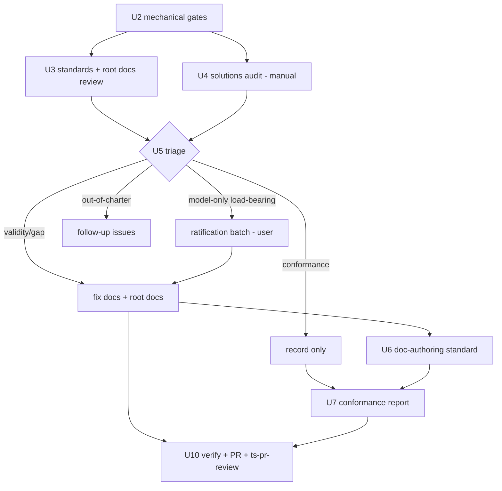

# fix: Repository documentation review (Issue #119)

## Summary

Run a repo-wide documentation review for Issue #119: validate every documented standard, concept, and best practice against current reality; trust-classify every directive (external best-practice verification is the primary signal, since most docs and code were model-authored); identify and remediate documentation gaps; audit repo conformance to the updated docs. Findings live in a Findings Ledger inside this plan. Conformance findings are recorded and reported, not fixed (user decision). Execution is ledger-first (user decision 2026-09-10): the first pass outputs the Findings Ledger only; every document fix waits for the user's explicit approval of that ledger (KTD 11). The effort closes with a PR reviewed through the newly rewritten `/ts-pr-review` pipeline; knowledge capture runs manually via `/ts-compound` afterwards, outside this plan (user decision 2026-09-10).

---

## Problem Frame

The repo's documentation layer has accumulated without a full audit: every doc under `docs/standards/`, every solutions doc under `docs/solutions/` (INDEX files excluded), the root docs (`README.md`, `CLAUDE.md`, `CONCEPTS.md`, `STRATEGY.md`), `docs/ROUTING.md` plus INDEX files everywhere, every `skills/*/SKILL.md` with its `references/` tree, and the `scripts/` corpus. Corpus sizes are deliberately unstated — counts drift during execution, so scope is defined by criteria, not numbers (user decision 2026-09-10). Exploration already surfaces drift candidates — `README.md`'s skills table lists fewer skills than `skills/` holds (`ts-compound-refresh` missing), `index-standards.md`'s own example table contradicts its link-format rule, `STRATEGY.md` carries `last_updated: 2026-06-22`, and no doc-authoring standard exists despite docs being this repo's primary product surface. Nothing verifies the documented claims match current code and skill behavior.

Audit volume is unknowable at plan time, so the plan defines an audit → ledger → triage → remediate workflow rather than pre-writing fixes.

---

## Requirements

From Issue #119 plus user decisions (2026-09-09):

**Validation and gap analysis**

- R1. Every standards doc, root doc, solutions doc, `docs/ROUTING.md`, and every `skills/*/SKILL.md` carries a recorded validity verdict (`valid` / `drifted` / `obsolete`) with `file:line` or command evidence — including docs verified as still correct (`kept-valid` rows). Verdict-to-ledger encoding: `valid` → `kept-valid` row; `drifted`/`obsolete` → `Verdict:` prefix in the Claim/Item field plus a terminal disposition (`fixed-in-U<n>` if a unit fixes it, else `deferred-issue-#<n>`). SKILL.md drifted claims dispose `deferred-issue-#<n>` (no `skills/**` remediation this cycle, per R4); their `references/` files stay U2-mechanical-only.
- R2. Documentation gaps are identified and classified (missing standards, missing coverage, stale structure).

**Remediation**

- R3. Validity and gap findings in `docs/**` and root docs are remediated in this effort: docs updated to match reality, gaps closed with new docs where in-charter.
- R4. Conformance findings (repo content violating docs) are recorded and reported only — no `skills/**` or `scripts/**` content edits from conformance findings in this cycle.

**Reporting and capture**

- R5. The conformance report is posted as a comment on Issue #119; large clusters may become follow-up issues.
- R6. The review lifecycle itself is captured as a solutions doc via `ts-compound` — descoped from plan execution (user decision 2026-09-10): the user runs `/ts-compound` manually after this effort; no unit executes it.
- R7. INDEX files stay consistent with doc additions and deletions throughout (generated tables only, never hand-edited).

**Hygiene and verification**

- R8. All local `.claude/worktrees/*` copies are inspected and removed.
- R9. The PR is reviewed via `/ts-pr-review` and the pipeline's output is inspected against its post-7847ab7 behavior contract; misbehavior is reported as a finding.

**Trust and provenance**

- R10. Every directive-level claim in `docs/standards/` and the two KTD policy docs (`docs/solutions/ktd-normalization-policy.md`, `docs/solutions/behavioral-ktd-verification.md`) carries a trust classification — `verified-external` (with citation), `user-confirmed` (only via ratification), `potential-human` (account plus forensic markers), or `model-only` — because most existing documentation and the code it describes were model-authored, so behavior consistency and account attribution alone cannot establish legitimacy.
- R11. Model-authored claims that carry load-bearing weight pass through explicit user ratification (keep / drop / rewrite) before the docs shipping in this PR retain them — including externally-backed claims, where the citation serves as review context but does not bypass the batch.

---

## Key Technical Decisions

1. **Mechanical-first ordering.** Deterministic validators run before semantic passes. They are cheap, they cover surfaces CI never checks (`README.md`, `skills/`), and they seed the ledger so semantic review only judges what machines can't.
2. **Findings Ledger as the single source of truth.** A ledger section of this plan (schema below; append-only for row creation — an existing row's Disposition and Fixed-in update in place) replaces scratch files. Every finding gets an ID, evidence, class, severity, and disposition; ledger verification is an explicit U10 step (every row terminal-dispositioned, every U3/U4-reviewed doc rowed), with `/ts-verify-implementation` running in parallel as standard diff review.
3. **Composition over invention.** Reuse `scripts/validate-index-standards.py`, `scripts/update-indexes.py`, `scripts/verify-script-refs.sh`, `scripts/verify-scripts.sh`, `skills/ts-compound-refresh/scripts/validate-doc-claims.py`, and `skills/ts-compound-refresh/scripts/validate-frontmatter.py` — direct script invocations only; no `/ts-compound` or `/ts-compound-refresh` skill runs in this plan (user decision 2026-09-10; capture runs manually post-plan). Zero new scripts (see `docs/solutions/workflow-issues/composition-over-generalization-for-verification.md`).
4. **Conformance is record-only** (user decision, 2026-09-09). The sweep produces a report and ledger rows, not edits to `skills/**` or `scripts/**`. Remediation becomes follow-up work: non-noise conformance rows carry `deferred-issue-#<n>` (issues filed at U10); `recorded-only` is reserved for S4 noise.
5. **New doc-authoring standard goes to `docs/standards/`**, gated on the audit confirming the gap. It follows the standards-vs-conventions doctrine in `docs/standards/INDEX.md`: direct MUST rules plus a Conformance Checklist, cross-linking `index-standards.md` and `link-convention.md` without duplicating them.
6. **Escalation threshold: >40 S1/S2 findings at triage (all classes — validity, gap, conformance, hygiene)** gates PR-widening escalation only: splitting remediation into per-area commits and offloading out-of-charter S3 gaps to new issues rather than widening the PR. Per-area commits are U5's default at any finding count.
7. **Docs match reality, not the reverse** — except where the code looks wrong. In those cases stop and surface to the user instead of editing the doc to bless a possible regression. The same exception covers prescribing-convention conflicts: when a doc's purpose is to mandate a convention and current repo shape contradicts it, surface the conflict — never rewrite the prescription to bless the status quo.
8. **Trust model: external verification is the primary signal.** Roughly 90% of the validation corpus (docs and the code they describe) was written by the same models, so in-repo consistency proves nothing about authority. Trust ladder, heaviest first: (a) `verified-external` — the rule is a documented community/expert best practice, cited from authoritative sources outside the repo (the primary metric); (b) `user-confirmed` — exists only after the user ratifies it; no in-repo record earns this pre-ratification; (c) `potential-human` — Taegost-account content that passes forensic marker verification; (d) `model-only` — everything else, which must justify itself through the ratification gate. Attribution rules: `Cinandriel`-authored content is AI by definition (user's AI-helper persona). The user's own accounts carry no human guarantee — AI regularly works under the `Taegost` identity (PR reviews, quality passes), the user sometimes forgets to switch to Cinandriel, and git author `Mike Wheway` is shared with Claude sessions. PR-review comments under `Taegost` skew AI for this reason (`ts-pr-review` posts through the active token). `potential-human` therefore requires account attribution **plus** forensic markers: typos and grammar slips, casual register, short directive sentences, first-person decisions — versus the polished, heavily-structured, hedged shape of drafted output. Untagged Taegost commits are candidates, never confirmations (other models did not consistently tag). Marker verification is a heuristic, not proof — which is why every `potential-human` row still enters the ratification batch, carrying its source reference (commit SHA or issue/comment URL) so the user can confirm or deny authorship in one glance.
9. **Ratification, not silent resolution, for load-bearing claims.** Every load-bearing claim enters the U5 ratification batch regardless of external backing — external research accelerates review (citation shown as context) but never bypasses it. A load-bearing `model-only` claim with no external backing gets disposition `needs-ratification`; one with external backing enters the batch carrying its citation. The user keeps, drops, or rewrites each. A kept externally-backed claim becomes `externally-corroborated` with the citation recorded — the label reflects model assessment plus citation, not user ratification of the underlying rule. No silent retention and no silent deletion (deleting an unrecorded real directive loses tribal knowledge). Batch processing: weight order first (behavior-changing directives lead), chunks of ~10 per sitting. Outcomes: keep → Trust flips to `user-confirmed` (this IS the ratified-keep state — no separate disposition value); kept externally-backed → `externally-corroborated`; drop/rewrite → `fixed-in-U5`; user-deferred or unanswered → `deferred-issue-#<n>` (issue filed at U10), claim stays recorded-and-tracked — the no-silent-retention prohibition binds only items never presented to the user. **Load-bearing** (shared definition for R11, U3, U5, and KTD 10): a directive whose removal would change skill or CI behavior, or that other documents cross-reference.
10. **External verification scopes to rule-bearing surfaces.** `docs/standards/`, root policy docs, and load-bearing conventions (load-bearing per the KTD 9 definition) get the external-research pass — U3 researches only load-bearing rules, not every directive. `docs/solutions/` learnings are incident records, inherently local — they get trust classification via attribution only, not external verification.
11. **Ledger-first execution** (user decision, 2026-09-10). The first execution pass outputs the Findings Ledger only — no document fix is implemented without the user's explicit approval of the ledger. Remediation in U5 begins only after that approval; the ratification batch is presented within it. Exceptions require explicit user approval — the U6 doc-authoring standard's own drafting is one (DR19 decision).

---

## Findings Ledger Design

Section at the end of this plan. Append-only governs row creation only: rows are added, never deleted or reordered, while an existing row's **Disposition** and **Fixed-in** fields update in place as work completes. Row schema:

```markdown
| ID | Surface | Location | Claim/Item | Evidence | Class | Severity | Trust | Disposition | Fixed-in |
```

- **Class:** `validity` (doc wrong vs reality) · `gap` (missing doc/coverage) · `conformance` (repo violates doc) · `hygiene`
- **Severity (validity/gap):** S1 contradicts reality · S2 stale facts · S3 gap · S4 cosmetic
- **Severity (conformance):** S1 violates a MUST rule · S2 violates a SHOULD rule or current convention · S3 minor deviation · S4 cosmetic
- **Severity (hygiene):** S4 by default; S2 when the issue blocks a tool or gate
- **Trust:** `verified-external <source URL + direct quote of cited passage>` — missing either field downgrades the row to `model-only` · `user-confirmed <source>` · `potential-human <sha-or-url>` · `model-only` — attribution per KTD 8; `user-confirmed` only ever set at ratification
- **Disposition:** `fixed-in-U<n>` · `deferred-issue-#<n>` (out-of-charter gaps and non-noise conformance/hygiene rows — issue filed at U10, issue number recorded in the row before merge) · `recorded-only` (S4 noise only) · `wont-fix-churn` · `kept-valid` · `externally-corroborated` (kept externally-backed claim, KTD 9) · `needs-ratification` · `rejected-finding` (user overrules an auditor verdict; row keeps its original severity, Trust becomes `user-confirmed` — preserves the audit trail that a finding was raised and by whom overruled) · `ratified-keep` (user ratified a `needs-ratification` row as-is; Trust `user-confirmed`)
- **Fixed-in:** filled only when the row's disposition is not `fixed-in-U<n>`; otherwise `—` (the disposition already names the unit)

`kept-valid` rows carry evidence too — task 1 of the issue demands proof of validation, not just a list of problems.

Acceptance bar (checked at U10): zero unaddressed S1/S2 findings — every S1/S2 row carries a terminal disposition; every S3 finding has a row with a legal disposition; S4 rows are recorded but never block.

**Ratification decision ingestion (user-directed, 2026-09-10).** The user reviews all ledger rows offline via `ratification-decisions.csv` (repo root, untracked, `.git/info/exclude`d) — one row per ledger row with columns ID, Surface, Location, Claim, Evidence, Severity, Trust, Disposition, Decision, Note. Filled values map: `keep` → `ratified-keep` + Trust `user-confirmed`; `drop`/`rewrite` → `fixed-in-U5` (Note should say what); `defer` → `deferred-issue-#<n>`; `reject-finding` → `rejected-finding` (original Severity retained, Trust `user-confirmed`); `promote` → `needs-ratification` for discussion. An empty `Decision` is a data error: surface the row ID and do not process the row — never fall back to the proposed disposition (user decision 2026-10-05). Ingestion validates every ID and Decision value against the ledger, applies Disposition/Trust/Fixed-in flips in place, and appends user Notes as a decisions log under the ledger section. Per the one-gate rule (2026-09-10): a completed CSV is approval and go in one step — approved fixes apply immediately, no second confirmation.

---

## High-Level Technical Design


```mermaid
flowchart TB
    A[U2 mechanical gates] --> B[U3 standards + root docs review]
    A --> C[U4 solutions audit - manual]
    B --> D{U5 triage}
    C --> D
    D -->|validity/gap| E[fix docs + root docs]
    D -->|model-only load-bearing| R[ratification batch - user]
    R --> E
    D -->|conformance| F[record only]
    D -->|out-of-charter| G[follow-up issues]
    E --> H[U6 doc-authoring standard]
    F --> I[U7 conformance report]
    H --> I
    E --> K[U10 verify + PR + ts-pr-review]
    I --> K
```

The ledger is written by U2–U4 and U7, consumed by U5 (triage), and checked by `ts-verify-implementation` at U10. U8 is descoped — knowledge capture runs manually via `/ts-compound` after this effort (user decision 2026-09-10). U9 (worktree cleanup) is local-only and runs outside the PR.

---

## Implementation Units

### U1. Branch and ledger scaffold

- **Goal:** Feature branch `docs/119-repo-documentation-review` with this plan committed and the empty Findings Ledger section in place.
- **Requirements:** R1, R2, R7 (scaffold)
- **Dependencies:** none
- **Files:** `docs/plans/2026-09-09-001-fix-repo-documentation-review-plan.md`, `docs/plans/INDEX.md` (regenerated)
- **Approach:** Branch from current `main`. All units run in the main checkout on this branch — no worktrees (user preference, 2026-09-10). Ledger section carries the schema and severity definitions verbatim.
- **Verification:** `python3 scripts/validate-index-standards.py docs/` passes.
- **Test scenarios:** Test expectation: none — documentation scaffold; verification via the index validator.

### U2. Mechanical gate sweep, all surfaces

- **Goal:** Every deterministic validator run over every surface, including surfaces CI never covers; findings seeded into the ledger with command output as evidence.
- **Requirements:** R1, R2
- **Dependencies:** U1
- **Files:** ledger rows only
- **Approach:** Zero new scripts. Run `scripts/validate-index-standards.py` over `docs/ README.md CONCEPTS.md STRATEGY.md CLAUDE.md skills/`; `scripts/update-indexes.py` followed by an empty-`git diff` idempotency check; `scripts/verify-script-refs.sh`; `scripts/verify-scripts.sh --all`; `skills/ts-compound-refresh/scripts/validate-doc-claims.py` over every `docs/standards/*.md` and `docs/solutions/**/*.md`; grep sweeps for references to deleted or renamed artifacts.
- **Patterns to follow:** CI invocation shapes in `.github/workflows/ci.yml`.
- **Verification:** Every command's exit status recorded as ledger evidence; all mechanically-detectable S2 findings identified before U3 starts.
- **Test scenarios:** Test expectation: none — read-only audit; verification via recorded gate output.

### U3. Standards and root-docs semantic validity and trust review

- **Goal:** Task 1 for `docs/standards/`, root docs, and all `skills/*/SKILL.md`: every documented claim verified against current reality, and every directive-level claim trust-classified per KTD 8.
- **Requirements:** R1, R10
- **Dependencies:** U2
- **Files reviewed:** `docs/standards/agent-standards.md`, `docs/standards/index-standards.md`, `docs/standards/link-convention.md`, `docs/standards/script-extraction-standards.md`, `docs/standards/script-frontmatter-convention.md`, `docs/standards/script-security-standards.md`, `docs/standards/testing-standards.md`, `README.md`, `CLAUDE.md`, `CONCEPTS.md`, `STRATEGY.md`, `docs/ROUTING.md`, all `skills/*/SKILL.md`
- **Approach:** Three passes per doc. First, claim extraction: list every testable claim (named scripts and their behavior, file paths, counts, "MUST be validated by X"), verify each against code or skill behavior, record a verdict row with evidence. Second, external verification: for each load-bearing directive rule (load-bearing per the KTD 9 definition), research what authoritative external sources advise for the domain (shellcheck and shell scripting guidance for script-security-standards, GitHub Actions docs for CI conventions, CommonMark for link rules, pytest/bats community practice for testing-standards, prompt-engineering and agent-design practice for agent-standards) and record `verified-external` with source URL plus a direct quote of the cited passage (missing either = `model-only`), or note no external backing found. Third, attribution: gather Taegost-account candidates (GitHub issues, PR comments via `gh`; commits lacking an AI co-author trailer) and apply forensic marker verification per KTD 8 — account alone never yields human, because AI works under that identity regularly. Candidates passing marker checks rate `potential-human`; `Cinandriel`-authored content counts as model-written. Nothing rates above `potential-human` before ratification. No file edits in this unit. Known seeds: the `index-standards.md` example-vs-rule column inconsistency; `link-convention.md` claims vs actual `validate-index-standards.py` behavior; `testing-standards.md` vs `run-test-suites.sh` globs and `detect-coverage-gaps.sh`; `agent-standards.md` vs the `skills/*/references/agents/*.md` corpus; README skills tables; `STRATEGY.md` staleness; `CONCEPTS.md` glossary entries pointing at real machinery. SKILL.md files get the claim-extraction pass too (named scripts, paths, counts, described behavior); drifted SKILL.md claims get verdict rows disposed `deferred-issue-#<n>` per R4, and their `references/` files stay U2-mechanical-only.
- **Verification:** Every listed doc has a completed verdict table in the ledger with reality evidence and trust classification, `kept-valid` rows included with evidence.
- **Test scenarios:** Test expectation: none — read-only audit; verification via ledger completeness.

### U4. Solutions docs audit — record only, manual

- **Goal:** Task 1 for `docs/solutions/`: freshness, overlap, and supersession verdicts for every solutions doc — record-only, no edits. No `/ts-compound` or `/ts-compound-refresh` runs in this plan (user decision 2026-09-10; capture runs manually post-plan).
- **Requirements:** R1
- **Dependencies:** U2
- **Files reviewed:** `docs/solutions/**` (INDEX files excluded) including both root policy docs; ledger rows out only
- **Approach:** Manual audit: per-doc freshness pass (each testable claim vs current reality), overlap and supersession scan across the set, inbound-link check plus repo-wide filename grep before any delete recommendation. Outcomes land as `validity` ledger rows with verdicts and evidence, trust classification by attribution only (KTD 10 — incident learnings are local records, no external verification pass). Root policy docs (`docs/solutions/ktd-normalization-policy.md`, `docs/solutions/behavioral-ktd-verification.md`) get explicit verdicts — load-bearing for KTD verification, and as rule-bearing policy they additionally get the U3 external-verification treatment. Edits (once approved per KTD 11) and INDEX regeneration move to U5.
- **Verification:** Every solutions doc carries a verdict row with evidence in the ledger; zero doc edits made in this unit.
- **Test scenarios:** Test expectation: none — read-only audit; verification via ledger completeness.

### U5. Triage and documentation remediation

- **Goal:** Ledger-driven fixes for `validity` and `gap` classes, gated by the ratification batch; remediation volume discovered and executed here, not assumed.
- **Requirements:** R3, R7, R11
- **Dependencies:** U2, U3, U4
- **Files:** whatever the ledger implicates — expected clusters: `docs/standards/*.md`, `README.md`, `CONCEPTS.md`, `STRATEGY.md`, `docs/solutions/*`
- **Approach:** Triage first; no edits until the user approves the ledger (KTD 11) — the first pass outputs the ledger only. Present the sorted ledger plus the ratification batch together: every load-bearing claim per KTD 9 (`needs-ratification` rows, externally-backed load-bearing rows with citations as review context, `potential-human` rows awaiting authorship confirmation), processed in weight order (behavior-changing directives first) in chunks of ~10; keep / drop / rewrite per item, candidate commit SHAs shown for `potential-human` entries. Batch outcomes per KTD 9: keep → Trust flips to `user-confirmed`; kept externally-backed → `externally-corroborated`; drop/rewrite → `fixed-in-U5`; user-deferred or unanswered → `deferred-issue-#<n>` (issue filed at U10). After approval, fix S1/S2 in batches, one commit per doc area (standards batch, root-docs batch, solutions batch). S3 in-scope fixes flow to U6 or are fixed here; S3 out-of-charter becomes follow-up issues; S4 marked `wont-fix-churn`. Conformance rows get `recorded-only` when S4 noise, else `deferred-issue-#<n>` (issues filed at U10). Where the code looks wrong rather than the doc, stop and surface to the user. INDEX regeneration happens here (R7). Apply the U2 gate set after each batch to catch link breakage introduced by edits.
- **Verification:** Ledger rows flipped to `fixed-in-U5`; gates green after every batch.
- **Test scenarios:** Test expectation: none — documentation edits; verification via re-run gate set per batch.

### U6. Doc-authoring standard

- **Goal:** Close the confirmed gap: no standard governs prose, audience, or placement decisions.
- **Requirements:** R2, R3, R7
- **Dependencies:** U3, U5 (gap confirmation)
- **Files:** `docs/standards/doc-authoring-standards.md` (new), `docs/standards/INDEX.md`, cross-reference in `docs/ROUTING.md` if warranted
- **Approach:** Conditional on U3/U5 evidence confirming the gap (strongly pre-seeded). Ratify before shipping: draft the standard's directive claims first, run a ratification mini-batch on them per R11/KTD 9, then finalize — the standard ships ratified, not model-only (approved exception to KTD 11, DR19 decision 2026-09-10). Content: audience, tone, placement decision rule (standard vs solutions doc vs README entry vs `CONCEPTS.md` term), an authoring-time trust-classification MUST rule — every new directive-level claim gets a trust classification when written, per R10/KTD 8 — and a Conformance Checklist that includes it. Cross-link `index-standards.md` and `link-convention.md`; do not duplicate their rules.
- **Patterns to follow:** structure of `docs/standards/testing-standards.md` and the standards-vs-conventions doctrine in `docs/standards/INDEX.md`.
- **Verification:** One `/ts-doc-review` pass on the new standard; `validate-index-standards.py docs/` passes; the doc satisfies its own checklist.
- **Test scenarios:** Test expectation: none — new standard document; verification via doc-review pass and index validator.

### U7. Conformance audit — record only

- **Goal:** Task 4: repo content checked against the now-current docs; findings recorded, no fixes.
- **Requirements:** R4, R5
- **Dependencies:** U6 (sweep runs against updated docs)
- **Files:** report content only — no `skills/**` or `scripts/**` edits
- **Approach:** Mechanical layer first: `validate-index-standards.py skills/ scripts/`; grep sweeps per standard (bare-URL links, line-2 `# <script-name> -- <description>` header comments per `docs/standards/script-frontmatter-convention.md`); `agent-standards.md` conformance across the agent corpus; README skills-listing check against actual `skills/` directories. Manual layer for judgment calls (agent definition structure, prose conventions). Findings land as `conformance` ledger rows and a structured report posted to Issue #119 at U10. Follow-up issues only for large clusters — decide at execution.
- **Verification:** Ledger conformance rows match the report 1:1 — one row per enumerated mechanical-sweep finding plus one per named manual check; report drafted.
- **Test scenarios:** Test expectation: none — read-only audit; verification via ledger completeness.

### U8. Descoped — manual capture post-plan

- **Goal:** None in this plan. Knowledge capture via `/ts-compound` is descoped (user decision 2026-09-10): the user runs it manually after this effort closes. R6 is satisfied outside this plan.
- **Requirements:** none (R6 descoped)
- **Dependencies:** none
- **Files:** none
- **Approach:** No work. If the user's manual capture run surfaces findings about this effort, they enter follow-up issues, not this PR.
- **Verification:** n/a.
- **Test scenarios:** n/a.

### U9. Worktree cleanup

- **Goal:** All local `.claude/worktrees/*` copies inspected and removed.
- **Requirements:** R8
- **Dependencies:** none (local-only; run any time before U10)
- **Files:** no files from the worktree enter the PR or source control (`.claude/worktrees/` is gitignored); only output is the `hygiene` ledger row in this plan
- **Approach:** For each worktree directory: check for uncommitted changes and unmerged branches (`git worktree list`, `git -C <path> status`). If clean, `git worktree remove` then `git worktree prune`. Surface anything non-trivial to the user before removing. Record as a `hygiene` ledger row.
- **Verification:** `git worktree list` shows only the main checkout (implementation runs on the feature branch in the main checkout — no worktrees, user preference 2026-09-10).
- **Test scenarios:** Test expectation: none — local housekeeping; verification via `git worktree list`.

### U10. Verification, PR, and pipeline watch

- **Goal:** Ship with full gate coverage; exercise the newly rewritten review pipeline; deliver the conformance report.
- **Requirements:** R5, R7, R9
- **Dependencies:** U1–U9
- **Files:** `docs/pull_requests/<PR#>_verification.md` (new), Issue #119 comment
- **Approach:** Full battery: pytest, `scripts/run-test-suites.sh`, shellcheck, `scripts/verify-script-refs.sh`, `scripts/verify-scripts.sh --all`, `validate-index-standards.py` over all surfaces, `update-indexes.py` idempotency. Then an explicit ledger-verification step — every row carries a terminal disposition and every U3/U4-reviewed doc has a row, checked against the acceptance bar (Findings Ledger Design); `/ts-verify-implementation` runs in parallel as standard diff review. Open the PR, post the U7 conformance report as an Issue #119 comment, then run `/ts-pr-review` on the PR. Use `/ts-pr-fix-findings` for any review feedback.
- **Execution note:** `/ts-pr-review` was rewritten in 7847ab7 — scripted payload via `skills/ts-pr-review/scripts/build-review-payload.sh`, deterministic P0–P3 severity mapping, P2+ posts REQUEST_CHANGES, pre-existing findings land report-only in the fallback comment, zero-findings runs still execute the full pipeline. Watch for: payload construction succeeding from the run artifact, severity mapping stable across re-runs, P2+ actually blocking, pre-existing findings on untouched files staying report-only, clean runs completing end-to-end. **Pipeline misbehavior is itself a ledger finding — report it, do not work around it silently.**
- **Verification:** All gates green; verification doc written per the `docs/pull_requests/` naming convention; Issue #119 comment confirmed visible via `gh issue view 119 --json comments --jq '.comments[-1].body'` (R5); `/ts-pr-review` output inspected against the behavior contract above; PR merged with `Closes #119`.
- **Test scenarios:** Test expectation: none — verification and review orchestration; verification via the gate battery and the review run itself.

---

## Scope Boundaries

**In scope**

- Edits to `docs/**` and root docs (`README.md`, `CLAUDE.md`, `CONCEPTS.md`, `STRATEGY.md`) from validity and gap findings
- New `docs/standards/doc-authoring-standards.md`
- Conformance report (record-only) and its Issue #119 comment
- `docs/pull_requests/<PR#>_verification.md` (U10 verification doc)
- Local worktree cleanup

**Out of scope (this cycle)**

- Conformance *fixes* to `skills/**` or `scripts/**` — recorded, remediated in follow-up issues
- Code behavior changes anywhere
- New CI tooling (for example a markdown linter) — record as a gap finding, defer
- Hand-edits to generated INDEX tables

### Deferred to Follow-Up Work

- Conformance remediation issues spawned from the U7 report (created at U5/U10 depending on cluster size)
- Any S3 gaps judged out-of-charter at triage
- Knowledge capture via `/ts-compound` — user runs it manually after this effort (descoped 2026-09-10)

---

## Risks & Dependencies

- **Audit scope ballooning** (the full standards, solutions, and skills-doc corpus — criteria-defined, counts deliberately unstated per the 2026-09-10 ruling). Mitigation: ledger plus dedicated triage unit between discovery and fixes; conformance record-only bounds the PR; the >40 S1/S2 threshold splits remediation.
- **Solutions-doc deletion breaks citations.** Mitigation: inbound-link check plus repo-wide filename grep before any delete recommendation (manual, per U4).
- **INDEX drift after doc additions and deletions.** Mitigation: rely on `update-indexes.py` regeneration (pre-commit runs it); empty-diff idempotency check.
- **Remediation blesses broken code.** Mitigation: doc-matches-reality rule with the explicit stop-and-surface exception.
- **Newly rewritten `/ts-pr-review` misbehaving mid-PR.** Mitigation: U10 execution note; misbehavior becomes a finding rather than a silent workaround.
- **Dependencies:** none external. All machinery already exists in-repo.

---

## Findings Ledger

Append audit rows below. Schema and severity definitions live in the Findings Ledger Design section.

| ID | Surface | Location | Claim/Item | Evidence | Class | Severity | Trust | Disposition | Fixed-in |
|---|---|---|---|---|---|---|---|---|---|

### Plan-review rows (ts-doc-review, 2026-09-09)

Rows below record this plan's own `/ts-doc-review` pass (7 reviewers). Plan-review dispositions: `applied-2026-09-10` (user approved 2026-09-09; fix applied to this plan 2026-09-10), `needs-plan-review` (awaiting user decision), `recorded-only` (advisory). Rows applied in the 2026-09-10 DR7–DR28 session may embody user-modified fixes — that session's rulings govern. Trust is `model-only` for all rows — reviewer claims are model-authored until user-ratified, per this plan's own KTD 8.

The rows have been moved to their own CSV file, currently located in `{REPO_ROOT}/ratification-decisions.csv`

### Per-prefix split tooling (2026-10-05)

Executed `docs/plans/2026-10-05-001-split-ratification-csv-plan.md` to support offline ratification of the ledger above: created `scripts/split-ratification-csv.py` (splits the ratification CSV into `{PREFIX}-ratification.csv` files under `resources/doc-ratification/{DATE}/`, grouped by ID prefix with trailing digits stripped), its test suite `tests/test_split_ratification_csv.py`, and the split output under `resources/doc-ratification/2026-10-05/` (46 files, 761 rows, one per audit-surface prefix). This tooling was not an Implementation Unit of this plan — recorded as acceptable scope creep, user-approved 2026-10-05. The split output files are intentionally left uncommitted until the source CSV is final.

### Attribution and hygiene rows

Attribution corpus (U3 pass 3) and worktree cleanup (U9).

#### AT — attribution corpus

| ID | Surface | Location | Claim/Item | Evidence | Class | Severity | Trust | Disposition | Fixed-in |
|---|---|---|---|---|---|---|---|---|---|
| AT1 | attribution | corpus (gh: issues+PRs+comments, commits) | Attribution corpus built per KTD 8: 125 items, 960 comments, 277 commits, 3 identities (Taegost owner, cinandriel, coderabbitai); 9 potential-human candidates, 9 inconclusive; docs plausibly human-transcribed: index-standards.md (PR 97), subagent-bootstrap-dispatch.md (PR 97), agent-definition-convention.md (PR 84/88/89) | Scratch artifacts (session-local): /tmp/all_issue_comments.json, /tmp/all_pr_review_comments.json, /tmp/all_issues.json, /tmp/all_prs.json, /tmp/commits.txt | hygiene | n/a | model-only | recorded-only | — |

#### H9 — worktree cleanup

| ID | Surface | Location | Claim/Item | Evidence | Class | Severity | Trust | Disposition | Fixed-in |
|---|---|---|---|---|---|---|---|---|---|
| H91 | worktree-cleanup | .claude/worktrees/agent-af738a740083dfc3f | Stale agent worktree removed per U9: clean tree at e07b42f, fork cf09c7b, 8 commits fully superseded (squash-landed via 05a1483 PR 120; git cherry 0 patch-equivalent; main carries its own tests/scripts/test-run-test-suites.sh); branch-only files were 18 intentionally-deleted plan docs; worktree and branch worktree-agent-af738a740083dfc3f deleted, pruned | git worktree list now shows only the main checkout | hygiene | n/a | model-only | fixed-in-U9 | — |

### Audit notes (per surface, U2-U4)

Auditor pass-2 notes preserved: code-wrong flags (KTD 7 stop-and-surface candidates for U5 triage), external-verification citations (URL plus quoted passage, per DR5), and cross-surface flags. Subagent-bootstrap-dispatch notes appended from the final wave.

#### CM — CLAUDE.md

1. Placement tension with a solutions doc: `docs/solutions/tooling-decisions/claude-code-plugin-script-path-resolution.md:182` states "conventions belong in docs/standards/, never in CLAUDE.md." That doc's sentence is scoped to script-path resolution, but its generalized phrasing conflicts with CLAUDE.md:7-9 hosting a behavioral convention — added the same day (2026-07-09), one commit after 310fb32 moved the Script Extraction Policy out of CLAUDE.md into docs/standards/. Either that solutions sentence over-generalizes or the ratification of the verify-fixes section should record why CLAUDE.md is the intended surface (it is a directive for acting on findings, arguably instructions rather than a convention). Flag for the solutions-doc auditor and for the ratification batch.
2. ROUTING.md completeness gap (affects the "complete map" wording, not the pointer's validity): ROUTING.md's Other Resources omits `docs/INDEX.md` — an active, generator-owned file (owner: wave-2-dispatch-index-automation, last-updated 2026-09-09) that itself indexes the docs/ sub-INDEXes. ROUTING.md is separately under audit this cycle (plan U3, files list at `docs/plans/2026-09-09-001-fix-repo-documentation-review-plan.md:146`), so route this finding there rather than fixing via CLAUDE.md. ROUTING.md omitting CLAUDE.md itself is defensible (auto-loaded, not a navigation target) and needs no action.
3. Nothing in code contradicts the doc: `python3 scripts/validate-index-standards.py docs` exits 0 with 48 files, 0 failures; every path the doc's pointer transitively relies on resolves; the directive's origin incident commit ca44c43 and its subject file both exist. No code-side remediation flagged.agentId: a48c95b2b9da3d598 (use SendMessage with to: 'a48c95b2b9da3d598', summary: '<5-10 word recap>' to continue this agent)
<usage>subagent_tokens: 64302
tool_uses: 11
duration_ms: 371368</usage>

#### RM — README.md

**Seed (2) did not reproduce.** `grep -n "pull_requests|script-index|14_001" README.md` returns no matches (exit 1). The README does not cite the deleted docs/pull_requests/14_001/plan.md nor the deleted skills/_deprecated/script-index/SKILL.md. If a U2 grep flagged README.md for these, the hit was misattributed — the references may live in another surface. Note that docs/pull_requests/ itself still exists in the repo.

**Skills-table delta (listed vs actual).** Actual skills/: 16 dirs. Table 1 (6 skills): all exist. Table 2 (9 skills): all exist. Missing from both tables: **ts-compound-refresh** — this confirms the plan's seed. Structure tree lists only 14, additionally omitting **load-plan**. Net: two separate completeness fixes (tables and tree).

**S1 family — phantom external dependency.** The strongest finding: README asserts four times (lines 38, 85, 87, 122) that ts-pr-review requires the claude-plugins-official `code-review` plugin. The skill actually hard-gates on the in-repo `/ts-code-review` skill (ts-pr-review SKILL.md:25-26, review.json artifact gate). No skill in the repo references claude-plugins-official. Users following README would install a plugin nothing uses. Treat lines 38, 85, 87, 122 as one fix, not four.

**Doc-vs-code ambiguity worth a decision, not an automatic fix:** the `user_invocable: true` frontmatter requirement (lines 172-179, 235). Either the README states the repo's intended convention and 11 skills under-specify it, or the field was quietly dropped as a concept and the README template is stale. There is no validator either way (no test or script checks frontmatter). U5 should pick one side deliberately rather than just editing the README — this is the one row where "the code looks wrong rather than the doc" is a live possibility.

**Runtime-consumption claim has real blast radius:** line 236 says docs/ is "Not consumed by Claude Code at runtime", but ts-verify-implementation reads docs/solutions/behavioral-ktd-verification.md during verification and scripts/solutions-search.sh queries docs/solutions. A contributor taking the README literally could treat docs/ as inert. S2, fix is a one-line wording change.

**Unverifiable in-repo (model-only trust, no row):** line 7/23 install-instructions settings schema (`extraKnownMarketplaces`/`enabledPlugins` shape — names verified against marketplace.json, schema shape not); lines 165/180 `/reload-plugins` as a Claude Code command. Both plausible, neither checkable without an external pass, which was out of scope.

**Minor observation, no row:** line 3's description ("PR review, PR fix, and implementation verification") mirrors marketplace.json verbatim and so is internally consistent, but the repo now ships 16 skills spanning planning, compounding, and doc tooling. If U5 touches the manifest description, README line 3 should move with it (single source of truth — the manifest is canonical).agentId: a437e52033ade56a0 (use SendMessage with to: 'a437e52033ade56a0', summary: '<5-10 word recap>' to continue this agent)
<usage>subagent_tokens: 73618
tool_uses: 13
duration_ms: 538955</usage>

#### RT — docs/ROUTING.md

Tree/code-side defects (doc is right, tree is wrong — do not "fix" ROUTING.md for these):

1. **`docs/pull_requests/INDEX.md` is not in version control.** It exists on disk (2628 bytes, mode 600) but is excluded by a **local-only** `.git/info/exclude` entry (`docs/pull_requests/`, line 8). Fresh clones get `pull_requests/` with content but no INDEX.md. The exclude file also lists three already-tracked files (`97_fix_001.md`, `97_verification.md`, `104_verification.md`) where it is a no-op. This local exclude state is exactly the kind of thing that makes in-repo consistency checks pass on one machine and fail elsewhere.
2. **`docs/INDEX.md` contradicts `docs/standards/index-standards.md:96-98`**, which places docs/ root under "When NOT to create INDEX.md" ("That is the provenance of ROUTING.md"). The validator (`scripts/validate-index-standards.py:393-406`) only warns for INDEX.md at the **repo** root, so docs/INDEX.md sails through — a written-rule vs enforcement gap. It also copies ROUTING's intro sentence verbatim as its description of ROUTING. Ledger row TBD covers the ROUTING-side gap; the resolution (delete docs/INDEX.md, or amend index-standards and wire it into the validator) belongs to an issue, not this doc.
3. **ROUTING.md itself is unstandardized.** index-standards' frontmatter and table rules scope to "Every INDEX.md file"; the sole exception doc has no format spec anywhere (it carries only `tags` + `description`). Not a violation — a coverage hole in index-standards worth flagging during that doc's own audit.
4. **Trailing-slash directory links** (L51, 53-56, 64, 73-74) sit next to index-standards' "No trailing slashes on file paths" (line 76). Read literally that rule covers file paths only, so no violation — but the validator has no trailing-slash handling at all, so the interpretation is untested by CI.
5. Minor: `scripts/__pycache__/` is untracked but properly gitignored — no action needed.agentId: a640d02863c3be049 (use SendMessage with to: 'a640d02863c3be049', summary: '<5-10 word recap>' to continue this agent)
<usage>subagent_tokens: 72687
tool_uses: 19
duration_ms: 512454</usage>

#### LC — link-convention.md

External verification (verified-external backing):

1. CommonMark 0.31.2, section 6.3 "Links" — <https://spec.commonmark.org/0.31.2/> — verbatim: "A link contains link text (the visible text), a link destination (the URI that is the link destination), and optionally a link title." and "An inline link consists of a link text followed immediately by a left parenthesis `(`, an optional link destination, an optional link title, and a right parenthesis `)`." Backs the `[name](uri)` form in R7. Caveat: same section — "There are two basic kinds of links in Markdown" (inline and reference) — so R7 is a deliberate restriction of CommonMark, not a restatement of it.
2. Google developer documentation style guide, "Cross-references and linking" — <https://developers.google.com/style/cross-references> — verbatim: "Write link text that makes sense without the surrounding text. Don't use phrases such as this document, this article, or click here." and "For the link text itself, use short, unique, descriptive phrases that provide context for the material that you're linking to." Directly backs line 17 including its exact `[click here]` counter-example.
3. GitHub Docs, "Basic writing and formatting syntax" — <https://docs.github.com/en/get-started/writing-on-github/getting-started-with-writing-and-formatting-on-github/basic-writing-and-formatting-syntax> — verbatim (Relative links section): "Relative links are easier for users who clone your repository. Absolute links may not work in clones of your repository - we recommend using relative links to refer to other files within your repository." Backs line 18. Same page, Links section: "You can create an inline link by wrapping link text in brackets `[ ]`, and then wrapping the URL in parentheses `( )`."
4. markdownlint rule MD034 — <https://github.com/DavidAnson/markdownlint/blob/main/doc/Rules.md> — verbatim: "`MD034` - Bare URL used ... Aliases: `no-bare-urls`". The bare-URL prohibition at line 19 is an established linting practice. Nuance: the same GitHub page notes "GitHub automatically creates links when valid URLs are written in a comment" — bare URLs already render as links on GitHub, so line 19 is a consistency/display-control policy, not a rendering necessity.

Code-looks-wrong flags (doc mirrors reality or reality is the weaker party):

1. `scripts/validate-index-standards.py` `check_r7_links` (lines 74-143) under-implements its own R7 definition. Probes confirm it accepts reference-style links `[text][ref]`, angle autolinks `<https://...>`, HTML anchors, empty display text `[](...)`, non-descriptive text, nonexistent targets, and broken-paren links; it flags only bare URLs. Its docstring (line 5) and epilog (line 598) make the same "all markdown links" overstatement the doc repeats — the doc likely mirrored the code's self-description. Fix direction needs a ruling at ratification: narrow the R7 wording to "no bare URLs" in both doc and script, or broaden the checker.
2. `skills/ts-compound-refresh/scripts/validate-doc-claims.py` section 3 (lines 306-321) extracts links with `MD_LINK_RE` without skipping fenced blocks or inline code spans, while the repo's other link checker does strip code (validate-index-standards.py lines 59-63 and 98). Every illustrative link in any doc will flag — this audit's three seeds are instances of that class defect, not doc drift.
3. No enforcement wiring: neither `.github/workflows/ci.yml` (pytest covers `tests/test_validate_index_standards.py`, which tests the validator on synthetic fixtures only) nor `.pre-commit-config.yaml` (update-indexes, shellcheck, verify-script-refs, verify-scripts) ever runs `validate-index-standards.py` against the real docs tree. R7 compliance on real docs is currently manual-only. Logged as TBD gap row; the wiring decision belongs to the consolidator, not this doc's U5 wording fix.
4. Minor: rule ID "R7" is overloaded repo-wide (links here, exec-bit in `tests/scripts/test-fleet-help.sh:112`, README dependencies in a brainstorm) — cosmetic, but worth a rule-ID registry if more standards docs adopt the `Rule (Rn)` pattern; this is currently the only `docs/standards/` doc using it.agentId: ac504e025ee83fc5b (use SendMessage with to: 'ac504e025ee83fc5b', summary: '<5-10 word recap>' to continue this agent)
<usage>subagent_tokens: 94562
tool_uses: 29
duration_ms: 804355</usage>

#### CC — CONCEPTS.md

1. Suppression exemption mismatch across layers (not a CONCEPTS.md defect): `skills/ts-code-review/scripts/merge-findings.py` step 7 exempts P0 AND P1 at anchor 50+ from the late gate, while `skills/ts-code-review/references/findings-schema.json:112` tells reviewers to suppress below anchor 75 with an exception for P0 only. This is coherent layering (reviewer self-censor is stricter than the mechanical gate; a P1 at 50 the reviewer reports anyway survives the merge), but anyone reconciling the two texts should know the asymmetry is deliberate-looking yet undocumented in either file's rationale.
2. Dual pre-commit wiring: the checked-in `.pre-commit-config.yaml` runs `scripts/update-indexes.py` (which delegates to `index-scripts.py` at line 514), while this checkout's `.git/hooks/pre-commit` is an untracked hand-written bash hook that runs the two generators explicitly with `--skip-scripts`. Repo state is consistent; the local hook is environment-only duplication and a candidate for deletion if it ever drifts from the config.
3. `scripts/verify-scripts.sh:141` gates on the literal string `--help` via grep, even though CONCEPTS.md:63 correctly defines compliance behaviorally. The behavioral suite (`tests/scripts/test-fleet-help.sh`) is the real check; the gate is a deliberately crude proxy. A script with a behavioral help branch that omits the literal token would fail the gate despite conforming to the documented definition — worth remembering if a false positive ever lands there, but not a doc bug.
4. CONCEPTS.md:23's "each agent file lives in a skill's references/agents/" is true on disk today (7 of 7 skill agent dirs are skill-local) but agent-standards.md:149-152 already sanctions a shared repo-root `agents/` tier that Issue #83 will populate — this entry will go stale the moment that lands. Flagging for the U5 fix batch to consider a two-location phrasing while editing this file anyway.agentId: abf8f2631086dcd5e (use SendMessage with to: 'abf8f2631086dcd5e', summary: '<5-10 word recap>' to continue this agent)
<usage>subagent_tokens: 98739
tool_uses: 41
duration_ms: 795537</usage>

#### SX — script-extraction-standards.md

**N1 — External quotes (verified-external backing):**

- **E1** — URL: <https://code.claude.com/docs/en/skills> ("Available string substitutions" table, fetched in full 2026-09-10):
  - `${CLAUDE_SKILL_DIR}`: *"The directory containing the skill's SKILL.md file. For plugin skills, this is the skill's subdirectory within the plugin, not the plugin root. Use this in bash injection commands to reference scripts or files bundled with the skill, regardless of the current working directory."*
  - `${CLAUDE_PLUGIN_ROOT}`: *"The plugin's installation directory. Substituted only in plugin skills. Use this to reference scripts or files bundled anywhere in the plugin, including resources shared between the plugin's skills."*
- **E2** — URL: <https://code.claude.com/docs/en/plugins-reference> (via search snippet; full-page section fetch was rate-limited): *"Prefix the command with cd "${CLAUDE_PLUGIN_ROOT}" && if the script needs to run from the plugin's own directory."* Corroborates doc line 38 (bare relative paths do not reach plugin files).
- **E3** — URL: <https://stackoverflow.com/questions/192292/how-best-to-include-other-scripts#12694189> (sacii answer): pattern `DIR="${BASH_SOURCE%/*}"` then `. "$DIR/incl.sh"`; comment on that answer: *"it works as expected across multiple `source`s (i mean, if you `source` a script that `source`s another in another directory and so on, it still works)."* Backs line 40 ("correct in every layout").

**N2 — Residual model-only detail:** "resolved at skill-load time" (line 36) appears nowhere in the official docs — they confirm the variables are string substitutions and CWD-independent but do not state timing. The detail is immaterial (all guidance built on it is the CWD-independence that is quoted) but should not be cited as externally verified. Note ts-coding-workflow/SKILL.md:20 repeats the same timing claim.

**N3 — Seed adjudication summary (all 3 flags reproduced by running `python3 skills/ts-compound-refresh/scripts/validate-doc-claims.py docs/standards/script-extraction-standards.md`; exit 1, "checked 11 paths, 0 SHAs, 0 links; 3 flags"):** all three are false positives on intentional examples, which the validator's own docstring (lines 30-33) designates as adjudication decisions, not hard failures. `scripts/foo.sh` (line 38) is the worked example of the forbidden bare shape; `lib/` "line 44" is a `loc_suffix()` substring artifact (the first line containing "lib/" is the line-44 `scripts/lib/` heading; the real generic tokens are on line 49); `lib/nested/helper.sh` (line 49) is an explicit "e.g." hypothetical whose described behavior (no recursion) I verified in `scripts/index-scripts.py:160-176`. No doc change required. Optional cosmetic hardening if the U5 pass wants the validator clean: rewrite `scripts/foo.sh` as `scripts/<name>.sh` and `lib/nested/helper.sh` as `lib/nested/<helper>.sh` — both would then hit the validator's existing placeholder heuristics.

**N4 — Code-side, not doc-side (flag for follow-up issue, do not edit the doc):** `scripts/extract-ktds.py`, `scripts/locate-plan.py`, `scripts/verify-ktd-literal.py`, and `scripts/run-shellcheck.sh` have no dedicated test under `tests/scripts/` (they appear only in `tests/scripts/test-fleet-help.sh`, a fleet-wide `--help`/exec-bit smoke test) — against the doc's "Have corresponding tests in `tests/scripts/`" requirement, applicability depending on whether these count as "extracted scripts."

**N5 — No code-wrong cases:** in every checked interaction (gate scope classification, skip counting, repo-relative failure reporting, lib-tier check exemptions, INDEX non-recursion) the code matches the doc's described behavior exactly; nothing suggests the code deviated and the doc records a stale intent. Both gates are wired twice (`.pre-commit-config.yaml:18-27` and `.github/workflows/ci.yml:60-63`), supporting the doc's "regression gate" wording.agentId: a8d1cb4bc17c028ad (use SendMessage with to: 'a8d1cb4bc17c028ad', summary: '<5-10 word recap>' to continue this agent)
<usage>subagent_tokens: 108299
tool_uses: 35
duration_ms: 918715</usage>

#### TS — testing-standards.md

**1. U2 seed does not reproduce.** The current doc contains no reference to `skills/_deprecated/script-index/SKILL.md`: `grep -n "deprecated|script-index"` on the file returns nothing (exit 1), `git log --all -S "script-index" -- docs/standards/testing-standards.md` returns no commits, and `skills/_deprecated/` does not exist on disk. The obsolete-reference finding is not attributable to this document.

**2. The one S1 drift (auto-dispatch gates).** Doc :23-29 presents three gates with OR semantics ("If any gate passes, implementer-tests is dispatched"). Actual mechanism in `skills/ts-work/SKILL.md:171` is: "if `detect-changed-code-files.sh` returns non-empty **AND** the unit has a `Test Scenarios:` section with non-manual-only tests, dispatch" — gates 1 and 2 are a conjunction; only gate 3 (`SKILL.md:173`, "If the unit's `Files:` list contains test files, `implementer-tests` MUST be dispatched") is an independent trigger. Effective skill semantics: (gate1 AND gate2) OR gate3. Doc says gate1 OR gate2 OR gate3 — a code-changed unit with no Test Scenarios section dispatches under the doc's reading but not the skill's. U5 should rewrite :23-29 to the conjunction form.

**3. Code looks wrong, not the doc — temp-dir leaks in 4 test suites.** `tests/scripts/test-fetch-review-comments.sh:111`, `tests/scripts/test-post-pr-comment.sh:136`, `tests/scripts/test-resolve-thread.sh:167`, `tests/skills/ts-code-review/test-select-reviewers.sh:56` each `mktemp -d` (or `mktemp`) with no `trap ... EXIT` and no explicit `rm`, violating the doc's :18 convention and leaving mock gh dirs in /tmp after every run. Recommend folding into the deferred conformance issue rather than editing the doc.

**4. External verification quotes.**
- pytest test discovery — <https://docs.pytest.org/en/stable/explanation/goodpractices.html> (Good Integration Practices, "Conventions for Python test discovery"): "In those directories, search for `test_*.py` or `*_test.py` files, imported by their test package name"; "`test` prefixed test functions or methods outside of class"; "If no arguments are specified then collection starts from testpaths(if configured) or the current directory." These back the doc's underscore-naming rule (:15, :53), the pytest-function convention (:69, :84), and the zero-config collection claim (:57).
- bats-core — <https://bats-core.readthedocs.io/en/stable/:> "Bats (Bash Automated Testing System) is a TAP-compliant testing framework for Bash 3.2 or above."; writing-tests page: `run` "invokes its arguments as a command, saves the exit status and output into special global variables"; "You can define special `setup` and `teardown` functions, which run before and after each test case, respectively." The repo's .bats files use exactly this canonical idiom (`@test`, `run`, `[ "$status" -eq 0 ]`, `setup()` in test-git-context.bats), so the doc's inclusion of bats in the battery (:47) is practice-consistent; what's missing is a .bats conformance checklist (ledger row above).
- The doc's bash-suite conventions (ok()/die(), tmpdir trap, exit-code assertions) found no direct external backing as a package — they are repo-local R4 conventions (cross-referenced at `skills/ts-work/SKILL.md:171`), consistent with TAP-style output that bats itself emits. Classified model-only/needs-ratification, not verified-external.

**5. Empirical verification of "bare pytest tests/ collects all" (:57).** No pytest config file exists anywhere (pytest.ini, pyproject.toml, setup.cfg, tox.ini, conftest.py all absent). `PYTHONDONTWRITEBYTECODE=1 python3 -m pytest tests/ --collect-only -q -p no:cacheprovider` collected 141 tests across all 6 Python suites (count grew from the plan-era 101 because test_validate_index_standards.py expanded). Claim verified, not merely plausible.

**6. Minor, not ledgered.** `tests/scripts/__pycache__/` holds stale `.pyc` entries for the renamed dash-named suites (e.g. `test-index-scripts.cpython-312-pytest-9.1.0.pyc`); harmless (gitignored per .gitignore:1-2) but could be swept in the repo-hygiene issue. A leftover worktree exists at `.claude/worktrees/agent-af738a740083dfc3f/` — already covered by the U9 worktree-cleanup task, not this document.

**7. Verified-correct load-bearing cluster needing ratification.** The runner, detector, and CI descriptions (:33-49, :92) all match their sources exactly on the audit date — the drift risk is future, not present. These rows carry needs-ratification so the user affirms them as canonical; none required correction.agentId: a47354b10a192553e (use SendMessage with to: 'a47354b10a192553e', summary: '<5-10 word recap>' to continue this agent)
<usage>subagent_tokens: 84891
tool_uses: 19
duration_ms: 904928</usage>

#### SF — script-frontmatter-convention.md

**External quotes (verified-external backing)**

1. Google Shell Style Guide — <https://google.github.io/styleguide/shellguide.html> — section "File Header", verbatim: *"Start each file with a description of its contents. Every file must have a top-level comment including a brief overview of its contents. A copyright notice and author information are optional."* — Backs the existence of a description comment only. It says nothing about line-2 placement, the ` -- ` separator, basename naming, sentence count, or verb-first case. Those specifics are model-only repo conventions.
2. lexgrog(1) — <https://man7.org/linux/man-pages/man1/lexgrog.1.html> — section "WHATIS PARSING", verbatim: *"When using the traditional man macro set, a correct NAME section looks something like this: .SH NAME / foo \- program to do something"* and *"Sometimes authors include a NAME section, but place free-form text there rather than 'name \- description'."* — This is the origin of the `name -- description` idiom (rendered `name -- description` in `whatis`/`apropos` output). It is analogy-strength backing for a shell-comment convention, not a spec for it.
3. Jekyll Front Matter — <https://jekyllrb.com/docs/front-matter/> — verbatim: *"The front matter must be the first thing in the file and must take the form of valid YAML set between triple-dashed lines."* — Confirms that in docs-as-code usage "frontmatter" means structured YAML/TOML metadata, which is how every other doc in this repo uses the term (index-standards.md:16, agent-standards.md:13, docs/solutions/ schema). Row TBD-P (hygiene) follows from this.

**Code looks wrong, not the doc**

- **Verb-first violations (row TBD-F)**: the doc rule is clear and the three scripts drift from it. Note scripts/verify-scripts.sh is itself the pre-commit gate script — its own header violates the style rule it lives alongside. Fix is a one-line comment edit per file.
- **tests/ residue**: 3 test scripts still carry em-dash separators (`test-to-json.sh`, `test-verify-fix.sh`, `test-sync-taegosts-skills.sh`), 8 have no description comment at all, and 2 contain `# U<id>` comments. This does not violate this doc (tests/ are explicitly excluded), but if the repo ever wants a repo-wide comment standard, these are the outstanding items — the "Migration Notes" narrative is only true inside the convention's scope.
- **No enforcement tool**: `verify-scripts.sh` is the natural home for a line-2 header check (it already walks all in-scope scripts and classifies scope). The convention's MUST is currently honor-system, corroborated by docs/plans/2026-09-08-001-fix-repo-hygiene-gates-ci-plan.md:129. Row TBD-L recommends deciding: add the gate check, or add a line to this doc stating conformance is inspection-only.

**Cross-surface observations (for other auditors)**

- `docs/standards/INDEX.md:34` describes this doc as covering "all shell scripts across the repository" — the doc itself excludes tests/ and non-shell scripts. The subtitle overstates; INDEX.md's row should be aligned when the tests/-convention wording is fixed.
- The doc is load-bearing: cross-referenced by `docs/standards/index-standards.md:190` (checklist item), `docs/standards/script-extraction-standards.md:22` and `:57` (gate-scope table explicitly leans on this doc's "Test Scripts (Excluded)" scope), and indexed in `docs/standards/INDEX.md:34`. The proposed S2 fix (row TBD-I) must reword the tests/ description without touching the exclusion itself, since script-extraction-standards.md:57 depends on it.
- `validate-frontmatter.py` (identical copies in skills/ts-compound/scripts/ and skills/ts-compound-refresh/scripts/) validates docs/solutions/ YAML frontmatter — unrelated to this doc despite the name overlap. No enforcement relationship either direction.
- One earlier session note: the task prompt suggested checking `validate-frontmatter.py` for what it checks under this convention — verified it checks nothing under this convention (YAML parser-safety for solutions docs only), so no row attaches to it beyond the hygiene term-collision row.agentId: a7d335bbd0880c0a4 (use SendMessage with to: 'a7d335bbd0880c0a4', summary: '<5-10 word recap>' to continue this agent)
<usage>subagent_tokens: 85917
tool_uses: 29
duration_ms: 951781</usage>

#### IS — index-standards.md

**External verification (verified-external, with verbatim quotes):**

1. CommonMark Spec 0.31.2, section 6.3 Links — <https://spec.commonmark.org/0.31.2/> — "A link contains link text (the visible text), a link destination (the URI that is the link destination), and optionally a link title." (Quote confirmed verbatim against the official spec text via search index of spec.commonmark.org/current; the full single-page spec truncates in fetchers, so the quote was captured from the official spec page's indexed text.) Backs doc line 61's `[name](uri)` rule. Supplementary, official CommonMark cheatsheet — <https://commonmark.org/help/> — syntax table row: `[Link](http://a.com)`.
2. GitHub Docs, "About READMEs" → section "Relative links and image paths in markdown files" — <https://docs.github.com/en/repositories/managing-your-repositorys-settings-and-features/customizing-your-repository/about-readmes> — "The path of the link will be relative to the current file." and "You can use all relative link operands, such as `./` and `../`." and "Absolute links may not work in clones of your repository - we recommend using relative links to refer to other files within your repository." Backs doc lines 70-76 (relative, filesystem-resolvable paths) and refutes the line 175 "Leading ./" violation annotation.
3. GitHub Docs, "Basic writing and formatting syntax" → Links — <https://docs.github.com/en/get-started/writing-on-github/getting-started-with-writing-and-formatting-on-github/basic-writing-and-formatting-syntax> — "You can create an inline link by wrapping link text in brackets `[ ]`, and then wrapping the URL in parentheses `( )`."
4. **No external backing found** for: the frontmatter required-field list (including `owner`), the one-subfolder scoping depth, the ROUTING.md exception, or the per-directory INDEX.md placement doctrine. MkDocs/GitLab-style docs-as-code guidance uses `index.md`/`README.md` conventions, not repo-root `INDEX.md` files with these semantics. All such rules rate model-only, needs-ratification where load-bearing.

**Seed adjudication (validate-doc-claims.py reproduced all 9 flags live; exit 1):**
- Lines 117-127 path flags: `skills/ts-commit/scripts/INDEX.md` — real drift (obsolete example; no scripts dir). `skills/ts-work/INDEX.md` — real drift (false "no scripts/ subdirectory" rationale; ts-work/scripts/ exists). `standards/index-standards.md` — real drift (wrong path AND no generator reads any standards file). `notes/INDEX.md` and `archive/INDEX.md` — adjudicated illustrative-hypothetical (negative examples asserting no repo state), kept-valid.
- Lines 57-61 link flags: 57-58 are a genuinely rendered (unfenced) table whose links are dead — real drift, fix by fencing or unlinking. Line 61 flags are false positives: the link sits inside inline-code backticks; see code flag below.

**Code-side observations (code looks wrong, not the doc):**
1. `scripts/update-indexes.py:509` processes `docs/` itself and generates `docs/INDEX.md`, which line 98 of the standard forbids. Either the standard or the generator must change — this is a policy decision, hence deferred-issue-#tbd rather than fixed-in-U5.
2. `skills/ts-compound-refresh/scripts/validate-doc-claims.py` link check does not skip inline-code spans (and its INDEX-validator sibling `extract_links` in validate-index-standards.py does skip fenced blocks) — the line 61 flag on a backticked example is a false-positive class worth fixing in the tool.
3. `scripts/validate-index-standards.py:274` exempts **any** file named ROUTING.md from scope checks, broader than the doc's "Only docs/ROUTING.md" — code laxer than doc; harmless today (one ROUTING.md exists) but a latent divergence.
4. `check_r8_table` (validate-index-standards.py:226-258) validates only header names — it never verifies that Link-column cells contain markdown links or that descriptions are non-empty, so checklist items at lines 184-186 are partially unenforced despite the doc's Automation Requirements implying standards validation exists.

**Reality check:** `python3 scripts/validate-index-standards.py docs/` currently passes 48/48 with 10 warnings — the live INDEX corpus complies with the validator; the drift is concentrated in this standards document's own prose, examples, and its description of the automation scripts.

**Key files:** `docs/standards/index-standards.md` (target), `scripts/validate-index-standards.py`, `scripts/update-indexes.py`, `scripts/index-scripts.py`, `scripts/lib/index_common.py`, `skills/ts-compound-refresh/scripts/validate-doc-claims.py`, `docs/INDEX.md`, `skills/ts-work/scripts/INDEX.md`, `.github/workflows/ci.yml`, `tests/test_validate_index_standards.py` (all repo-relative to /home/taegost/_ws/taegosts-skills).agentId: a150ac34dbeb7bf34 (use SendMessage with to: 'a150ac34dbeb7bf34', summary: '<5-10 word recap>' to continue this agent)
<usage>subagent_tokens: 101971
tool_uses: 27
duration_ms: 1048506</usage>

#### AS — agent-standards.md

## External verification (verified-external)
Source for all quotes: <https://code.claude.com/docs/en/sub-agents> (fetched 2026-09-10).

1. Frontmatter requiredness — "The following fields can be used in the YAML frontmatter. Only `name` and `description` are required." The repo standard (line 27-34) marks model/tools/effort required too. That is a deliberate repo-stricter convention, not drift — but ratification should note the platform baseline. The doc's own Example (lines 38-45) then violates the repo's own stricter rule by omitting `model` — internally inconsistent either way.
2. Model default (contradicts line 31) — "When you omit it, Claude Code picks the model in the subagent model order" — resolved as per-invocation `model` parameter, then frontmatter `model`, then `CLAUDE_CODE_SUBAGENT_MODEL` env var, then main conversation's model. Nothing defaults to haiku. The only haiku backing is: "Control costs by routing tasks to faster, cheaper models like Haiku" — which supports the corpus convention (53/53 `model: haiku`), not a "default".
3. Effort — documented field with values "`low`, `medium`, `high`, `xhigh`, `max`" (default "inherits from session") — matches line 21/33 exactly.
4. disallowedTools — "Tools to deny, removed from inherited or specified list." — matches line 34.
5. Description-driven dispatch (backs line 30) — "Claude uses each subagent's description to decide when to delegate tasks."
6. Bootstrap rationale (backs lines 92/118 token argument) — "Use one when a side task would flood your main conversation with search results, logs, or file contents you won't reference again: the subagent does that work in its own context and returns only the summary." and "Preserve context by keeping exploration and implementation out of your main conversation."

## Scope caveat on external checks
Platform docs store registered subagents in `.claude/agents/`, `~/.claude/agents/`, or plugin `agents/` — not `skills/<skill>/references/agents/`. Not a doc defect: this repo's agent files are prompt files read from disk by generic subagents (ts-code-review SKILL.md:333 explicitly forbids `subagent_type`/typed agents), so platform storage rules do not apply. Adjudication of the validator seed: line 9's `references/agents/` and `agents/` flags are repo-root resolution of skill-relative prose (not drift) plus the genuinely-absent planned `agents/` directory (row for line 149-154).

## Code-looks-wrong flags (do not bless via doc edits)
1. **Inline-fallback split (the S1 row).** ts-compound (SKILL.md:154, 339) removed the inline-content fallback entirely ("removed per the Bootstrap-only dispatch contract") and aborts after 3 failed acks; ts-code-review (SKILL.md:333), ts-doc-review (SKILL.md:207), and ts-work (SKILL.md:175) retain an inline fallback; ts-compound-refresh (SKILL.md:317) notes-and-continues. agent-standards.md line 102 universalizes the retaining behavior while line 88 declares bootstrap the only allowed pattern. One behavior must be canonical; the doc cannot be fixed without that ruling — hence deferred-issue, not a silent U5 reword.
2. **INDEX.md MUST rule vs skill reality.** ts-work SKILL.md:67,171,203 and ts-doc-review SKILL.md:250 invoke `${CLAUDE_PLUGIN_ROOT}/scripts/...` directly; both scripts ARE listed in `scripts/INDEX.md` (lines 25, 28, 53), so the registry lookup layer is bypassed. The doc rule is fine (user-confirmed restoration per merge fa89db1); the skills drift from it — belongs in the skills' own audit surfaces, deferred to an issue.
3. **Minor:** ts-doc-review's bootstrap prompt (references/subagent-bootstrap.md) says "passes file paths instead of inline content" yet also inlines `{document_content}`. Benign (the document under review, not the agent's contract), but the sentence overstates.
4. **History guard for U5:** the Issue #83 section's current "deduplication planned, not yet done" text is the operative decision — commit 3ad80ca (2026-07-09 11:53) had decided "accept the duplication, do not consolidate", and merge fa89db1 (2026-07-09 12:18) reversed it "per user clarification", relabeling `agents/` as intentional groundwork for a future dedup pass. The doc at HEAD matches the later decision; U5 must not "correct" it back toward either commit's wording, and the `agents/` table row should be annotated as planned, not deleted.

## Kept-valid summary
Verified correct and load-bearing: bootstrap-only dispatch (all six dispatching skills conform), the 4-file read-list and ack mechanics (verbatim), schema-as-guidance quote, "What You Verify" specialization (4/4), "hunting for predates the standard" (git -S evidence), learnings-researcher tailoring quotes (verbatim in both copies), effort tiers and disallowedTools (platform-documented), no-persona terminology, filename==name (53/53).agentId: ac20314255db5c9b8 (use SendMessage with to: 'ac20314255db5c9b8', summary: '<5-10 word recap>' to continue this agent)
<usage>subagent_tokens: 99759
tool_uses: 34
duration_ms: 1063503</usage>

#### SS — script-security-standards.md

**External verification (URL + verbatim quotes):**

1. **§1/§4 strict mode** — verified-external. <http://redsymbol.net/articles/unofficial-bash-strict-mode/> (doc's own reference; live via reader, TLS cert currently expired on direct fetch): "Your bash scripts will be more robust, reliable and maintainable if you start them like this: #!/bin/bash / set -euo pipefail"; "`set -u` affects variables. When set, a reference to any variable you haven't previously defined ... is an error, and causes the program to immediately exit"; "The `set -e` option instructs bash to immediately exit if any command [1] has a non-zero exit status"; "This setting prevents errors in a pipeline from being masked." Note: redsymbol contains no "never set -uo without -e" rule — that prohibition is repo-authored.
2. **§2 ANSI-C quoting** — verified-external. <https://www.gnu.org/software/bash/manual/html_node/ANSI_002dC-Quoting.html:> "Character sequences of the form `$'string'` are treated as a special kind of single quotes. The sequence expands to string, with backslash-escaped characters in string replaced as specified by the ANSI C standard." (`\n` newline, `\t` horizontal tab, `\xHH` eight-bit character.)
3. **§2 metacharacter blocking** — verified-external. <https://cheatsheetseries.owasp.org/cheatsheets/OS_Command_Injection_Defense_Cheat_Sheet.html:> "Ensure that metacharacters like ones specified in `Note A` and whitespaces are not part of the Regular Expression"; Note A metacharacters: "& | ; $ > < ` \ ! ' " ( )". The doc's blocklist is a superset of Note A (adds ~ * ? { } control chars, whitespace, `/`) — stricter than the OWASP minimum. Also: "The values for commands and the relevant arguments should be both validated."
4. **§7 eval/quoting** — verified-external. <https://google.github.io/styleguide/shellguide.html:> "`eval` should be avoided."; "Always quote strings containing variables, command substitutions, spaces or shell meta characters."
5. **§11 ShellCheck** — verified-external. <https://www.shellcheck.net/:> "finds bugs in your shell scripts." Google Shell Style Guide: "The ShellCheck project identifies common bugs and warnings for your shell scripts. ... It is recommended for all scripts, large or small." (Note: "recommended", not "mandatory" — the doc's "must pass cleanly" is stricter than Google's posture, a repo-author decision.) SC2329 wiki (<https://www.shellcheck.net/wiki/SC2329>): "ShellCheck is currently bad at figuring out functions that are invoked via `trap`. In such cases, please ignore the message with a directive." — directly backs the doc's SC2317/SC2329 rationale.
6. **§3 path traversal** — model-only. "No external backing found": OWASP Path_Traversal and WSTG directory-traversal pages returned 404 from every fetcher during the audit; the command-injection cheat sheet covers metacharacters but not `..`. The rule itself is implemented in-repo exactly as documented.

**Empirical severity evidence** (ShellCheck 0.10.0, run with `--rcfile=/dev/null` so the repo's own disables don't mask results): SC2015 (info) 17 hits, SC2016 (info), SC2317 (info), SC2140 (warning), SC2155 (warning), SC2034 (warning), SC2181 (style) — all seven match the doc's Level column. SC2329 was never emitted by 0.10.0 on the cited files or synthetic probes, so its "info" level is unverified empirically (wiki text confirms the code and rationale). Severity probing was done against the repo's own cited test files (tests/scripts/test-verify-fix.sh etc.), which also confirms the .shellcheckrc rationale — those files really do contain the patterns.

**Code looks wrong, not the doc (flag):**
1. **.pre-commit-config.yaml:17** — hook description says "Requires shellcheck installed locally (see .shellcheckrc)" but .shellcheckrc contains no install instructions; they live in `scripts/run-shellcheck.sh --help` (line 23), which is where the standards doc correctly points. Trivial pointer bug in the YAML.
2. **scripts/lib/input-validation.sh:100** — `validate_repo_format` accepts values like `../repo` (dots are in the allowed class and `..` passes `^[a-zA-Z0-9._-]+/...`). Mitigated in practice because all consumers pass the value as a quoted `gh api` argument (§7), so this is hardening feedback, not an exploitable path.
3. **scripts/verify-scripts.sh:27** — uses `set -eo pipefail` without `-u` in a repo whose standard (§1) requires `-u` on all scripts; deliberately omitted (script indexes arrays that can be empty under arithmetic evaluation), but it belongs in whatever §1 scope carve-out gets ratified.
4. The `.shellcheckrc` header (line 2) cross-references this doc's §11, and `build-review-payload.sh` cites §5 in source — this document is load-bearing for both gates and skill code, which is why the §5/§1 scope drift rows are rated S1 rather than cosmetic.agentId: aec3271e63a9e2a82 (use SendMessage with to: 'aec3271e63a9e2a82', summary: '<5-10 word recap>' to continue this agent)
<usage>subagent_tokens: 117854
tool_uses: 64
duration_ms: 1546946</usage>

#### SG — STRATEGY.md

**Code looks wrong, not the doc (skills-side flags):**
- `skills/ts-plan/SKILL.md:226` instructs flagging plan decisions that "pull away from the active tracks" — STRATEGY.md has no active/inactive track status, so "active tracks" has no referent. Either STRATEGY.md gains status markers or ts-plan's wording should say "tracks". Same class of mismatch at `skills/ts-plan/SKILL.md:212` and `skills/ts-brainstorm/SKILL.md:118` ("persona" — no persona section exists; the audience section under "Who it's for" is the de facto referent). I recorded this once as TBD-12 against STRATEGY.md since it is the smaller fix surface, but the skill wording is the other legitimate side of the fix.
- Repo-history contradiction: commit 3e424e8's message claims "fix plugin name typo (Taegotss -> Taegosts)" in STRATEGY.md, but "Taegotss" is still present at line 18 — the recorded CodeRabbit fix was incomplete. The frontmatter `name: Taegosts Skills` and the H1 are correct; only line 18 keeps the typo.

**What changed since last_updated (2026-06-22), briefly:**
- 66 commits since (47 touching skills/; 161 files changed, +21,999/-258): skills grew from the initial import set to 16, including ts-compound-refresh, ts-do-work-loop, load-plan; scripts/ + scripts/lib/ shared helpers extracted (Wave 2, #97); tests/ and pytest discovery added (#120); docs/standards/ and docs/solutions conventions established (#96, #110); CI and pre-commit shellcheck wired (2026-07-09); marketplace-install script path fix (#116, 2026-09-08). None of this is reflected in STRATEGY.md, whose install/update narrative ("git pull is the entire update process", "works out of the box when cloned") predates the marketplace-registration flow that is now the documented install path.

**Coverage observations for other auditors:**
- `docs/INDEX.md` does not list STRATEGY.md (or CONCEPTS.md); discovery is only via `docs/ROUTING.md:71` and the README tree at `README.md:230`. That is an INDEX.md gap, not a STRATEGY.md defect.
- The plural "harnesses like Claude Code" (line 10) is ecosystem framing; the repo itself ships only a Claude Code marketplace manifest. Left unledgered as non-testable framing.

**Audit boundary:** no external verification performed, per instructions — all verdicts rest on in-repo evidence (git log, grep, file reads). No edits or writes made.agentId: abf97609840ae8c4b (use SendMessage with to: 'abf97609840ae8c4b', summary: '<5-10 word recap>' to continue this agent)
<usage>subagent_tokens: 59885
tool_uses: 13
duration_ms: 237740</usage>

#### TC — ts-commit

1. **U2 seed CONFIRMED drifted — but not on this surface.** `docs/standards/index-standards.md:117` states "`skills/ts-commit/scripts/INDEX.md` -- Lists skill-specific scripts (5+ files)". Verified: `skills/ts-commit/` contains only `SKILL.md` — no `scripts/` dir at all. The claim's home file is index-standards.md, so the `deferred-issue-#tbd` ledger row belongs to the index-standards auditor; handing over the evidence here. Note the standard's own "5+ files" predicate makes the citation doubly wrong for this skill. For contrast, 8 sibling skills do ship `scripts/INDEX.md` (ts-plan, ts-work, ts-code-review, ts-pr-review, ts-pr-fix-findings, ts-doc-review, ts-compound, ts-compound-refresh), so the doc is not universally stale — only for ts-commit and ts-commit-push-pr (also lacks a scripts/ dir).

2. **Cross-surface sentinel divergence (code/doc conformance, neither side wrong alone).** ts-commit uses `__DEFAULT_BRANCH_UNRESOLVED__` (SKILL.md:29,57) while ts-commit-push-pr uses `DEFAULT_BRANCH_UNRESOLVED` (SKILL.md:33,64). Each file is internally consistent (echo and check match), but sibling skills implement the same concept with different sentinel strings. Cosmetic/hygiene; no standard doc I could see names a canonical form.

3. **`!cmd` dynamic-context syntax is used by only 2 of 16 skills** (ts-commit, ts-commit-push-pr — a consistent pair), while ts-coding-workflow and ts-verify-implementation invoke context-gather.sh via a different inline-candidate-path pattern. Three distinct invocation styles for the same script across surfaces. Not a defect in this file; flagging as a repo-level conformance question for the consolidator.

4. **Code looks correct, not the doc.** context-gather.sh's actual output contract matches SKILL.md line 47 key-for-key, including `has_open_pr_error` which the script's own header comment omits but the SKILL documents — the SKILL is more accurate than the script's header here. Nothing to flag as wrong-in-code.

5. **External-platform claims untestable in scope.** Line 37's claim that `${CLAUDE_PLUGIN_ROOT}` is substituted "at skill-load time on Claude Code", line 67's tool names for Codex/Antigravity/Pi, and the `!cmd` Claude Code behavior itself could not be externally verified per audit constraints. Repo-internal evidence (marketplace manifest, verbatim-identical text in ts-commit-push-pr:42, active use) supports them; trust stays model-only.

6. **No references/ exposure.** This SKILL.md makes zero `references/*.md` claims and indeed ships no references/ dir — no U2-style dangling-path risk inside the target itself.agentId: a44e70c5c584c3549 (use SendMessage with to: 'a44e70c5c584c3549', summary: '<5-10 word recap>' to continue this agent)
<usage>subagent_tokens: 63114
tool_uses: 10
duration_ms: 262795</usage>

#### DV — ts-doc-review

1. **U2 seed resolved — no drift.** The prompt's suspicion that SKILL.md might reference deleted `skills/ce-doc-review/scripts/` basenames is disproven. History: scripts were created for ce-doc-review (7352052, 1ec002f), renamed to ts- prefix in 2c6c517 (PR 20), synced back to the ce copy in e69a0b9, then the entire stale ce-doc-review directory was deleted in 1abb2b5 (PR 73, "stale directory cleanup"). SKILL.md was substantially rewritten after that (474b19e wired the scripts into security-lens; cf09c7b/PR 116 added the CLAUDE_SKILL_DIR/CLAUDE_PLUGIN_ROOT resolution) and contains zero ce-doc-review path strings. Repo-wide grep confirms the basenames are referenced only from ts-doc-review surfaces (SKILL.md, scripts/INDEX.md, references/agents/security-lens-reviewer.md). Shared basenames are lineage, not dead links.

2. **Code-side hygiene (flag, not a doc issue):** untracked working-tree artifact `skills/ts-doc-review/scripts/__pycache__/check-credentials-in-configmaps.cpython-312.pyc` exists on disk. It is NOT git-tracked (`git ls-files` shows only INDEX.md and the two scripts), so no repo hygiene row is warranted — but if it keeps regenerating locally, a `.gitignore` entry for `__pycache__/` may be worth a future cycle. Amusingly, the audited script itself excludes `__pycache__` from its own scans (main loop `dirs` filter).

3. **Cross-surface observation:** `references/review-output-template.md` and `references/open-questions-defer.md` exist but are never named in SKILL.md. Not orphans — grep shows they are cross-referenced from walkthrough.md, bulk-preview.md, and synthesis-and-presentation.md, which SKILL.md explicitly delegates to. Delegation chain intact; no gap row.

4. **Minor asymmetry, no doc contradiction:** the NetworkPolicy script scans only `.yaml`/`.yml` while the credentials script also scans `.json` (matching its JSON `kind` gate). SKILL.md makes no claim either way, so no finding.

5. **Claims not offline-testable (no rows):** `${CLAUDE_SKILL_DIR}`/`${CLAUDE_PLUGIN_ROOT}` load-time substitution behavior, the `AskUserQuestion`/`ToolSearch` preload semantics (SKILL.md:13-14), and the ~40-50% notification-loss rate (SKILL.md:250) are platform/runtime assertions that cannot be verified by read-only inspection; the surrounding guard-and-fallback logic is internally consistent.

**Summary:** 14 kept-valid rows, 0 drifted, 0 obsolete. SKILL.md is fully current — it postdates both the ce-doc-review cleanup and the last script change (scripts last touched 1e06aba; SKILL.md last touched cf09c7b), and every verifiable claim checked out against the tracked scripts, reference files, agent count, and cross-skill dependencies.agentId: aefdb087e077d0cfc (use SendMessage with to: 'aefdb087e077d0cfc', summary: '<5-10 word recap>' to continue this agent)
<usage>subagent_tokens: 67264
tool_uses: 9
duration_ms: 327416</usage>

#### LP — load-plan

1. **Doc vs code ambiguity on JSON (row SKILL.md:100-102)** — this is arguably a script-usability gap too: `scripts/locate-plan.py` prints JSON that SKILL.md never tells the reader to parse. The fix belongs in the doc (Step 3: parse JSON `path`/`error`/`candidates`), not the script — the JSON contract is deliberate (ambiguous case is exit 0 with a `status` key, so it is not an error). Flagging so the deferred fix does not "simplify" the script to plain-text output and break ambiguity signaling.
2. **Cross-surface consumer conformance** — `skills/ts-verify-implementation/SKILL.md:46-48` invokes bare `/load-plan` (interactive) with no `--non-interactive`, while `skills/ts-pr-fix-findings/SKILL.md:44` conforms. Whether this violates SKILL.md:56 depends on whether ts-verify-implementation ever runs in agent mode (it is dispatched by ts-do-work-loop and the PR pipeline). Worth checking when that surface is audited; not a defect of load-plan's doc.
3. **Cosmetic phrasing asymmetry** — SKILL.md:88 attributes load-time substitution only to `${CLAUDE_PLUGIN_ROOT}` while the snippet at :93 also depends on `${CLAUDE_SKILL_DIR}`; sibling skills (ts-pr-review:71, ts-doc-review:136) describe both variables as load-time-substituted. S4-level; folded into notes rather than a row since the fallback mechanism itself is correctly described.
4. **Script matches `*.html` too** (`scripts/locate-plan.py:94`) while all doc references to plans say `*.md` (the PR-body scan pattern, SKILL.md:31,79). Doc never claims md-only for branch extraction, so no drift — but if `docs/plans/*.html` files are not a real convention in this repo (none exist), the script glob is dead tolerance.
5. **Vacuous exclusions** — load-plan has no `references/` or `scripts/` bundle (only SKILL.md, 5260 bytes), so the task's references-exclusion rule has nothing to skip here; the script it depends on is shared-tier at repo root.
6. **Recent maintenance** — git log shows SKILL.md last touched by #123, #116, #79. The two drifted rows (JSON contract, No remote) predate and survived those passes; nothing in the current branch's changes affects this file.agentId: a0b812cea6e88ae68 (use SendMessage with to: 'a0b812cea6e88ae68', summary: '<5-10 word recap>' to continue this agent)
<usage>subagent_tokens: 65974
tool_uses: 13
duration_ms: 435001</usage>

#### CO — ts-compound

1. **Headline finding (row :62):** the session-history feature is dead as written. Discovery and extraction are fully functional (all four scripts exist, CLIs match the doc's pipeline at :291-313 exactly), but the synthesis prompt `references/agents/session-historian.md` exists nowhere in the repo, so the guard clauses (:61, :263, :316) always fire and the synthesis dispatch (:315-324) is unreachable. Either the file was dropped in the ce-sessions deletion (:64 says scripts were copied to remove that dependency — the prompt half was not restored) or intentionally removed without pruning the doc. Doc-side remediation per R4 is deferred; a code-side question (restore the file, or delete Phase 1 step 4's synthesis half) belongs in the deferred issue.
2. **Possible dead code (flag):** `skills/ts-compound/scripts/detect-overlap.py` is git-tracked but referenced by no skill — SKILL.md's overlap assessment (:234-237) is described as model judgment across 5 dimensions and never invokes it; only `skills/ts-compound/scripts/INDEX.md` lists it. Candidate for deletion or wiring; not a doc defect.
3. **Stale sibling index:** `skills/ts-compound/scripts/INDEX.md` lists only detect-overlap.py and validate-frontmatter.py — the four session-history scripts (file dates Sep 8, frontmatter last-updated 2026-09-07) are missing. Separate surface, outside this pass.
4. **Unverifiable claim:** :256's fallback "GitHub MCP tools (e.g., `unblocked` data_retrieval)" names a third-party MCP tool I could not verify without external access (barred this audit). Low stakes — third-level fallback behind `gh` CLI. Left out of the ledger for lack of evidence either way.
5. **Ack-list quality:** expected-ack lists at :334-337 look hand-maintained — besides the :336 duplicate, Related Docs Finder's list (:337) names only its agent file while the universal prompt template (:159-164) has every agent read schema.yaml and yaml-schema.md; the subset-style check means RDF's schema reads are never ack-verified. Cosmetic today (subsets pass), but worth folding into the deferred issue.
6. **Prior-audit confirmation:** :154 and :339 still carry the exact re-dispatch / 3-attempt / inline-fallback-removed wording at the same line numbers, and the apparent tension with the retained inline fallback (:171, :181, :341) resolves cleanly — different failure modes (unread contract files vs failed artifact write). No drift there.
7. **Repo-content observation:** loose files at `docs/solutions/` root (behavioral-ktd-verification.md, ktd-normalization-policy.md) sit outside the `docs/solutions/[category]/[filename].md` shape the doc promises — content placement, not a doc claim.
8. **No code-side defects found:** validate-frontmatter.py, run-bundled-validator.sh, and all four session-history scripts behave exactly as SKILL.md describes; nothing looks wrong in the code rather than the doc.

Target audited: `skills/ts-compound/SKILL.md` (repo copy, 754 lines). Read-only throughout; no files written.agentId: a0420e5994131dd43 (use SendMessage with to: 'a0420e5994131dd43', summary: '<5-10 word recap>' to continue this agent)
<usage>subagent_tokens: 87327
tool_uses: 10
duration_ms: 451006</usage>

#### PN — ts-plan

**U2 seed adjudication — refuted; paths are current, not dead.** The seed hypothesized that `skills/ts-plan/scripts/INDEX.md` points at basenames deleted from `skills/ce-plan/scripts/`, making them dead paths. Reality: INDEX.md uses relative links (`./generate-plan-filename.sh`, `./scan-repo-structure.sh`) that resolve to live files in its own directory, and its one-line descriptions match each script's `--help` output. `scripts/lib/input-validation.sh:32` cites the **current** path `skills/ts-plan/scripts/generate-plan-filename.sh` in its PRIMARY CONSUMERS header — zero ce-plan references in either file. Git history (`--follow`) shows continuous lineage: created in 1ec002f (Tier 2 scripts), renamed ce-plan→ts-plan in 2c6c517, with the stale `skills/ce-plan/scripts/*` copies removed in 1abb2b5/7bf801d. `ls skills/ce-plan` fails today. No ledger row needed — INDEX.md and input-validation.sh are internally consistent with current reality.

**U2 seed second assumption — SKILL.md does not name the two scripts at all.** The task framing assumed SKILL.md describes generate-plan-filename.sh and scan-repo-structure.sh behavior; it does not (only shared-tier wait-for-file.sh). The gap row above captures the consequence: the bundled automation is orphaned from the workflow it automates.

**Code-vs-doc divergence (code side suspect):** `generate-plan-filename.sh --help` accepts `--type <feat|fix|chore>` while SKILL.md:352 defines plan types as `feat`, `fix`, or `refactor`. SKILL.md never invokes the script so nothing inside the skill breaks, but if the orphaned script is ever wired in (the S3 gap above), `refactor` would exit 1 as an invalid type. Flagging as a script-side enum drift to resolve if/when the wiring gap is addressed.

**Not testable offline (no external verification per constraints):** platform claims at SKILL.md:19 (AskUserQuestion/ToolSearch, Codex `request_user_input`/`spawn_agent`, Antigravity `ask_question`, Pi `pi-ask-user`) and SKILL.md:203 (`${CLAUDE_PLUGIN_ROOT}` substitution at skill-load time). Nothing in-repo contradicts them; ts-doc-review/SKILL.md:136 states the same plugin-root mechanics, so they are at least internally consistent across surfaces.

**Year time-bomb:** the line 9 hardcoded "current year is 2026" is accurate today but will silently become false in 2027 with no mechanism to catch it. Kept-valid per rules (currently true), but recommend the deferred issue consider deriving the year at runtime or an annual-review hook.

**Cross-surface residue:** a duplicate `scripts/lib/input-validation.sh` exists under `.claude/worktrees/agent-af738a740083dfc3f/` — already covered by pending U9 worktree cleanup, no new action.

**Shared-tier path arithmetic verified:** SKILL.md:203's `<skill-dir>/../../scripts/` fallback resolves correctly (skills/ts-plan → repo root → scripts/), consistent with where wait-for-file.sh and lib/ actually live.

**Line count:** `wc -l` reports 597 vs Read's 598 displayed lines — final line lacks a trailing newline; cosmetic, no finding.agentId: a062edc112a74bb22 (use SendMessage with to: 'a062edc112a74bb22', summary: '<5-10 word recap>' to continue this agent)
<usage>subagent_tokens: 77410
tool_uses: 9
duration_ms: 351442</usage>

#### TP — ts-commit-push-pr

1. **Code flagged, not doc** — `scripts/context-gather.sh:71-73`: the no-upstream `unpushed_count` fallback (total HEAD commit count) is the code side of ledger row 7; the inline comment admits it "matches legacy behavior". Either the script or the doc should change; the deferred row covers the doc side.
2. **Unreferenced scripts** — `build-pr-body.sh` (--plan-path/--pr-number, builds a plan-derived PR body), `pr-metadata.sh`, and `gh-get-pr-state.sh` all exist in `scripts/` with working --help, but this SKILL.md dispatches none of them; it hand-rolls body creation (mktemp) and PR-state checks (context-gather.sh / inline gh). Not a claim mismatch in this file, but cross-surface: worth checking scripts/INDEX.md and other consuming skills for whether a dispatch relationship is claimed elsewhere.
3. **Default-branch resolution triplicated with divergent fallbacks** — SKILL.md:64 (origin/HEAD → gh repo view → main), `scripts/git-default-branch.sh` (verify origin/main or origin/master only, else error), `scripts/default-branch.sh` (layered including gh repo view). Edge behavior differs: context-gather.sh uses git-default-branch.sh, so with no origin/HEAD and gh available the script path yields "main" while the SKILL.md manual path yields the real default. Consolidation candidate for the deferred issue.
4. **Unverifiable within scope** — SKILL.md:8 platform question-tool names (request_user_input in Codex, ask_question in Antigravity/agy, ask_user in Pi with pi-ask-user) not verified; no external verification permitted. The Claude Code half (AskUserQuestion via ToolSearch) is consistent with this environment. No ledger row since no verdict is supportable.
5. **References-contents exclusions** — claims pointing into reference internals were not verified per plan scope: "core principle at the top" and "Steps A through G" (SKILL.md:104, 116) and "Pre-A" (SKILL.md:12). Only file existence was audited.
6. **Non-reproducible rationale** — SKILL.md:135 claims wrappers/stdin can yield an empty PR body while gh exits 0; reproducing would require creating a PR, so it stands as policy rationale, unverified.
7. **History** — last commit touching the skill's script resolution was cf09c7b (#116, marketplace path fix, authored under a personal commit identity); per audit directive trust remains model-only regardless.

Summary: 13 ledger rows — 10 kept-valid, 3 drifted (all deferred-issue-#tbd per plan R4: working_tree JSON nesting S3, unpushed_count no-upstream semantics S3, residual CE branding S4). Target file: `/home/taegost/_ws/taegosts-skills/skills/ts-commit-push-pr/SKILL.md`; primary corroborating code at `/home/taegost/_ws/taegosts-skills/scripts/context-gather.sh`. No writes performed.agentId: a8182fa1b2a3a7a47 (use SendMessage with to: 'a8182fa1b2a3a7a47', summary: '<5-10 word recap>' to continue this agent)
<usage>subagent_tokens: 69542
tool_uses: 11
duration_ms: 457849</usage>

#### CW — ts-coding-workflow

1. Config looks wrong, not the doc: this session's harness lists a legacy user-level (non-repo) skill `do-work-loop` whose description still reads "Run /ce-work ... run /verify-implementation" — pre-rebrand names removed by #20 (commit 2c6c517 renamed skills to the ts- prefix). It shadows/duplicates the repo's ts-do-work-loop and references commands that no longer exist. Fix belongs in the user-level skill config, not in this repo file.
2. Minor internal phrasing tension, not a defect: the Dispatch Model (line 73) says "the skill file path is the single source of truth" while Phases 1-3 invoke sub-skills by slash name. This mirrors how agent-standards and ts-code-review separate slash-invocation from subagent bootstrap dispatch, so I read it as consistent; flagging only in case the team wants stricter path-based language.
3. The `triggers` field (the one drifted item) is inert-looking but harmless: the `description` on line 3 already carries the trigger intent and is what the harness surfaces. Remediation, if any, is deletion or conversion of those phrases into the description — deferred per R4.
4. Phase 0 fallback is functional in this environment: no `CLAUDE_PLUGIN_ROOT` needed since `HOME/_ws/taegosts-skills` is candidate 2 and the probe file exists at repo-root `scripts/context-gather.sh`.
5. No drift from the recent #123 orchestrator-token-reduction refactor: that work touched ts-pr-review and ts-code-review, not this file; every skill and script this file names still exists with matching behavior.agentId: afff9799c100633f2 (use SendMessage with to: 'afff9799c100633f2', summary: '<5-10 word recap>' to continue this agent)
<usage>subagent_tokens: 62442
tool_uses: 11
duration_ms: 484117</usage>

#### VF — ts-verify-implementation

1. **Doc-omission, not code bug (row above, S3):** `skills/ts-verify-implementation/scripts/detect-file-status.sh` is a working, INDEX-listed helper whose four statuses (committed / on_disk_gitignored / on_disk_untracked / missing) map 1:1 onto Step 3a's taxonomy. SKILL.md describes the check procedurally instead of dispatching to the script. Code looks right; the doc under-references its own bundled tooling. INDEX.md routing partially mitigates.
2. **verify-ktd-literal.py normalization layer:** the script's `--help` states it applies normalization rules from `docs/solutions/ktd-normalization-policy.md` (file exists) before comparison. SKILL.md's literal-KTD section (lines 85-94) never mentions this policy layer. Not a contradiction — the script is authoritative and the doc's "deterministic script comparison" claim still holds — but the runtime behavior the doc describes is a subset of actual behavior. Worth naming if this surface is ever remediated.
3. **Cross-surface stale name:** the third-party `caveman:do-work-loop` skill description still says "run /verify-implementation" — the pre-rename name (rename in commit 2c6c517). The repo's own surfaces are consistent: `skills/ts-do-work-loop/SKILL.md:29` and `skills/ts-coding-workflow/SKILL.md:54` both invoke `/ts-verify-implementation`. Outside this audit's target; flagging for whoever owns that surface.
4. **Coverage-detector phrasing:** SKILL.md:131 says the detector checks for "a corresponding test file in `tests/`". The script's candidate test paths are indeed all under `tests/` (lines 90-93), but it also treats changed files matching `test-*` / `*_test.*` / `*spec.*` patterns (line 78) as tests themselves regardless of location. The doc claim is accurate as stated for gap detection; noting the slight simplification only.
5. **Frontmatter variance, no violation:** no repo standard governs SKILL.md frontmatter fields (the docs/standards frontmatter hits cover scripts, agents, and indexes only). `user_invocable` is a consistent minority pattern (5 skills); `argument-hint` (9 skills) is absent here. Cosmetic variance, not a conformance breach — no ledger row.
6. **U2 seed resolution detail:** `skills/verify-implementation/scripts/detect-file-status.sh` (77 lines) was deleted in commit 1abb2b5 ("stale directory cleanup", PR #73) following the ts- rename in 2c6c517 (PR #20). `git log --follow` confirms continuous history from the old path into `skills/ts-verify-implementation/scripts/detect-file-status.sh`, which currently runs and matches its INDEX.md description. INDEX.md link target resolves; entry is live.

**Summary:** 14 claims verified kept-valid, 2 rows deferred per R4 (one S4 stale example filename, one S3 step-3a script-dispatch gap), 0 S1/S2 findings. All three named scripts exist, run, and match their described contracts; all 4 agent files plus the subagent template exist; both referenced solutions docs and ROUTING.md exist; the U2 seed basename is current, not dead.agentId: af2501025f7e8c8bb (use SendMessage with to: 'af2501025f7e8c8bb', summary: '<5-10 word recap>' to continue this agent)
<usage>subagent_tokens: 63719
tool_uses: 17
duration_ms: 367671</usage>

#### CF — ts-compound-refresh

1. **U2 finding does not reproduce on the repo copies.** U2 reported that `references/per-action-flows.md` + `references/decision-questions.md` cite deleted `skills/_deprecated/script-index`. Case-insensitive sweeps (`script-index`, `script_index`, `_deprecated`, `INDEX`) return **zero hits in both files** at this HEAD. Either U2 was raised against plugin-cache copies (which can lag the repo) or against an earlier revision — `per-action-flows.md` mtime is Sep 8 09:45, same as SKILL.md. Recommend the U2 owner re-confirm the surface before writing a deferred-issue row against these files. The SKILL.md itself is clean of any deprecated/removed-machinery references.
2. **`validate-doc-claims.py` sync-claim hygiene is correct as written.** SKILL.md:24 marks `validate-frontmatter.py` as a synced copy (verified byte-identical to ts-compound's) while SKILL.md:25 deliberately does not mark `validate-doc-claims.py` as synced — and indeed ts-compound has no such script. The asymmetry is accurate, not an omission.
3. **`design-patterns/` physically absent from `docs/solutions/`** (dirs present: architecture-patterns, conventions, documentation-gaps, tooling-decisions, workflow-issues). This is not drift: SKILL.md:229 describes the category *mapping* in `references/yaml-schema.md:77` (verified), and mapping dirs are created on demand. Flagging so a future auditor doesn't misread the physical absence as a stale claim.
4. **External-platform claims unverifiable (SKILL.md:31).** `request_user_input` (Codex), `ask_question`/`agy` (Antigravity), `ask_user`/`pi-ask-user` (Pi) could not be checked — external verification was out of scope. No verdict; noted for a future cycle that permits it.
5. **No code-side problems found.** Both validators' `--help` output matches the SKILL.md descriptions check-for-check; `scripts/run-bundled-validator.sh` behaves exactly as SKILL.md:24,27 claims (CLAUDE_SKILL_DIR resolution, existence guard, "manual checklist" fallback message, exit 2). `scripts/__pycache__/` is untracked and gitignored (`.gitignore:1`) — no hygiene issue.
6. **Consistent with recency.** SKILL.md was last modified Sep 8 09:45 alongside the per-action-flows.md update and the #116 bundled-script-path fix; the surface reads as freshly reconciled, which the 16/16 kept-valid result reflects.agentId: a4673c100119cdd29 (use SendMessage with to: 'a4673c100119cdd29', summary: '<5-10 word recap>' to continue this agent)
<usage>subagent_tokens: 76540
tool_uses: 12
duration_ms: 503143</usage>

#### DW — ts-do-work-loop

1. **Row TBD:40 is drift against the orchestrator's own sub-skills, not the descope decision.** ts-plan now forbids the plan `status` field outright (plan-sections.md:220-222, echoed in markdown-rendering.md:184-187), and ts-work explicitly says it never mutates the plan and that a legacy `status:` field should be ignored as state (ts-work/SKILL.md:63). All four current plans carry `status: completed` as legacy; no plan uses `pending`. Step 4.1 instructs an action the skills being orchestrated prohibit — the doc is behind the deliberate convention ("whether it shipped is derived from git"), so this is a doc fix, not a code fix.

2. **ts-compound descope (NOTE only, per plan R4 instruction).** ts-do-work-loop:41 mandates running ts-compound post-completion inside the loop. Plan docs/plans/2026-09-09-001-fix-repo-documentation-review-plan.md descopes ts-compound from that plan's execution only (R6 at line 41, U8 at line 194; user decision 2026-09-10, capture runs manually post-effort). That decision is scoped to plan #119, so this SKILL.md line is not drift under it. Flagging the tension: if manual-capture-after-effort is meant as general policy, step 4.2 is the remaining automated-capture surface.

3. **Operational consequence of the TBD:41 drift.** Because "Full, No Session History" is parsed as a context hint (ts-compound/SKILL.md:32), an automated loop hitting interactive ts-compound will block on the Full-vs-Lightweight and session-history blocking questions (SKILL.md:36, 86). The intent described — Full, no session history, no questions — is exactly the existing `mode:headless` contract (SKILL.md:37), so the fix is a one-token substitution, but that is remediation for the deferred issue, not this cycle.

4. **Frontmatter convention gap (cross-surface).** `user_invocable` appears in only 5 of 16 SKILL.md files (load-plan, ts-do-work-loop, ts-pr-fix-findings, ts-pr-review, ts-verify-implementation) and `argument-hint` in 9 of 16; no repo standard defines the skill frontmatter schema. ts-do-work-loop is internally consistent, so this is not a row against this surface — it supports the plan-exploration finding that no doc-authoring standard exists.

5. **Code looks right, docs look wrong.** Nothing here suggests a code/script defect: the no-status plan convention and the `mode:headless` flag are deliberate, internally consistent behaviors in ts-plan, ts-work, and ts-compound. Both drifted rows dispose as documentation updates.

6. **Consistency confirmed elsewhere.** ts-coding-workflow:53-66 mandates this loop over raw ts-work and describes its cycle accurately; ts-verify-implementation's bootstrap-dispatch and plan-path argument handling match how this skill invokes it (lines 23, 29). The example plan at line 16 is a real, completed plan — path valid, though a completed plan makes a slightly odd usage example (cosmetic, not rowed).agentId: a9ce90d23e4767246 (use SendMessage with to: 'a9ce90d23e4767246', summary: '<5-10 word recap>' to continue this agent)
<usage>subagent_tokens: 77922
tool_uses: 13
duration_ms: 539953</usage>

#### PF — ts-pr-fix-findings

1. **U2 seed discharges clean.** The deleted path `skills/pr-fix-findings/scripts/` (pre-ts-rename residue, removed in #73/1abb2b5) shared basenames with the live scripts, but SKILL.md never cites the dead path — all five script citations resolve through `${CLAUDE_SKILL_DIR}/scripts/` to the live directory. Both seeds (check-thread-resolution.sh, fetch-issue-comments.sh) exist and their `--help` matches the described behavior exactly.
2. **Only one substantive drift found: `safe_auto` (SKILL.md:127).** The rubric (skills/ts-code-review/references/action-class-rubric.md:16) forbids emitting `safe_auto`, so the SKILL.md example names a class the pipeline can never produce. Grouping logic still works if read as "same class," but the example will never match real findings. Deferred per R4.
3. **`honcho_conclude` (SKILL.md:38) is a stale tool name** — current Honcho MCP tool is `create_conclusion`. The "or equivalent" hedge keeps the step executable, so S2 not S1. Deferred per R4.
4. **Hermes dependency is single-surface but reality-tested.** Only this skill references Hermes kanban; the degradation path (tracker-file-authoritative, card ops no-op) was exercised for real in docs/pull_requests/116_fix_002.md:7 with `hermes` absent from PATH. Doc correctly anticipates the environment.
5. **Code looks right, not the doc — no flag.** All eight scripts (five skill-local, two shared, extract-ktds.py) exist, are executable, and their flags/output fields match SKILL.md's citations. No script contradicts a described behavior.
6. **Cosmetic, not row-worthy:** the `/ts-pr-fix-findings PR #1` invocation form (SKILL.md:17) is untestable read-only; `cinandriel/taegosts-skills` (SKILL.md:16) is a real reviewer identity on PR #123 but as a repo owner could be a fork — external verification out of scope.
7. **Cross-surface:** sibling skills use two severity vocabularies — ts-pr-review's payload taxonomy (Critical/High/Moderate/Minor/Info, which this doc correctly mirrors) vs ts-verify-implementation's internal summary (Critical/Major/Minor at ts-verify-implementation/SKILL.md:140). Both are internally consistent with their own pipeline stage; noted only so a future taxonomy-unification issue doesn't "fix" the wrong one.
8. **No references/ claims.** This SKILL.md cites no `references/*.md`; the directory does not exist. Nothing in scope to audit there.agentId: a92849d04f8dd17ee (use SendMessage with to: 'a92849d04f8dd17ee', summary: '<5-10 word recap>' to continue this agent)
<usage>subagent_tokens: 74634
tool_uses: 18
duration_ms: 525209</usage>

#### DB — ts-debug

1. **No code-wrong findings.** ts-debug names no repo scripts (consistent with its having no scripts/ directory) and every cross-skill dependency, reference file, and command claim checked out. Nothing here suggests the code is wrong rather than the doc.
2. **Unverifiable externals (no-external-verification constraint)** — not ledgered: `agent-browser` CLI (line 65, hedged with "if installed" so low risk); Codex `request_user_input`, Antigravity `ask_question`, Pi `ask_user`/`pi-ask-user` (lines 145, 236 — internally consistent verbatim across 8 sibling skills, but the external platforms themselves were not checked); Linear `Closes` / Jira Smart Commit auto-close conventions (line 232). Trust column reflects model-only authorship per audit rules.
3. **gh field names partially verified.** Only the `--json` flag was confirmed via local help output; the field list `title,body,comments,labels` (line 39) is standard but was not independently validated, per the no-external-checks constraint.
4. **References content-match unaudited by design.** Lines 67 ("intermittent-bug techniques"), 111-117 (anti-pattern rationalizations), and 203 ("four-layer model: entry validation, invariant check, environment guard, diagnostic breadcrumb") assert content inside the three reference files; only existence was verified per audit instructions. A future pass should confirm those pointers still describe what the files contain.
5. **File is frozen since the rename.** `git log` shows one commit ever touched this file: 2c6c517 (ts- prefix rename, PR #20). It never received the orchestrator token-reduction pass applied to ts-code-review and ts-pr-review in 7847ab7 (PR #123). Line 197's characterization of ts-code-review remains accurate post-#123, so no drift there — but the density/style divergence is a candidate for a future harmonization pass, not a defect.
6. **Cross-surface observation (other auditors' surfaces):** `docs/ROUTING.md`, `docs/INDEX.md`, and `CONCEPTS.md` contain no mention of ts-debug at all (grep returned empty). The doc-routing layer has zero visibility into the repo's debug skill — a gap belonging to those files, not this one.
7. **Registration is fine.** `.claude-plugin/marketplace.json` registers one plugin with `source: "./"`, so skills are auto-discovered from `skills/`; no per-skill entry is needed and none is missing.
8. **The single S4 row** (line 30's "no further phase skipping" vs the documented Phase 3 skip exits) is a doc-internal wording tension, not a false claim about repo reality — deferred rather than kept-valid so the consolidator can decide whether rewording is worth a fix batch.agentId: a60f3f0399cdc5a26 (use SendMessage with to: 'a60f3f0399cdc5a26', summary: '<5-10 word recap>' to continue this agent)
<usage>subagent_tokens: 73490
tool_uses: 12
duration_ms: 574717</usage>

#### CR — ts-code-review

1. **U2 adjudication — INDEX/SKILL paths are live, not dead.** Current `skills/ts-code-review/scripts/INDEX.md:22` cites `./select-reviewers.sh`, which resolves to the existing `skills/ts-code-review/scripts/select-reviewers.sh` — not the deleted `skills/ce-code-review/scripts/select-reviewers.sh`. The U2 observation does not hold against the current file (last-updated 2026-09-08, last touched by commit 7847ab7). `skills/ce-code-review/` does not exist; the only repo-wide mentions are historical, in `docs/solutions/tooling-decisions/ce-skills-extraction.md`. SKILL.md itself never cites select-reviewers.sh at all, so no dead-path claim exists on the target surface.
2. **Code-side flag (not a doc defect): select-reviewers.sh is an orphan.** It works (`--help` exit 0, output `{always_on, conditional, rationale}`) and has a test (`tests/skills/ts-code-review/test-select-reviewers.sh`), but nothing in SKILL.md's flow invokes it — and SKILL.md:270 mandates selection as "agent judgment, not keyword matching" while the script selects "based on changed files". It is either dead legacy from the pre-#123 design or the INDEX advertises behavior the skill superseded. Cross-surface echo: repo-root `scripts/detect-diff-scope.sh` (per scripts/INDEX.md) also claims to "detect which reviewers apply" — same superseded pattern at repo level.
3. **Drift is internally confirmable, not just externally.** `agent-catalog.md` — declared at SKILL.md:104 as "the full per-agent selection criteria" and inlined at :623 — omits both julik-frontend-races and swift-ios, so SKILL.md:118's stack-specific roster contradicts its own inlined catalog. Fix surface for both S2 rows is SKILL.md:118 (+ the example team block at :297), not the catalog.
4. **Origin evidence for the drift:** the two prompt files never existed in this repo's git history (git log --all across all paths returns nothing for either name), and `docs/solutions/tooling-decisions/ce-skills-extraction.md:37-38` records them as deliberately not extracted during the CE import. The SKILL.md roster entries are import leftovers, not deletions.
5. Minor non-rows: SKILL.md:380's exit-code parenthetical is non-exhaustive (script also exits 1 when every compact return is dropped as malformed) — claim as stated is true, so kept-valid. SKILL.md:610's wording "Only the agent catalog below is inlined at load time. These are **not** inlined" reads as a self-contradiction on first pass ("These" = the bullet list); S4 cosmetic, subsumed by R4 deferral. `scripts/__pycache__/` in the skill dir is untracked and gitignored (`.gitignore:1`) — local artifact, no ledger row.

Row 19 (catalog completeness) is classed S3 rather than n/a: the catalog claim is true of 13 of 15 roster names, so it is partially drifted by the same two dead entries — consolidator may merge it into the :118 rows if cleaner. All dispositions follow plan R4: no skills/** remediation this cycle.agentId: aa95b02db3c0aeef6 (use SendMessage with to: 'aa95b02db3c0aeef6', summary: '<5-10 word recap>' to continue this agent)
<usage>subagent_tokens: 84438
tool_uses: 18
duration_ms: 648975</usage>

#### WK — ts-work

1. **U2 seed adjudicated as stale, not an issue.** The seed claimed skills/ts-work/scripts/INDEX.md indexes basenames of deleted ce-work scripts. Reality: `git log --follow` shows both scripts have continuous history through the rename commit 2c6c517 ("Rename skills to ts- prefix"); the skills/ce-work directory was removed later in 1abb2b5. The current INDEX.md entries match the two files physically present in skills/ts-work/scripts/ with descriptions matching the script header comments verbatim. Nothing dangles; no row required.
2. **Code-side flag (looks wrong in code, not the doc):** `scripts/load-dispatch-standards.sh` implements DS-002 "no-subagent-spawning" but exempts any file whose text contains `example|documentation|reference|legacy|deprecated|comment|inline`. skills/ts-work/SKILL.md:63 contains "legacy", so the skill's extensive subagent-dispatch choreography (Phase 1 step 4) is unconditionally exempt from a gate nominally forbidding it. Either the gate's exclusion heuristic or the standard's scope is broken — worth a deferred issue of its own.
3. **The two ts-work scripts are fully built, indexed, and tested but never wired into the workflow doc** (ledger gaps at :152 and :249). SKILL.md describes both procedures manually. This is the inverse of the usual drift (doc claims code that is missing); per plan R4 both dispose deferred.
4. **Inherited-context residue:** :152 example "apps/plane/" (no apps/ tree exists in this repo), and the System-Wide Test Check table :278-281 uses Rails-era idioms ("callbacks on models", "after_* hooks", "Agent vs Chat vs ChatMethods"). Generic guidance, inert here, but they mark the doc's pre-rename provenance. Cosmetic, noted only.
5. **Option B (:122-126)** depends on external plugin skill ce-worktree — convention-ratified (docs/solutions/conventions/skill-namespace-prefix-convention.md:104 names it explicitly) — but unlike :346's ce-simplify-code it carries no in-line unavailable-fallback sentence; a reader without that plugin must infer Options A/C.
6. **Attribution terminology:** "attribution" at :318 and shipping-workflow.md:96 resolves to the shields badges in PR descriptions (including a MODEL_SLUG badge), not commit trailers. The doc reads consistently once that referent is fixed; flagged here since "full attribution" could be misread as commit footer attribution, which no repo machinery implements.
7. **Phase structure is self-consistent:** SKILL.md merges Phase 3-4 into one heading that routes to shipping-workflow.md, which carries Phase 3 (Quality Check) and Phase 4 (Ship It) separately. All back-references (:318, :354, :367) resolve, except the screenshot claim row above.
8. **No hardcoded corpus counts** appear anywhere in SKILL.md — compliant with the plan-authoring ruling from memory (2026-09-10). All numeric values present are routing heuristics (file counts, line thresholds), not corpus claims.agentId: ae4acefc97d445e65 (use SendMessage with to: 'ae4acefc97d445e65', summary: '<5-10 word recap>' to continue this agent)
<usage>subagent_tokens: 99944
tool_uses: 18
duration_ms: 912691</usage>

#### PV — ts-pr-review

1. **No drift found — zero deferred rows.** This SKILL.md is the post-7847ab7 (PR #123) rewrite (file mtime 2026-09-09, same as its scripts), and every testable claim — script flags, severity map, event thresholds, pre-existing report-only routing, zero-findings APPROVE path, artifact contract, cross-skill stdin behavior — matches current script behavior exactly. The plan's R4 "drifted claims dispose deferred-issue-#tbd" path ends up unused for this document.
2. **Candidate scripts named in the audit brief are absent from the doc, correctly.** `run-id.sh` and `request-reviews.sh` appear nowhere in ts-pr-review/SKILL.md; no claims about them exist to verify. `request-reviews.sh` does not exist in the repo at all — flagging only so the orchestrator doesn't expect a row for it.
3. **Cross-surface contract is mutually pinned (positive observation).** ts-code-review/SKILL.md:501-513 specifies the exact review.json shape ts-pr-review consumes (review.json written on every terminal status; `scope.head_sha`/`scope.pr_url`; pre-existing appended into `findings` with `pre_existing: true` intact) and explicitly names ts-pr-review's builder routing as pinned by `tests/scripts/test-build-review-payload.sh`. If either side changes, the other document plus that test must be checked in the same change.
4. **Code-side nit (script, not this doc):** `fetch-pr-data.sh` `--help` labels its argument `pr_url` under an "Arguments" heading while its usage line and examples accept numbers and `owner/repo#N` forms. Cosmetic help-text inconsistency; SKILL.md's use of it is correct. No doc remediation warranted.
5. **Platform claim verified only repo-internally.** SKILL.md:71's "substituted at skill-load time" for `${CLAUDE_SKILL_DIR}`/`${CLAUDE_PLUGIN_ROOT}` cannot be externally verified under this audit's constraints; marked kept-valid on repo-internal consistency (same convention in ts-code-review/SKILL.md:380, every scripts/INDEX.md, and commit cf09c7b which specifically fixed marketplace path resolution). The sentence also carries its own fallback instruction, so it degrades safely if the platform behaves differently.
6. **No findings where the code looks wrong rather than the doc.** The three scripts' implementations, --help text, and the doc agree on all audited behaviors, including the subtle ones (jq `-j` raw output making an empty fallback genuinely 0 bytes; event ranks computed from non-pre-existing findings only).agentId: a3d833a1b1c45ae1b (use SendMessage with to: 'a3d833a1b1c45ae1b', summary: '<5-10 word recap>' to continue this agent)
<usage>subagent_tokens: 71527
tool_uses: 11
duration_ms: 265297</usage>

#### AX — automatic-test-dispatch

**Code-wrong flags: none.** No claim in the doc misstates what the scripts or skill actually do. The two drifted items are doc-ahead-of-skill-text gaps, not factual errors about code. Notably this doc is already current with #120/#118: commit 05a1483 applied the bash-suite qualifier (line 43) and fixed the example to the underscore name `tests/test_validate.py` (line 77), so the doc does not carry the stale dash-name guidance that plan R11 targeted.

**Supersession risk: low, two nuances.**
1. The doc's Context (line 23) describes a blind spot that has since been *partially closed by other means*: SKILL.md:194 now instructs every subagent to check scenario coverage across happy/edge/error/integration and supplement gaps, and implementer-tests.md's Fidelity section permits explicitly-called-out additions beyond the documented plan. The doc's core mechanism (auto-dispatch when the plan lists no test files) remains necessary and is not superseded — but a reader of the Context alone would overstate how blind the system still is.
2. The "Failure handling" section (lines 52-54) records design intent ("non-blocking, logs and continues") that no ts-work text encodes. Either the intent was dropped from the skill during the #123 orchestrator token-reduction pass or it was never encoded; if ts-work is ever re-specified from this doc, the non-blocking contract would silently inherit no authority. Recommend folding the semantics into ts-work SKILL.md:171 or marking the section as historical in U5.

**Inbound-link issues: none material.** Three in-repo citations (conventions/INDEX.md:31, tooling-decisions/compliance-gate-scope-classification.md:268, plan 2026-09-08-001:54,163-164) — all accurate; the compliance doc's description of this doc's test-naming rule matches its current text post-#120. The two worktree copies of the plan are harness artifacts, not citations. One adjacent hygiene note outside this doc's scope: conventions/INDEX.md frontmatter says `last-updated: 2026-09-07` but the doc it indexes was modified 2026-09-08; harmless since the listing text itself is still accurate.

**Freshness:** created 2026-07-05 via #104 (commit 0c3a9b6), last touched 2026-09-08 (#120). Well-maintained relative to the corpus.agentId: af6009e55bcd75e9c (use SendMessage with to: 'af6009e55bcd75e9c', summary: '<5-10 word recap>' to continue this agent)
<usage>subagent_tokens: 65899
tool_uses: 13
duration_ms: 243683</usage>

#### BR — ts-brainstorm

1. **Direction of the defect is doc-side, but the fix decision is substantive.** `docs/solutions/tooling-decisions/ce-skills-extraction.md:44,50` shows all three missing files were deliberately dropped at extraction ("No Slack integration in this workflow"; visual-probe server listed as optional). The SKILL.md text retained — and references repeatedly — the full subsystem wiring: five visual-probe touchpoints and a three-branch Slack router. When issue #tbd picks this up, the choice is restore the files or strip the subsystem; stripping is not a line-edit, because the visual-probe gate is woven into Interaction Rule 4 (L35), the Phase 0.3 tripwire (L106), the Phase 1.3 gate (L181-183), and Phase 2 approach presentation (L208).

2. **L106 fallback predicate tests the wrong failure mode.** The safety valve reads "if the runtime does not expose a concrete skill directory... use the text path." In this repo the runtime does expose the directory — the file simply is not in it. So the guard never fires on the actual defect: a user choosing visual fails at script-invocation time rather than degrading to the text path as designed. This masking likely explains why the drift went unnoticed.

3. **Hardcoded repo name in scratch path (cross-surface).** L120 bakes `/tmp/taegosts-skills/ts-brainstorm/<run-id>/` into a marketplace-distributed skill. `docs/brainstorms/INDEX.md` frontmatter shows the repo's convention for marketplace installs is `${CLAUDE_PLUGIN_ROOT}`-relative resolution, which this prefix ignores. The same path appears in `references/handoff.md:62`, so the two files agree with each other — consistent, but both would be wrong outside this checkout. Outside this audit's single-doc scope; flagging for the cross-surface pass.

4. **Platform tool claims unverifiable under audit constraints.** L35 asserts cross-harness tool names — `request_user_input` (Codex), `ask_question` (Antigravity CLI, `agy`), `ask_user` (Pi, `pi-ask-user` extension). No external verification permitted this cycle, so these get no ledger row and no verdict.

5. **`#$ARGUMENTS` leading `#` (cross-surface convention question).** The `#` prefix inside `<feature_description>` tags appears identically in ts-plan, ts-work, and ts-debug. If any harness treats `#` as literal, it pollutes the extracted text in all four skills equally. Repo-wide convention, not a ts-brainstorm defect; noted for whoever owns the convention question.

6. **L9 hardcoded year is correct today but structurally fragile** — silently false on 2027-01-01. Candidate for an S4 hygiene row at a future cycle; valid as of this audit date.

7. **No obsolete claims found** — nothing in the file describes removed machinery other than the three drifted references. Post-`0dbc441` HTML cleanup was complete: no `html`/`output:html` residue anywhere in the file.

Target file: `/home/taegost/_ws/taegosts-skills/skills/ts-brainstorm/SKILL.md` (282 lines). No files were written; no edits made.agentId: ab29407ed43c93335 (use SendMessage with to: 'ab29407ed43c93335', summary: '<5-10 word recap>' to continue this agent)
<usage>subagent_tokens: 81490
tool_uses: 12
duration_ms: 388960</usage>

#### RO — review-orchestrator-token-reduction

**Code-wrong flags: none.** Every rule the doc encodes matches shipped code, including the doc's own correction narrative — the max/min inversion it warns about is fixed in the shipped `min(group, key=...)` (merge-findings.py:331), and the conservative `max()` ladders (merge-findings.py:336-338) match the doc's example character-for-character. The strongest corroboration: the Before column reconstructs to exactly 15,002 words from base-state files, and the jq snippet is a verbatim transcription of build-review-payload.sh:367-373.

**Supersession risk: low, one instance.** The doc froze at 9a89c45 (2026-09-08 21:57, "mark plan completed"); three commits landed after it on the branch (d9e5b84 remediation, b1bc9f2 verification round 3, 0978e76 reconciliation) plus the squash. None reversed a decision the doc records, but b1bc9f2 refined payload-builder mechanics (fnum positional numbering, pre_existing type gate, event-prose sync) that the doc does not mention — its rule descriptions remain accurate against the shipped script, so this is a completeness gap, not a contradiction. The "2 iterations to final PASS" completion claim is the one statement the later history directly supersedes.

**Inbound links: exactly one, accurate.** docs/solutions/architecture-patterns/INDEX.md:21 (auto-generated, truncated quote of the Context paragraph — faithful). No skill, standard, script, or CI file cites this doc; nothing else describes it.

**Topology footnote (hygiene, not doc fault):** 7847ab7 is a single-parent squash (parent 05a1483); local branch `feat/review-pipeline-token-reduction` still exists and diverges slightly from merged content (branch-tip SKILL.md 9,245 words vs merged 9,248). Branch deletion is a repo-hygiene item for the audit set, unrelated to this doc's validity.

**Model-only (unverifiable in-repo, no contradiction found):** the ~170-word before-quote, the worktree-isolation incident (What Didn't Work 1 — SHA 05a1483 confirmed to be the branch base, consistent), the pytest-caught inversion (test suite does contain the independent-maxima scenario at test_merge_findings.py:133), and the "six implementation units" count (plan structure corroborates U1-U5 references seen; U6 not directly grepped).

**Verdict summary:** valid with minor drift. The drift rows (S2 word counts, S2 iteration claim, three S4 cosmetics) are all fixable by refreshing measured numbers and one quoted snippet against the shipped tree; no claim in the doc contradicts current behavior.agentId: af697e1323380ba56 (use SendMessage with to: 'af697e1323380ba56', summary: '<5-10 word recap>' to continue this agent)
<usage>subagent_tokens: 81168
tool_uses: 19
duration_ms: 419284</usage>

#### NS — skill-namespace-prefix-convention

**Code-wrong flags:** None blocking. The sed techniques are sound: word-boundary examples (:54-55, :162) work in GNU sed, and the path-anchored non-boundary patterns (:67-70, :87) are safe in context because `skills/ce-` and `/tmp/old-prefix/` anchors cannot double-prefix (a `skills/ts-` string never contains `skills/ce-`). Minor internal tension worth a one-line caveat if the doc is edited: :87 uses plain-prefix sed right after :50-58 warns against plain-prefix sed. Not a defect.

**Count-claim root cause:** The "13" in :22 is real but mislabeled — 13 skill dirs were renamed in 2c6c517, of which only 9 carried `ce-`. The sentence conflated "13 skills renamed" with "13 skills with the ce- prefix". Fix should state: 9 ce- skills extracted (22c4912), 13 dirs renamed total (9 ce-→ts-, 4 bare→ts-), 1 bare skill (do-work-loop) deleted.

**Supersession risk:** None. No newer document replaces this convention; it remains the only naming-convention record and is cited as precedent by docs/solutions/conventions/agent-definition-convention.md:208, making it load-bearing via cross-reference. Under ts-compound-refresh lifecycle it is 2+ months stale relative to repo state (load-plan addition, marketplace path work in cf09c7b) but its guidance remains applicable.

**Inbound-link issues:**
1. docs/solutions/conventions/INDEX.md:32 — the listing's description excerpt reproduces the false "13 skills" sentence verbatim, so the error propagates to the index. Any U5 fix to the doc must sync this excerpt.
2. docs/solutions/conventions/agent-definition-convention.md:208 — citation is accurate ("precedent for large-scale naming conventions"); no action.
3. docs/INDEX.md has no reference to docs/solutions/conventions/ at all (grep for "conventions" returns nothing) — a set-level routing gap outside this doc's scope; flag for the U4 set-level scan.

**ce-worktree/ce-simplify-code in-repo claim check:** Clean. Only this doc names ce-worktree in docs/, and it names it correctly as external. The live references in skills/ts-work/SKILL.md:123 and skills/ts-work/references/shipping-workflow.md:21 are external-plugin invocations, consistent with :104. Note ts-compound/SKILL.md:748 calls ce-simplify-code a "surviving skill" — loose wording but external-dependent, not this doc's problem.

**Trust discipline:** All rows model-only. This doc sits in the ~90% model-authored corpus; in-repo consistency alone was not treated as proof, and nothing was marked user-confirmed or potential-human. The two needs-ratification rows cover the claims whose truth rests on Claude Code mechanics that cannot be confirmed from the repo.

**Historical timeline established (for the consolidator):** 3e424e8 (#1, import, 3 bare skills) → 22c4912 (#3, 2026-06-25, 9 ce- skills extracted) → 2c6c517 (#20, 2026-07-01, rename + rebrand, 13 renamed + 1 deleted, doc written same day) → d23e5f7 (#80, 2026-07-04, bare load-plan added) → today: 16 skills (load-plan bare + 15 ts-).agentId: abcacb8b114c7cc7e (use SendMessage with to: 'abcacb8b114c7cc7e', summary: '<5-10 word recap>' to continue this agent)
<usage>subagent_tokens: 70774
tool_uses: 17
duration_ms: 448057</usage>

#### AD — agent-definition-convention

**Code-wrong flags: none in the doc's own mechanics.** All drift is doc-vs-corpus. The doc's dispatch guidance was updated in-step with code by PR #123 (commit 7847ab7, 2026-09-09): the old "two patterns coexist" section was rewritten to bootstrap-universal, and the rewrite matches actual orchestrators (verified in all 6 dispatching skills). One genuine repo defect surfaced adjacent to the doc: `skills/ts-brainstorm/SKILL.md:134` references `references/agents/slack-researcher.md`, which does not exist, with no absence guard (unlike ts-compound's guarded `session-historian.md` at ts-compound/SKILL.md:61) — a live instance of the doc's own Pitfall 1.

**Supersession risk: none.** No later decision reversed this doc. The near-miss: `docs/pull_requests/123_002_review-remediation-plan.md:41` (finding T10) proposed correcting agent-standards.md to say Direct-seed intentionally remains primary for ts-work/ts-compound/ts-plan — instead those skills were migrated to bootstrap, so both docs now agree and agent-standards.md:162 delegates the taxonomy to this doc. The two PR remediation records (123_001:32, 123_002:41) describe this doc's pre-#123 two-pattern content; they are dated PR artifacts, not living contradictions.

**Freshness:** frontmatter `date: 2026-07-04` is the creation commit (304ab0b); content was meaningfully revised 2026-09-09 (7847ab7) with no last-updated marker. index-standards.md:25-37 requires created/last-updated only for INDEX.md files, so this is not a convention violation — metadata gap only.

**Inbound links: 4 live, all accurate** — agent-standards.md:162 (taxonomy delegation), docs/solutions/architecture-patterns/review-orchestrator-token-reduction.md:218 (taxonomy summary matches current content), conventions/INDEX.md:30, parent INDEX chain. No broken inbound links.

**Non-issues verified:** effort enum xhigh/max unused in corpus (41 high, 12 medium) — permissive enum, not drift; historical Context claims (three pre-#74 patterns) consistent with repo evolution though the originating plan file was deleted in #123 cleanup; Issues #74/#83 are external GitHub references — unverifiable per audit constraints (model-only trust, as instructed for the whole corpus).agentId: a18ee6374a2f1d2c1 (use SendMessage with to: 'a18ee6374a2f1d2c1', summary: '<5-10 word recap>' to continue this agent)
<usage>subagent_tokens: 83287
tool_uses: 19
duration_ms: 455623</usage>

#### BK — behavioral-ktd-verification

**Code-wrong flags: none.** Both scripts behave as the doc's taxonomy implies — `extract-ktds.py` parses both marker types (old format defaults to `[literal]`), `verify-ktd-literal.py` performs exact normalized matching appropriate for literal specs. All failures found are doc-vs-skill drift, not code defects.

**External verification (KTD 10):**
- The doc's only load-bearing platform claim is that behavioral KTD verification runs as LLM subagent judgment. VERIFIED: <https://code.claude.com/docs/en/sub-agents> — "Each subagent runs in its own context window with a custom system prompt, specific tool access, and independent permissions." and "Each subagent starts with a fresh, isolated context window." The fresh-context semantics actively support the doc's design (criteria must be handed to subagents in their prompts, which is what SKILL.md:96 + the agent files do).
- No claims about Agent tool parameters or skill frontmatter fields exist in this doc, so no further external fetches were required.

**Inbound links (6 surfaces, all resolve):** CONCEPTS.md:15 (accurate summary); tooling-decisions/skills-lack-plan-ktd-validation.md:71,85,134 (relative `../behavioral-ktd-verification.md` resolves); docs/solutions/INDEX.md:21 (description truncation is by design, update-indexes.py:143-145); docs/plans/2026-09-09-001 R10:157 (names this doc as one of two KTD policy docs — this audit is that pass); skills/ts-verify-implementation SKILL.md:96 + completeness/correctness/scope-verifier.md + subagent-template.md:53 (runtime consumers).

**Inbound-link issues:**
1. `skills/ts-verify-implementation/references/agents/scope-verifier.md:19` attributes to this doc a significance test phrased "would a reasonable implementer reading only the plan produce this addition?" — the doc contains no such test; its actual test (lines 74, 80) is categorical (new persistence, external side effects, user-facing surface, new files). Misquote; the fix lands in the skills tree, outside this doc's U5 edit scope.
2. All 5 runtime references use bare repo-relative paths without `${CLAUDE_PLUGIN_ROOT}` resolution. Marketplace-install resolution of `docs/` paths is unproven (commit cf09c7b fixed this class of bug for scripts; solutions/INDEX.md carries a resolution note for its own links). Set-level observation.

**Placement premise corrected:** the audit brief stated index-standards requires category subdirs for solutions docs. `docs/standards/index-standards.md` Placement Rules (lines 85-98) govern INDEX.md creation, not content-file location — no such rule exists. The doc IS tracked (INDEX.md:21), so the conditional gap does not fire. Root placement alongside ktd-normalization-policy.md is a set-level observation only; ROUTING.md:50-56 routes to solutions by directory and via solutions/INDEX.md, so both root docs remain reachable.

**Consumer structure note:** ts-verify-implementation fields 4 verifiers (Correctness, Completeness, Scope, Standards). The doc references the three that use it; standards-verifier.md does not reference this doc — the doc's "applies to" list is accurate as written.agentId: aa5938bbb3a3a807f (use SendMessage with to: 'aa5938bbb3a3a807f', summary: '<5-10 word recap>' to continue this agent)
<usage>subagent_tokens: 87214
tool_uses: 20
duration_ms: 496543</usage>

#### OG — composition-over-generalization

**Code-wrong flags (drifted claims that now contradict the code they describe):**

1. **S2 — argument-passing guidance is inverted.** The doc (line 32) says pass filename only and never the full path; the current skill chain says the opposite. `ts-pr-fix-findings/SKILL.md:193` instructs "pass the full plan path from Step 0a (e.g., `docs/plans/2026-09-08-002-...`)" and notes resolution is delegated to `load-plan`, whose explicit-path step (`load-plan/SKILL.md:30,68-70`) reads whatever valid path it is given. A reader following the doc would pass a bare filename that is not a valid CWD-relative path, falling through to PR-body/branch-name discovery — possibly the wrong plan or an error. This drift was introduced when plan loading was centralized in `load-plan` (d23e5f7, 2026-07-04 — same day the doc was written; the doc's mechanics were superseded within hours by the parallel #79/#80 work).

2. **S3 — conditional-invocation claim superseded by tracker-verdict gating.** The doc's "without a plan, only per-finding verification runs" was true at origin (Step 6a was then titled "conditional — requires plan"). Current Step 6a is "ALWAYS executes" (ts-pr-fix-findings/SKILL.md:184-188) — the no-plan path writes a `skipped-no-plan` verdict and Step 7 hard-gates on the tracker file (lines 219-225). The doc's framing ("gate the sub-skill call on whether a feature plan was loaded") describes a gate that no longer exists in that form.

**Supersession risk:** low-to-moderate. The doc's headline principle (compose `ts-verify-implementation` rather than generalize it) still matches the live architecture — `ts-pr-fix-findings` invokes it as a sub-skill and has not absorbed verification. Only the two implementation-detail claims (argument passing, conditionality) drifted. Recommend an update note or a "superseded details" banner in U5 rather than deletion; the principle and the incident record remain sound.

**Inbound links (2 found):**
- `docs/solutions/workflow-issues/INDEX.md:21` — accurate, no issue.
- `docs/plans/2026-09-09-001-fix-repo-documentation-review-plan.md:60` — cites this doc as the basis for "Composition over invention… Zero new scripts." This is an analogical extension: the doc is about composing *skills* for verification logic and never discusses scripts. The extension is directionally fair (the cited principle generalizes), but the citation slightly overstates the doc's scope. No action needed on this doc; flag only if the plan is revised.

**Other:** Not load-bearing for skill or CI behavior — no skill, script, or workflow config references the doc; it is a learning record, so no `needs-ratification` rows apply. Trust model-only throughout (origin commit authored under the Cinandriel git identity via the ts-compound flow; per audit rules, no user-confirmed assignment). ROUTING.md points to the `solutions/workflow-issues/` directory only, which is by design.agentId: ac74315b288c4f843 (use SendMessage with to: 'ac74315b288c4f843', summary: '<5-10 word recap>' to continue this agent)
<usage>subagent_tokens: 69437
tool_uses: 17
duration_ms: 251778</usage>

#### KL — skills-lack-plan-ktd-validation

**Code-wrong flags: none.** Every testable claim checked out against current scripts and skills. No doc statement contradicts script behavior, skill behavior, or git history.

**Supersession assessment — valid as living guidance, not just historical record.** The recorded gap ("skills lacked plan KTD validation") is closed: the fix was d23e5f7 (#79/#80), the same commit that created this doc, and all five components it records still exist and are still invoked exactly as described. The title's past tense ("lacked") is correct decision-record framing; the Guidance section remains an accurate description of current architecture. Do not reclassify as obsolete. The two later commits touching this doc (cf09c7b #116, 7847ab7 #123) were Related-link maintenance only (fixing a broken standards link, replacing dead plan links with ad3b560 git-history annotations) — evidence the doc is actively kept current on links, though the Examples section was not updated for #116's path-resolution convention (row 13).

**Verified details worth noting.** The doc's "before subagent launch" phrasing (:71) matches ts-verify-implementation SKILL.md's Step 4 workflow where script output is included in subagent context and "the script result is authoritative." The doc's example pseudocode (`for ktd in ktds` at :112) loosely iterates the array where the script actually returns `{plan, ktds, count}` — illustrative simplification, and the field name `ktd["type"]` it uses is exactly right (extract-ktds.py:120), so not ledgered as drift.

**Inbound links.** Exactly one repo-wide citation of the filename: docs/solutions/tooling-decisions/INDEX.md:25, accurate. No skill or standards doc references this doc by name — ts-verify-implementation references the two companion docs (behavioral-ktd-verification.md, ktd-normalization-policy.md) directly, not this record. That is normal for a tooling-decision record; no gap.

**Cross-references all resolve.** behavioral-ktd-verification.md appears at :71, :85 (inline path mentions) and :134 (markdown link); the file exists at docs/solutions/behavioral-ktd-verification.md. Same for ktd-normalization-policy.md (:59, :135) and docs/standards/script-security-standards.md (:136).

**Trust:** model-only throughout — no Taegost ratification markers were assessed as user-confirmation, and no user-confirmed or potential-human trust was assigned.agentId: a42528b3306b54cc7 (use SendMessage with to: 'a42528b3306b54cc7', summary: '<5-10 word recap>' to continue this agent)
<usage>subagent_tokens: 67870
tool_uses: 15
duration_ms: 302470</usage>

#### RL — readme-lifecycle-documentation

**Code-wrong flags: none.** Pure documentation learning record; no code or CI claims.

**Provenance verified (doc lifecycle vs README history).** The doc and the README sections it documents were authored in the same commit (4a83d75, 2026-06-22, issue #2) — it is a contemporaneous record, not a later reconstruction. README has been maintained under the prescribed lifecycle since: last README-touching commit 05a1483 (2026-09-08, pre-commit/shellcheck setup added to Contributing). The doc was itself updated 2026-09-09 (7847ab7) only to convert its two dead plan links to plain-text provenance after ad3b560 — exactly per the repo's link convention; content otherwise untouched since creation.

**Supersession risk: none found.** No later doc, standard (docs/standards/ has no README-lifecycle standard), or decision reverses the consolidation choice. Freshness caveat worth surfacing at ratification: README.md is now 236 lines against the doc's own ~300-line non-applicability threshold, and the repo has since grown separate navigation files (CLAUDE.md, CONCEPTS.md, docs/ROUTING.md), eroding the "single file, no navigation overhead" premise. No superseding decision is recorded — if README keeps growing, the pattern's applicability should be re-decided, not silently outlived.

**Inbound links: all accurate, none stale.** Four inbound references: category INDEX (docs/solutions/documentation-gaps/INDEX.md:21), directory chain (docs/solutions/INDEX.md:25, docs/INDEX.md:25), category listing (docs/ROUTING.md:55), and the #119 audit plan itself (docs/plans/2026-09-09-001-fix-repo-documentation-review-plan.md:279, DR6). DR6 cites this doc as the canonical example of a prescribing-doc-vs-reality conflict and was applied 2026-09-10 — the S3 conformance row above is therefore already tracked; deferred-issue-#tbd should reference DR6 when the ledger consolidates.

**Dropped-scope integrity.** The original plan's U3 (fix-cycle walkthrough, dependent on the removed plugin-cache research) was never completed — the research was deleted in ad3b560 while still status: active and blocked. The doc's Related section records this correctly and makes no dangling promise; current README has no fix-cycle/plugin-cache guidance beyond bare `/reload-plugins` mentions (README.md:165, 180). That is an intentional, documented gap, not drift.agentId: a59bf113904de55fd (use SendMessage with to: 'a59bf113904de55fd', summary: '<5-10 word recap>' to continue this agent)
<usage>subagent_tokens: 72735
tool_uses: 15
duration_ms: 338317</usage>

#### NR — notification-resilience

**Code-wrong flags: none.** The doc's script contract is fully accurate against `scripts/wait-for-file.sh` — signature, defaults (180s/10s), exit codes (0 found / 1 timeout), and the 3-minute/15-minute bounds all verified live (`--help` exit 0) and corroborated by `tests/scripts/test-wait-for-file.sh`. The inotifywait/Monitor flow matches `skills/ts-doc-review/SKILL.md:250` exactly.

**Unverifiable claims (noted as such, per scope):** the "~40-50% notification loss" figure (doc line 25) is an incident-era measurement with no artifact in-repo; Issue #98 is external. Both stay as learning-record content. Note that `ts-doc-review/SKILL.md:250` promotes the unverifiable figure into a runtime skill directive as a parenthetical quantifier — harmless but it is the one place the incident number has operational weight.

**Drift findings (2, both S3, deferred):**
1. Line 36 names a ts-work output convention ("completion status (exit code + summary)") that no in-repo artifact defines — ts-work's skill body and agent references specify no output-file format, schema, or path. A consumer parsing a ts-work agent output per this doc has nothing defined to parse against.
2. The doc (created 2026-07-05, single commit 0c3a9b6 / PR #104, never amended) predates the plugin script-path-resolution work (PR #116, cf09c7b) and still shows bare repo-relative `scripts/wait-for-file.sh` invocations, while every runtime consumer now uses `${CLAUDE_PLUGIN_ROOT}`. Mechanism unaffected; invocation form and the missing cross-link to `docs/solutions/tooling-decisions/claude-code-plugin-script-path-resolution.md` are the residual staleness.

**Supersession risk: low.** The newer `docs/solutions/architecture-patterns/review-orchestrator-token-reduction.md:219` (PR #123, 2026-09) cross-links this doc as the live "disk-first family," confirming currency post-token-reduction. No later doc replaces the pattern.

**Inbound links: 5 surfaces, all accurate** — 3 skills (ts-work:203, ts-plan:205, ts-doc-review:250), `subagent-bootstrap-dispatch.md:112` (reciprocal), `review-orchestrator-token-reduction.md:219`, plus accurate `workflow-issues/INDEX.md:22` summary and intact index chain (`docs/solutions/INDEX.md:27`, `docs/ROUTING.md:54`).

**Minor hygiene (not a ledger row):** frontmatter `problem_type: workflow-issue` (hyphen) here vs sibling `composition-over-generalization-for-verification.md` using `workflow_issue` (underscore) — the repo's own validator accepts both, so it is a cosmetic enum inconsistency, not a schema break.

**Ratification:** the doc is load-bearing (3 runtime skill references) and entirely model-authored; the script-contract, Monitor-flow, and inbound-accuracy rows above carry `needs-ratification`.agentId: ad70f03370a030c72 (use SendMessage with to: 'ad70f03370a030c72', summary: '<5-10 word recap>' to continue this agent)
<usage>subagent_tokens: 65677
tool_uses: 14
duration_ms: 318258</usage>

#### PP — claude-code-plugin-script-path-resolution

**Code-wrong flags: none.** No snippet, whitelist description, or mechanism claim in the doc misdescribes the code it cites. The gate, wrapper, generators, and SKILL.md snippets all match implementation.

**Verified-external (substitution claim, doc line 54) — the only externally checked row:**
- <https://code.claude.com/docs/en/skills> — "${CLAUDE_SKILL_DIR} | The directory containing the skill's SKILL.md file. For plugin skills, this is the skill's subdirectory within the plugin, not the plugin root." and "Claude Code substitutes ${CLAUDE_SKILL_DIR} and ${CLAUDE_PROJECT_DIR} in two places: the skill's markdown content, and Bash rules in the allowed-tools frontmatter."
- <https://code.claude.com/docs/en/plugins-reference> — "${CLAUDE_PLUGIN_ROOT} | Absolute path to the plugin's installation directory"; for "Skill and agent content" the placeholder resolves "Anywhere the placeholder appears".
- Caveat: docs phrase it as substitution "in the skill's markdown content", not literally "at skill-load time"; substance (CWD-independent, substituted inline) matches. Doc wording acceptable.

**CLAUDE.md-tension cross-reference (routed special check):** The statement is at **line 46**, not ~182 as routed (line 182 is the INDEX-regeneration bullet, unrelated). Exact text, line 46: `The canonical rule lives in docs/standards/script-extraction-standards.md ("Script path resolution") — conventions belong in docs/standards/, never in CLAUDE.md.` Tension: CLAUDE.md:7 ("Verifying Proposed Fixes") is itself a repo workflow convention that lives in CLAUDE.md, so the blanket "never in CLAUDE.md" reads as overgeneral. In context the rule is scoped to script-path conventions; no other doc repeats it in blanket form. Ratification batch should decide: narrow to "script-resolution conventions" or soften. S3 conformance.

**Inbound links (grep for filename, 6 references, all path-valid and content-accurate):**
- docs/solutions/tooling-decisions/INDEX.md:23 — listed, description quotes the doc's own opening.
- docs/solutions/tooling-decisions/claude-code-plugin-repository-structure.md:107 — accurate cross-reference.
- docs/solutions/architecture-patterns/review-orchestrator-token-reduction.md:220 — accurate; notes open guard-mechanism question (issue #117).
- docs/solutions/tooling-decisions/compliance-gate-scope-classification.md:267 — says this doc's Known-issues section "pre-registered exactly these residuals; both entries were marked resolved by this work" — accurate post-05a1483.
- docs/pull_requests/116_fix_002.md:52 — cites "doc:170" for the advisory design; current line 170 is exactly that advisory bullet. Accurate.
- docs/plans/2026-09-08-001-fix-repo-hygiene-gates-ci-plan.md:54,163,201,212 — plan R11 wording says stale counters "removed"; implementation instead kept the section and marked both entries resolved (05a1483). Harmless divergence in a superseded plan; doc content is the current, accurate one. Note only, no row.

**Freshness:** doc fully current post-#116/#120; last touched by 7847ab7 (#123). The one drifted item is the "24 R4 tests" count (S4, cheap fix: restate as 25 gate+surface checks or expand the R4 label to "fix-plan requirement 4, Regression gate"). Minor wording caveat, no row: line 181 says scan_scripts "recurses into scripts/lib/" — implementation (index-scripts.py:148-171) lists lib/ top-level files one level deep and explicitly does not recurse into nested subdirectories; the claimed outcome (lib/input-validation.sh keeps its INDEX row) holds.

**Trust:** model-authored learning record (ts-compound-captured); no user-confirmed or potential-human markers found; kept-valid rows carry no human-confirmation claim.agentId: a93422e8a7ad5eacb (use SendMessage with to: 'a93422e8a7ad5eacb', summary: '<5-10 word recap>' to continue this agent)
<usage>subagent_tokens: 85084
tool_uses: 24
duration_ms: 511066</usage>

#### CG — compliance-gate-scope-classification

**Code-wrong flags (adjacent, found during verification).** `scripts/load-dispatch-standards.sh:38-46,57-66`: the exemption greps the *whole file* for the keyword list — a skill file containing "example" anywhere (e.g. in prose) bypasses the DS-002 subagent-spawning and model-selection checks entirely, defeating the "only flag actual dispatch logic" intent. Doc-side consequence is row 13 (undocumented); the code weakness itself is out of this audit's write scope but should ride the same follow-up issue.

**Point-in-time counts, not drift.** 46 suites / 58 gate files / 101 pytest tests / fleet of 26 were all verified accurate at the doc's creation commit. PR #123 (#123, 2026-09-09) grew them to 47 / 60 / 141 / 28 compliance-shaped scripts; the two new scripts (`skills/ts-code-review/scripts/merge-findings.py`, `skills/ts-pr-review/scripts/build-review-payload.sh`) pass the gate's grep-able checks but are deliberately absent from `FLEET_SCRIPTS` ("stable as the fleet grows"), so `test-fleet-help.sh` under-asserts the current fleet — a test-coverage note for the suites audit, not a doc defect.

**Prior-wave finding answered.** The load-dispatch-standards.sh exemption (example|documentation|reference|legacy|deprecated|comment|inline) is *not* documented in this doc or anywhere in the corpus — confirmed gap (row 13).

**Supersession risk: none.** Only commit ever to touch the doc is 05a1483; no later doc contradicts it. Reverse check: docs/pull_requests/120_001-remediation-plan.md F7 recorded the prune split as 8+1 — that plan was wrong; the doc's 6+3 matches git evidence (git show 123b6a5), and the 9-count fix it mandated was applied at lines 49/214/261. Round-2 remediation V2 (extract-*.py exit codes, 23→26) also verified applied.

**Inbound links: healthy.** Single inbound citation: docs/solutions/tooling-decisions/INDEX.md:24 with an accurate summary quoting the doc's own opening. Directory chain docs/INDEX.md:25 → docs/solutions/INDEX.md → tooling-decisions/INDEX.md intact; docs/ROUTING.md:53 covers the directory. No dangling or inaccurate inbound links.

**Overall verdict: valid.** Every implementation-matched claim (classifier, lib tier, REL_BASE, pre-commit, runner, CI pins, renames, prune record, fleet assertions) matches current code and git history exactly; the two defects are one S4 wording error, one S4 mislabeled snippet, and one S3 documentation gap for the load-dispatch-standards.sh exemption.agentId: a9514d1005b95c0b7 (use SendMessage with to: 'a9514d1005b95c0b7', summary: '<5-10 word recap>' to continue this agent)
<usage>subagent_tokens: 86441
tool_uses: 24
duration_ms: 507710</usage>

#### CE — ce-skills-extraction

**Code-wrong flags (belong to skills surfaces; discovered via this doc's removal list).** The doc's removal claims are accurate against the tree — the residue lives in the skills, not the doc:
1. `skills/ts-brainstorm/SKILL.md:134` instructs "Read `references/agents/slack-researcher.md` and dispatch a generic subagent" — directory does not exist, no absence guard. Dangling dispatch instruction.
2. `skills/ts-brainstorm/SKILL.md:35,106,181,183,208` — the visual-probe gate routes through `references/visual-probes.md` and `scripts/visual-probe-server.js`, both absent. The line 106 fallback covers path resolution only, not file absence. The gate can never execute as written.
3. `skills/ts-code-review/SKILL.md:118,281,297` still name `julik-frontend-races-reviewer` and `swift-ios-reviewer` as stack-specific conditional reviewers; no persona files exist. The extraction commit message says persona-catalog was scrubbed of them, but the current catalog file is gone (restructured to agent-catalog.md) and the SKILL.md references persist.
4. `skills/ts-compound/SKILL.md:61-62,263-264,316` reference `references/agents/session-historian.md` with graceful-absence guards — safe, but permanently on the skip path; the guards are dead code by construction.

**Wave-finding corroboration.** All four cited evidence claims verified: slack-researcher dropped, visual-probe-server optional and absent, julik/swift not extracted, agent-native-reviewer absent. The doc is sound evidence for those findings; row for :51 should be read narrowly (only the .md prompt was dropped, not session-history tooling).

**Supersession risk.** Moderate. The doc is a dated snapshot (2026-06-25) and internally consistent (per-skill counts sum to 17,696 ≈ its own ~17,700 total), but the counts never matched the extraction commit as committed, and the Status column invites misreading since 2 of 10 findings landed (2c6c517 U9/U10). Repo has since grown to 16 skills; nothing in the doc flags the ts- rename.

**Inbound links.** Five found; all resolve and all frame the doc as historical — `README.md:53`, `docs/solutions/conventions/agent-definition-convention.md:207`, `docs/solutions/conventions/skill-namespace-prefix-convention.md:181`, `docs/solutions/workflow-issues/composition-over-generalization-for-verification.md:77`, `docs/solutions/tooling-decisions/INDEX.md:21` (row present, description is an accurate truncated quote). One cross-surface issue: README:53's "These 9 skills" framing undercounts the current 16-skill tree — flag for the README wave, not this doc.

**Out of scope per brief.** Upstream "25+ skills" claim and the external homelab-k8s motivating-plan link were not verified.

**Overall verdict:** valid with localized drift. Load-bearing removal list fully verified; S3 item is the session-history description ( contradicted by files the extraction itself added); S4 items are count drift, frozen statuses, and the missing rename pointer.agentId: a2594e4c42fc494b5 (use SendMessage with to: 'a2594e4c42fc494b5', summary: '<5-10 word recap>' to continue this agent)
<usage>subagent_tokens: 78260
tool_uses: 18
duration_ms: 566708</usage>

#### KN — ktd-normalization-policy

**Overall verdict: drifted.** The rule set as a whole matches the script, but the doc contains two false claims about leading-whitespace handling, one false claim about subagent context, and one undocumented blank-line-filtering behavior. Doc last touched d23e5f7 (2026-07-04); the script's normalization code is unchanged since — commit 05a1483 (2026-09-08, PR #120) added only the 4-line `--help` early branch (verify-ktd-literal.py:192-194). The drift is original to the doc, not caused by later script changes.

**Code-wrong flags (decision needed at triage):**
- The rule-1 example and rule-3 clause contradict both the implementation AND the doc's own rule-1 text ("strip leading and trailing blank lines... preserve relative indentation"), which does match the code. Minimal fix is doc-side (correct the example, reword rule 3 to "leading blank lines"). However, the example records what may have been the original intent: normalize leading indentation so a KTD cut from an indented plan code fence matches a flush-left implementation line. That intent is currently unimplemented — without it, single-line specs carrying leading indentation can never match (T1/T6), which is exactly the false-positive class the Purpose section (line 22) says the policy exists to prevent. User should choose: align doc to code (doc-only, U5) or implement first-line leading-whitespace stripping in the script (code change, own unit).
- Code-wrong is NOT flagged for blank-line filtering or the escape list: the implementation is self-consistent; only its documentation is incomplete.

**External verification (verified-external evidence):**
- Bash ANSI-C quoting premise for rule 4. URL: <https://www.gnu.org/software/bash/manual/html_node/ANSI_002dC-Quoting.html> — quote: "Character sequences of the form `$'string'` are treated as a special kind of single quotes. The sequence expands to string, with backslash-escaped characters in string replaced as specified by the ANSI C standard." Escape table confirms \n → newline, \t → horizontal tab, \\ → backslash, \' → single quote, \" → double quote — exactly the doc's five. No code.claude.com page is relevant: the doc makes no Claude Code platform claims; its only external-behavior claims are bash quoting semantics.
- Local bash cross-check: `printf '%s' $'\n' | od -c` → `\n` (0x0a); `printf '%s' '\n' | od -c` → literal `\ n`. Confirms the doc's "Important" note (line 84) that the two are different strings; script run T4 confirms they FAIL comparison as required.

**Empirical test log** (all via `scripts/verify-ktd-literal.py --spec X --file <(printf ...)` process substitution, no files written): T2 rule-2 example MATCH; T3 rule-4 example MATCH; T4 escape-semantics FAIL as required; T5 rule-5 backtick example MATCH; T7 rule-3 indentation-preservation example MATCH; T8/T9 blank-line asymmetry (drift); T10b precedence composition MATCH. Failures: T1 (rule-1 example), T6 (rule-3 clause).

**Inbound-link issues:** none. All 7 citing surfaces resolve, describe the doc accurately, and remain accurate after the U5 corrections above (they describe the rule set, not the two wrong claims). One nuance: CONCEPTS.md:19 says the policy "Covers whitespace stripping" — accurate for trailing whitespace and blank lines, but will over-promise leading-whitespace stripping if the U5 fix goes doc-side; revisit that line in the same edit.

**Hygiene notes (no rows):** frontmatter schema matches sibling policy doc exactly (title/date/category/module/problem_type/component/severity/tags); all ts-compound search fields present; `module: scripts/verify-ktd-literal.py` accurate. Frontmatter `date: 2026-07-02` vs commit date 2026-07-04 — plausibly authoring vs commit date, not flagged.

**Trust dispositions explained:** the doc is model-authored (single commit, PR #79/#80 session); in-repo consistency alone proves nothing, so nothing is marked user-confirmed or potential-human. Rule 4's bash premise and the escape-coverage gap are verified-external via the GNU bash manual quote above. The in-repo normative rules (rule list conformance, rule 7 fail-semantics) are load-bearing — cross-referenced by CONCEPTS.md, the script docstring, link-convention.md, ts-verify-implementation, and skills-lack-plan-ktd-validation.md — so they carry needs-ratification; descriptive rows (Application contract, INDEX chain, inbound links, placement) are kept-valid.agentId: a8edbc9801b2c2f94 (use SendMessage with to: 'a8edbc9801b2c2f94', summary: '<5-10 word recap>' to continue this agent)
<usage>subagent_tokens: 83838
tool_uses: 24
duration_ms: 602406</usage>

#### RP — claude-code-plugin-repository-structure

**Code-wrong flags: none.** The doc contains no executable code; all JSON/YAML snippets match repo reality (`marketplace.json` field-for-field; install snippet identical to `README.md:7-29`). No count claims exist to drift (deliberately — no corpus counts).

**cf09c7b / #116 supersession check: none — additive only.** The commit's diff on this file adds exactly the "Script path resolution" section (lines 97-107) and changes no prior decision. The marketplace.json-vs-plugin.json decision, directory structure, frontmatter example, and install snippet all predate it and are untouched. The added section is corroborated by the regression gate it shipped: `scripts/verify-script-refs.sh:226-228` enforces precisely the three prefixes the doc lists, and the real tier layout matches (shared root `scripts/` with `lib/`; skill-local `scripts/` in 9 of 16 skills).

**External verification (permitted Claude Code marketplace claims, all confirmed):** (1) `<https://code.claude.com/docs/en/plugin-marketplaces`> — "Create `.claude-plugin/marketplace.json` in your repository root"; `source: "./"` is a documented "marketplace-root source"; schema fields match. (2) `<https://code.claude.com/docs/en/plugins-reference`> — cache installs are "grouped by marketplace and plugin and named for the resolved version", confirming line 99's three-segment path; `CLAUDE_PLUGIN_ROOT` documented. (3) `<https://code.claude.com/docs/en/skills`> — `CLAUDE_SKILL_DIR` is a documented substitution ("regardless of the current working directory"). Two claims the docs do NOT support: the silent-failure absolutism (line 111) and the underscore `user_invocable` spelling.

**user_invocable is a repo-wide issue, not doc-local (S3).** The hyphenated documented field is `user-invocable`. The underscore form appears in this doc (line 72), 5 SKILL.md files (load-plan, ts-do-work-loop, ts-pr-fix-findings, ts-pr-review, ts-verify-implementation), the README skills table, and `docs/solutions/documentation-gaps/readme-lifecycle-documentation.md:86` which calls it "required frontmatter". Behavioral impact today is nil (default is user-invocable; unknown fields are inert), but the convention is non-canonical and self-propagating — a single fix issue should cover all surfaces; this doc alone would leave the loop open. Also note: for non-plugin distribution (claude.ai packaging) the documented six-field allowlist would hard-error on extra fields.

**Minor ambiguities (noted, not rowed):** Line 28's example `compound-engineering/3.11.2/.claude-plugin/plugin.json` is a two-segment path describing a third-party repo tree, while line 99's cache pattern is three-segment — consistent if 3.11.2 is a repo subdirectory, but the doc never says which tree the example names; an S4 reword candidate if a U5 touch-up happens anyway. Line 28's either/or framing of the two manifests is scenario-specific: a plugin root and marketplace root can coexist at the same repo root with both files; the decision as recorded is still correct for this repo's standalone-marketplace setup (and empirically works — #115/#116 debugging presupposed a functioning install).

**Inbound links (5) — all accurate, none stale:** `docs/solutions/tooling-decisions/INDEX.md:22` (listing present, summary verbatim from Context); `docs/solutions/tooling-decisions/claude-code-plugin-script-path-resolution.md:198`; `docs/solutions/conventions/skill-namespace-prefix-convention.md:182`; `docs/solutions/documentation-gaps/readme-lifecycle-documentation.md:203`; `docs/plans/2026-09-07-001-fix-plugin-script-resolution-plan.md:105` (historical plan, fine). `docs/ROUTING.md` maps `solutions/tooling-decisions/` at directory level (line 53), so the missing per-file entry is not a gap.

**Adjacent supersession risk (other surfaces, flagging for the consolidator):** cf09c7b's commit message records a "dated correction" to plan `2026-06-22-003` (cache-behavior), but that plan no longer exists in `docs/plans/` (only 2026-09 plans remain) — the correction survives only in git history. Not this doc's defect; relevant if the audit treats commit-message-referenced plans as corpus.

**Freshness:** Otherwise current. No claim in the doc contradicts the tree or the official docs; the only staleness items are the unbumped date (row TBD, fixed-in-U5) and the silence absolutism, which reads as a dated observation from June 2026 Claude Code.agentId: aadc1eb63e85cea01 (use SendMessage with to: 'aadc1eb63e85cea01', summary: '<5-10 word recap>' to continue this agent)
<usage>subagent_tokens: 77977
tool_uses: 18
duration_ms: 598731</usage>

